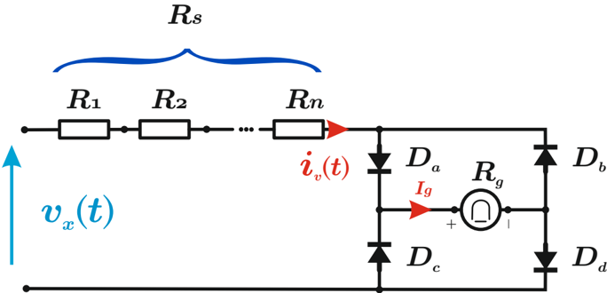

# 5.4.2 Instrumento con rectificador onda completa

Tags: #eli214
## 5.4.2. Instrumento con rectificador onda completa

Según el esquema simplificado de un instrumento de bobina móvil con rectificador de onda completa, se tiene:

1. En el semiciclo positivo conducen los diodos D a y D d . Por tanto, la corriente i g ( t ) circula por el galvanómetro y es la corriente medida i ( t ) .
2. En el semiciclo negativo conducen los diodos D b y D c . Luego, la corriente i g ( t ) circula por el galvanómetro y tiene el sentido opuesto a la corriente medida, es decir -i ( t ) .
3. En términos simples esta forma tipo puente tiene una funcionalidad del tipo 'valor absoluto' .
4. La única restricción es disponer diodos de buena calidad para evitar no-linealidades al momento de conducir, prefiriendo tener diodos de germanio que de silicio.

Los diodos de germanio fabrican de una manera similar a los diodos de silicio, usan también una unión PN y se implantan con las mismas impurezas. Tienen una tensión de polarización directa de 0 , 3V y se utilizan mejor en circuitos eléctricos de baja potencia al tener pérdidas de potencia más pequeñas, siendo apropiados para circuitos de precisión.

Por tanto, si la corriente que entra al instrumento es i ( t ) = ∥ ∥ I 0 · sin ( 2 π T · t )∥ ∥ el valor de la corriente que mide el galvanómetro será ¯ i g , tal que:

$$\bar { i } _ { g } = I _ { g } = \frac { 1 } { T } \int _ { 0 } ^ { T } \left \| I _ { 0 } \cdot s i n \left ( \frac { 2 \pi } { T } \cdot t \right ) d t \right \| = \frac { 2 I _ { 0 } } { \pi } \ \left [ A \right ]$$

Por lo tanto el factor de forma para esta configuración será:

$$I _ { e f } = K _ { e s c } \cdot \bar { i } _ { g } \longrightarrow K _ { e s c } = \frac { I _ { e f } } { \bar { i } _ { g } } = \frac { \pi } { 2 \sqrt { 2 } } \approx 1 , 1 1 \approx \frac { 1 } { 0 , 9 0 }$$

De este modo se tiene un factor de forma más parecido a ' 1 , 00 ', lo cual implica la similitud entre la forma de onda que se mide y la que se informa, requiriendo un menor ajuste.

Si el instrumento en vez de indicar una corriente, indicase una tensión, ésta quedaría definida por las resistencias del circuito de adaptación equivalente R s y la resistencia del galvanómetro R g , tal que:

$$V _ { e f } = ( R _ { s } + R _ { g } ) \cdot I _ { e f } = K _ { e s c } \cdot ( R _ { s } + R _ { g } ) \cdot \bar { i } _ { g } \approx 1 , 1 1 \cdot ( R _ { s } + R _ { g } ) \cdot \bar { i } _ { g } \ \ [ V ]$$

Para el caso de establecer la sensibilidad en alterna en términos de la sensibilidad en continua, se tiene:

## Sensibilidad de corriente:

$$s _ { i _ { c a } } = I _ { e f _ { M } } = \frac { \pi } { 2 \sqrt { 2 } } \bar { i } _ { g _ { M } } \simeq 1 , 1 1 \cdot s _ { i _ { c c } } \ \ [ A ]$$

## Sensibilidad de tensión:

$$s _ { v _ { c a } } = \frac { 1 } { I _ { e f _ { M } } } = \frac { 2 \sqrt { 2 } } { \pi } \frac { 1 } { \bar { i } _ { g _ { M } } } - \simeq 0 , 9 0 \cdot s _ { v _ { c c } } \quad [ \Omega / V ]$$

A continuación se presenta en la tabla 5.2 los errores que cometen los instrumentos de bobina móvil con rectificador de onda completa, cuando se aplican formas de onda como triangular y cuadrada y su factor de forma fue concebido para medición sinusoidal.

Tabla 5.2: Error cometido por instrumentos de bobina móvil con rectificador de onda completa para distintas formas de onda.

| Forma de onda   | Amplitud   | Valor efectivo    | Valor indicado                      | Error %   |
|-----------------|------------|-------------------|-------------------------------------|-----------|
| Sinusoidal      | A          | A √ 2 = 0 , 707 A | ( π 2 √ 2 ) × { 2 A π } = 0 , 707 A | 0%        |
| Cuadrada        | A          | A                 | ( π 2 √ 2 ) ×{ A } = 1 , 11 A       | +11%      |
| Triangular      | A          | A √ 3 = 0 , 577 A | ( π 2 √ 2 ) × { A 2 } = 0 , 555 A   | - 3 , 8%  |

## Ejercicio:

Considere un multímetro de continua y alterna, donde se conoce que la sensibilidad en continua son 20kΩ / V , R g = 2 k Ω . Si se sabe que su topología es de rectificador de media onda y se desea usar el rango de 100 V ca , determine la sensibilidad del instrumento y la resistencia del adaptador.

## Respuesta:

La sensibilidad en alterna para esa topología es de 0,45 veces la alterna, por lo cual se llega a:

$$s _ { v _ { c a } } = 9 k \Omega / V \Leftrightarrow \bar { i } _ { g _ { M } } = 5 0 \mu A$$

Por ello la resistencia del voltímetro en rango de 100 V son 900 kΩ , y por tanto la resistencia de la etapa de adaptación o atenuación son 898 kΩ .

SECCIÓN 5.5

## Instrumentos de valor máximo

En ciertas aplicaciones de ensayo que requieren medir, por ejemplo, tensiones o corrientes máximas que dan origen a rupturas o arcos eléctricos.

Un circuito práctico se presenta a continuación donde los resistores R 1 y R 2 constituyen un divisor de tensión o lo que se conoció en acápites anteriores como la etapa de atenuación o adaptación .

El condensador C se carga a la máxima tensión de entrada del divisor cuando el diodo D conduce, así el diodo actúa como un filtro de polaridad considerando la simetría de la señal medida. Para los casos donde la señal a medir no es simétrica se deberá tener claro previamente la polaridad que interesa medir y si existe el grado de libertad, dar la correcta orientación eléctrica al diodo. Cuando el diodo no conduce, el condensador se descarga por medio del circuito formado por la resistencia R 3 y del galvanómetro de bobina móvil . 'Si la constante de tiempo de descarga es mucho mayor que el período de la señal alterna a medir, la corriente continua I g del galvanómetro será proporcional al valor máximo de la señal de entrada que en este caso corresponde a tensión eléctrica' .

Al igual que en los instrumentos con rectificador, la escala de los instrumentos de valor máximo están calibradas para leer en valor efectivo de onda sinusoidal , lo cual significa que se introduce un factor de corrección 1 / √ 2 . Para cualquier otro tipo de señal, el instrumento medirá el valor máximo y lo seguirá informando ponderado por 1 / √ 2 .

La respuesta en frecuencias de estos instrumentos puede ser bastante mayor al del instrumento con rectificador, pudiendo llegar hasta 1GHz si el circuito detector de máximos es puesto de forma directa en la punta de prueba.

SECCIÓN 5.6

## Voltímetros electrónicos

## 5.4.2. Instrumento con rectificador onda completa

Según el esquema simplificado de un instrumento de bobina móvil con rectificador de onda completa, se tiene:

1. En el semiciclo positivo conducen los diodos D a y D d . Por tanto, la corriente i g ( t ) circula por el galvanómetro y es la corriente medida i ( t ) .
2. En el semiciclo negativo conducen los diodos D b y D c . Luego, la corriente i g ( t ) circula por el galvanómetro y tiene el sentido opuesto a la corriente medida, es decir -i ( t ) .
3. En términos simples esta forma tipo puente tiene una funcionalidad del tipo 'valor absoluto' .
4. La única restricción es disponer diodos de buena calidad para evitar no-linealidades al momento de conducir, prefiriendo tener diodos de germanio que de silicio.

Los diodos de germanio fabrican de una manera similar a los diodos de silicio, usan también una unión PN y se implantan con las mismas impurezas. Tienen una tensión de polarización directa de 0 , 3V y se utilizan mejor en circuitos eléctricos de baja potencia al tener pérdidas de potencia más pequeñas, siendo apropiados para circuitos de precisión.

Por tanto, si la corriente que entra al instrumento es i ( t ) = ∥ ∥ I 0 · sin ( 2 π T · t )∥ ∥ el valor de la corriente que mide el galvanómetro será ¯ i g , tal que:

$$\bar { i } _ { g } = I _ { g } = \frac { 1 } { T } \int _ { 0 } ^ { T } \left \| I _ { 0 } \cdot s i n \left ( \frac { 2 \pi } { T } \cdot t \right ) d t \right \| = \frac { 2 I _ { 0 } } { \pi } \ \left [ A \right ]$$

Por lo tanto el factor de forma para esta configuración será:

$$I _ { e f } = K _ { e s c } \cdot \bar { i } _ { g } \longrightarrow K _ { e s c } = \frac { I _ { e f } } { \bar { i } _ { g } } = \frac { \pi } { 2 \sqrt { 2 } } \approx 1 , 1 1 \approx \frac { 1 } { 0 , 9 0 }$$

De este modo se tiene un factor de forma más parecido a ' 1 , 00 ', lo cual implica la similitud entre la forma de onda que se mide y la que se informa, requiriendo un menor ajuste.

Si el instrumento en vez de indicar una corriente, indicase una tensión, ésta quedaría definida por las resistencias del circuito de adaptación equivalente R s y la resistencia del galvanómetro R g , tal que:

$$V _ { e f } = ( R _ { s } + R _ { g } ) \cdot I _ { e f } = K _ { e s c } \cdot ( R _ { s } + R _ { g } ) \cdot \bar { i } _ { g } \approx 1 , 1 1 \cdot ( R _ { s } + R _ { g } ) \cdot \bar { i } _ { g } \ \ [ V ]$$

Para el caso de establecer la sensibilidad en alterna en términos de la sensibilidad en continua, se tiene:

## Sensibilidad de corriente:

$$s _ { i _ { c a } } = I _ { e f _ { M } } = \frac { \pi } { 2 \sqrt { 2 } } \bar { i } _ { g _ { M } } \simeq 1 , 1 1 \cdot s _ { i _ { c c } } \ \ [ A ]$$

## Sensibilidad de tensión:

$$s _ { v _ { c a } } = \frac { 1 } { I _ { e f _ { M } } } = \frac { 2 \sqrt { 2 } } { \pi } \frac { 1 } { \bar { i } _ { g _ { M } } } - \simeq 0 , 9 0 \cdot s _ { v _ { c c } } \quad [ \Omega / V ]$$

A continuación se presenta en la tabla 5.2 los errores que cometen los instrumentos de bobina móvil con rectificador de onda completa, cuando se aplican formas de onda como triangular y cuadrada y su factor de forma fue concebido para medición sinusoidal.

Tabla 5.2: Error cometido por instrumentos de bobina móvil con rectificador de onda completa para distintas formas de onda.

| Forma de onda   | Amplitud   | Valor efectivo    | Valor indicado                      | Error %   |
|-----------------|------------|-------------------|-------------------------------------|-----------|
| Sinusoidal      | A          | A √ 2 = 0 , 707 A | ( π 2 √ 2 ) × { 2 A π } = 0 , 707 A | 0%        |
| Cuadrada        | A          | A                 | ( π 2 √ 2 ) ×{ A } = 1 , 11 A       | +11%      |
| Triangular      | A          | A √ 3 = 0 , 577 A | ( π 2 √ 2 ) × { A 2 } = 0 , 555 A   | - 3 , 8%  |

## Ejercicio:

Considere un multímetro de continua y alterna, donde se conoce que la sensibilidad en continua son 20kΩ / V , R g = 2 k Ω . Si se sabe que su topología es de rectificador de media onda y se desea usar el rango de 100 V ca , determine la sensibilidad del instrumento y la resistencia del adaptador.

## Respuesta:

La sensibilidad en alterna para esa topología es de 0,45 veces la alterna, por lo cual se llega a:

$$s _ { v _ { c a } } = 9 k \Omega / V \Leftrightarrow \bar { i } _ { g _ { M } } = 5 0 \mu A$$

Por ello la resistencia del voltímetro en rango de 100 V son 900 kΩ , y por tanto la resistencia de la etapa de adaptación o atenuación son 898 kΩ .

