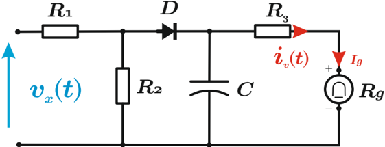
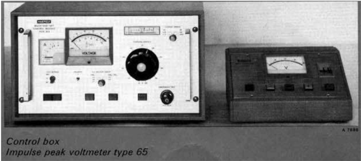

# 5.5 Instrumentos de valor máximo

Tags: #eli214
SECCIÓN 5.5

## Instrumentos de valor máximo

En ciertas aplicaciones de ensayo que requieren medir, por ejemplo, tensiones o corrientes máximas que dan origen a rupturas o arcos eléctricos.

Un circuito práctico se presenta a continuación donde los resistores R 1 y R 2 constituyen un divisor de tensión o lo que se conoció en acápites anteriores como la etapa de atenuación o adaptación .

El condensador C se carga a la máxima tensión de entrada del divisor cuando el diodo D conduce, así el diodo actúa como un filtro de polaridad considerando la simetría de la señal medida. Para los casos donde la señal a medir no es simétrica se deberá tener claro previamente la polaridad que interesa medir y si existe el grado de libertad, dar la correcta orientación eléctrica al diodo. Cuando el diodo no conduce, el condensador se descarga por medio del circuito formado por la resistencia R 3 y del galvanómetro de bobina móvil . 'Si la constante de tiempo de descarga es mucho mayor que el período de la señal alterna a medir, la corriente continua I g del galvanómetro será proporcional al valor máximo de la señal de entrada que en este caso corresponde a tensión eléctrica' .

Al igual que en los instrumentos con rectificador, la escala de los instrumentos de valor máximo están calibradas para leer en valor efectivo de onda sinusoidal , lo cual significa que se introduce un factor de corrección 1 / √ 2 . Para cualquier otro tipo de señal, el instrumento medirá el valor máximo y lo seguirá informando ponderado por 1 / √ 2 .

La respuesta en frecuencias de estos instrumentos puede ser bastante mayor al del instrumento con rectificador, pudiendo llegar hasta 1GHz si el circuito detector de máximos es puesto de forma directa en la punta de prueba.

