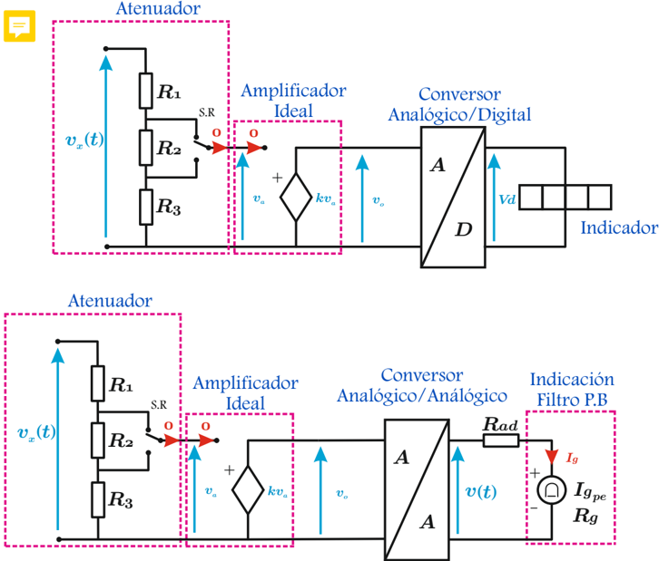
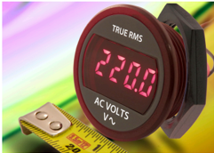
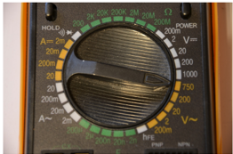

# 5.6.1 Principio de funcionamiento

Tags: #eli214
## 5.6.1. Principio de funcionamiento

Los voltímetros electrónicos de corriente alterna presentan en general una mayor sensibilidad, mayor impedancia de entrada y ancho de banda que sus pares anteriormente descritos. También resultan de un costo y complejidad superiores.

Según el tipo de respuesta o variable sensible , se puede hacer la siguiente clasificación, que para los instrumentos de indicación digital la respuesta es parte del circuito convertidor A/D y para los de indicación analógica parte del convertidor A/A :

Figura 5.4: Esquema de funcionamiento de voltímetros, con lectura analógica y digital

Average: Instrumento sensible al valor medio o 'average' de la señal alterna rectificada , ya sea en media onda u onda completa, indicando una lectura en términos del valor efectivo V ef .

$$V _ { e f } = \underbrace { \frac { \pi } { \sqrt { 2 } } } _ { 1 / 2 \, o . } \cdot \bar { v } _ { x } ( t ) \quad \vee \quad V _ { e f } = \frac { \pi } { 2 \sqrt { 2 } } \cdot \bar { v } _ { x } ( t ) \\$$

Peak: Instrumento sensible al valor máximo o 'peak' de la señal alterna , indicando una lectura en términos del valor efectivo V ef .

$$V _ { e f } = \frac { \hat { v } _ { x } ( t ) } { \sqrt { 2 } }$$

TRMS: Instrumento sensible al valor efectivo verdadero o 'TRMS' de la señal de entrada , indicando una lectura directa del valor efectivo V ef .

$$V _ { e f } = V _ { e f _ { c a } } \ \vee \ \ V _ { e f } = \sqrt { V _ { e f _ { c a } } ^ { 2 } + \bar { v } _ { x } ^ { 2 } ( t ) }$$

En este tipo de instrumentos el valor efectivo se obtiene mediante la definición integral , llevada a serie numérica durante un período de muestreo para sistemas de indicación digital o implementada analógicamente con amplificadores operacionales para indicación por galvanómetro. La selección de usar o no la componente continua equivale a que en el circuito de medida esté o no un filtro de continua.

