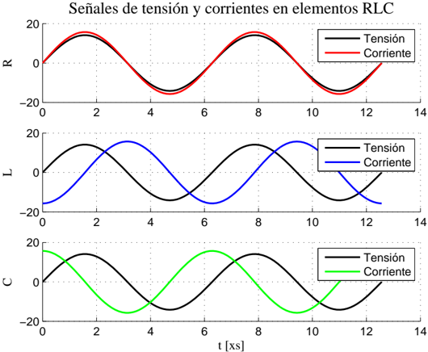
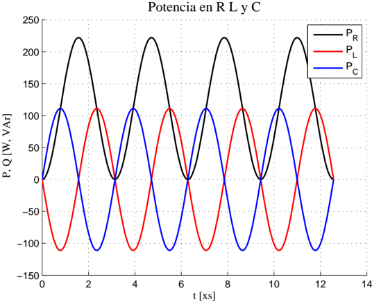
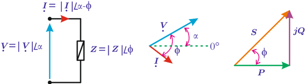
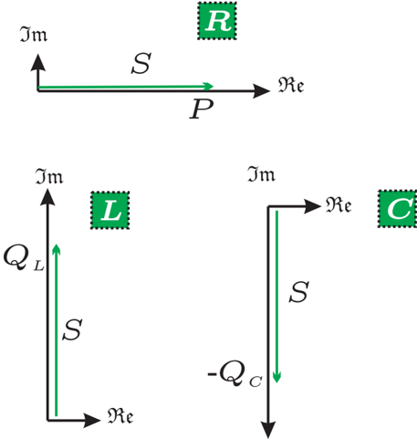

# 6.1 Introducción

Tags: #eli214
SECCIÓN 6.1

## Introducción

La potencia es la capacidad que tiene un objeto para realizar un trabajo en un tiempo determinado. En el Sistema Internacional de Unidades la potencia se mide en Vatios o en Watts y el símbolo de la unidad es W .

$$1 \ [ W ] = 1 \ [ J / s ]$$

Por otro lado el trabajo es la energía producida o consumida, medido en Joule 1 y el símbolo de la unidad es J , la cual se entiende como la potencia producida o consumida, multiplicada por el tiempo que duró el trabajo.

$$1 \ [ J ] = 1 \ [ W \cdot s ]$$

En electricidad, para una mejor interpretación de la medición de energía, se usa la unidad ' Watt-hora ' ( Wh ). De este modo es posible tener una cuantificación rápida de la energía consumida/producida si se conocen los valores de las potencias nominales de las instalaciones o equipos.

La potencia y energía son variables de suma importancia, dada la dinámica alcanzada por los sistemas modernos y la crisis energética, que nos exige el diseño de máquinas, procesos e instalaciones cada vez más eficientes, que a su vez se traduce de forma casi directa en tener sistemas de medición mayor exactitud y confiabilidad.

En electrotecnia, los sistemas de medición de potencia y energía difieren entre sí según sea la frecuencia del sistema. La medición de potencia y energía por sistemas electrodinámicos a frecuencia industrial ( 50 -60Hz ) se resiste ser reemplazado por sus competidores electrónicos principalmente en el aspecto de tarificación, aunque para el diagnóstico o el análisis de la calidad de las variables eléctricas y calidad de energía se ha visto esencialmente cubierta por analizadores de redes digitales, los cuales incorporan una serie de funciones matemáticas y memoria para ir registrando en el tiempo tanto tensiones como corrientes en el tiempo, así como son también capaces de entregar diagramas fasoriales, componentes armónicos por medio de la Transformada Rápida de Fourier (FFT), entre otros, en conjunto a que presentan un menor tamaño.

1 Por favor, no traduzca Joule como ' Julios'!!!

En un elemento de dos terminales, con referencia carga, se define la potencia instantánea consumida por él como:

$$p ( t ) = v ( t ) \cdot i ( t ) \ [ W ]$$

Figura 6.1: Formas temporales de la tensiones y corrientes en R , L y C

Con lo cual según los desfases que hay entre tensión y corriente según el tipo de carga ( R -L -C ) dan una forma temporal de potencia p ( t ) .

Figura 6.2: Formas temporales de la potencia en R , L y C

Solamente el valor medio de la potencia p ( t ) en el tiempo t , puede transformarse en otra forma de energía como: trabajo, calor, movimiento, etc. Luego la energía consumida será:

$$E ( t ) = \int _ { 0 } ^ { t } p ( t ) d t \ [ J ]$$

En redes monofásicas sometidas a excitaciones sinusoidales analizadas en estado estacionario, representadas por sendos fasores en el plano de la frecuencia ω 0 , de tensión V = V ef ∡ α y corriente I = I ef ∡ α -φ ; que han reemplazado a las variables temporales v ( t ) = √ 2 V ef · sin ( ω 0 t + α ) e i ( t ) = √ 2 I ef · sin ( ω 0 t + α -φ ) , permiten una representación geométrica que parte por las variables de tensión y corriente para darle una interpretación a la potencia, que algunos autores de la literatura la definen como un fasor de doble frecuencia.

Figura 6.3: Representación circuital con excitación sinusoidal estacionaria y transformada fasorial

Por ello se definen las siguientes componentes de la potencia p ( t ) vistas en un plano complejo

Potencia activa: Potencia que efectúa y/o produce trabajo:

$$P = \bar { p } ( t ) = \Re e \{ V \cdot I ^ { * } \} = \| V \| \cdot \| I \| \cdot \cos ( \phi ) \ \ [ W ]$$

Potencia reactiva: Potencia que no efectúa trabajo, pero que hace uso de las redes tanto en tensión como corriente:

$$Q = \Im \{ V \cdot I ^ { * } \} = \| V \| \cdot \| I \| \cdot s i n ( \phi ) \ \ [ V A r ]$$

Definición que considera con referencia carga que Q &gt; 0 es consumo reactivo inductivo.

Potencia aparente: Cuantificación compleja de la potencia total que consume un sistema:

$$S = V \cdot I ^ { * } = \| V \| \cdot \| I \| \triangle \phi = P + j Q = \| S \| \zeta t a n ^ { - 1 } \left ( Q / P \right ) \ \left [ V A \right ]$$

Factor de potencia: Factor de calidad que permite establecer la eficiencia de un sistema eléctrico en términos de lo que consume versus lo que realmente produjo trabajo útil.

$$F P = \cos ( \phi ) = P / \| S \| \ [ - ]$$

De este modo para los sistemas básicos R -L -C se tiene en cuanto a la potencia compleja los siguientes casos típicos:

Figura 6.4: Potencias complejas

Si se tiene un sistema trifásico y es posible cuantificar la potencia de cada uno de sus circuitos o fases, se tienen las siguiente definiciones:

Potencia activa trifásica:

P 3 φ = P 1 + P 2 + P 3 [W]

Potencia reactiva trifásica:

Q 3 φ = Q 1 + Q 2 + Q 3 [VAr]

Potencia aparente trifásica:

S 3 φ = P 3 φ + jQ 3 φ [VA]

Si el sistema trifásico es balanceado, las expresiones de potencia se reducen a:

## Potencia activa trifásica:

$$P _ { 3 \phi } = 3 P _ { 1 } = \sqrt { 3 } V _ { L } I _ { e f } \cdot \cos ( \phi ) = 3 V _ { f } I _ { e f } \cdot \cos ( \phi ) \ \ [ W ]$$

## Potencia reactiva trifásica:

$$Q _ { 3 \phi } = 3 Q _ { 1 } = \sqrt { 3 } V _ { L } I _ { e f } \cdot s i n ( \phi ) = 3 V _ { f } I _ { e f } \cdot s i n ( \phi ) \ \ [ V A r ]$$

## Potencia aparente trifásica:

$$S _ { 3 \phi } = 3 P _ { 1 } + j 3 Q _ { 1 } = \sqrt { 3 } V _ { L } I _ { e f } \triangle \phi = 3 V _ { f } I _ { e f } \triangle \phi \ \ [ V A ]$$

Donde: V L es el valor efectivo de la tensión de línea, V f el valor efectivo de la tensión de fase e I ef el valor efectivo de la corriente de línea.

