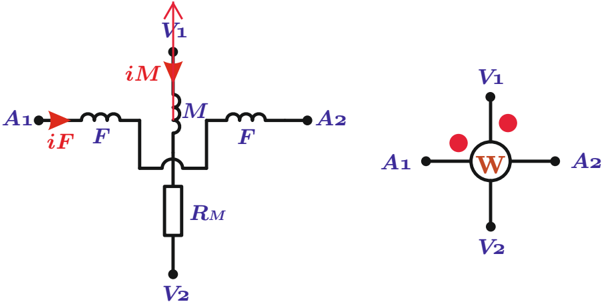

# 6.2.1 Generalidades

Tags: #eli214
## 6.2.1. Generalidades

Uno de los instrumentos más utilizados para medir potencia es el vatímetro electrodinámico cuyo principio de funcionamiento se basa en generar un torque electromagnético cuando circulan corrientes por sus bobinas fija y móvil, por lo cual y por medio de los trabajos virtuales tendremos para la energía del sistema la siguiente descripción:

$$W _ { E M } = \frac { 1 } { 2 } L _ { F i j } \cdot i _ { F } ^ { 2 } + \frac { 1 } { 2 } L _ { M o v } \cdot i _ { M } ^ { 2 } + M \cdot i _ { F } \cdot i _ { M }$$

donde: L Fij y L Mov son los valores de las inductores de la bobina 'fija' y 'móvil' , respectivamente asociadas a las corrientes i F e i M . M es el valor del inductor mutuo.

Figura 6.5: Vatímetro electrodinámico

De este modo se llega a una expresión para el torque:

$$T _ { E } = \frac { \partial W _ { E M } } { \partial \theta } = \frac { \partial M } { \partial \theta } \cdot i _ { F } \cdot i _ { M }$$

En estado estacionario, igualando el torque eléctrico T E al torque mecánico del instrumento e indicación angular expresado por el ángulo θ , revisando su respuesta en estado estacionario y considerar que la frecuencia eléctrica de la red ( ω 0 ) es mucho mayor que la frecuencia natural del sistema electromecánico ( ω n ) se obtiene:

$$\theta = \frac { 1 } { k _ { r } } \frac { \partial M } { \partial \theta } \cdot \overline { i _ { F } \cdot i _ { M } }$$

Si a la bobina móvil se le añade una resistencia serie para hacer proporcional la corriente i m con la tensión, se tendrá junto a la descripción fasorial de las corrientes que:

$$\theta = \frac { 1 } { k _ { r } } \frac { \partial M } { \partial \theta } \cdot \Re \{ I _ { M } \cdot I ^ { * } _ { F } \} = \frac { 1 } { k _ { r } \cdot R _ { M } } \frac { \partial M } { \partial \theta } \cdot \Re \{ V _ { M } \cdot I ^ { * } _ { F } \}$$

Se llega finalmente a:

$$\theta = K _ { w } \cdot \Re \{ V _ { V 1 - V 2 } \cdot I _ { A 1 - A 2 } ^ { * } \} = K _ { w } \cdot P$$

