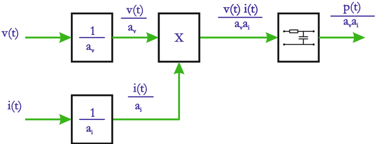

# 6.2.2 Instrumentos para medir potencia activa

Tags: #eli214
## 6.2.2. Instrumentos para medir potencia activa

Los vatímetros electrodinámicos se clasifican según su construcción en:

## 6.2.2.1. Instrumentos sin fierro

Son aquellos donde las bobinas que lo componen tienen núcleo de aire, que si bien se debe procurar un buen diseño por el menor grado de acoplamiento y desmedro de la inductancia mutua, tienen por ventaja que el circuito no presenta problemas de no linealidad, como los que se dan en circuitos magnéticos con fierro. Por ello, requieren niveles de corrientes mayores para generar una deflexión en la aguja indicadora y son fácilmente influenciables ante la presencia de campos magnéticos externos.

## 6.2.2.2. Instrumentos ferrodinámicos

Las bobinas tienen un núcleo de fierro que las rodea, lo cual les da mayor inmunidad antes campos externos y permiten piezas móviles de mayor resistencias. Su uso es industrial.

## 6.2.2.3. Instrumentos de bajo factor de potencia

En mediciones de potencia activa donde el factor de potencia es muy bajo, es decir, cuya potencia reactiva es mayor que la potencia activa, instrumentos corrientes, logran una deflexión de aguja muy pequeña aún cuando la tensión y corriente estén al máximo de sus rangos admisibles o nominales. Por ello es que se diseñan instrumentos para este rango de factor de potencia, que en principio tienen una baja constante de resorte k r . En este tipo de instrumentos se define:

$$\cos ( \phi ) _ { I n s t } = \frac { \text{maxima deflexion a plena escala} \ [ W ] } { \text {Mayor rango de tensión } \ [ V ] \ \times \ \text {Mayor rango de corriente } \ [ A ] }$$

Esta definición es independiente del tipo de carga usada y debe cuidarse que la potencia a medir sea inferior a la deflexión a plena escala de los rangos usados. Un cuidado similar debe tenerse en todo vatímetro en evitar sobrecargas por intentar el tener una mayor deflexión en desmedro de usar un rango de corriente o tensión menor, que no corresponda al nivel de la variable.

## Ejemplos:

- 1.- Determine el factor de potencia de un instrumento con:
- 2.-Del vatímetro anterior ( a ) y un vatímetro ( b ) de 150V -5A -750W , determine la deflexión en % de la lectura a plena escala, si ambos miden (no al mismo tiempo)

Escalas máximas:

37 , 5 - 75 - 150W

Rangos de tensión:

75 - 150V

Rangos de corriente:

2 , 5 - 5A

Respuesta:

De la expresión anterior se tiene que cos ( φ ) Inst = 0 , 2

una carga pasiva de 120V -3A y cos ( φ ) = 0 , 3 ind .

## Respuesta:

- ( a ) Se usan los rangos de 150V -5A , llegando a:

$$L e c t u r a = 1 0 0 \, \% \cdot \frac { 1 2 0 \times 3 \times 0 , 3 } { 1 5 0 \times 5 \times 0 , 2 } = 7 2 \, \%$$

- ( b ) El instrumento es de factor de potencian unitario, por tanto:

$$L e c t u r a = 1 0 0 \, \% \cdot \frac { 1 2 0 \times 3 \times 0 , 3 } { 1 5 0 \times 5 \times 1 } = 1 4 , 4 \, \%$$

El ejemplo anterior demuestra el apropiado uso de vatímetros según el tipo de carga y factor de potencia. Para cargas que son altamente capacitivas, con desfases relativos entre corriente y tensión del orden del 89 o , propio del estudio de aislamientos eléctricos, el medir potencia activa se hace inviable. Por ello en su reemplazo se busca medir el factor de pérdidas o tan δ , mediante la estrategia del uso de puentes comparadores de alterna, que implica que no solamente se modifican resistencias sino también capacidades de ajuste, hasta lograr que por el indicador circule una corriente nula.

## 6.2.2.4. Vatímetro electrónico

Una forma de concebir un vatímetro electrónico es utilizando un amplificador en el circuito de tensión de un instrumento electrodinámico, reduciendo el consumo del instrumento sobre la red a medir.

Otro tipo más habitual, típico de los analizadores de redes, funciona procesando analógica o digitalmente las variables v ( t ) e i ( t ) , para luego ser multiplicadas electrónicamente obteniendo una señal proporcional a p ( t ) . Luego p ( t ) es filtrada con un pasa bajos que rescate principalmente su componente continua y de ese modo obtener P = ¯ p ( t ) .

Figura 6.6: Esquema de funcionamiento vatímetro electrónico

El vatímetro electrónico tiene una mayor aceptación en la medida que se requiera una salida ya se analógica o digital para ser conectada a un sistema de monitoreo, registro, adquisición de datos y posteriormente su análisis y proceso.

## 6.2.2. Instrumentos para medir potencia activa

Los vatímetros electrodinámicos se clasifican según su construcción en:

## 6.2.2.1. Instrumentos sin fierro

Son aquellos donde las bobinas que lo componen tienen núcleo de aire, que si bien se debe procurar un buen diseño por el menor grado de acoplamiento y desmedro de la inductancia mutua, tienen por ventaja que el circuito no presenta problemas de no linealidad, como los que se dan en circuitos magnéticos con fierro. Por ello, requieren niveles de corrientes mayores para generar una deflexión en la aguja indicadora y son fácilmente influenciables ante la presencia de campos magnéticos externos.

## 6.2.2.2. Instrumentos ferrodinámicos

Las bobinas tienen un núcleo de fierro que las rodea, lo cual les da mayor inmunidad antes campos externos y permiten piezas móviles de mayor resistencias. Su uso es industrial.

## 6.2.2.3. Instrumentos de bajo factor de potencia

En mediciones de potencia activa donde el factor de potencia es muy bajo, es decir, cuya potencia reactiva es mayor que la potencia activa, instrumentos corrientes, logran una deflexión de aguja muy pequeña aún cuando la tensión y corriente estén al máximo de sus rangos admisibles o nominales. Por ello es que se diseñan instrumentos para este rango de factor de potencia, que en principio tienen una baja constante de resorte k r . En este tipo de instrumentos se define:

$$\cos ( \phi ) _ { I n s t } = \frac { \maxima deffieldexí n a p lena e s cala \ [ W ] } { \text {Mayor rango de tensión } \ [ V ] \ \times \ \text {Mayor rango de corriente } \ [ A ] }$$

Esta definición es independiente del tipo de carga usada y debe cuidarse que la potencia a medir sea inferior a la deflexión a plena escala de los rangos usados. Un cuidado similar debe tenerse en todo vatímetro en evitar sobrecargas por intentar el tener una mayor deflexión en desmedro de usar un rango de corriente o tensión menor, que no corresponda al nivel de la variable.

## Ejemplos:

- 1.- Determine el factor de potencia de un instrumento con:
- 2.-Del vatímetro anterior ( a ) y un vatímetro ( b ) de 150V -5A -750W , determine la deflexión en % de la lectura a plena escala, si ambos miden (no al mismo tiempo)

Escalas máximas:

37 , 5 - 75 - 150W

Rangos de tensión:

75 - 150V

Rangos de corriente:

2 , 5 - 5A

Respuesta:

De la expresión anterior se tiene que cos ( φ ) Inst = 0 , 2

una carga pasiva de 120V -3A y cos ( φ ) = 0 , 3 ind .

## Respuesta:

- ( a ) Se usan los rangos de 150V -5A , llegando a:

$$L e c t u r a = 1 0 0 \, \% \cdot \frac { 1 2 0 \times 3 \times 0 , 3 } { 1 5 0 \times 5 \times 0 , 2 } = 7 2 \, \%$$

- ( b ) El instrumento es de factor de potencian unitario, por tanto:

$$L e c t u r a = 1 0 0 \, \% \cdot \frac { 1 2 0 \times 3 \times 0 , 3 } { 1 5 0 \times 5 \times 1 } = 1 4 , 4 \, \%$$

El ejemplo anterior demuestra el apropiado uso de vatímetros según el tipo de carga y factor de potencia. Para cargas que son altamente capacitivas, con desfases relativos entre corriente y tensión del orden del 89 o , propio del estudio de aislamientos eléctricos, el medir potencia activa se hace inviable. Por ello en su reemplazo se busca medir el factor de pérdidas o tan δ , mediante la estrategia del uso de puentes comparadores de alterna, que implica que no solamente se modifican resistencias sino también capacidades de ajuste, hasta lograr que por el indicador circule una corriente nula.

## 6.2.2.4. Vatímetro electrónico

Una forma de concebir un vatímetro electrónico es utilizando un amplificador en el circuito de tensión de un instrumento electrodinámico, reduciendo el consumo del instrumento sobre la red a medir.

Otro tipo más habitual, típico de los analizadores de redes, funciona procesando analógica o digitalmente las variables v ( t ) e i ( t ) , para luego ser multiplicadas electrónicamente obteniendo una señal proporcional a p ( t ) . Luego p ( t ) es filtrada con un pasa bajos que rescate principalmente su componente continua y de ese modo obtener P = ¯ p ( t ) .

Figura 6.6: Esquema de funcionamiento vatímetro electrónico

El vatímetro electrónico tiene una mayor aceptación en la medida que se requiera una salida ya se analógica o digital para ser conectada a un sistema de monitoreo, registro, adquisición de datos y posteriormente su análisis y proceso.

