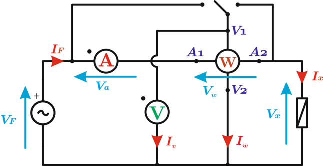

# 6.2.3 Modelo y conexiones del vatímetro

Tags: #eli214
## 6.2.3. Modelo y conexiones del vatímetro

En una red monofásica no es difícil establecer una conexión acertada del vatímetro, en el entendido de colocar los terminales de tensión en paralelo al punto común a la carga que se quiere medir y con los terminales de corriente en serie a la carga o consumo, junto a su adecuada selección de los rangos a emplear. Sin embargo, con un vatímetro en una red monofásica se pueden hacer dos tipos de conexión:

Conexión voltimétrica: Cuando los terminales de tensión se conectan de forma directa en paralelo a la carga a medir. De esta forma se tiene que la medición de potencia activa tiene incluida el error del consumo de la rama de tensión:

$$P _ { V } = ( \mathbb { W } ) = \Re e \{ V _ { x } \cdot ( I _ { x } + I _ { w } + I _ { V } ) ^ { * } \} = \underbrace { \Re e \{ V _ { x } \cdot I _ { x } ^ { * } \} } _ { P _ { x } } + \underbrace { \Re e \{ V _ { x } \cdot ( I _ { w } + I _ { V } ) ^ { * } \} } _ { \varepsilon _ { V } }$$

Conexión amperimétrica: Cuando los terminales de corriente se conectan de forma directa en serie a la carga a medir. Así se tiene en la medición de potencia activa un error por la caída de tensión de la rama de corriente:

$$P _ { A } = ( \mathbb { W } ) \, = \Re \{ ( V _ { x } + V _ { w } + V _ { A } ) \cdot \mathbb { I } _ { x } ^ { * } \} = \underbrace { \Re \{ V _ { x } \cdot \mathbb { I } _ { x } ^ { * } \} } _ { P _ { x } } + \underbrace { \Re \{ ( V _ { w } + V _ { A } ) \cdot \mathbb { I } _ { x } ^ { * } \} } _ { \varepsilon _ { A } }$$

Figura 6.7: Esquema de conexiones

En ambas conexiones se comete un error sistemático que puede corregirse conociendo las resistencias internas de los instrumentos. Hay instrumentos llamados 'vatímetros compensados' que descuentan los consumos propios, pero no así la de los instrumentos externos que se coloquen como voltímetros y amperímetros.

Si en un instrumento analógico se obtuviese una lectura negativa, lo que se debe hacer es invertir los terminales de corriente. Si bien se tendría el mismo efecto al invertir los terminales de tensión, esto nunca debe hacerse dado que expondría a una fuerte diferencia de potencial entre la bobina de tensión y la de corriente, que en un caso favorable podría introducir un error desconocido y en peor caso dañar el aislamiento existente entre las bobinas.

