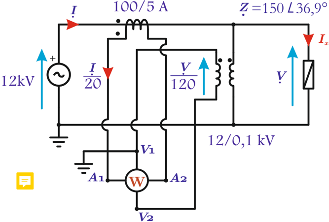

# 6.2.4 Ampliación de rangos

Tags: #eli214
## 6.2.4. Ampliación de rangos

Si los rangos de medida de tensión y/o corriente son insuficientes por el nivel de las variables involucradas, la solución clásica es el empleo según la necesidad de transformadores de tensión TP y/o transformadores de corriente TC , para lo cual la lectura del vatímetro ( W ) dará la potencia activa P x , al ponderar la lectura por la razón de vueltas del TP ' n V ' y/o la razón de vueltas del TC ' n A '. Por seguridad siempre se debe procurar una adecuada conexión a tierra de los secundarios.

Figura 6.8: Ampliación de rangos por transformadores

En caso que las tensiones involucradas sean menores que 1kV , existe la opción de ampliar el rango de tensión usando resistencias adicionales en serie.

Ejemplo: Se tiene un vatímetro cuya bobina de tensión tiene una sensibilidad de 30Ω / V con rangos 75 -150V . Calcule la resistencia de cada rango de tensión y la resistencia externa para ampliar el rango de tensión de 150 a 450V .

## Respuesta:

Para el rango de 75V , R v 1 = 75 · 30 = 2 , 25kΩ .

Para el rango de 150V , R v 2 = 150 · 30 = 4 , 50kΩ .

Para el rango de 450V , R v 3 = 450 · 30 = 13 , 50kΩ , luego R ext = 13 , 5 -4 , 5 = 9kΩ .

