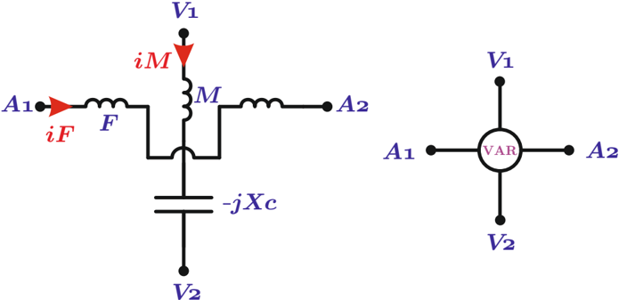

# 6.2.5 Medición de potencia reactiva

Tags: #eli214
## 6.2.5. Medición de potencia reactiva

Para medir potencia reactiva, se puede usar un vatímetro convencional electrodinámico, pero que en su bobina de tensión se le incorpore en serie un condensador, reemplazando a la resistencia. De este modo la ecuación del ángulo se transforma a:

$$\theta = \frac { 1 } { k _ { r } } \frac { \partial M } { \partial \theta } \cdot \Re \{ I _ { M } \cdot I _ { F } ^ { * } \} = \frac { 1 } { k _ { r } \cdot X _ { c } } \frac { \partial M } { \partial \theta } \cdot \Re \{ j \cdot V _ { M } \cdot I _ { F } ^ { * } \} = K _ { v a r } \Re \{ j P - Q \} = - K _ { v a r } \cdot Q$$

Es decir, este instrumento medirá proporcional a la potencia reactiva, pero con signo contrario. Por ello, se debe invertir los terminales de corriente para compensar el signo. A esta configuración se la denomina 'Vármetro' (VAr) .

Figura 6.9: Esquema de construcción de un vármetro

SECCIÓN 6.3

## Medición de potencia trifásica

## 6.2.5. Medición de potencia reactiva

Para medir potencia reactiva, se puede usar un vatímetro convencional electrodinámico, pero que en su bobina de tensión se le incorpore en serie un condensador, reemplazando a la resistencia. De este modo la ecuación del ángulo se transforma a:

$$\theta = \frac { 1 } { k _ { r } } \frac { \partial M } { \partial \theta } \cdot \Re \{ I _ { M } \cdot I _ { F } ^ { * } \} = \frac { 1 } { k _ { r } \cdot X _ { c } } \frac { \partial M } { \partial \theta } \cdot \Re \{ j \cdot V _ { M } \cdot I _ { F } ^ { * } \} = K _ { v a r } \Re \{ j P - Q \} = - K _ { v a r } \cdot Q$$

Es decir, este instrumento medirá proporcional a la potencia reactiva, pero con signo contrario. Por ello, se debe invertir los terminales de corriente para compensar el signo. A esta configuración se la denomina 'Vármetro' (VAr) .

Figura 6.9: Esquema de construcción de un vármetro

