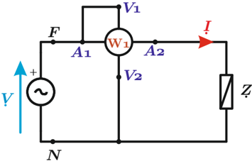
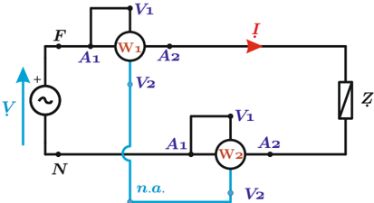
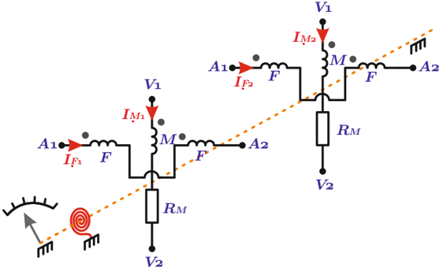

# 6.3.1 Teorema de Blondel y el vatímetro trifásico

Tags: #eli214
## 6.3.1. Teorema de Blondel y el vatímetro trifásico

La potencia de una carga polifásica o n-fásica , se mide empleando varios vatímetros o en su defecto con un (1) solo vatímetro de varios terminales. Haciendo abstracción de cualquiera de las dos opciones anteriores, siempre será posible de ser interpretado como un conjunto finito de vatímetros monofásicos; la cantidad de éstos está dada por el teorema de Blondel .

## Teorema de Blondel :

La potencia en un circuito de 'n' fases o líneas activas se puede medir con 'n' vatímetros, dispuestos de tal modo que en cada una de las 'n' líneas se mida la corriente, mientras que las tensiones se midan en todas las líneas respecto a un punto común, llamado 'neutro artificial' si y solo sí éste no coincida con alguna de las líneas en cuestión.

Si el punto común coincide con una de las líneas activas, la tensión del vatímetro de esa línea se hará cero, pudiendo ser eliminado y la medición de potencia se podrá llevar a cabo con 'n-1' elementos. Implícitamente se establece que la información de las 'n-1' corrientes sea la suficiente ( L.I. ) para poder representar la información del sistema global.

Por lo tanto, la potencia del sistema será la suma de las potencias medidas por cada vatímetro .

Del teorema de Blondel se puede deducir el resultado de medir en un circuito monofásico la potencia activa ya sea usando uno ó dos vatímetros:

1. Para el caso con un (1) vatímetro tendremos al despreciar las pérdidas internas y errores que:

$$( W 1 ) = P _ { 1 } = \Re \{ V \cdot I ^ { * } \}$$

Figura 6.10: Medición de potencia con un vatímetro

2. En el caso de usar dos vatímetros respecto a un neutro artificial, se tiene para cada caso:

$$x =$$

$$( W 2 ) \, = \Re \{ V _ { F - n . a . } \cdot I ^ { * } \} \\ ( W 3 ) \, = \Re \{ V _ { N - n . a . } \cdot ( - I ) ^ { * } \}$$

Por lo cual la potencia medida será:

$$P _ { m e d } = ( \mathbb { W } 2 ) + ( \mathbb { W } 3 ) \, = \Re \{ ( V _ { F - n . a . } - V _ { N - n . a . } ) \cdot I ^ { * } \} = \Re \{ V _ { F - N } \cdot I ^ { * } \} = \Re \{ V \cdot I ^ { * } \} = P _ { 1 }$$

Figura 6.11: Medición de potencia con dos vatímetros

$$\}$$

En circuitos trifásicos habrá la opción de medir la potencia con tres elementos (forma convencional) o con dos elementos (conexión Arón). Constructivamente un vatímetro trifásico de dos elementos se forma mediante dos circuitos magnéticos independientes y no acoplados, donde ambas bobinas móviles están unidas a un eje común debiendo sumar torque en el mismo sentido. Así sumando los torques eléctricos e igualándolos al torque mecánico se llega en equilibrio a la siguiente ecuación de ángulo:

$$\theta = \frac { 1 } { k _ { r } } \frac { \partial M } { \partial \theta } \cdot \Re \{ I _ { M 1 } \cdot I 1 ^ { * } _ { F } + I _ { M 2 } \cdot I ^ { * } _ { F 2 } \}$$

Figura 6.12: Vatímetro electrodinámico de dos elementos

