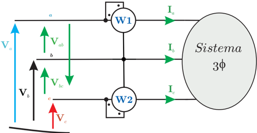
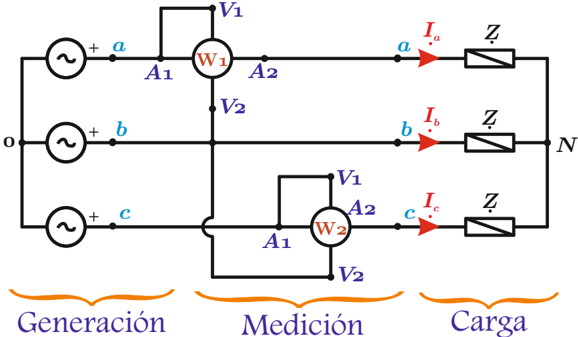
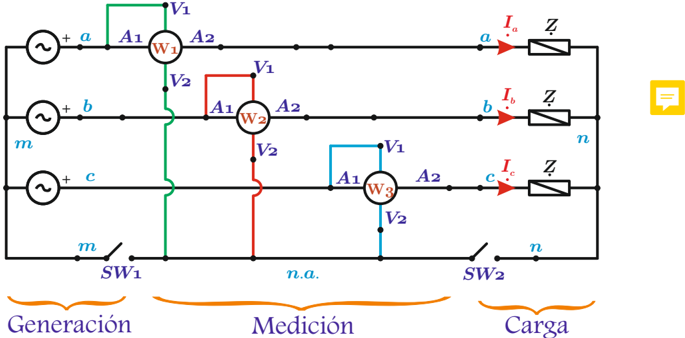

# 6.3.2 Medición de potencia trifásica circuitos trifilares

Tags: #eli214
## 6.3.2. Medición de potencia trifásica circuitos trifilares

En un circuito trifásico se sabe que la potencia activa está dada por:

$$P _ { 3 \phi } \equiv P _ { 1 } + P _ { 2 } + P _ { 3 } \equiv \Re \{ V _ { a } \cdot I _ { a } ^ { * } + V _ { b } \cdot I _ { b } ^ { * } + V _ { c } \cdot I _ { c } ^ { * } \}$$

## 6.3.2.1. Método de los dos vatímetros

El método permite por el teorema de Blondel medir la potencia activa de un circuito trifásico que tenga tres líneas, sin importar si el circuito es balanceado o desbalanceado.

Figura 6.13: Sistema de los 2 vatímetros o Arón.

Una de las posibilidades para medir potencia trifásica con dos vatímetros, da la siguiente expresión para la lectura aditiva de ambos instrumentos:

$$P _ { m e d } = ( W 1 ) + ( W 2 ) = \Re \{ V _ { a b } { \cdot } I _ { a } ^ { * } + V _ { c b } { \cdot } I _ { c } ^ { * } \} = \Re \{ V _ { a } { \cdot } I _ { a } ^ { * } + V _ { c } { \cdot } I _ { c } ^ { * } - V _ { b } { \cdot } \underbrace { ( I _ { a } + I _ { c } ) ^ { * } \} \equiv P _ { 3 \phi } } _ { - I _ { b } ^ { * } }$$

## Nota:

La condición:

$$I _ { a } + I _ { b } + I _ { c } = 0$$

en un sistema trifásico balanceado se cumple siempre, simplemente por la simetría de las corrientes que sumadas fasorialmente forman un polígono cerrado (triángulo equilátero). Ahora bien, en un sistema desbalanceado , se requerirá que no haya neutro conectado para garantizar la restricción anterior, que implícitamente es otra forma de ver el teorema de Blondel.

Figura 6.14: Sistema de los 2 vatímetros o Arón con terminales.

La indicación de alguno de los vatímetros puede resultar negativa a pesar de a naturaleza pasiva de la carga , lo cual es solamente por el desfase entre la tensión y corriente de línea. De ser así se debe cambiar la polaridad de la bobina de corriente y restar el valor en vez de sumarlo. En un vatímetro trifásico se debe ser simétrico en cuanto a la conexión de cada uno de los terminales, así si se obtiene una lectura negativa, se deberán invertir ambas bobinas de corriente.

## Ejemplo:

Conexión Arón en un circuito 3 φ balanceado sec (+) , que usa como punto común la fase 'b' . Indique que factor de potencia debe tener la carga para que los vatímetros marquen negativo.

## Respuesta:

'Un vatímetro indicará negativo si el ángulo que hay entre la tensión y la corriente de sus bobinas está entre 90 o &lt; φ &lt; 270 o ':

1. (W1) y (W2) indican positivo para cos ( φ ) &gt; 0 , 5 inductivo o capacitivo.
2. (W1) indica negativo y (W2) indica positivo para cos ( φ ) &lt; 0 , 5 inductivo.
3. (W2) indica negativo y (W1) indica positivo para cos ( φ ) &lt; 0 , 5 capacitivo.
4. (W1) indica cero para cos ( φ ) = 0 , 5 inductivo.
5. (W2) indica cero para cos ( φ ) = 0 , 5 capacitivo.

## 6.3.2.2. Método de los tres vatímetros con neutro artificial

Método que considera a un vatímetro por línea activa, que por el teorema de Blondel mide la potencia activa trifásica al contar con tres elementos. Si el sistema trifásico cuenta con neutro el cual puede o no conectarse al neutro artificial de los vatímetros, por Blondel con n = 4 conductores se estaría midiendo correctamente la potencia trifásica con n -1 = 3 vatímetros, pero habrá que se cuidadoso en la referencia para las tensiones que mide cada instrumento.

Note que los tres vatímetros no tienen por qué generar una carga balanceada, ya que perfectamente pudieran trabajarse con rangos distintos y marcas diferentes.

Por lo tanto la configuración de tres vatímetros medirá:

$$P _ { m e d } = ( \mathbb { W } 1 ) \, + \, ( \mathbb { W } 2 ) \, + \, ( \mathbb { W } 3 ) \, = \Re \{ V _ { a - x } \cdot I _ { a } ^ { * } + V _ { b - x } \cdot I _ { b } ^ { * } + V _ { c - x } \cdot I _ { c } ^ { * } \} \equiv P _ { 3 \phi }$$

Donde x puede ser el neutro artificial n.a. , o bien el neutro de la carga N o el neutro de la fuente M .

Figura 6.15: Sistema de los 3 vatímetros con neutro artificial.

