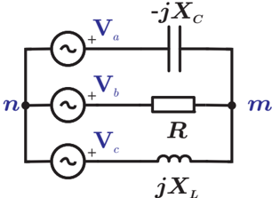
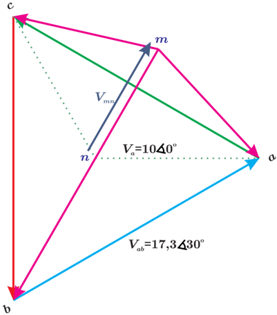
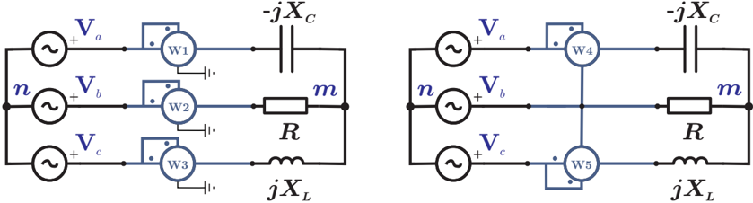

# 6.3.3 Ejemplo de circuito desbalanceado

Tags: #eli214
## 6.3.3. Ejemplo de circuito desbalanceado.

Normalmente el trabajo con circuitos balanceados no presenta mayores problemas en la medición y cálculo de potencias ya sea con/sin neutro conectado, por lo cual es en los sistemas desbalanceados donde realmente se evidencian los conceptos y qué miden los vatímetros según su conexión.

Sea el circuito trifásico desbalanceado de la figura 6.16, donde las reactancias y resistencia valen la unidad ( R = X L = X C = 1Ω ), las fuentes son de secuencia positiva de valor efectivo 10V .

Figura 6.16: Sistema 3 φ desbalanceado.

En este problema se evaluarán todas las variables de interés donde además se observarán las diferencias entre unir o no los nodos m y n , expresando la corriente circulante o la diferencia de potencial según corresponda.

## 6.3.3.1. Sistema sin neutro ( m separado de n ).

Haciendo dos LVK y el LCK que nos dan ecuaciones LI , tenemos:

$$V _ { a } - V _ { b } = I _ { a } ( - j X _ { C } ) - I _ { b } ( R ) \\ V _ { b } - V _ { c } = I _ { b } ( R ) - I _ { c } ( j X _ { L } ) \\ - I _ { c } = I _ { a } + I _ { b }$$

Resolviendo mejor un sistema de ecuaciones 2 × 2 que el sistema anterior ( 3 × 3 ) al considerar sólo las ecuaciones de tensión, eliminando la variable I c que se despeja del LCK , se llega a:

$$\left [ \begin{array} { c c } - j & - 1 \\ j & 1 + j \end{array} \right ] \cdot \left [ \begin{array} { c } I _ { a } \\ I _ { b } \end{array} \right ] = \left [ \begin{array} { c } 1 0 ( 1 - a ^ { 2 } ) \\ 1 0 ( a ^ { 2 } - a ) \end{array} \right ]$$

Obteniéndose así las corrientes de las tres fases y con las LE respectivas, las caídas de tensión en los elementos pasivos, donde se usó la variable compleja a = 1 ∡ 120 o para simplificar la descripción de las tensiones fasoriales.

$$I _ { a } = 8 , 9 7 \triangleleft 4 5 ^ { o } \ [ A ] \sim V _ { x c } = 8 , 9 7 \triangleleft - 4 5 ^ { o } \ [ V ] \\ I _ { b } = 1 7 , 3 2 \triangleleft - 1 2 0 ^ { o } \ [ A ] \sim V _ { r } = 1 7 , 3 2 \triangleleft - 1 2 0 ^ { o } \ [ V ] \\ I _ { c } = 8 , 9 7 \triangleleft 7 5 ^ { o } \ [ A ] \sim V _ { x l } = 8 , 9 7 \triangleleft 1 6 5 ^ { o } \ [ V ]$$

Finalmente calculando la caída de tensión entre los puntos m y n , o sea V mn :

$$V _ { m n } = V _ { a } - I _ { a } ( - j X _ { C } ) = 7 , 3 2 \triangle 6 0 ^ { o } \ [ V ]$$

Como se aprecia precariamente en el sistema de ecuaciones, en las cargas lo único que las fuentes imponen son las tensiones de línea , habiendo una acomodación de sus tensiones de fase. En un sistema trifásico balanceado las tensiones de línea forman un triángulo equilátero y las tensiones de fase quedan ubicadas desde los vértices del triángulo hacia su centro, haciendo un punto neutro virtual que también implicaría que se impone tensión de fase a las cargas. En un caso desbalanceado se mantienen las tensiones de línea, pero las de fase se ubican a una distancia V mn del centro del triángulo, lo cual se llama corrimiento del neutro o tensión de neutro , tal como se aprecia en la figura 6.17, por lo cual y por fase no es evidente lo que sucede en las cargas.

Figura 6.17: Diagrama fasorial sistema trifásico desbalanceado.

Fórmula: Si se desea calcular de manera rápida la caída de tensión en el neutro, tensión V mn , se puede usar la siguiente relación:

$$V _ { m n } = V _ { a } \frac { Y _ { a } + a ^ { 2 } Y _ { b } + a Y _ { c } } { Y _ { a } + Y _ { b } + Y _ { c } }$$

donde a = 1 ∡ 120 o , Y a,b,c son las admitancias equivalentes desde m a n de cada línea a , b y c , respectivas y en ese orden, del sistema trifásico. Esta fórmula se puede demostrar fácilmente al buscar el equivalente Thévenin y Norton entre los puntos m y n .

Particularmente se aprecia aplicando la ecuación 6.2 que la tensión de neutro para este ejemplo es:

$$V _ { m n } = 1 0 \frac { j + a ^ { 2 } - j a } { j + 1 - j } = 1 0 \cdot 0 , 7 3 2 \angle 6 0 ^ { o } \ [ V ]$$

## 6.3.3.2. Sistema con neutro ( m unido de n ).

Considerando ahora que se unen los puntos m y n con un amperímetro ( AN ) , tenemos que el problema es relativamente mucho más fácil de resolver que el sin neutro, ya que basta hacer los LV K 2 en cada una de las fases pasando por el conductor neutro, lo cual es sinónimo de decir que por la conexión de los neutros se ha impuesto tensión de fase en las cargas:

$$V _ { a } & = I _ { a } ( - j X _ { C } ) \sim I _ { a } = \frac { 1 0 } { - j } = 1 0 \angle 9 0 ^ { o } \ [ A ] \\ V _ { b } & = I _ { b } ( R ) \sim I _ { b } = \frac { 1 0 a ^ { 2 } } { 1 } = 1 0 \angle - 1 2 0 ^ { o } \ [ A ] \\ V _ { c } & = I _ { c } ( j X _ { L } ) \sim I _ { c } = \frac { 1 0 a } { j } = 1 0 \angle 3 0 ^ { o } \ [ A ]$$

Por lo cual el diagrama fasorial de tensiones es simplemente un triángulo equilátero formado por las tensiones de línea, donde las tensiones de fase ubicadas desde los vértices del triángulo coinciden en su centro y por ende no hay corrimiento del neutro.

Finalmente, calculando la corriente del neutro:

$$( A N ) = I _ { N } = I _ { a } + I _ { b } + I _ { c } = 7 , 3 2 \angle 6 0 ^ { o } \ [ A ]$$

## 6.3.3.3. Cálculo y medición de potencia

Sean los circuitos de la figura 6.18, donde de desea calcular las lecturas de los vatímetros cuando hay y no hay neutro conectado/unido.

Figura 6.18: Cálculo de la potencia medida por vatímetros.

Considerando que los tres vatímetros generan un neutro virtual que se conecta a tierra uniéndolo al punto n , se aprecia que la tensión que cae en cada instrumento es la de fase de la fuente respectiva, así tendremos que:

$$V J ^ { * } \} = \Re \{ 8 0 7 / 7 - 4 5 ^ { o } \}$$

$$( W 1 ) & = \Re \{ V _ { a } I _ { a } ^ { * } \} = \Re \{ 8 9 , 7 \angle - 4 5 ^ { o } \ \} \\ ( W 2 ) & = \Re \{ V _ { b } I _ { b } ^ { * } \} = \Re \{ 1 7 3 , 2 \angle 0 ^ { o } \ \} \\ \frac { ( W 3 ) = \Re \{ V _ { c } I _ { c } ^ { * } \} = \Re \{ 8 9 , 7 \angle 4 5 ^ { o } \ \} } { ( W 1 ) + ( W 2 ) + ( W 3 ) = 3 0 0 [ W ] }$$

2 Con neutro hay tres ecuaciones de malla LI .

Por otra parte los dos vatímetros dan:

$$( W 4 ) & = \Re \{ V _ { a b } I _ { a } ^ { * } \} = \Re \{ 8 9 , 7 \sqrt { 3 } \triangle - 1 5 ^ { o } \ \} \\ & \frac { ( W 5 ) = \Re \{ V _ { c b } I _ { c } ^ { * } \} = \Re \{ 8 9 , 7 \sqrt { 3 } \triangle 1 5 ^ { o } \ \} } { ( W 4 ) + ( W 5 ) = 3 0 0 [ W ] }$$

Considere que en la medición con los tres vatímetros su neutro artificial une al punto m , con ello los potenciales que miden son los de las cargas respectivamente, con esto se tiene:

$$( W 1 ^ { \prime } ) & = \Re \{ V _ { x c } I _ { a } ^ { * } \} = \Re \{ 8 , 9 7 ^ { 2 } \triangle - 9 0 ^ { o } \ \} \\ ( W 2 ^ { \prime } ) & = \Re \{ V _ { r } I _ { b } ^ { * } \} = \Re \{ 1 7 , 3 2 ^ { 2 } \triangle 0 ^ { o } \ \} \\ \underline { ( W 3 ^ { \prime } ) } & = \Re \{ V _ { x l } I _ { c } ^ { * } \} = \Re \{ 8 , 9 7 ^ { 2 } \triangle 9 0 ^ { o } \ \} \\ ( W 1 ^ { \prime } ) + ( W 2 ^ { \prime } ) + ( W 3 ^ { \prime } ) & = 1 7 , 3 2 ^ { 2 } = 3 0 0 [ W ]$$

Lo cual demuestra que las configuraciones de vatímetros permiten la medición de la potencia trifásica, independiente del potencial usado como referencia, dado que son los ángulos relativos de las tensiones y corrientes los encargados de hacer el 'ajuste' .

## Note:

Sólo por concepto, el único elemento que consume potencia activa es la resistencia R = 1Ω , por lo cual la potencia trifásica tiene que ser la que consume ese elemento, es decir:

$$P _ { 3 \phi } = \| I _ { b } \| ^ { 2 } \cdot R = 3 0 0 [ W ]$$

Ahora, si neutro virtual se une al neutro de las fuentes que a su vez hace que el mismo potencial de fase de las fuentes sea el de las cargas, se tiene que:

$$( W 1 ) & = \Re \{ V _ { a } I _ { a } ^ { * } \} = \Re \{ 1 0 0 \angle - 9 0 ^ { o } \ \} \\ ( W 2 ) & = \Re \{ V _ { b } I _ { b } ^ { * } \} = \Re \{ 1 0 0 \angle 0 ^ { o } \ \} \\ \frac { ( W 3 ) = \Re \{ V _ { c } I _ { c } ^ { * } \} = \Re \{ 1 0 0 \angle 9 0 ^ { o } \ \} } { ( W 1 ) + ( W 2 ) + ( W 3 ) = 1 0 0 [ W ] }$$

Por otra parte los dos vatímetros dan:

$$( W 4 ) & = \Re \{ V _ { a b } I _ { a } ^ { * } \} = \Re \{ 1 0 0 \sqrt { 3 } \triangle - 6 0 ^ { o } \ \} \\ & \frac { ( W 5 ) = \Re \{ V _ { c b } I _ { c } ^ { * } \} = \Re \{ 1 0 0 \sqrt { 3 } \triangle 6 0 ^ { o } \ \} } { ( W 4 ) + ( W 5 ) = 1 0 0 \sqrt { 3 } [ W ] }$$

Note que en la configuración de los dos vatímetros no se está cumpliendo que la suma de las corrientes de las tres fases debe ser cero, pues bien está la corriente del neutro de 7 , 3[ A ] .

Conceptualmente, la potencia activa trifásica es la que disipa la resistencia:

$$P _ { 3 \phi } = \| I _ { b } \| ^ { 2 } \cdot R = 1 0 0 [ W ]$$

Cambiar la conexión impone otra distribución de tensiones y corrientes.

