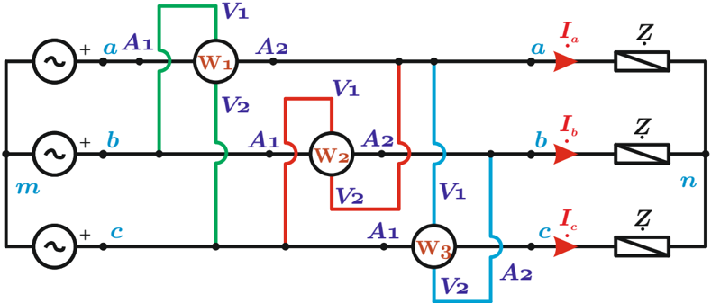

# 6.3.5 Medición de potencia reactiva trifásica

Tags: #eli214
## 6.3.5. Medición de potencia reactiva trifásica

Si se disponen de dos o tres 'vármetros' (VAr) , es posible de forma directa medir la potencia reactiva trifásica, aplicando adecuadamente el Teorema de Blondel.

Si no se dispone de ellos, es posible medir la potencia reactiva mediante el uso ingenioso de vatímetros, siempre y cuando la generación sea equilibrada. Para ello en un sistema trifásico trifilar, basta disponer de tres vatímetros que tomen la corriente de cada una de las tres líneas, pero metódica y secuencialmente, se tomen lectura de la tensión de línea de la fases siguientes, así se obtendrá:

$$( W 1 ) + ( W 2 ) + ( W 3 ) \, = \, \Re \epsilon \{ V _ { b c } I _ { a } ^ { * } + V _ { c a } I _ { b } ^ { * } + V _ { a b } I _ { c } ^ { * } \} = \sqrt { 3 } \Re \{ - j ( V _ { a } I _ { a } ^ { * } + V _ { b } I _ { b } ^ { * } + V _ { c } I _ { c } ^ { * } ) \} \equiv \sqrt { 3 } Q _ { 3 \phi }$$

Figura 6.19: Esquema de medición de potencia reactiva con generación equilibrada y carga equilibrada o no equilibrada.

Es decir:

$$Q _ { 3 \phi } = \frac { ( W 1 ) + ( W 2 ) + ( W 3 ) } { \sqrt { 3 } }$$

SECCIÓN 6.4

## Medición del factor de potencia a frecuencia industrial

El factor de potencia o ' cos ( φ ) ' de una carga se calcula generalmente de la medición de potencia activa (W) , tensión (V) y corriente (A) . Muchas otras veces es útil tener una indicación directa del factor de potencia con objeto de su monitoreo y control, evitando por medio de compensación que baje de niveles preestablecidos y que además de generar ineficiencias en el sistema eléctrico, sea causa de multas..

Los 'cosfímetros' más empleados son los de bobinas cruzadas, los de fierro móvil y los electrónicos.

## 6.3.5. Medición de potencia reactiva trifásica

Si se disponen de dos o tres 'vármetros' (VAr) , es posible de forma directa medir la potencia reactiva trifásica, aplicando adecuadamente el Teorema de Blondel.

Si no se dispone de ellos, es posible medir la potencia reactiva mediante el uso ingenioso de vatímetros, siempre y cuando la generación sea equilibrada. Para ello en un sistema trifásico trifilar, basta disponer de tres vatímetros que tomen la corriente de cada una de las tres líneas, pero metódica y secuencialmente, se tomen lectura de la tensión de línea de la fases siguientes, así se obtendrá:

$$( W 1 ) + ( W 2 ) + ( W 3 ) \, = \, \Re \epsilon \{ V _ { b c } I _ { a } ^ { * } + V _ { c a } I _ { b } ^ { * } + V _ { a b } I _ { c } ^ { * } \} = \sqrt { 3 } \Re \{ - j ( V _ { a } I _ { a } ^ { * } + V _ { b } I _ { b } ^ { * } + V _ { c } I _ { c } ^ { * } ) \} \equiv \sqrt { 3 } Q _ { 3 \phi }$$

Figura 6.19: Esquema de medición de potencia reactiva con generación equilibrada y carga equilibrada o no equilibrada.

Es decir:

$$Q _ { 3 \phi } = \frac { ( W 1 ) + ( W 2 ) + ( W 3 ) } { \sqrt { 3 } }$$

