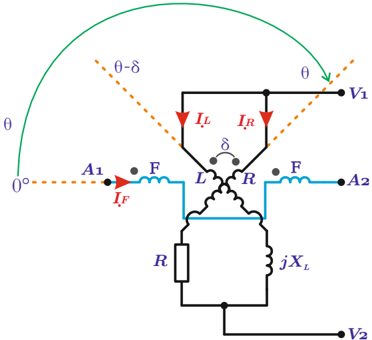

# 6.4.1 Cosfímetro de bobinas cruzadas

Tags: #eli214
## 6.4.1. Cosfímetro de bobinas cruzadas

Su aspecto constructivo es muy similar a un instrumento electrodinámico , en el cual el sistema móvil que se utiliza para medir tensión se tiene un par de bobinas separadas entre sí en un ángulo fijo ' δ '. Mientras en una de las bobinas móviles se conecta una resistencia R M para hacer que la tensión de entrada sea proporcional a la corriente que circula y genera torque en esa bobina, en la otra bobina se conecta una reactancia inductiva X L . La bobina fija mantiene la configuración normal midiendo la corriente que circula por el sistema.

Figura 6.20: Esquema de medición de potencia reactiva con generación equilibrada y carga equilibrada o no equilibrada.

El torque de la aguja para dar una lectura o indicación quedará definido principalmente por las fuerzas eléctricas, dado que esta configuración adolece de resorte de retención, por tanto:

$$T _ { e } = \frac { \partial M _ { R - F } } { \partial \theta } \cdot \Re \{ I _ { R } \cdot I ^ { * } _ { F } \} + \frac { \partial M _ { L - F } } { \partial \theta } \cdot \Re \{ I _ { L } \cdot I ^ { * } _ { F } \}$$

Donde:

* I F = ‖ I ‖ ∡ -φ es la corriente de la bobina fija por donde pasa la corriente del sistema, que alimenta a la carga ‖ Z ‖ ∡ φ ,

* I R = V ∡ 0 o /R es la corriente de la bobina móvil que tiene resistencia de adaptación,
* I L = V ∡ -90 o /X L es la corriente de la bobina móvil que tiene una reactancia de adaptación,
* M R -F = M · cos ( θ ) es la inductancia mutua entre la bobina fija y la bobina móvil que tiene la resistencia, y
* M R -L = M · cos ( θ -δ ) es la inductancia mutua entre la bobina fija y la bobina móvil que tiene la reactancia, que espacialmente está desplazada en un ángulo δ .

Para una deflexión estable se tiene:

$$0 = - \frac { M } { R } \cdot \| V \cdot \mathbf I \| s i n ( \theta ) \cos ( \phi ) - \frac { M } { X _ { L } } \cdot \| V \cdot \mathbf I \| s i n ( \theta - \delta ) \cos ( \phi - 9 0 ^ { o } )$$

Si se hace que los valores de la resistencia y reactancia a frecuencia industrial sean iguales X L = R y por diseño que δ = 90 o , se llega a:

$$t a n ( \theta ) = t a n ( \phi ) \longrightarrow \theta = \phi$$

