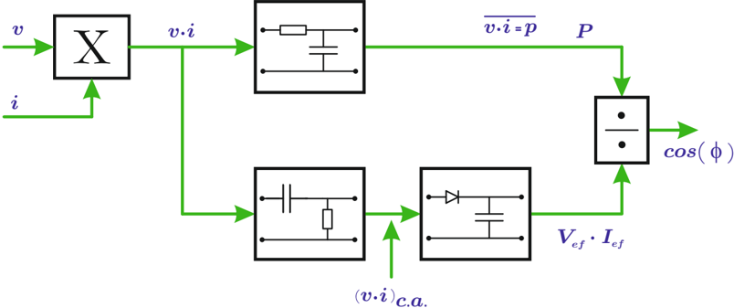

# 6.4.3 Cosfímetro electrónico

Tags: #eli214
## 6.4.3. Cosfímetro electrónico

Haciendo abstracción de la forma final en que el instrumento electrónico hará la indicación ya sea con un postproceso analógico-digital o analógico-analógico, se puede centrar el presente análisis en la forma en que se procesan las señales de tensión y corriente de un cierto circuito eléctrico.

Figura 6.21: Esquema cosfímetro electrónico.

1. Se adaptan las señales de tensión v ( t ) = V 0 sin ( ωt ) y corriente i ( t ) = I 0 sin ( ωt -φ ) el tiempo a niveles dentro del rango de trabajo de los amplificadores. La corriente se lleva a una señal de tensión proporcional.
2. Se multiplican ambas señales v ( t ) e i ( t ) para obtener:

$$p ( t ) = \frac { V _ { 0 } \cdot I _ { 0 } } { 2 } \left ( \cos ( \phi ) \{ 1 - \cos ( 2 \omega t ) \} - s i n ( \phi ) s i n ( 2 \omega t ) \right )$$

Señal que se usa como entrada en dos bloques:

- a ) p ( t ) se hace pasar por un filtro pasa bajos, para obtener la componente su continua, es decir:

$$P = \bar { p } ( t ) = \frac { V _ { 0 } \cdot I _ { 0 } } { 2 } \cdot \cos ( \phi )$$

- b ) p ( t ) se hace pasar por un filtro pasa altos, para sacar al componente continua y dejar solamente su componente alterna:

$$p _ { c a } ( t ) = - \frac { V _ { 0 } \cdot I _ { 0 } } { 2 } \left ( \cos ( 2 \omega t - \phi ) \right )$$

Si a p ca se rectifica y guarda el valor su valor máximo se obtendrá:

$$\frac { V _ { 0 } \cdot I _ { 0 } } { 2 } = V _ { e f } \cdot I _ { e f } = \| S \|$$

3. Se dividen las señales obtenidas desde los bloques anteriores, buscando obtener P/ ‖ S ‖ , el cual se procesa para generar una indicación del ' cos ( φ ) '.

En algunos casos y según la tecnología actual, la introducción de elementos electrónicos para el procesamiento de las señales, efectuar operaciones como multiplicación y división introducen errores. Por ello, en busca de otra alternativa se cambia el principio de medida diseñando sistemas sensibles al paso por cero de las señales de tensión y corriente indicando la fase relativa, instrumento que se denomina 'fasímetro' , el cual ha sido desplazado por el osciloscopio solo en términos de costo y función específica.

