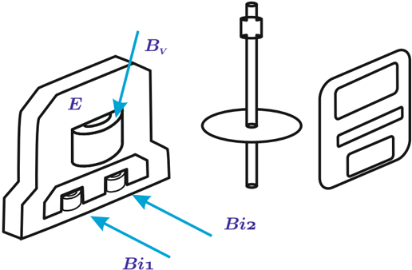
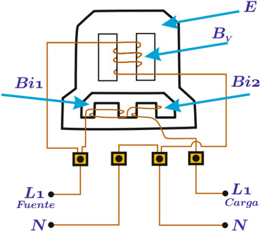

# 6.5 Medición de energía

Tags: #eli214
SECCIÓN 6.5

## Medición de energía

La energía es una de las variables eléctricas más medidas en la actualidad y por lo tanto requiere gran exactitud. Las compañías distribuidoras de energía en cada empalme o punto de conexión para el consumo industrial o doméstico, coloca un por lo menos un medidor de energía y en base a él, hace sus facturaciones o cobros de consumo.

La energía eléctrica es medida en kWh para poder representar y correlacionar la energía con los consumos habituales y el tiempo que duró el consumo. Por ejemplo, una ampolleta de 40W tarda 25h en consumir 1kWh , pero en tan solo un segundo consume 40J . Normalmente la unidad Joule se usa de forma más común en sistemas transitorios de energía, por la corta duración de los intervalos temporales asociados.

El instrumento de mayor difusión para medir la energía eléctrica a frecuencia industrial es el contador de inducción 3 , el cual además de ser de bajo costo y escasa necesidad de mantenimiento, es bastante exacto en un amplio rango de carga y factor de potencia.

Figura 6.22: Medidor de energía (diagrama de explosión).

Su funcionamiento es similar al de un motor de inducción bifásico, donde la tensión de entrada alimenta una bobina de tensión ( B v ) que produce un campo magnético. Luego, de la misma línea activa que alimenta a la carga, se conectan dos bobinas de corriente en serie entre sí ( B i 1 y B i 2 ). Los campos de las bobinas de corriente están a oposición de fase y a su vez están desplazados cierto ángulo del campo producido por la bobina de tensión y que en su sumatoria producen un campo del tipo onda viajera . El rotor es un disco de aluminio donde se inducirán corrientes que a su vez generan un campo que tiende a seguir a la onda viajera , produciendo así que el disco gire. Como no hay resorte de frenado o retención, se dispone de un imán fijo que al moverse el disco le inducirán corrientes que tenderán a frenarlo. Por consiguiente, habrá un movimiento producto del equilibrio de torques electromagnéticos, girando a una velocidad fija, que a tensión constante dependerá únicamente de la magnitud de la corriente que la carga consuma y por ende su potencia y energía.

3 Desarrollado por Schallenberger en 1888.

Figura 6.23: Esquema de conexión de medidor de energía.

Existen diversos mecanismos de conteo de las vueltas del disco, lo cual reflejará un acumulado de la energía consumida.

La conexión eléctrica de un contador de energía deberá ser igual a la de un vatímetro. En redes trifásicas para medidores de energía se puede aplicar el teorema de Blondel empleando contadores con dos o tres elementos, donde cada uno de los elementos en cuestión está constituido por bobinas y disco que no influyen con los otros elementos, pero los discos se disponen en un mismo eje con objeto de sumar las energías por fase, por medio de la sumatoria de torques.

