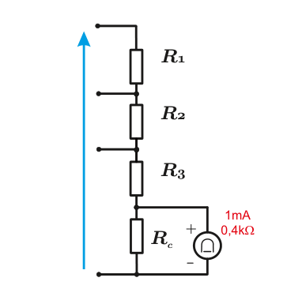
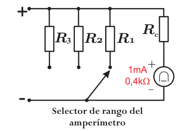

## METROLOGÍA ELÉCTRICA

## EXP-03-S1-2026

## Experiencia N° 3

## 'Voltímetro y Amperímetro en Corrriente continua'

## 1. Objetivos

## 1.1. Objetivos generales

1. Construir un multitester ( voltímetro y amperímetro ) usando un galvanómetro . 2. Aprender a medir resistencias con Puente de Wheatstone y Kelvin .

## 1.2. Objetivos específicos

1. Comprender el ancho de banda de un galvanómetro de característica pasa bajos . 2. Calcular, construir, ajustar y calibrar un voltímetro y un amperímetro de corriente continua que utiliza como indicador un galvanómetro . 3. Aprender a usar el Puente de Wheatstone para medir resistencias del orden entre los Ω y kΩ y contrastar con óhmetro correspondiente. 4. Aprender a usar el Puente de Kelvin para medir resistencias del orden entre los mΩ y Ω y contrastar con óhmetro correspondiente.

## 2. Desarrollo

## 2.1. Registro de los elementos a usar y consideraciones previas

1. Inicie en su cuaderno el protocolo de la experiencia anotando los datos de la experiencia, como: Título, fecha, horas, integrantes, secretario, condiciones ambientales, etc. 2. Anote las características principales de los elementos e instrumentos a utilizar, tales como: Marca, modelo, características, número de serie, número de inventario, etc. 3. Anote cada caso de estudio claramente, los ajustes que se realizaron y los datos obtenidos del trabajo previo.

## 2.2. Ancho de banda del galvanómetro

Alimente al galvanómetro desde un generador de señales con una señal de tensión:

$$v ( t ) = 2 A + A s i n ( 2 \pi f t )$$

Para este caso se recomienda que A esté entre 50 -200mV y que la frecuencia f sea 0 , 1Hz . Utilice un osciloscopio para ir corroborando sus configuraciones con el generador de señales y registre las formas de onda cuando lo considere importante.

- a.Revise la polaridad de la tensión/terminales para que no se estropee el galvanómetro al marcar negativo. Corrija polaridad de terminales y ajuste el valor de A para que la deflexión máxima no supere el rango del galvanómetro y esté dentro del último tercio de la escala. - b.Mida en el galvanómetro el valor máximo indicado e intente medir 'al ojo' el valor medio de la oscilación de la aguja. - c.Conocida la resistencia interna del galvanómetro R g , verifique que los valores anteriores cumplen la Ley de Ohm , considerando que la escala del galvanómetro está en mA . Justifique. - d.Sin cambiar A , modifique la frecuencia de entrada de v ( t ) y repita los puntos b y c para cada caso. Frecuencias de estudio: 1 -1 , 5 -2 -10 -15 -20 -50 -100 -1000 -5000Hz . - e.Grafique la amplitud máxima medida, en términos de la frecuencia en escala semilogarítmica. - f.Compruebe la característica pasa bajos del galvanómetro indicando desde qué frecuencia se mide solamente la componente continua y determine su ancho de banda ( frecuencia ) desde que la amplitud de la oscilación medida se reduce en aprox. un 70 % del valor medido a 0 , 1Hz . - i.Indique sus comentarios para cada punto, según corresponda.

## 2.3. Voltímetro analógico

Arme el voltímetro de la figura 1 en un protoboard , con las siguientes especificaciones: Sensibilidad mínima s = 0 , 7kΩ / V , rangos 0 -1 -5 -10 V y R C que permita ajustes de ± 10 % de variación de la corriente por el galvanómetro .

- a.Contraste el óhmetro que utilizará, con un Puente de Wheatstone . - b.Mida las resistencias con el óhmetro y puente. - c.Verifique la protección de sobrecarga del galvanómetro (diodos o fusible). - d.Arme el circuito de la Figura 1 con los valores de resistencia calculados y medidos de los puntos anteriores. - e.Energice el circuito con la fuente electrónica de tensión variable, por el rango mayor de tensión y ajuste R C para la máxima deflexión de su instrumento. - f.- Usando como referencia/patrón un voltímetro digital, contraste el voltímetro construido en los tres rangos (sólo a la tensión de rango), sin reajustar R C . Alimente con la fuente electrónica. - g.Verifique la linealidad de cada rango/escala tomando a lo menos 4 puntos, haciendo variar la tensión de la fuente electrónica. - h.Aplique 10V cc a dos resistores en serie iguales, de no más de 100Ω c/u. Mida con su voltímetro la tensión de cada resistor y de la fuente en la escala más apropiada. Indique el valor real y el valor medido en cada caso, considere el error sistemático , la contrastación del punto anterior y si lo sabe el error admisible . ( Sea claro en cada paso ). - i.Indique sus comentarios para cada punto, según corresponda.

Figura 1: Voltímetro de tres rangos

## 2.4. Amperímetro analógico

Sin desarmar el circuito anterior, arme el amperímetro de la Figura 2 en el mismo protoboard con las siguientes especificaciones: Sensibilidad según el punto anterior, rangos 0 -10 -50 -100 mA y R C que permita ajustes de ± 10 % de variación de la corriente por el galvanómetro . En este caso puede disponer a gusto personal, el buscar e incorporar un selector que permita conmutar la conexión del voltímetro al amperímetro del mismo galvanómetro .

- a.Contraste el óhmetro que utilizará, con un Puente de Kelvin . - b.Mida las resistencias con el óhmetro y el puente. - c.Arme el circuito de la Figura 2 con los valores de resistencia calculados y medidos de los puntos anteriores. - d.Energice el circuito con la fuente electrónica de tensión variable con dos resistencias limitadoras en serie y ajuste por estas resistencias el nivel de corriente del mayor rango y ajuste R C para la máxima deflexión de su instrumento. - e.- Usando como referencia/patrón un amperímetro de bobina móvil, contraste el amperímetro construido en los dos rangos (sólo a la corriente de rango), sin reajustar R C . - f.Verifique la linealidad de cada rango/escala tomando a lo menos 4 puntos. - g.Aplique 10V cc a 3 resistores en paralelo, de tal manera que por cada uno de ellos circule una corriente que sea medible en al menos un rango de su amperímetro y de la fuente en la escala más apropiada. Considere que para la medición de la corriente total no puede superar el rango máximo de su amperímetro (rango de 100 mA ) y la corriente de cada uno de los resistores debe ser apropiada para cada uno de los rangos (buscando medir de manera adecuada). Indique el valor real y el valor medido en cada caso, considere el error sistemático , la contrastación del punto anterior y si lo sabe el error admisible . ( Sea claro en cada paso ). - h.Indique sus comentarios para cada punto, según corresponda.

Figura 2: Amperímetro de dos rangos

## 3. Informe

## 3.1. Generalidades

Realice en informe en formato digital y subirlo al aula virtual, antes de la hora acordada. Considere como hitos relevantes lo siguiente:

- a.El nombre del archivo a subir en aula de indicar el N° de la experiencia y el grupo (Ej. Informe\_E1\_G1 ). - b.Portada que indique claramente: Nombre de la asignatura, número de experiencia (Ej. E1 ), número de grupo (Ej. G3 ) y fecha de entrega. - c.Índice de contenidos , abordando los principales puntos desarrollados. - d.Resumen Ejecutivo , Introducción y objetivos , propios de la experiencia y algún otro que se crea relevante. - e.Como las conclusiones son individuales, estás no pueden exceder una página. El nombre del archivo que indique las conclusiones debe tener un nombre de la siguiente forma Apellido1\_Apellido2 . . - f.Tomar como referencia el documento llamado Recomendaciones para elaboración de informes que se encuentra en aula virtual.

Nota: Si hubiera trabajo previo, normalmente se entrega impreso y revisa antes de comenzar la experiencia.

## 3.2. Resultados finales

1. El informe deberá contener al menos los circuitos utilizados, las señales observadas, su trabajo previo (cálculos y simulaciones), las conclusiones de lo desarrollado, gráficos que muestren la linealidad del voltímetro y amperímetro construidos. 2. Hitos 2.2, 2.3, 2.4 y 3.2, sumado al cualquier actividad extra que se encuentre de 3. importancia de breve exposición. Si aplica , cada hito debe tener una conclusión particular.

## 4. Estudios y trabajos previos a la experiencia

- a.Elija la sensibilidad de su voltímetro dentro de la especificación exigida. Investigue los miliamperímetros ( galvanómetros ) disponibles en pañol y seleccione el que utilizará para el desarrollo de la experiencia. - b.Determine la máxima deflexión de su instrumento indicador. - c.Para el voltímetro , calcule las resistencias necesarias e indique su valor junto al valor de potencia que debe soportar c/u. Considere que los valores de resistencia están normalizados, por ej.: 10 -12 -15 -18 -22 -27 -33 -39 -47 -56 -68 -82 -100 × 10 N . Puede lograr otros valores agregando resistencias en paralelo o serie.

Para el amperímetro , calcule las resistencias paralelo R 1 , R 2 y R 2 ( shunt ) para lograr las condiciones especificadas. Considere para la construcción de los shunt's con un alambre de Nicrom , por ejemplo de 0 , 45 mm de diámetro y de 1 , 2Ω mm 2 /m de resistividad. Calcule la longitud del alambre a usar en cada rango y arme su resistencia. Consulte en pañol, disponibilidad de alambre y selecciónelo previamente.

- d.Calcule R C para cada instrumento para dar el rango de ajuste solicitado. Considere que para esto dispondrá de resistencias variables (potenciómetros) de rangos 0 -5 , 0 -10 y 0 -20 kΩ en el pañol. - e.Entender el principio de funcionamiento de la protección del miliamperímetro en caso de una selección inadecuada del rango. Para ello puede simular el circuito en un software de análisis de circuitos (Por ej.:PSIM o alguno similar). En este punto debe corroborar si el miliamperímetro podrá funcionar a plena escala ( 1mA ) antes que operen los diodos (suponer V op = 0 , 7V en los diodos). - f.Realice previamente la lista que instrumentos que usará en laboratorio, indique el galvanómetro y resistencias que utilizará, instrumentos, con las características mínimas, etc.. - g.Antes de comenzar el laboratorio debe mostrar los cálculos de los valores estimados para las resistencias internas de su instrumento. - h.Realice/diseñe el circuito de contrastación para cada instrumento y el circuito de validación con el cual estudiará el error sistemático. Para el caso del amperímetro los circuitos deberán contar con dos resistencias limitadoras en serie : una fija ajustada a la máxima corriente de ensayo y la otra variable para dar el ajuste requerido. Calcule ambas resistencias (valores de resistencia y de corriente máxima) si usa una fuente electrónica de tensión de 10 V cc . - i.Tome todas las medidas pertinentes para programar el trabajo y terminar antes de las 18:15hrs.

La planificación debería ser suficiente para realizar las mediciones en el laboratorio, y poder determinar aspectos adicionales del ítem Informe .

Se pueden traer los circuitos armados previamente, pero igualmente se deberán medir las resistencias de los componentes empleados, lo cual se puede hacer al final para evitar desarmar y armar el circuito ya construido.

Si se piden materiales en pañol para armar con tiempo los circuitos se deberá anotar ya hacer responsable por los componentes solicitados. Considere que tal vez no será posible tener antes de laboratorio al galvanómetro, pero si el protoboard y las resistencias si lo solicita.