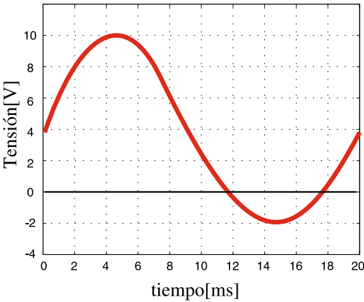

image text: Figure ID 0 parsed from layout.

# METROLOGÍA ELÉCTRICA

# EXP-04-S1-2026

# Experiencia N° 4 'Osciloscopio Digital Parte 1'

# 1. Objetivos

# 1.1. Objetivos generales

a.Aprender a usar un osciloscopio y su funcionamiento.

b.Conocer y aprender los conceptos de básicos de operación como son: base de tiempo, ganancia por canal, acoplamiento, trigger, etc.

c.Conocer y aprender los principios de conexión a partir de las puntas o sondas de medida.

d.Analizar los resultados y obtener conclusiones.

# 1.2. Objetivos específicos

Analizar el concepto y el comportamiento práctico de:

a.La base de tiempo y la ganancia por canal.

b.El trigger y level .

c.Los tipos de acoplamientos: CC , CA y GND .

d.- El modo normal e invertido .

e.- El modo Y-t y el modo X-Y .

# 2. Desarrollo

# 2.1. Registro de los elementos a usar

Inicie en su cuaderno el protocolo de la experiencia anotando los datos de la experiencia, como: Título, fecha, horas, integrantes, secretario, condiciones ambientales, etc.

Anote las características principales de los elementos e instrumentos a utilizar, tales como: Marca, modelo, características, número de serie, número de inventario, etc.

Anote cada caso de estudio claramente y los ajustes que se realizaron.

En todas las experiencias está prohibido el uso del Auto-setting .

image text: Figure ID 1 parsed from layout.

image text: Figure ID 2 parsed from layout.

# 2.2. El trigger y level

Através de un generador de señales deberá visualizar una señal sinusoidal, Triangular y luego una cuadrada, todas de 5 , 0V rms y frecuencia 50Hz . Antes de ejecutar cualquier medición, deberá ajustar las puntas del osciloscopio.

a.Conecte la señal sinusoidal al canal 1 ( CH1 ).

b.Sincronice el trigger con CH1 , con el level un poco mayor que cero ( 0 + ). Haga los ajustes necesarios que se verán in situ para que la señal se vea inmóvil.

c.Varíe lentamente el level desde 0 + a un valor positivo grande. Comente.

d.Varíe lentamente el level desde 0 + a un valor negativo grande. Comente.

e.Vuelva al caso b. y cambie el modo del trigger entre flanco de pendiente positiva y negativa. Comente.

f.Vuelva al caso b. y conecte en el CH2 la señal rectangular.

g.Analice que sucede al sincronizar con: CH1 , luego CH2 y luego con red eléctrica.

h.Repita el punto anterior, pero considerando que la señal del CH2 tiene otra frecuencia (múltiplo, submúltiplo de 50Hz y frecuencia aleatoria).

# 2.3. Acoplamientos y modo normal-invertido

Desde la mesa central se inyectará a cada uno de los bancos de trabajo de la figura 1 en el CH1 , mientras que en el CH2 habrá una señal muy similar pero de valor medio aleatorio.

image text: Figure ID 3 parsed from layout.

image text: Figura 1: Señal a medir

a.Con acoplamiento CC para cada señal mida las amplitudes, valores medios y períodos respectivos. Calcule el valor efectivo total, el valor efectivo armónico y el valor medio.

# METROLOGÍA ELÉCTRICA

# EXP-04-S1-2026

image text: Figure ID 4 parsed from layout.

image text: Figure ID 5 parsed from layout.

# METROLOGÍA ELÉCTRICA

# EXP-04-S1-2026

image text: Figure ID 6 parsed from layout.

b.Con acoplamiento CC , mida el desfase de las señales en tiempo y en grados. Haga un diagrama fasorial.

c.Con acoplamiento CA , mida el desfase de las señales en tiempo y en grados. Comente y compare con el caso anterior.

d.Con acoplamiento GND . Comente.

e.Con acoplamiento CC y modo invertido en ambos canales mida las amplitudes, valores medios y períodos respectivos.

f.Con acoplamiento CC en ambos canales pero sólo con el CH1 en modo invertido , mida el desfase de las señales en tiempo y en grados. Haga un diagrama fasorial y comente.

# 2.4. Ganancias, Base de tiempo y modos temporales

Con el osciloscopio en modo Y-t , se aplicarán a los canales 1 y 2 una señal sinusoidal de amplitud y frecuencia variable.

Ajuste las ganancias y base de tiempo para tener como mínimo dos ciclos y medir: amplitud y frecuencia.

Reduzca la ganancia hasta que no se pueda apreciar la señal. Comente.

Aumente la ganancia en un paso y mida en ambos canales amplitud, período y frecuencia en division y en unidades.

Repita lo anterior aumentando la ganancia hasta que la señal se sature. Comente.

Con el osciloscopio en modo X-Y registre la figura de Lissajous y:

Mida el valor máximo de cada eje. Comente.

Agregue a uno de los canales un desfase que vaya creciendo en el tiempo, registre la figura de Lissajous.

Aumente la frecuencia de una de las señales de un canal y registre la figura de Lissajous.

# 2.5. Medición de señal transitoria

Desde la mesa central se inyectará a cada uno de los bancos de trabajo una señal transitoria, que deberá ser capaz de medir con el osciloscopio. Las características de la señal se le darán a conocer en el laboratorio.

image text: Figure ID 7 parsed from layout.

# 3. Informe

a.Grafique la forma de onda medida en cada caso y el concepto involucrado, destaque las diferencias que provee cada opción al estar midiendo la misma señal. Importante guardar las formas de ondas en formato xxx.csv, así como png o jpg desde el osciloscopio. No olvidar llevar pendrive.

b.Indique sus conclusiones generales e individuales por concepto estudiado.

# 3.1. Generalidades.

Realice en informe en formato digital y subirlo al aula virtual, antes de la hora acordada. Considere como hitos relevantes lo siguiente:

a.El nombre del archivo a subir en aula de indicar el N° de la experiencia y el grupo (Ej. Informe_E1_G1 ).

b.Portada que indique claramente: Nombre de la asignatura, número de experiencia (Ej. E1 ), número de grupo (Ej. G3 ) y fecha de entrega.

c.Índice de contenidos , abordando los principales puntos desarrollados.

d.Resumen Ejecutivo , Introducción y objetivos , propios de la experiencia y algún otro que se crea relevante.

e.Como las conclusiones son individuales, estás no pueden exceder una página. El nombre del archivo que indique las conclusiones debe tener un nombre de la siguiente forma Apellido1_Apellido2 .

f.Tomar como referencia el documento llamado Recomendaciones para elaboración de informes que se encuentra en aula virtual.

# METROLOGÍA ELÉCTRICA

# EXP-04-S1-2026

image text: Figure ID 8 parsed from layout.
