image text: Figure ID 0 parsed from layout.

# DS1000Z Series Digital Oscilloscope

# May, 2020 RIGOL TECHNOLOGIES CO., LTD.

# Guaranty and Declaration

# Copyright

© 2020 RIGOL TECHNOLOGIES CO., LTD. All Rights Reserved.

# Trademark Information

RIGOL ®  is the trademark of RIGOL TECHNOLOGIES CO., LTD.

# Publication Number

UGA19114-1110

# Software Version

00.04.03.SP2

Software upgrade might change or add product features. Please acquire the latest version of the manual from RIGOL website or contact RIGOL to upgrade the software.

# Notices

⚫ RIGOL products are covered by P.R.C. and foreign patents, issued and pending.

⚫ RIGOL reserves the right to modify or change parts of or all the specifications and pricing policies at the company's sole decision.

⚫ Information in this publication replaces all previously released materials.

⚫ Information in this publication is subject to change without notice.

⚫ RIGOL shall not be liable for either incidental or consequential losses in connection with the furnishing, use, or performance of this manual, as well as any information contained.

⚫ Any part of this document is forbidden to be copied, photocopied, or rearranged without prior written approval of RIGOL .

# Product Certification

RIGOL guarantees that this product conforms to the national and industrial standards in China as well as the ISO9001:2015 standard and the ISO14001:2015 standard. Other international standard conformance certifications are in progress.

# Contact Us

If you have any problem or requirement when using our products or this manual, please contact RIGOL .

E-mail: service@rigol.com

Website: www.rigol.com

# Safety Requirement

# General Safety Summary

Please review the following safety precautions carefully before putting the instrument into operation so as to avoid any personal injury or damage to the instrument and any product connected to it. To prevent potential hazards, please follow the instructions specified in this manual to use the instrument properly.

# Use Proper Power Cord.

Only the exclusive power cord designed for the instrument and authorized for use within the local country could be used.

# Ground the Instrument.

The instrument is grounded through the Protective Earth lead of the power cord. To avoid electric shock, connect the earth terminal of the power cord to the Protective Earth terminal before connecting any input or output terminals.

# Connect the Probe Correctly.

If a probe is used, the probe ground lead must be connected to earth ground. Do not connect the ground lead to high voltage. Improper way of connection could result in dangerous voltages being present on the connectors, controls or other surfaces of the oscilloscope and probes, which will cause potential hazards for operators.

# Observe All Terminal Ratings.

To avoid fire or shock hazard, observe all ratings and markers on the instrument and check your manual for more information about ratings before connecting the instrument.

# Use Proper Overvoltage Protection.

Ensure that no overvoltage (such as that caused by a bolt of lightning) can reach the product. Otherwise, the operator might be exposed to the danger of an electric shock.

# Do Not Operate Without Covers.

Do not operate the instrument with covers or panels removed.

# Do Not Insert Objects into the Air Outlet.

Do not insert objects into the air outlet, as doing so may cause damage to the instrument.

# Use Proper Fuse.

Please use the specified fuses.

# Avoid Circuit or Wire Exposure.

Do not touch exposed junctions and components when the unit is powered on.

# Do Not Operate with Suspected Failures.

If you suspect that any damage may occur to the instrument, have it inspected by RIGOL authorized personnel before further operations. Any maintenance, adjustment or replacement especially to circuits or accessories must be performed by RIGOL authorized personnel.

# Provide Adequate Ventilation.

Inadequate ventilation may cause an increase of temperature in the instrument, which would cause damage to the instrument. So please keep the instrument well ventilated and inspect the air outlet and the fan regularly.

# Do Not Operate in Wet Conditions.

To avoid short circuit inside the instrument or electric shock, never operate the instrument in a humid environment.

# Do Not Operate in an Explosive Atmosphere.

To avoid personal injuries or damage to the instrument, never operate the instrument in an explosive atmosphere.

# Keep Instrument Surfaces Clean and Dry.

To avoid dust or moisture from affecting the performance of the instrument, keep the surfaces of the instrument clean and dry.

# Prevent Electrostatic Impact.

Operate the instrument in an electrostatic discharge protective environment to avoid damage induced by static discharges. Always ground both the internal and external conductors of cables to release static before making connections.

# Use the Battery Properly.

Do not expose the battery (if available) to high temperature or fire. Keep it out of the reach of children. Improper change of a battery (lithium battery) may cause an explosion. Use the RIGOL specified battery only.

# Handle with Caution.

Please handle with care during transportation to avoid damage to keys, knobs, interfaces, and other parts on the panels.

# Safety Notices and Symbols

# Safety Notices in this Manual:

image text: Figure ID 1 parsed from layout.

image text: Figure ID 2 parsed from layout.

# WARNING

Indicates a potentially hazardous situation or practice which, if not avoided, will result in serious injury or death.

# CAUTION

Indicates a potentially hazardous situation or practice which, if not avoided, could result in damage to the product or loss of important data.

# Safety Terms on the Product:

DANGER

It calls attention to an operation, if not correctly performed, could result in injury or hazard immediately.

WARNING

It calls attention to an operation, if not correctly performed, could result in potential injury or hazard.

CAUTION

It calls attention to an operation, if not correctly performed, could result in damage to the product or other devices connected to the product.

# Safety Symbols on the Product:

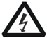
image text: Figure ID 3 parsed from layout.

image text: Hazardous Voltage

image text: Figure ID 4 parsed from layout.

image text: Safety Warning

image text: Figure ID 5 parsed from layout.

image text: Protective Earth Terminal

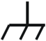
image text: Figure ID 6 parsed from layout.

image text: Chassis Ground

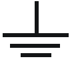
image text: Figure ID 7 parsed from layout.

image text: Test Ground

# Allgemeine Sicherheits Informationen

# Ü berprü fen Sie diefolgenden Sicherheitshinweise

sorgfä ltigumPersonenschä denoderSchä den am Gerä tundan damit verbundenen weiteren Gerä tenzu vermeiden. Zur Vermeidung vonGefahren, nutzen Sie bitte das Gerä t nur so, wiein diesem Handbuchangegeben.

# Um Feuer oder Verletzungen zu vermeiden, verwenden Sie ein ordnungsgemä ß es Netzkabel.

Verwenden Sie fü r dieses Gerä t nur das fü r ihr Land zugelassene und genehmigte Netzkabel.

# Erden des Gerä tes.

Das Gerä t ist durch den Schutzleiter im Netzkabel geerdet. Um Gefahren durch elektrischen Schlag zu vermeiden, ist es unerlä sslich, die Erdung durchzufü hren. Erst dann dü rfen weitere Ein- oder Ausgä nge verbunden werden.

# Anschluss einesTastkopfes.

Die Erdungsklemmen der Sonden sindauf dem gleichen Spannungspegel des Instruments geerdet. Schließ enSie die Erdungsklemmen an keine hohe Spannung an.

# Beachten Sie alle Anschlü sse.

Zur Vermeidung von Feuer oder Stromschlag, beachten Sie alle Bemerkungen und Markierungen auf dem Instrument. Befolgen Sie die Bedienungsanleitung fü r weitere Informationen, bevor Sie weitere Anschlü sse an das Instrument legen.

# Verwenden Sie einen geeigneten Ü berspannungsschutz.

Stellen Sie sicher , daß keinerlei Ü berspannung (wie z.B. durch Gewitter verursacht) das Gerä t erreichen kann. Andernfallsbestehtfü r den Anwender die GefahreinesStromschlages.

# Nicht ohne Abdeckung einschalten.

Betreiben Sie das Gerä t nicht mit entfernten Gehä use-Abdeckungen.

# Betreiben Sie das Gerä t nicht geö ffnet.

Der Betrieb mit offenen oder entfernten Gehä useteilen ist nicht zulä ssig. Nichts in entsprechende Ö ffnungen stecken (Lü fter z.B.)

# Passende Sicherung verwenden.

Setzen Sie nur die spezifikationsgemä ß en Sicherungen ein.

# Vermeiden Sie ungeschü tzte Verbindungen.

Berü hren Sie keine unisolierten Verbindungen oder Baugruppen, wä hrend das Gerä t in Betrieb ist.

# Betreiben Sie das Gerä t nicht im Fehlerfall.

Wenn Sie am Gerä t einen Defekt vermuten, sorgen Sie dafü r, bevor Sie das Gerä t wieder betreiben, dass eine Untersuchung durch RIGOL autorisiertem Personal durchgefü hrt wird. Jedwede Wartung, Einstellarbeiten oder Austausch von Teilen am Gerä t, sowie am Zubehö r dü rfen nur von RIGOL autorisiertem Personal durchgefü hrt werden.

# Belü ftung sicherstellen.

Unzureichende Belü ftung kann zu Temperaturanstiegen und somit zu thermischen Schä den am Gerä t fü hren. Stellen Sie deswegen die Belü ftung sicher und kontrollieren regelmä ß ig Lü fter und Belü ftungsö ffnungen.

# Nicht in feuchter Umgebung betreiben.

Zur Vermeidung von Kurzschluß  im Gerä teinneren und Stromschlag betreiben Sie das Gerä t bitte niemals in feuchter Umgebung.

# Nicht in explosiver Atmosphä re betreiben.

Zur Vermeidung von Personen- und Sachschä den ist es unumgä nglich, das Gerä t ausschließ lich fernab jedweder explosiven Atmosphä re zu betreiben.

# Gerä teoberflä chen sauber und trocken halten.

Um den Einfluß  von Staub und Feuchtigkeit aus der Luft auszuschließ en, halten Sie bitte die Gerä teoberflä chen sauber und trocken.

# Schutz gegen elektrostatische Entladung (ESD).

Sorgen Sie fü r eine elektrostatisch geschü tzte Umgebung, um somit Schä den und Funktionsstö rungen durch ESD zu vermeiden. Erden Sie vor dem Anschluß  immer Innen- und Auß enleiter der Verbindungsleitung, um statische Aufladung zu entladen.

# Die richtige Verwendung desAkku.

Wenneine Batterieverwendet wird, vermeiden Sie hohe Temperaturen bzw. Feuer ausgesetzt werden. Bewahren Sie es auß erhalbder Reichweitevon Kindern auf. Unsachgemä ß eÄ nderung derBatterie (Anmerkung: Lithium-Batterie) kann zu einer Explosion fü hren. VerwendenSie nur von RIGOL angegebenenAkkus.

# Sicherer Transport.

Transportieren Sie das Gerä t sorgfä ltig (Verpackung!), um Schä den an Bedienelementen, Anschlü ssen und anderen Teilen zu vermeiden.

# Sicherheits Begriffe und Symbole

# Begriffe in diesem Guide:

image text: Figure ID 8 parsed from layout.

image text: Figure ID 9 parsed from layout.

# WARNING

Die Kennzeichnung WARNING beschreibt Gefahrenquellen die leibliche Schä den oder den Tod von Personen zur Folge haben kö nnen.

# CAUTION

Die Kennzeichnung Caution (Vorsicht) beschreibt Gefahrenquellen die Schä den am Gerä t hervorrufen kö nnen.

# Begriffe auf dem Produkt:

DANGER

weist auf eine Verletzung oder Gefä hrdung hin, die sofort geschehen kann.

WARNING

weist auf eine Verletzung oder Gefä hrdung hin, die mö glicherweise nicht sofort geschehen.

CAUTION

weist auf eine Verletzung oder Gefä hrdung hin und bedeutet, dass eine mö gliche Beschä digung des Instruments oder anderer Gegenstä nde auftreten kann.

# Symbole auf dem Produkt:

image text: Figure ID 10 parsed from layout.

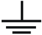
image text: Figure ID 11 parsed from layout.

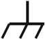
image text: Figure ID 12 parsed from layout.

image text: Figure ID 13 parsed from layout.

image text: Figure ID 14 parsed from layout.

image text: Gefä hrliche Spannung

image text: Sicherheits- Hinweis

image text: Schutz-erde

image text: Gehä usemasse

image text: Erde

# Measurement Category

# Measurement Category

DS1000Z series digital oscilloscopes can make measurements in Measurement Category I.

image text: Figure ID 15 parsed from layout.

# WARNING

This oscilloscope can only be used for measurements within its specified measurement categories.

# Measurement Category Definitions

Measurement category I is for measurements performed on circuits not directly connected to MAINS. Examples are measurements on circuits not derived from MAINS, and specially protected (internal) MAINS derived circuits. In the latter case, transient stresses are variable. For that reason, the transient withstand capability of the equipment is made known to the user.

Measurement category II is for measurements performed on circuits directly connected to low voltage installations. Examples are measurements on household appliances, portable tools and similar equipment.

Measurement category III is for measurements performed in building installations. Examples are measurements on distribution boards, circuit-breakers, wiring (including cables, bus-bars, junction boxes, switches and socket-outlets) in fixed installations, equipment for industrial use and some other equipment. For example, stationary motors with permanent connection to a fixed installation.

Measurement category IV is for measurements performed at the source of a low-voltage installation. Examples are electricity meters and measurements on primary overcurrent protection devices and ripple control units.

# Ventilation Requirement

This oscilloscope uses fan to force cooling. Please make sure that the air intake and exhaust areas are free from obstructions and have free air. When using the oscilloscope in a bench-top or rack setting, provide at least 10 cm clearance beside, above and behind the instrument for adequate ventilation.

image text: Figure ID 16 parsed from layout.

# WARNING

Inadequate ventilation may cause a temperature increase which can damage the instrument. So please keep the instrument well ventilated during operation and inspect the intake and fan regularly.

# Working Environment

# Temperature

Operating: 0

℃ to +50 ℃

Non-operating: -40

℃ to +70 ℃

# Humidity

0 ℃ to +30 ℃ :

≤95 % relative humidity

+30 ℃ to +40 ℃ :

≤75 % relative humidity

+40 ℃ to +50 ℃ :

≤45 % relative humidity

image text: Figure ID 17 parsed from layout.

# Altitude

Operating: below 3 km

Non-operating: below 15 km

# Installation (Overvoltage) Category

This product is powered by mains conforming to installation (overvoltage) category II.

image text: Figure ID 18 parsed from layout.

# WARNING

Make sure that no overvoltage (such as that produced by a thunderstorm) can reach the product, or else the operator might be exposed to the danger of electric shock.

# Installation (Overvoltage) Category Definitions

Installation (overvoltage) category I refers to signal level which is applicable to equipment measurement terminals connected to the source circuit. In these terminals, precautions are done to limit the transient voltage to the corresponding low level.

Installation (overvoltage) category II refers to the local power distribution level which is applicable to equipment connected to the AC line (AC power).

# Pollution Degree

Degree 2

# Pollution Degree Definitions

Pollution degree 1: No pollution or only dry, non-conductive pollution occurs. The pollution has no influence. For example, a clean room or air-conditioned office environment.

# WARNING

To avoid short circuits inside the instrument or electric shocks, please do not operate in humid environment.

Pollution degree 2: Normally only dry, non-conductive pollution occurs. Occasionally a temporary conductivity caused by condensation may occur. For example, general indoor environment.

Pollution degree 3: Conductive pollution occurs, or dry, non-conductive pollution occurs which becomes conductive due to condensation which is expected. For example, sheltered outdoor environment.

Pollution degree 4: Pollution that generates persistent conductivity through conductive dust, rain, or snow. For example, outdoor locations.

# Safety Class

Class 1 -Grounded Product

# Care and Cleaning

# Care

Do not store or leave the instrument where it may be exposed to direct sunlight for long periods of time.

# Cleaning

Clean the instrument regularly according to its operating conditions.

Disconnect the instrument from all power sources.

Clean the external surfaces of the instrument with a soft cloth dampened with mild detergent or water. Avoid having any water or other objects into the chassis via the heat dissipation hole. When cleaning the LCD, take care to avoid scarifying it.

image text: Figure ID 19 parsed from layout.

image text: Figure ID 20 parsed from layout.

# CAUTION

To avoid damage to the instrument, do not expose it to caustic liquids.

# WARNING

To avoid short-circuit resulting from moisture or personal injuries, ensure that the instrument is completely dry before connecting it to the power supply.

# Environmental Considerations

The following symbol indicates that this product complies with the WEEE Directive 2002/96/EC.

image text: Figure ID 21 parsed from layout.

# Product End-of-Life Handling

The equipment may contain substances that could be harmful to the environment or human health. To avoid the release of such substances into the environment and avoid harm to human health, we recommend you to recycle this product appropriately to ensure that most materials are reused or recycled properly. Please contact your local authorities for disposal or recycling information.

You can click on the following link http://www.rigol.com/Files/RIGOL_RoHS2.0&WEEE.pdf to download the latest

version of the RoHS&WEEE certification file.

# DS1000Z Series Overview

DS1000Z series is a multifunctional and high-performance digital oscilloscope designed on the basis of the UltraVision technique developed by RIGOL . Featuring extremely high memory depth, wide dynamic range, clear display, excellent waveform capture rate and comprehensive triggering functions, it is a useful commissioning instrument for various fields such as communication, aerospace, defense, embedded systems, computers, research and education. Wherein, the mixed signal digital oscilloscope aimed at the embedded design and test fields allows users to measure analog and digital signals at the same time. DS1000Z is the one with the most comprehensive functions and the most outstanding specifications among the 100 MHz bandwidth digital oscilloscopes.

# Main features:

⚫ 1 GSa/s real-time sample rate of the analog channels; up to 24 Mpts standard memory depth

⚫ 1 GSa/s real-time sample rate of the digital channels

⚫ 100 MHz, 70 MHz and 50 MHz analog channel bandwidth

⚫ 4 analog channels, 16 digital channels (only available for DS1000Z Plus that has been upgraded with the MSO upgrade option)

⚫ Dual-channel 25 MHz signal source (applicable to digital oscilloscopes with source channels)

⚫ 30,000 wfms/s (dots display) waveform capture rate

⚫ Real-time hardware waveform recording and playback functions; up to 60,000 frames of waveform can be recorded

⚫ Intensity graded color display

⚫ Low base noise, 1 mV/div to 10 V/div ultra-wide vertical dynamic range

⚫ 7.0 inch WVGA (800*480) TFT LCD, with ultra-wide screen, vivid picture, low power consumption and long service life

⚫ Adjustable waveform brightness

⚫ Auto setting of waveform display ( AUTO )

⚫ Up to 15 kinds of trigger functions, including various protocol triggers

⚫ Standard parallel decoding and multiple serial decoding

⚫ Auto measurement of 37 waveform parameters (with statistics)

⚫ Fine delayed sweep function

⚫ Built-in FFT function

⚫ Multiple waveform math operation functions

⚫ Pass/fail test function

⚫ Standard interfaces: USB Device, USB Host, LAN and Aux

⚫ Conform to LXI CORE 2011 DEVICE class instrument standards; enable quick, economic and efficient creation and reconfiguration of test system

⚫ Supports remote command control

⚫ Built-in help to facilitate information acquisition

⚫ Supports multiple languages and Chinese/English input

⚫ Novel and delicate industrial design and easy operation

# Document Overview

# Main Topics of this Manual:

# Chapter 1 Quick Start

Introduce the preparations before using the oscilloscope and provide a basic introduction of the instrument.

# Chapter 2 To Set the Vertical System

Introduce the vertical system functions of the oscilloscope.

# Chapter 3 To Set the Horizontal System

Introduce the horizontal system functions of the oscilloscope.

# Chapter 4 To Set the Sample System

Introduce the sample system functions of the oscilloscope.

# Chapter 5 To Trigger the Oscilloscope

Introduce the trigger mode, trigger coupling, trigger holdoff, external trigger and various trigger types of the oscilloscope.

# Chapter 6 MATH and Measurement

Introduce how to make math operation, auto measurement and cursor measurement.

# Chapter 7 Digital Channel

Introduce how to use the digital channels of the mixed signal digital oscilloscope.

# Chapter 8 Protocol Decoding

Introduce how to decode the input signal using those common protocols.

# Chapter 9 Reference Waveform

Introduce how to compare the input waveform with the reference waveform.

# Chapter 10 Pass/Fail Test

Introduce how to monitor the input signal using the Pass/Fail test.

# Chapter 11 Waveform Record

Introduce how to analyze the input signal using waveform record.

# Chapter 12 Display Control

Introduce how to control the display of the oscilloscope.

# Chapter 13 Signal Source

Introduce how to use the built-in signal source.

# Chapter 14 Store and Recall

Introduce how to store and recall the measurement result and the setting of the oscilloscope.

# Chapter 15 Accessibility Setting

Introduce how to set the remote interfaces and system-related functions.

# Chapter 16 Remote Control

Introduce how to control the oscilloscope remotely.

# Chapter 17 Troubleshooting

Introduce how to deal with the common failures of the oscilloscope.

# Chapter 18 Appendix

Provide common information such as the options and accessories.

# Format Conventions in this Manual:

# 1. Key

The front panel keys are denoted by the format of "Key Name (Bold) + Text Box". For example, Utility denotes the "Utility" key.

# 2. Menu

The menu items are denoted by the format of "Menu Word (Bold) + Character Shading". For example, System denotes the "System" menu item under Utility .

# 3. Operation Step

The next step of operation is denoted by an arrow " → ". For example, Utility → System denotes that first press Utility on the front panel and then press System .

# 4. Knob

image text: Figure ID 22 parsed from layout.

| Knob                     |
|--------------------------|
| Horizontal Scale Knob    |
| Horizontal Position Knob |
| Vertical Scale Knob      |
| Vertical Position Knob   |
| Trigger Level Knob       |

image text: Figure ID 23 parsed from layout.

image text: Figure ID 24 parsed from layout.

image text: Figure ID 25 parsed from layout.

image text: Figure ID 26 parsed from layout.

image text: Figure ID 27 parsed from layout.

# Content Conventions in this Manual:

DS1000Z series includes the following models. Unless otherwise noted, this manual takes DS1104Z-S Plus for example to illustrate the functions and operation methods of DS1000Z series.

| Model          | Analog Bandwidth   |   Number of Analog Channels | Number of Source Channels   | Number of Digital Channels   |
|----------------|--------------------|-----------------------------|-----------------------------|------------------------------|
| DS1104Z-S Plus | 100 MHz            |                           4 | 2                           | 16 [1]                       |
| DS1074Z-S Plus | 70 MHz             |                           4 | 2                           | 16 [1]                       |
| DS1104Z Plus   | 100 MHz            |                           4 | --                          | 16 [1]                       |
| DS1074Z Plus   | 70 MHz             |                           4 | --                          | 16 [1]                       |
| DS1054Z        | 50 MHz             |                           4 | --                          | --                           |

Note [1] : Required to upgrade through the MSO upgrade option (includes the logic analyzer probe RPL1116 and the model label).

# Manuals of this Product:

The manuals of this product include the quick guide, user guide, programming guide, data sheet and etc. The latest versions of the manuals can be downloaded from RIGOL official website (www.rigol.com).

# Contents

| Guaranty and Declaration .........................................................................I      |                                                                                                   |
|----------------------------------------------------------------------------------------------------------|---------------------------------------------------------------------------------------------------|
| Safety Requirement................................................................................       | II                                                                                                |
| General Safety Summary...........................................................................II      |                                                                                                   |
| Safety Notices and Symbols......................................................................IV       |                                                                                                   |
| Allgemeine Sicherheits Informationen.........................................................            | V                                                                                                 |
| Sicherheits Begriffe und Symbole.............................................................VII         |                                                                                                   |
| Measurement Category..........................................................................VIII       |                                                                                                   |
| Ventilation Requirement...........................................................................       | IX                                                                                                |
| Working Environment                                                                                      | ............................................................................... X                 |
| Care and Cleaning                                                                                        | ..................................................................................XII             |
| Environmental Considerations..................................................................XII        |                                                                                                   |
| DS1000Z Series Overview...................................................................               | XIII                                                                                              |
| Document Overview.............................................................................           | XIV                                                                                               |
| Chapter 1 Quick Start .........................................................................1-1       |                                                                                                   |
| General Inspection                                                                                       | ................................................................................ 1-2              |
| Appearance and Dimensions...................................................................             | 1-3                                                                                               |
| To Prepare the Oscilloscope for Use.........................................................             | 1-4                                                                                               |
| To Adjust the Supporting Legs..........................................................                  | 1-4                                                                                               |
| To Connect to Power Supply.............................................................                  | 1-4                                                                                               |
| Turn-on Checkout                                                                                         | ........................................................................... 1-5                   |
| To Connect the Probe......................................................................               | 1-5                                                                                               |
| Function Inspection.........................................................................             | 1-7                                                                                               |
| Probe Compensation .......................................................................               | 1-8                                                                                               |
| Front Panel Overview.............................................................................        | 1-9                                                                                               |
| Rear Panel Overview.............................................................................1-10     |                                                                                                   |
| Front Panel Function Overview...............................................................1-12         |                                                                                                   |
| VERTICAL                                                                                                 | .....................................................................................1-12         |
| Logic Analyzer                                                                                           | ...............................................................................1-13               |
| Signal Source                                                                                            | ................................................................................1-13              |
| HORIZONTAL                                                                                               | ................................................................................1-14              |
| TRIGGER                                                                                                  | ......................................................................................1-15        |
| CLEAR                                                                                                    | ..........................................................................................1-15    |
| AUTO............................................................................................1-15     |                                                                                                   |
| RUN/STOP                                                                                                 | ....................................................................................1-16          |
| SINGLE.........................................................................................1-16      |                                                                                                   |
| Multifunction Knob.........................................................................1-16          |                                                                                                   |
| Function Menus                                                                                           | .............................................................................1-17                 |
| Print                                                                                                    | .............................................................................................1-18 |
| User Interface......................................................................................1-19 |                                                                                                   |
| Parameter Setting Method.....................................................................1-24        |                                                                                                   |
| To Use the Security Lock.......................................................................1-25      |                                                                                                   |

| To Use the Built-in Help System.............................................................1-26             |                                                                                                |
|--------------------------------------------------------------------------------------------------------------|------------------------------------------------------------------------------------------------|
| Chapter 2 To Set the Vertical System.................................................                        | 2-1                                                                                            |
| To Enable the Analog Channel                                                                                 | .................................................................2-2                           |
| Channel Coupling...................................................................................2-2       |                                                                                                |
| Bandwidth Limit.....................................................................................2-3      |                                                                                                |
| Probe Ratio                                                                                                  | ...........................................................................................2-3 |
| Waveform Invert....................................................................................2-4       |                                                                                                |
| Vertical Scale.........................................................................................2-4   |                                                                                                |
| Amplitude Unit.......................................................................................2-5     |                                                                                                |
| Channel Label........................................................................................2-5     |                                                                                                |
| Delay Calibration of the Analog Channel                                                                      | ...................................................2-7                                         |
| Chapter 3 To Set the Horizontal System                                                                       | ............................................ 3-1                                               |
| Delayed Sweep......................................................................................3-2       |                                                                                                |
| Time Base Mode                                                                                               | ....................................................................................3-3        |
| YT Mode.........................................................................................3-3          |                                                                                                |
| XY Mode.........................................................................................3-3          |                                                                                                |
| Roll Mode                                                                                                    | .......................................................................................3-5     |
| Chapter 4 To Set the Sample System .................................................                         | 4-1                                                                                            |
| Acquisition Mode....................................................................................4-2      |                                                                                                |
| Normal ...........................................................................................4-2        |                                                                                                |
| Peak Detect                                                                                                  | ....................................................................................4-2        |
| Average..........................................................................................4-2         |                                                                                                |
| High Resolution                                                                                              | ...............................................................................4-3             |
| Sin(x)/x.................................................................................................4-4 |                                                                                                |
| Sample Rate..........................................................................................4-4     |                                                                                                |
| Memory Depth.......................................................................................4-6       |                                                                                                |
| Antialiasing............................................................................................4-7  |                                                                                                |
| Chapter 5 To Trigger the Oscilloscope................................................                        | 5-1                                                                                            |
| Trigger Source                                                                                               | .......................................................................................5-2     |
| Trigger Mode.........................................................................................5-3     |                                                                                                |
| Trigger Coupling.....................................................................................5-4     |                                                                                                |
| Trigger Holdoff.......................................................................................5-5    |                                                                                                |
| Noise Rejection......................................................................................5-5     |                                                                                                |
| Trigger Type                                                                                                 | ..........................................................................................5-6  |
| Edge Trigger                                                                                                 | ...................................................................................5-7         |
| Pulse Trigger...................................................................................5-8          |                                                                                                |
| Slope Trigger.................................................................................5-10           |                                                                                                |
| Video Trigger.................................................................................5-13           |                                                                                                |
| Pattern Trigger                                                                                              | ..............................................................................5-15             |
| Duration Trigger                                                                                             | ............................................................................5-17               |
| TimeOut Trigger                                                                                              | ............................................................................5-19               |
| Runt Trigger..................................................................................5-21           |                                                                                                |
| Window Trigger                                                                                               | .............................................................................5-23              |
| Delay Trigger                                                                                                | ................................................................................5-25           |

| Setup/Hold Trigger.........................................................................5-28         |                                                                                                         |
|---------------------------------------------------------------------------------------------------------|---------------------------------------------------------------------------------------------------------|
| Nth Edge Trigger............................................................................5-30        |                                                                                                         |
| RS232 Trigger................................................................................5-32       |                                                                                                         |
| I2C Trigger....................................................................................5-34     |                                                                                                         |
| SPI Trigger....................................................................................5-37     |                                                                                                         |
| Trigger Output Connector......................................................................5-39      |                                                                                                         |
| Chapter 6 MATH and Measurement                                                                          | ....................................................6-1                                                 |
| Math Operation.....................................................................................     | 6-2                                                                                                     |
| Addition.........................................................................................       | 6-2                                                                                                     |
| Subtraction                                                                                             | .................................................................................... 6-3                |
| Multiplication..................................................................................        | 6-4                                                                                                     |
| Division..........................................................................................      | 6-4                                                                                                     |
| FFT ...............................................................................................     | 6-6                                                                                                     |
| "AND" Operation............................................................................6-11         |                                                                                                         |
| "OR" Operation..............................................................................6-12        |                                                                                                         |
| "XOR" Operation............................................................................6-13         |                                                                                                         |
| "NOT" Operation............................................................................6-14         |                                                                                                         |
|                                                                                                         | Intg..............................................................................................6-15  |
|                                                                                                         | Diff...............................................................................................6-16 |
|                                                                                                         | Sqrt..............................................................................................6-17  |
| Lg (Use 10 as the Base)                                                                                 | .................................................................6-17                                   |
| Ln                                                                                                      | ................................................................................................6-18    |
| Exp                                                                                                     | ..............................................................................................6-19      |
| Abs                                                                                                     | ..............................................................................................6-20      |
| Filter.............................................................................................6-21 |                                                                                                         |
| Fx Operation                                                                                            | .................................................................................6-22                   |
| Math Operation Label.....................................................................6-23           |                                                                                                         |
| Auto Measurement                                                                                        | ...............................................................................6-24                     |
| Quick Measurement after AUTO.......................................................6-24                 |                                                                                                         |
| One-key Measurement of 37 Parameters..........................................6-25                      |                                                                                                         |
| Frequency Counter Measurement                                                                           | ....................................................6-31                                                |
| Measurement Setting                                                                                     | .....................................................................6-31                               |
| To Clear the Measurement..............................................................6-32              |                                                                                                         |
| All Measurement............................................................................6-34         |                                                                                                         |
| Statistic Function                                                                                      | ...........................................................................6-34                         |
| Measurement History                                                                                     | .....................................................................6-35                               |
| Measurement Result Display Type....................................................6-35                 |                                                                                                         |
| Cursor Measurement.............................................................................6-36     |                                                                                                         |
| Manual Mode.................................................................................6-36        |                                                                                                         |
| Track Mode                                                                                              | ...................................................................................6-40                 |
| Auto Mode                                                                                               | ....................................................................................6-42                |
| XY Mode.......................................................................................6-43      |                                                                                                         |
| Chapter 7 Digital Channel...................................................................7-1         |                                                                                                         |
| To Select the Digital Channel ..................................................................        | 7-2                                                                                                     |
| To Turn on/off the Digital Channel...........................................................           | 7-2                                                                                                     |

| Group                                                                                                            | Set..............................................................................................7-3   |
|------------------------------------------------------------------------------------------------------------------|--------------------------------------------------------------------------------------------------------|
| To Set the Waveform Display Size............................................................7-4                  |                                                                                                        |
| Reorder Setting......................................................................................7-4         |                                                                                                        |
| Auto View..............................................................................................7-4       |                                                                                                        |
| To Set the Threshold                                                                                             | ..............................................................................7-4                      |
| To Set the Label.....................................................................................7-5         |                                                                                                        |
| Probe Calibration....................................................................................7-5         |                                                                                                        |
| Digital Channel Delay Calibration                                                                                | .............................................................7-5                                       |
| Chapter 8 Protocol Decoding .............................................................                        | 8-1                                                                                                    |
| Parallel Decoding                                                                                                | ...................................................................................8-2                 |
| RS232 Decoding                                                                                                   | ....................................................................................8-7                |
| I2C Decoding.......................................................................................8-12          |                                                                                                        |
| SPI Decoding.......................................................................................8-15          |                                                                                                        |
| Chapter 9 Reference Waveform.........................................................                            | 9-1                                                                                                    |
| To Enable REF Function ..........................................................................9-2             |                                                                                                        |
| To Select REF Source..............................................................................9-2            |                                                                                                        |
| To Adjust REF Waveform Display                                                                                   | .............................................................9-2                                       |
| To Save to Internal Memory                                                                                       | ....................................................................9-2                                |
| To Set the                                                                                                       | Color.....................................................................................9-3          |
| To Reset the Reference Waveform                                                                                  | ...........................................................9-3                                         |
| To Export to Internal or External Memory                                                                         | .................................................9-3                                                   |
| To Import from Internal or External Memory.............................................9-3                       |                                                                                                        |
| Chapter 10 Pass/Fail Test............................................................                            | 10-1                                                                                                   |
| To Enable Pass/Fail                                                                                              | Test........................................................................10-2                       |
| To Select Source                                                                                                 | ..................................................................................10-2                 |
| Mask Range.........................................................................................10-2 Test and | Output...................................................................................10-3          |
| To Save the Test Mask..........................................................................10-4              |                                                                                                        |
| To Load the Test                                                                                                 | Mask..........................................................................10-4                     |
| Chapter 11 Waveform Record......................................................                                 | 11-1                                                                                                   |
| Common Settings.................................................................................11-2             |                                                                                                        |
| Playback Option...................................................................................11-3           |                                                                                                        |
| Record Option......................................................................................11-4          |                                                                                                        |
| Chapter 12 Display Control..........................................................                             | 12-1                                                                                                   |
| To Select the Display Type                                                                                       | ....................................................................12-2                               |
| To Set the Persistence Time                                                                                      | ..................................................................12-2                                 |
| To Set the Waveform Intensity                                                                                    | ..............................................................12-3                                     |
| To Set the Screen Grid..........................................................................12-3             |                                                                                                        |
| To Set the Grid Brightness.....................................................................12-3              |                                                                                                        |
|                                                                                                                  | ............................................................ 13-1                                      |
| Chapter 13 Signal Source                                                                                         |                                                                                                        |
| To Output Basic Waveform....................................................................13-2                 |                                                                                                        |
| To Output Sine                                                                                                   | ..............................................................................13-2                     |
| To Output Square                                                                                                 | ..........................................................................13-3                         |

| To Output Ramp                                                                                             | ............................................................................13-4                     |
|------------------------------------------------------------------------------------------------------------|------------------------------------------------------------------------------------------------------|
| To Output Pulse.............................................................................13-5           |                                                                                                      |
| To Output DC                                                                                               | ................................................................................13-5                 |
| To Output Noise.............................................................................13-6           |                                                                                                      |
| To Output Built-in Waveform..................................................................13-6          |                                                                                                      |
| To Output Arbitrary Waveform                                                                               | .............................................................13-10                                   |
| To Select Waveform                                                                                         | .....................................................................13-11                           |
| To Create Waveform.....................................................................13-12               |                                                                                                      |
| To Edit Waveform                                                                                           | ........................................................................13-14                        |
| Modulation                                                                                                 | ........................................................................................13-15        |
|                                                                                                            | AM.............................................................................................13-16 |
| FM                                                                                                         | .............................................................................................13-17   |
| Chapter 14 Store and                                                                                       | Recall.........................................................14-1                                  |
| Storage System....................................................................................14-2     |                                                                                                      |
| Storage Type                                                                                               | .......................................................................................14-2          |
| Internal Storage and Recall                                                                                | ...................................................................14-5                              |
| External Storage and                                                                                       | Recall...................................................................14-6                        |
| Disk Management.................................................................................14-7       |                                                                                                      |
| To Select File Type                                                                                        | .........................................................................14-7                        |
| To Create a New File or Folder                                                                             | ........................................................14-8                                         |
| To Delete a File or                                                                                        | Folder..............................................................14-11                            |
| To Rename a File or Folder                                                                                 | ...........................................................14-11                                     |
| To Clear the Local Memory............................................................14-11                 |                                                                                                      |
| Factory..............................................................................................14-12 |                                                                                                      |
| Chapter 15 Accessibility Setting...................................................15-1                    |                                                                                                      |
| Remote Interface Configuration                                                                             | .............................................................15-2                                    |
| LAN Configuration..........................................................................15-2            |                                                                                                      |
| USB Device                                                                                                 | ...................................................................................15-5              |
| System-related.....................................................................................15-6    |                                                                                                      |
| Sound...........................................................................................15-6       |                                                                                                      |
| Language......................................................................................15-6         |                                                                                                      |
| System Information........................................................................15-6             |                                                                                                      |
| Vertical Reference..........................................................................15-6           |                                                                                                      |
| Power-off Recall.............................................................................15-7          |                                                                                                      |
| Self-calibration...............................................................................15-7        |                                                                                                      |
| Print Setting                                                                                              | ..................................................................................15-8               |
| Aux Output                                                                                                 | .................................................................................15-10               |
| Option Management.....................................................................15-11                |                                                                                                      |
| Auto Options                                                                                               | ...............................................................................15-12                 |
| Key                                                                                                        | Lock.....................................................................................15-12       |
| Chapter 16 Remote Control..........................................................16-1                    |                                                                                                      |
| Remote Control via USB........................................................................16-2         |                                                                                                      |
| Remote Control via LAN                                                                                     | ........................................................................16-6                         |
| Chapter 17 Troubleshooting.........................................................17-1                    |                                                                                                      |

| Chapter 18                                                                                                     | Appendix................................................................... 18-1                               |
|----------------------------------------------------------------------------------------------------------------|----------------------------------------------------------------------------------------------------------------|
| Appendix A: Accessories and Options.....................................................18-1                   | Appendix A: Accessories and Options.....................................................18-1                   |
| Appendix B: Warranty...........................................................................18-2            | Appendix B: Warranty...........................................................................18-2            |
| Index........................................................................................................1 | Index........................................................................................................1 |

# Chapter 1 Quick Start

This chapter introduces the precautions when using the oscilloscope for the first time, the front/rear panels of the oscilloscope, the user interface and the using method of the built-in help system.

The contents of this chapter:

◼ General Inspection

◼ Appearance and Dimensions

◼ To Prepare the Oscilloscope for Use

◼ Front Panel Overview

◼ Rear Panel Overview

◼ Front Panel Function Overview

◼ User Interface

◼ Parameter Setting Method

◼ To Use the Security Lock

◼ To Use the Built-in Help System

# General Inspection

# 1. Inspect the packaging

If the packaging has been damaged, do not dispose the damaged packaging or cushioning materials until the shipment has been checked for completeness and has passed both electrical and mechanical tests.

The consigner or carrier shall be liable for the damage to the instrument resulting from shipment. RIGOL would not be responsible for free maintenance/rework or replacement of the instrument.

# 2. Inspect the instrument

In case of any mechanical damage, missing parts, or failure in passing the electrical and mechanical tests, contact your RIGOL sales representative.

# 3. Check the accessories

Please check the accessories according to the packing lists. If the accessories are damaged or incomplete, please contact your RIGOL sales representative.

# Appearance and Dimensions

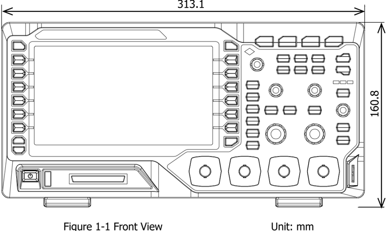
image text: Figure ID 28 parsed from layout.

image text: Figure 1-2 Top View                                                Unit: mm

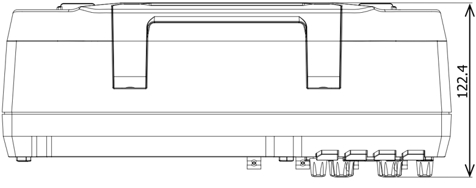
image text: Figure ID 29 parsed from layout.

# To Prepare the Oscilloscope for Use

# To Adjust the Supporting Legs

Adjust the supporting legs properly to use them as stands to tilt the oscilloscope upwards for stable placement of the oscilloscope as well as better operation and observation.

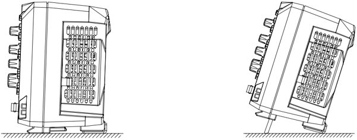
image text: Figure ID 30 parsed from layout.

image text: Figure 1-3 To Adjust the Supporting Legs

# To Connect to Power Supply

The power requirements of the oscilloscope are 100-240 V, 45-440 Hz. Please use the power cord supplied with the accessories to connect the oscilloscope to the AC power source as shown in the figure below.

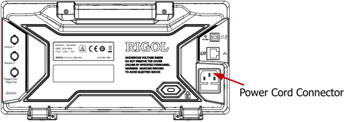
image text: Figure ID 31 parsed from layout.

image text: Figure 1-4 To Connect to Power Supply

# Turn-on Checkout

When the oscilloscope is connected to power, press the Power key at the lower-left corner of the front panel to start the oscilloscope. During the start-up process, the oscilloscope performs a series of self-tests. After the self-test, the welcome screen is displayed. The instrument is installed with the trial versions of the options before leaving factory and the remaining trial time is about 2,000 minutes. The "Installed Options" dialog box will be displayed if your instrument has currently installed the trial versions of options. From this dialog box you can view the name, detail, version and remaining trial time of the option currently installed.

# To Connect the Probe

RIGOL provides passive probe and logic probe for DS1000Z series. For the model of the probes, please refer to DS1000Z Series Datasheet. For detailed technical information of the probes, please refer to the corresponding Probe User Guide.

# Connect the passive probe:

Connect the BNC terminal of the probe to an analog channel input terminal of the oscilloscope on the front panel.

Connect the ground alligator clip or spring of the probe to the circuit ground terminal and connect the probe tip to the circuit point to be tested.

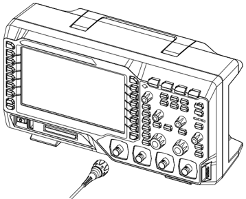
image text: Figure ID 32 parsed from layout.

image text: Figure 1-5 To Connect the Passive Probe

After you connect the passive probe, check the probe function and probe compensation adjustment before making measurements. For detailed procedures, refer to "Function Inspection" and "Probe Compensation" sections in this manual.

# Connect the logic probe:

Connect the single-wire terminal of the logic probe to the digital channel input terminal on the front panel of the oscilloscope in the correct direction.

Connect the other terminal of the logic probe to the signal under test. RIGOL provides DS1000Z Plus with the RPL1116 logic probe option. To realize convenient and flexible detection of signals, two connection methods for the signal under test are available. For the details, please refer to the RPL1116 Logic Probe User Guide.

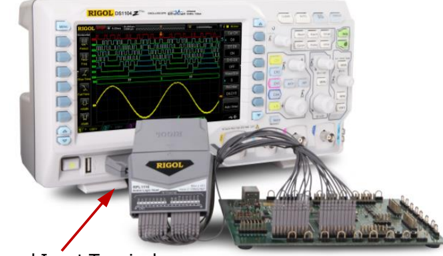
image text: Figure ID 33 parsed from layout.

image text: Figure 1-6 To Connect the Logic Probe Digital Channel Input Terminal

Note: The digital channel input terminal does not support hot plugging. Please do not insert or pull out the logic probe when the instrument is in power-on state.

# Function Inspection

Press Storage → Default to restore the oscilloscope to its default configuration.

Connect the ground alligator clip of the probe to the "Ground Terminal" as shown in the figure below.

Use the probe to connect the input terminal of CH1 of the oscilloscope and the "Compensation Signal Output Terminal" of the probe.

Set the attenuation on the probe to 10X. Then press AUTO .

Observe the waveform on the display. In normal condition, the square waveform as shown in the figure below should be displayed.

Use the same method to test the other channels. If the square waveforms actually shown do not match that in the figure above, please perform " Probe Compensation ".

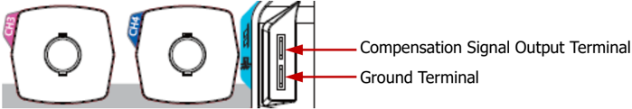
image text: Figure ID 34 parsed from layout.

image text: Figure 1-7 To Use the Compensation Signal

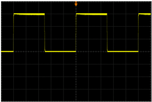
image text: Figure ID 35 parsed from layout.

image text: Figure 1-8 Square Waveform

image text: Figure ID 36 parsed from layout.

# Tip

The signal output from the probe compensation connector can only be used for probe compensation adjustment and cannot be used for calibration.

# WARNING

To avoid electric shock when using the probe, please make sure that the insulated wire of the probe is in good condition. Do not touch the metallic part of the probe when the probe is connected to high voltage source.

# Probe Compensation

When the probes are used for the first time, you should compensate the probes to make them match the input channels of the oscilloscope. Non-compensated or poorly compensated probes may cause measurement inaccuracy or errors. The probe compensation procedures are as follows.

Perform Step 1, 2, 3 and 4 specified in " Function Inspection ".

Check the displayed waveforms and compare them with the following figures.

Use a nonmetallic driver to adjust the low-frequency compensation adjustment hole on the probe until the displayed waveform is displayed as "Perfectly compensated" in the figure above.

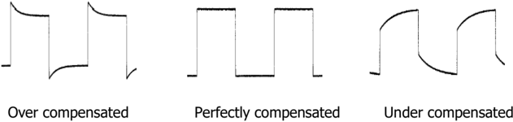
image text: Figure ID 37 parsed from layout.

image text: Figure 1-9 Probe Compensation

# Front Panel Overview

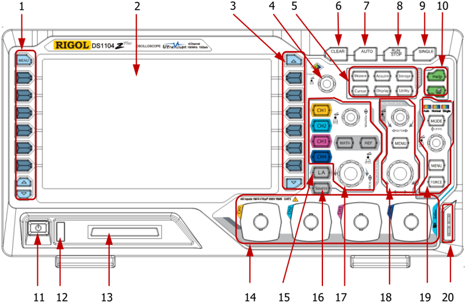
image text: Figure ID 38 parsed from layout.

image text: Figure 1-10 Front Panel Overview

|   No. | Description               |   No. | Description                                               |
|-------|---------------------------|-------|-----------------------------------------------------------|
|     1 | Measurement Menu Softkeys |    11 | Power Key                                                 |
|     2 | LCD                       |    12 | USB Host Interface                                        |
|     3 | Function Menu Softkeys    |    13 | Digital Channel Input Interface [1]                       |
|     4 | Multifunction Knob        |    14 | Analog Channel Input Interface                            |
|     5 | Common Operation Keys     |    15 | Logic Analyzer Control Key [1]                            |
|     6 | CLEAR                     |    16 | Signal Source [2]                                         |
|     7 | AUTO                      |    17 | VERTICAL Control                                          |
|     8 | RUN/STOP                  |    18 | HORIZONTAL Control                                        |
|     9 | SINGLE                    |    19 | TRIGGER Control                                           |
|    10 | Help/Print                |    20 | Probe Compensation Signal Output Terminal/Ground Terminal |

image text: Table 1-1 Front Panel Descriptions

Note [1] : Only applicable to DS1000Z Plus.

Note [2] : Only applicable to digital oscilloscopes with source channels.

# Rear Panel Overview

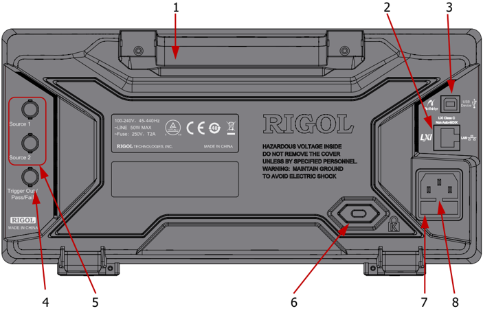
image text: Figure ID 39 parsed from layout.

image text: Figure 1-11 Rear Panel Overview

# 1 ． Handle

Pull up the handle vertically for easy carry of the instrument. When you do not need the handle, press it down.

# 2 ． LAN

Connect the instrument to network via this interface for remote control. This oscilloscope conforms to the LXI CORE 2011 DEVICE class instrument standards and can quickly build test system with other instruments.

# 3 ． USB Device

You can connect the oscilloscope to a PictBridge printer or PC via this interface. When a PC is connected, users can send SCPI commands using the PC software or control the oscilloscope via user-defined programming. When a printer is connected, users can print the waveform displayed on the screen using the printer .

# 4 ． Trigger Out and Pass/Fail

# ⚫ Trigger Out:

The oscilloscope can output a signal that can reflect the current capture rate of the oscilloscope at each trigger via this interface. Connect the signal to a waveform display device and measure the frequency of the signal. The measurement result is the same with the current capture rate.

# ⚫ Pass/Fail:

The instrument can output a negative pulse via this connector when a failed waveform is detected during the pass/fail test. The instrument continuously outputs a low level via this connector when no failed waveform is detected.

# 5 ． Source Output

The output terminals of the built-in dual-channel source of the oscilloscope. When source 1 or source 2 is enabled, the signal currently set can be output through the [Source 1] or [Source 2] connector on the rear panel.

# 6 ． Lock Hole

You can lock the instrument to a fixed location by using the security lock (please purchase it yourself) via the lock hole.

# 7 ． Fuse

If a new fuse is required, please use the specified fuse (250V, T2A). The replacing method is as follows.

Turn off the instrument, switch off the power supply and remove the power cord.

Insert a small straight screwdriver into the slot at the power cord connector and pry out the fuse holder gently.

Take out the fuse and replace it with a specified fuse. Then, install the fuse holder.

# 8 ． AC Power Cord Connector

AC power input terminal. The power requirements of this oscilloscope are 100-240 V, 45-440 Hz. Use the power cord provided with the accessories to connect the instrument to AC power. Then, you can press the Power key on the front panel to start the instrument.

# Front Panel Function Overview VERTICAL

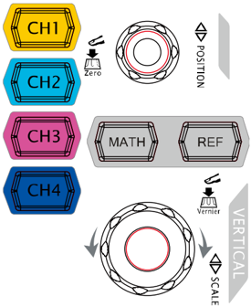
image text: Figure ID 40 parsed from layout.

CH1 , CH2 , CH3 , CH4 : analog channel setting keys. The 4 channels are marked by different colors which are also used to mark both the corresponding waveforms on the screen and the channel input connectors. Press any key to open the corresponding channel menu and press again to turn off the channel.

MATH : press MATH → Math to open the math operation menu under which A+B, A-B, A× B, A/B, FFT, A&&B, A||B, A^B, !A, Intg, Diff, Sqrt, Lg, Ln, Exp, Abs and Filter operations are provided. You can also press MATH to open the decoding menu and set the decoding options.

REF : press this key to enable the reference waveform function to compare the waveform actually measured with the reference waveform.

VERTICAL POSITION : modify the vertical position of the current channel waveform. Turn clockwise to increase the position and turn counterclockwise to decrease. During the modification, the waveform would move up and down and the position message (e.g. ) at the lower-left corner of the screen would change accordingly. Press down this knob to quickly reset the vertical position to zero.

VERTICAL SCALE : modify the vertical scale of the current channel. Turn clockwise to decrease the scale and turn counterclockwise to increase. During the modification, the display amplitude of the waveform would enlarge or reduce. The scale information (e.g. ) at the lower side of the screen would change accordingly. Press down this knob to quickly switch the vertical scale adjustment mode between "Coarse" and "Fine".

Tip How to set the vertical scale and vertical position of each channel? The 4 channels of DS1000Z use the same VERTICAL POSITION and VERTICAL SCALE knobs. If you want to set the vertical scale and vertical position of a channel, please press CH1 , CH2 , CH3 or CH4 at first to select the desired channel. Then turn the VERTICAL POSITION and VERTICAL SCALE knobs to set the values.

# Logic Analyzer

image text: Figure ID 41 parsed from layout.

Press this key to open the logic analyzer control menu. You can turn on or off any channel or channel group, modify the display size of the digital channel, modify the logic threshold of the digital channel as well as group the 16 digital channels. You can also set a label for each digital channel.

# Note:

-This function is only applicable to DS1000Z Plus with the MSO upgrade option.

-Press LA → D7-D0 ; when "On" is selected, CH4 function is automatically disabled; when "Off" is selected, CH4 function recovers automatically. Press LA → D15-D8 ; when "On" is selected, CH3 function is automatically disabled; when "Off" is selected, CH3 function recovers automatically.

image text: Figure ID 42 parsed from layout.

# Signal Source

image text: Figure ID 43 parsed from layout.

Press this key to enter the source setting interface. You can enable or disable the output of the [Source 1] or [Source 2] connector on the rear panel, set the output signal waveform and parameters, turn on or off the state display of the current signal.

Note: This function is only applicable to digital oscilloscopes with source channels.

# HORIZONTAL

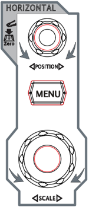
image text: Figure ID 44 parsed from layout.

HORIZONTAL POSITION : modify the horizontal position. The trigger point would move left or right relative to right and the horizontal position message (e.g.

the center of the screen when you rotate the knob. During the modification, waveforms of all the channels would move left or ) at the upper-right corner of the screen would change accordingly. Press down this knob to quickly reset the horizontal position (or the delayed sweep position).

MENU : press this key to open the horizontal control menu where you can turn on or off the delayed sweep function and switch between different time base modes.

HORIZONTAL SCALE : modify the horizontal time base. Turn clockwise to reduce the time base and turn counterclockwise to increase the time base. During the modification, waveforms of all the channels will be displayed in expanded or compressed mode and the time base message (e.g. ) at the upper side of the screen would change accordingly. Press down this knob to quickly switch to the delayed sweep state.

# TRIGGER

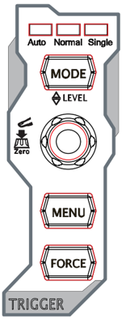
image text: Figure ID 45 parsed from layout.

# CLEAR

image text: Figure ID 46 parsed from layout.

# AUTO

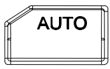
image text: Figure ID 47 parsed from layout.

MODE : press this key to switch the trigger mode to Auto, Normal or Single and the corresponding state backlight of the current trigger mode would be illuminated.

TRIGGER LEVEL : modify the trigger level. Turn clockwise to increase the level and turn counterclockwise to reduce the level. During the modification, the trigger level line would move up and down and the value in the trigger level message box (e.g. ) at the lower-left corner of the screen would change accordingly. Press down the knob to quickly reset the trigger level to zero point.

MENU : press this key to open the trigger operation menu. This oscilloscope provides various trigger types. For more details, please refer to " To Trigger the Oscilloscope ".

FORCE : press this key to generate a trigger signal forcibly.

Press this key to clear all the waveforms on the screen. If the oscilloscope is in the "RUN" state, new waveforms will be displayed.

Press this key to enable the waveform auto setting function. The oscilloscope will automatically adjust the vertical scale, horizontal time base and trigger mode according to the input signal to realize optimum waveform display.

Note: Waveform auto setting function requires that the frequency of sine is no lower than 41 Hz; the duty cycle should be greater than 1% and the amplitude must be at least 20 mVpp for square. Otherwise, the Waveform auto setting function may be invalid and the quick parameter measurement function displayed in the menu will also be unavailable.

# RUN/STOP

image text: Figure ID 48 parsed from layout.

# SINGLE

image text: Figure ID 49 parsed from layout.

Press this key to "RUN" or "STOP" waveform sampling. In the "RUN" state, the key is illuminated in yellow. In the "STOP" state, the key is illuminated in red.

Press this key to set the trigger mode to "Single". In single trigger mode, press FORCE to generate a trigger signal immediately.

# Multifunction Knob

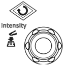
image text: Figure ID 50 parsed from layout.

# Adjust waveform brightness:

In non-menu-operation mode, turn this knob to adjust the brightness of waveform display. The adjustable range is from 0% to 100%. Turn clockwise to increase the brightness and counterclockwise to reduce. Press down this knob to reset the brightness to 60%.

You can also press Display → Intensity and use the knob to adjust the waveform brightness.

# Multifunctional:

In menu operation, the backlight of the knob goes on. Press any menu softkey and rotate the knob to select the submenus under this menu and then press down the knob to select the current submenu. It can also be used to modify parameters (please refer to the introduction in " Parameter Setting Method ") and input filename.

# Function Menus

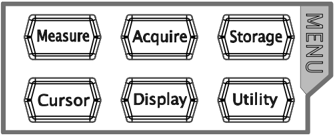
image text: Figure ID 51 parsed from layout.

Measure : press this key to open the measurement setting menu. You can set the measurement source, turn on or off the frequency counter, all measure, statistic function and etc. Press MENU at the left of the screen to open the measurement menus of 37 waveform parameters. Then, press down the corresponding menu softkey to quickly realize one-key measurement and the measurement result will be displayed at the bottom of the screen.

Acquire : press this key to enter the sample setting menu to set the acquisition mode, Sin(x)/x and memory depth of the oscilloscope.

Storage : press this key to enter the file store and recall interface. The storable file types include picture, traces, waves, setups, CSV and parameters. Internal and external storage as well as disk management are also supported.

Cursor : press this key to enter the cursor measurement menu. The oscilloscope provides four cursor modes: manual, track, auto and XY. Note that XY cursor mode is only available when the horizontal time base is set to XY.

Display : press this key to enter the display setting menu to set the display type, persistence time, wave intensity, grid type and grid brightness.

Utility : press this key to enter the system function setting menu to set the system-related functions or parameters, such as the I/O, sound and language. Besides, some advanced functions (such as the pass/fail test, waveform record, etc.) are also supported.

# Print

image text: Figure ID 52 parsed from layout.

Press this key to print the screen or save the screen to a USB storage device.

-If a PictBridge printer is connected currently and the printer is in idle state, pressing this key will execute the print operation.

-If no printer is connected but a USB storage device is inserted, pressing this key can save the screen to the USB storage device in the specified format. For more details, please refer to the introduction in " Storage Type ".

-If both a printer and a USB storage device are connected at the same time, the printer enjoys higher priority when pressing this key.

Note: DS1000Z only supports the flash memory USB storage device of FAT32 format.

# User Interface

DS1000Z provides 7.0 inch WVGA (800*480) TFT LCD.

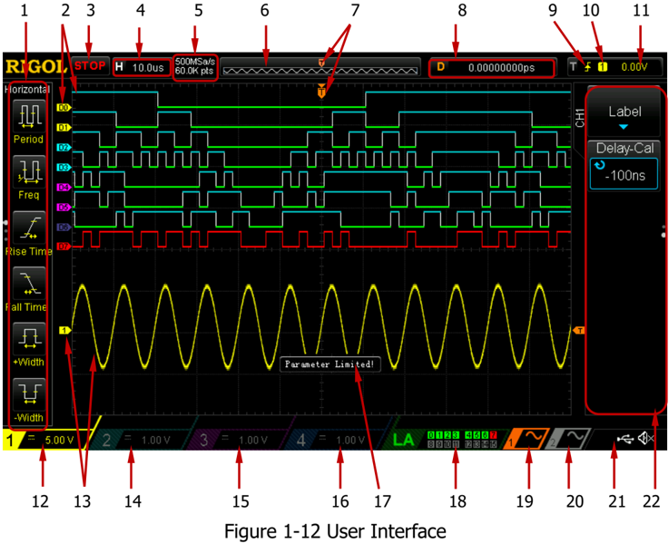
image text: Figure ID 53 parsed from layout.

# 1. Auto Measurement Items

Provide 20 horizontal (HORIZONTAL) and 17 vertical (VERTICAL) measurement parameters. Press the softkey at the left of the screen to activate the corresponding measurement item. Press MENU continuously to switch between the horizontal and vertical parameters.

# 2. Digital Channel Label/Waveform

The logic high level of the digital waveform is displayed in blue and the logic low level in green. Its edge is displayed in white. The waveform of the digital channel currently selected and the channel label are displayed in red. The digital channels can be divided into 4 channel groups by the grouping setting function of the logic analyzer function menu. The channel labels of the same channel group are displayed in the same color; different channel groups are marked with different colors.

Note: This function is only applicable to DS1000Z Plus with the MSO upgrade option.

# 3. Status

Available states includ e RUN, STOP, T'D (triggered), WAIT and AUTO.

# 4. Horizontal Time Base

⚫ Represent the time per grid on the horizontal axis on the screen.

⚫ Use HORIZONTAL SCALE to modify this parameter. The range available is from 5 ns to 50 s.

# 5. Sample Rate/Memory Depth

⚫ Display the current sample rate and memory depth of the oscilloscope.

⚫ The sample rate and memory depth will change in accordance with the horizontal time base.

# 6. Waveform Memory

Provide the schematic diagram of the memory position of the waveform currently on the screen.

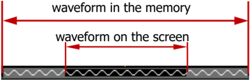
image text: Figure ID 54 parsed from layout.

# 7. Trigger Position

Display the trigger position of the waveform in the waveform memory and on the screen.

# 8. Horizontal Position

Use HORIZONTAL POSITION to modify this parameter. Press down the knob to automatically set the parameter to zero.

# 9. Trigger Type

Display the currently selected trigger type and trigger condition setting. Different labels are displayed when different trigger types are selected. For example, represents triggering on the rising edge in "Edge" trigger .

# 10. Trigger Source

Display the trigger source currently selected (CH1-CH4, AC or D0-D15). Different labels are displayed when different trigger sources are selected and the color of the trigger parameter area will change accordingly. For example, denotes that CH1 is selected as the trigger source.

# 11. Trigger Level

⚫ When an analog channel is selected as the trigger source, you need to set a proper trigger level.

⚫ The trigger level label is displayed at the right of the screen and the trigger level value is displayed at the upper-right corner of the screen.

⚫ When using TRIGGER LEVEL to modify the trigger level, the trigger level value will change with the up and down of .

Note: In slope trigger, runt trigger and window trigger, two trigger level labels ( and ) are displayed.

# 12. CH1 Vertical Scale

⚫ Display the voltage value per grid of CH1 waveform vertically.

⚫ Press CH1 to select CH1, and use VERTICAL SCALE to modify this parameter.

⚫ The following labels will be displayed according to the current channel setting: channel coupling (e.g. ) and bandwidth limit (e.g. ).

# 13. Analog Channel Label/Waveform

Different channels are marked with different colors and the colors of the channel label and waveform are the same.

# 14. CH2 Vertical Scale

⚫ Display the voltage value per grid of CH2 waveform vertically.

⚫ Press CH2 to select CH2, and use VERTICAL SCALE to modify this parameter.

⚫ The following labels will be displayed according to the current channel setting: channel coupling (e.g. ) and bandwidth limit (e.g. ).

# 15. CH3 Vertical Scale

⚫ Display the voltage value per grid of CH3 waveform vertically.

⚫ Press CH3 to select CH3, and use VERTICAL SCALE to modify this parameter.

⚫ The following labels will be displayed according to the current channel setting: channel coupling (e.g. ) and bandwidth limit (e.g. ).

# 16. CH4 Vertical Scale

⚫ Display the voltage value per grid of CH4 waveform vertically.

⚫ Press CH4 to select CH4, and use VERTICAL SCALE to modify this parameter.

⚫ The following labels will be displayed according to the current channel setting: channel coupling (e.g. ) and bandwidth limit (e.g. ).

# 17. Message Box

Display the prompt messages.

# 18. Digital Channel Status Area

Display the current status of the 16 digital channels. The digital channels currently turned on are displayed in green and the digital channel currently selected is displayed in red. The digital channels turned off are displayed in grey. Note: This function is only applicable to DS1000Z Plus with the MSO upgrade option.

# 19. Source 1 Waveform

⚫ Display the type of waveform currently set for source 1.

⚫ When the modulation of source 1 is enabled, will be displayed below the source 1 waveform.

⚫ When the impedance of source 1 is set to 50 Ω , will be displayed below the source 1 waveform.

⚫ This function is only applicable to digital oscilloscopes with source channels.

# 20. Source 2 Waveform

⚫ Display the type of waveform currently set for source 2.

⚫ When the modulation of source 2 is enabled, will be displayed below the source 2 waveform.

⚫ When the impedance of source 2 is set to 50 Ω , will be displayed below the source 2 waveform.

⚫ This function is only applicable to digital oscilloscopes with source channels.

# 21. Notification Area

Display the sound icon and USB storage device icon.

⚫ Sound Icon: Press Utility → Sound to enable or disable the sound. When the sound is enabled, will be displayed; when the sound is disabled, will be displayed.

⚫ USB Storage Device Icon: when a USB storage device is detected, will be displayed.

# 22. Operation Menu

Press any softkey to activate the corresponding menu. The following symbols might be displayed in the menu:

image text: Figure ID 55 parsed from layout.

image text: Figure ID 56 parsed from layout.

image text: Figure ID 57 parsed from layout.

Denote that the multifunction knob can be used to modify the parameters. The backlight of turns on in the parameter modification status.

Denote that you can use to select the desired items and the item currently selected is displayed in blue. Press down to enter the menu bar corresponding to the selected item. The backlight of is constant on after menus with this symbol are selected.

Denote that you can press to open the pop-up numeric keyboard and input the desired paramrter values directly. The backlight of is constant on after menus with this symbol are selected.

image text: Figure ID 58 parsed from layout.

image text: Figure ID 59 parsed from layout.

image text: Figure ID 60 parsed from layout.

image text: Figure ID 61 parsed from layout.

image text: Figure ID 62 parsed from layout.

Denote that the current menu has several options.

Denote that the current menu has a lower level menu.

Press this key to return to the previous menu.

The number of dots indicates the number of pages of the current menu.

# Parameter Setting Method

DS1000Z supports the following two parameter setting methods.

# Method one:

For the parameters with displayed on the menu, you can turn the multifunction knob directly to set the desired values.

# Method two:

For the parameters with displayed on the menu, press down the multifunction knob and the numeric keyboard as shown in the figure below is displayed. Turn the knob to select the desired value and press down the knob to input the value. After entering all the values, turn the knob to select the desired unit and press down the knob to complete the parameter setting.

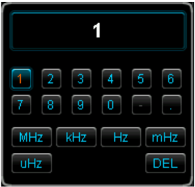
image text: Figure ID 63 parsed from layout.

image text: Figure 1-13 Numeric Keyboard

# To Use the Security Lock

If needed, you can use the security lock (please buy it yourself) to lock the oscilloscope to a fixed location. The method is as follows, align the lock with the lock hole and plug it into the lock hole vertically, turn the key clockwise to lock the oscilloscope and then pull the key out.

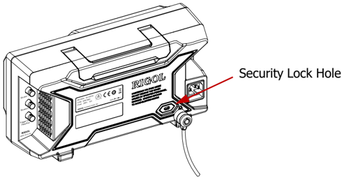
image text: Figure ID 64 parsed from layout.

image text: Figure 1-14 To Use the Security Lock

Note: Please do not insert other articles into the security lock hole to avoid damaging the instrument.

# To Use the Built-in Help System

The help system of this oscilloscope provides instructions for all the function keys (including the menu keys) on the front panel. Press Help to open the help interface and press again to close the interface. The help interface mainly consists of two parts. The left are "Help Options". The right is the "Help Display Area".

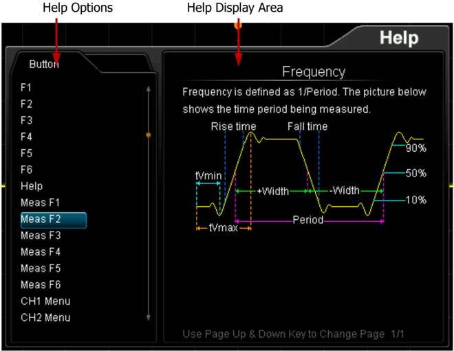
image text: Figure ID 65 parsed from layout.

image text: Figure 1-15 Help Interface

You can press the button (except the Power key , the multifunction knob and the menu page up/down key / ) directly on the front panel to get the corresponding help information in the "Help Display Area".

# Chapter 2 To Set the Vertical System

The contents of this chapter:

◼ To Enable the Analog Channel

◼ Channel Coupling

◼ Bandwidth Limit

◼ Probe Ratio

◼ Waveform Invert

◼ Vertical Scale

◼ Amplitude Unit

◼ Channel Label

◼ Delay Calibration of the Analog Channel

# To Enable the Analog Channel

DS1000Z provides 4 analog input channels (CH1-CH4). As the setting methods of the vertical systems of the four channels are the same, this chapter takes CH1 as an example to illustrate the setting method of the vertical system.

Connect a signal to the channel connector of CH1 and then press CH1 in the vertical control area (VERTICAL) on the front panel to enable CH1. At this point, the channel setting menu is displayed at the right side of the screen and the channel status label at the bottom of the screen (as shown in the figure below) is highlighted. The information displayed in the channel status label is related to the current channel setting.

image text: Figure ID 66 parsed from layout.

After the channel is turned on, modify the parameters such as the vertical scale, horizontal time base, trigger mode and trigger level according to the input signal for easy observation and measurement of the waveform.

# Channel Coupling

The undesired signals can be filtered out by setting the coupling mode. For example, the signal under test is a square waveform with DC offset.

⚫ When the coupling mode is "DC": the DC and AC components of the signal under test can both pass the channel.

⚫ When the coupling mode is "AC": the DC components of the signal under test are blocked.

⚫ When the coupling mode is "GND": the DC and AC components of the signal under test are both blocked.

Press CH1 → Coupling and use to select the desired coupling mode (the default is DC). The current coupling mode is displayed in the channel status label at the bottom of the screen as shown in the figure below. You can also press Coupling continuously to switch the coupling mode.

DC                                                    AC                                                GND

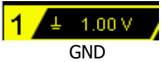
image text: Figure ID 67 parsed from layout.

# Bandwidth Limit

DS1000Z supports the bandwidth limit function which can reduce the display noise. For example, the signal under test is a pulse with high frequency oscillation.

⚫ When the bandwidth limit is disabled, the high frequency components of the signal under test can pass the channel.

⚫ When limiting the bandwidth to 20 MHz, the high frequency components of the signal under test that exceed 20 MHz are attenuated.

Press CH1 , then press BW Limit continuously to switch the bandwidth limit state (the default is OFF). When the bandwidth limit is enabled, the character " B " will be displayed in the channel status label at the bottom of the screen.

image text: Figure ID 68 parsed from layout.

Note: Bandwidth limit can reduce the noise as well as attenuate or eliminate the high frequency components of the signal.

# Probe Ratio

DS1000Z allows user to set the probe attenuation ratio manually. Press CH1 → Probe and use to select the desired probe ratio. The probe ratio values available are as shown in the table below.

image text: Figure ID 69 parsed from layout.

| Menu                                                                                           | Attenuation Ratio (display amplitude of the signal : actual amplitude of the signal)       |
|------------------------------------------------------------------------------------------------|--------------------------------------------------------------------------------------------|
| 0.01X 0.02X 0.05X 0.1X 0.2X 0.5X 1X 2X 5X 10X (the default value) 20X 50X 100X 200X 500X 1000X | 0.01:1 0.02:1 0.05:1 0.1:1 0.2:1 0.5:1 1:1 2:1 5:1 10:1 20:1 50:1 100:1 200:1 500:1 1000:1 |

image text: Table 2-1 Probe Ratio

# Waveform Invert

Press CH1 → Invert to turn on or off waveform invert. When waveform invert is turned off, the waveform display is normal; when waveform invert is turned on, the waveform voltage values are inverted (as shown in the figures below).

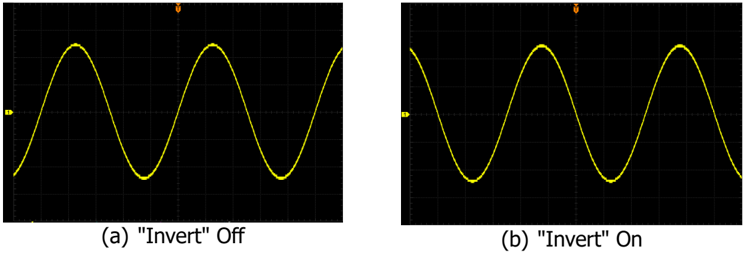
image text: Figure ID 70 parsed from layout.

image text: Figure 2-1 Waveform Invert

# Vertical Scale

Vertical scale refers to the voltage value per grid in the vertical direction on the screen and is usually expressed as V/div.

Press CH1 and rotate VERTICAL SCALE to adjust the vertical scale (clockwise to reduce the scale and counterclockwise to increase). The size of the displayed waveform will be changed accordingly. The scale information (as shown in the figure below) in the channel label at the bottom of the screen will change accordingly during the adjustment. The adjustable range of the vertical scale is related to the probe ratio currently set. By default, the probe ratio is 10X and the adjustable range of the vertical scale is from 10 mV/div to 100 V/div.

image text: Figure ID 71 parsed from layout.

The vertical scale can be adjusted in "Coarse" or "Fine" mode. Press CH1 → Volts/Div to switch the adjustment mode.

⚫ Coarse adjustment (take counterclockwise as an example): set the vertical scale in 1-2-5 step namely 10 mV/div, 20 mV/div, 50 mV/div, 100 mV/div … 100 V/div.

⚫ Fine adjustment: further adjust the vertical scale within a relatively smaller range to improve vertical resolution. If the amplitude of the input waveform is a little bit greater than the full scale under the current scale and the amplitude would be a little bit lower if the next scale is used, fine adjustment can be used to improve the amplitude of waveform display to view signal details.

Note: You can also press VERTICAL SCALE to quickly switch between "Coarse"

and "Fine" adjustments.

When changing the vertical scale of the analog channel by rotating VERTICAL SCALE , you can select to expand or compress the waveform around the "Center" or "Ground". For more details, please refer to the introduction in " Vertical Reference ".

# Amplitude Unit

Select the amplitude display unit for the current channel. The available units are W , A, V and U. When the unit is changed, the unit displayed in the channel label will change accordingly.

Press CH1 → Unit to select the desired unit and the default is V .

# Channel Label

The instrument uses the number of the channel to mark the corresponding channel by default. For ease of use, you can also set a label for each channel, for example, " ". Press CH1 → Label to enter the label setting menu. You can use the built-in label or manually input a label. Manual input does not support the Chinese input, and the length of the label cannot exceed 4 characters.

Press Display to turn on or off the channel label display. The default is CH1 when the channel label display is enabled.

Press Template to select the preset labels such as CH1, ACK, ADDR, BIT, CLK, CS, DATA, IN, MISO, MOSI, OUT, RX and TX, etc.

Press Label Edit and the label editing interface is automatically displayed as shown in the figure below. You can input the label manually.

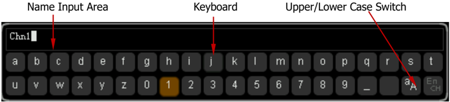
image text: Figure ID 72 parsed from layout.

image text: Figure 2-2 Label Editing Interface

For example, set the label to " ". Press Keyboard to select the "Keyboard" area.

Select "Aa" using and press down to switch it to " a A". Select "C" using and press down to input the character. Use the same method to input "hn1". After finishing the input, press OK to finish the editing. If the Display is enabled, the label will be displayed at the left of CH1 waveform.

To modify or delete the input character , press Name to select the "Name Input Area" and use to select the character to be modified or deleted. Enter the desired character or press Delete to delete the character selected.

# Delay Calibration of the Analog Channel

When using an oscilloscope for actual measurement, the transmission delay of the probe cable may bring relatively greater error (zero offset). DS1000Z supports user to set a delay time to calibrate the zero offset of the corresponding channel. Zero offset is defined as the offset of the crossing point of the waveform and trigger level line relative to the trigger position, as shown in the figure below.

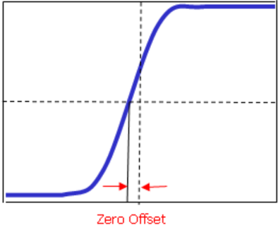
image text: Figure ID 73 parsed from layout.

image text: Figure 2-3 Zero Offset

Press CH1 → Delay-Cal and use to set the desired delay time. The range available is from -100 ns to 100 ns. Pressing down the multifunction knob will reset the delay time to 0.00 s.

Note: This parameter is related to the instrument model and the current horizontal time base setting. The larger the horizontal time base is, the larger the setting step will be. Take DS1104Z-S Plus as an example. The step values under different horizontal time base are as shown in the table below.

| Horizontal Time Base   | Delay Calibration Time Step   |
|------------------------|-------------------------------|
| 5 ns                   | 100 ps                        |
| 10 ns                  | 200 ps                        |
| 20 ns                  | 400 ps                        |
| 50 ns                  | 1 ns                          |
| 100 ns                 | 2 ns                          |
| 200 ns                 | 4 ns                          |
| 500 ns                 | 10 ns                         |
| 1 μs to 10 μs          | 20 ns                         |

image text: Table 2-2 Relation between delay calibration time step and horizontal time base

Note: When the horizontal time base is equal to or greater than 10 μs , the delay calibration time cannot be adjusted.

# Chapter 3 To Set the Horizontal System

The contents of this chapter:

◼ Delayed Sweep

◼ Time Base Mode

# Delayed Sweep

Delayed sweep can be used to enlarge a length of waveform horizontally to view waveform details.

Press MENU in the horizontal control area (HORIZONTAL) on the front panel and press Delayed to enable or disable delayed sweep.

Note: To enable delayed sweep, the current time base mode must be "YT".

In delayed sweep mode, the screen is divided into two display areas as shown in the figure below.

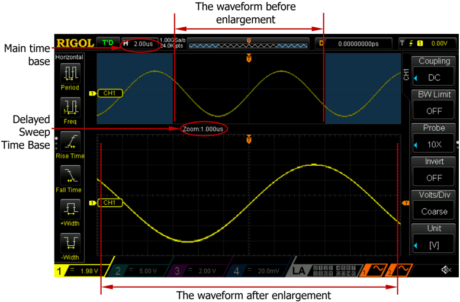
image text: Figure ID 74 parsed from layout.

image text: Figure 3-1 Delayed Sweep Mode

# The waveform before enlargement:

The waveform in the area that is not covered by subtransparent blue in the upper part of the screen is the waveform before enlargement. You can turn HORIZONTAL POSITION to move the area left and right or turn HORIZONTAL SCALE to enlarge or reduce this area.

# The waveform after enlargement:

The waveform in the lower part of the screen is the horizontally expanded waveform. Compared to the main time base, the delayed time base has increased the waveform resolution (as shown in the figure above).

Note: The delayed time base should be less than or equal to the main time base.

# Tip

You can also press down HORIZONTAL SCALE (delayed sweep shortcut key) to directly switch to the delayed sweep mode.

# Time Base Mode

Press MENU in the horizontal control area (HORIZONTAL) on the front panel and then press Time Base to select the time base mode of the oscilloscope. The default is YT.

# YT Mode

In this mode, the Y axis represents voltage and the X axis represents time. Note: Only when this mode is enabled, can " Delayed Sweep " be turned on. In this mode, when the horizontal time base is greater than or equal to 200 ms, the instrument enters slow sweep mode. For the details, please refer to the introduction of slow sweep in " Roll Mode ".

# XY Mode

In this mode, the oscilloscope changes the two channels from voltage-time display mode to voltage-voltage display mode. The phase deviation between two signals with the same frequency can be easily measured via Lissajous method. The figure below shows the measurement schematic diagram of the phase deviation.

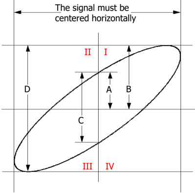
image text: Figure ID 75 parsed from layout.

image text: Figure 3-2 Measurement Schematic Diagram of Phase Deviation

According to sin  =A/B or C/D (wherein,  is the phase deviation angle between the two channels and the definitions of A, B, C and D are as shown in the figure above), the phase deviation angle is obtained, that is:

#  =  arcsin (A/B) or  arcsin (C/D)

If the principal axis of the ellipse is within quadrant I and III, the phase deviation angle obtained should be within quadrant I and IV, namely within (0 to π /2) or (3 π /2 to 2 π ). If the principal axis of the ellipse is within quadrant II and IV , the phase deviation angle obtained should be within quadrant II and III, namely within (π /2 to π) or (π to 3 π /2).

The XY function can be used to measure the phase deviation occurred when the signal under test passes through a circuit network. Connect the oscilloscope to the circuit to monitor the input and output signals of the circuit.

Application example: measure the phase deviation of the input signals of two channels.

# Method 1: Use Lissajous method

Connect a sine signal to CH1 and then connect a sine signal with the same frequency and amplitude but a 90° phase deviation to CH2.

Press AUTO and then adjust the vertical positions of CH1 and CH2 to 0 V.

Set the time base mode to XY, press X-Y and select "CH1-CH2". Rotate Horizontal SCALE to adjust the sample rate properly to get better Lissajous figure for better observation and measurement.

Rotate VERTICAL SCALE of CH1 and CH2 to make the signals easy to observe. At this point, the circle as shown in the figure below should be displayed.

Observe the measurement result shown in the figure above. According to the measurement schematic diagram of the phase deviation (as shown in Figure 3-2), A/B ( C/D) = 1 . Thus, the phase deviation angle  =  arcsin1=90° .

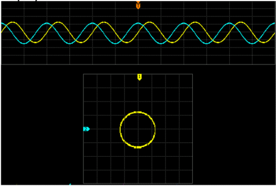
image text: Figure ID 76 parsed from layout.

# Note:

⚫ The maximum sample rate of XY mode is 500 MSa/s. Generally, longer sample waveform can ensure better display effect of Lissajous figure. But due to the limitation of the memory depth, you have to reduce the waveform sample rate to acquire longer waveform (refer to the introduction in " Memory Depth "). Therefore, during the measurement, reducing the sample rate properly can acquire better display effect of Lissajous figure.

⚫ When XY mode is enabled, " Delayed Sweep " will be disabled automatically.

⚫ Press X-Y to select "CH1-CH2, CH1-CH3, CH1-CH4, CH2-CH3, CH2-CH4, CH3-CH4". After you choose any of the options, the instrument automatically turns on the two corresponding channels and turns off the other two channels. The X-axis tracks the voltage of the first channel in each option; the Y-axis tracks the voltage of the second channel in each option.

⚫ The following functions are not available in XY mode:

" Delayed Sweep ", " Vectors ", " Protocol Decoding ", " Acquisition Mode ", " Pass/Fail Test ", " Waveform Record " " Digital Channel " and " To Set the Persistence Time ".

# Method 2: Use the shortcut measurement function

Please refer to "Phase 1 → 2" and "Phase 1 → 2" measurement functions of "Delay and Phase" on page 6-28 .

# Roll Mode

In this mode, the waveform scrolls from right to left to update the display. The horizontal position and trigger control of the waveform are not available. The range of horizontal scale adjustment is from 200 ms to 50.0 s.

Note: When Roll mode is enabled, the waveform " horizontal position ", " Delayed Sweep ", " Protocol Decoding ", " Pass/Fail Test ", " Waveform Record ", " To Set the Persistence Time " and " To Trigger the Oscilloscope " are not available.

# Slow Sweep

Slow sweep is similar to Roll mode. In YT mode, when the horizontal time base is set to 200 ms/div or slower, the instrument enters "slow sweep" mode in which the instrument first acquires the data at the left of the trigger point and then waits for a trigger event. After the trigger occurs, the instrument continues to finish the waveform at the right of the trigger point. When slow sweep mode is used to observe low frequency signal, DC " Channel Coupling " mode is recommended.

# Chapter 4 To Set the Sample System

The contents of this chapter:

◼ Acquisition Mode

◼ Sin(x)/x

◼ Sample Rate

◼ Memory Depth

◼ Antialiasing

# Acquisition Mode

The acquisition mode is used to control how to generate waveform points from sample points.

Press Acquire → Mode on the front panel and use to select the desired acquisition mode (the default is normal), then press down the knob to select this mode. You can also press Mode continuously to switch the acquisition mode.

# Normal

In this mode, the oscilloscope samples the signal at equal time interval to rebuild the waveform. For most of the waveforms, the best display effect can be obtained using this mode.

# Peak Detect

In this mode, the oscilloscope acquires the maximum and minimum values of the signal within the sample interval to get the envelope of the signal or the narrow pulse of the signal that might be lost. In this mode, signal confusion can be prevented but the noise displayed would be larger.

In this mode, the oscilloscope can display all the pulses with pulse widths at least as wide as the sample period.

# Average

In this mode, the oscilloscope averages the waveforms from multiple samples to reduce the random noise of the input signal and improve the vertical resolution. Greater number of averages can lower the noise and increase the vertical resolution; while at the same time, it will slow the response of the displayed waveform to the waveform changes.

When "Average" mode is selected, press Averages and use to set the desired number of averages. The number of averages can be set to 2, 4, 8, 16, 32, 64, 128, 256, 512 or 1024. The default is 2.

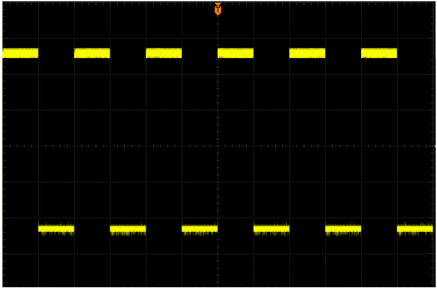
image text: Figure ID 77 parsed from layout.

image text: Figure 4-1 The Waveform before Average

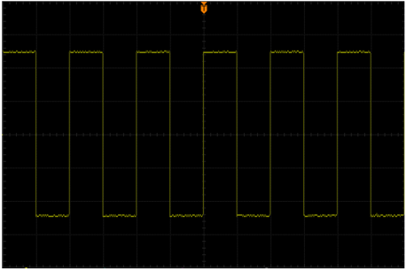
image text: Figure ID 78 parsed from layout.

image text: Figure 4-2 The Waveform after 256 Averages

# High Resolution

This mode uses a kind of ultra-sample technique to average the neighboring points of the sample waveform to reduce the random noise on the input signal and generate much smoother waveforms on the screen. This is generally used when the sample rate of the digital converter is higher than the storage rate of the acquisition memory.

Note: "Average" and "High Res" modes use different averaging methods. The former uses "Multi-sample Average" and the latter uses "Single Sample Average".

# Sin(x)/x

Press Sin(x)/x to enable or disable the dynamic sine interpolation function which can acquire better restoration of the original waveform.

Note: If the number of channels currently turned on is less than three, Sin(x)/x is grayed out and disabled.

# Sample Rate

The maximum sample rate of DS1000Z is 1 GSa/s.

Note: The sample rate is displayed in the status bar at the upper side of the screen and in the Sa Rate menu and can be changed by adjusting the horizontal time base through HORIZONTAL SCALE or modifying the " Memory Depth ".

The influence on the waveform when the sample rate is too low:

Waveform Distortion: when the sample rate is too low, some waveform details are lost and the waveform displayed is rather different from the actual signal.

Waveform Confusion: when the sample rate is lower than twice the actual signal frequency (Nyquist Frequency), the frequency of the waveform rebuilt from the sample data is lower than the actual signal frequency.

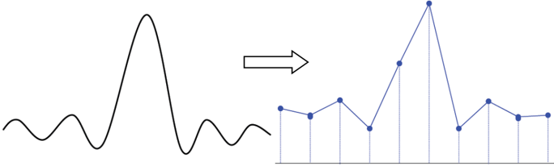
image text: Figure ID 79 parsed from layout.

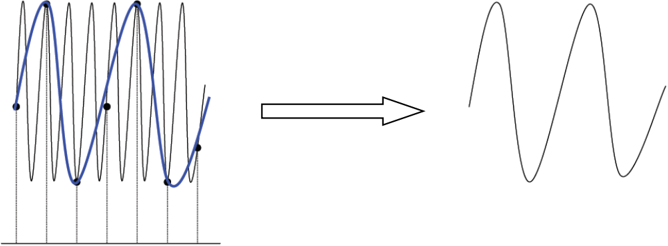
image text: Figure ID 80 parsed from layout.

Waveform Leakage: when the sample rate is too low, the waveform rebuilt from the sample data does not reflect all the actual signal information.

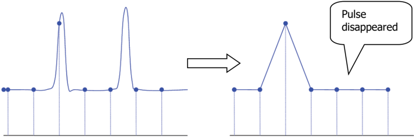
image text: Figure ID 81 parsed from layout.

# Memory Depth

Memory depth refers to the number of waveform points that the oscilloscope can store in a single trigger sample and it reflects the storage ability of the sample memory. DS1000Z provides up to 24 Mpts standard memory depth.

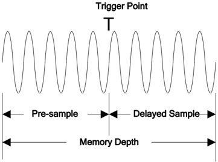
image text: Figure ID 82 parsed from layout.

image text: Figure 4-3 Memory Depth

The relation of memory depth, sample rate and horizontal time base scale fulfills the equation below:

M D e p t h = S R a t e \times T S c a l e \times H D i v s

MDepth

: Memory depth. The unit is pts.

SRate : Sample rate. The unit is Sa/s.

TScale

: Horizontal time base scale. The unit is s/div.

HDivs : Number of grids horizontally. The unit is div. For DS1000Z, this value is 12.

Therefore, under the same horizontal time base scale, higher memory depth can ensure higher sample rate.

Press Acquire → Mem Depth , use to switch to the desired memory depth (the default is auto) and then press down the knob to select the option. You can also press Mem Depth continuously to switch the memory depth.

⚫ For analog channels:

-When a single channel is enabled, the memory depths available include Auto, 12kPoints, 120kPoints, 1.2MPoints, 12MPoints and 24MPoints.

-When dual channels are enabled, the memory depths available include Auto, 6kPoints, 60kPoints, 600kPoints, 6MPoints and 12MPoints.

-When three or four channels are enabled, the memory depths available include Auto, 3kPoints, 30kPoints, 300kPoints, 3MPoints and 6MPoints.

⚫ For digital channels:

-When 8 channels are enabled, the memory depths available include Auto, 12kPoints, 120kPoints, 1.2MPoints, 12MPoints and 24MPoints.

-When 16 channels are enabled, the memory depths available include Auto,

6kPoints, 60kPoints, 600kPoints, 6MPoints and 12MPoints.

Note: In "Auto" mode, the oscilloscope selects the memory depth automatically according to the current sample rate.

# Antialiasing

At slower sweep speed, the sample rate is reduced and a dedicated display algorithm can be used to minimize the possibility of aliasing.

Press Acquire → Anti-aliasing to enable or disable the antialiasing function. By default, antialiasing is disabled and waveform aliasing is more possible.

# Chapter 5 To Trigger the Oscilloscope

As for trigger , you set certain trigger condition according to the requirement and when a waveform in the waveform stream meets this condition, the oscilloscope captures this waveform as well as the neighbouring part and displays them on the screen. For digital oscilloscope, it samples waveform continuously no matter whether it is stably triggered, but only stable trigger can ensure stable display. The trigger module ensures that every time base sweep or acquisition starts from the user-defined trigger condition, namely every sweep is synchronous to the acquisition and the waveforms acquired overlap to display stable waveform.

Trigger setting should be based on the features of the input signal, thus you need to have some knowledge of the signal under test to quickly capture the desired waveform. This oscilloscope provides abundant advanced trigger functions which can help you to focus on the desired waveform details.

The contents of this chapter:

◼ Trigger Source

◼ Trigger Mode

◼ Trigger Coupling

◼ Trigger Holdoff

◼ Noise Rejection

◼ Trigger Type

◼ Trigger Output Connector

# Trigger Source

Press MENU → Source in the trigger control area (TRIGGER) on the front panel to select the desired trigger source. Analog channels CH1-CH4, digital channels D0-D15 or the AC Line can all be used as trigger source.

# Analog channel input:

Signals input from analog channels CH1-CH4 can all be used as trigger source. No matter whether the channel selected is enabled, the channel can work normally. Note: When any channel among D7-D0 is enabled, CH4 cannot be used as trigger source; when any channel among D15-D8 is enabled, CH3 cannot be used as trigger source.

# Digital channel input:

Only the digital channels turned on can be used as trigger source. Please refer to the introduction of " To Turn on/off the Digital Channel " to turn on the desired digital channel.

# AC line:

The trigger signal is obtained from the AC power input of the oscilloscope. AC trigger is usually used to measure signals relevant to the AC power frequency. For example, stably trigger the waveform output from the transformer of a transformer substation; it is mainly used in related measurements of the power industry.

# Trigger Mode

The following is the schematic diagram of the acquisition memory. To easily understand the trigger event, the acquisition memory is divided into the pre-trigger buffer and post-trigger buffer.

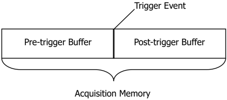
image text: Figure ID 83 parsed from layout.

image text: Figure 5-1 Schematic Diagram of the Acquisition Memory

After the system runs, the oscilloscope operates by first filling the pre-trigger buffer. It starts searching for a trigger after the pre-trigger buffer is filled. While searching for the trigger, the data sampled will still be transmitted to the pre-trigger buffer (the new data will continuously overwrite the previous date). When a trigger is found, the pre-trigger buffer contains the data acquired just before the trigger . Then, the oscilloscope will fill the post-trigger buffer and display the data in the acquisition memory. If the acquisition is activated via RUN/STOP , the oscilloscope will repeat this process; if the acquisition is activated via SINGLE , the oscilloscope will stop after finishing a single acquisition (you can pan and zoom the waveform currently displayed).

Press MODE in the trigger control area (TRIGGER) on the front panel or press MENU → Sweep to select the desired trigger mode. The corresponding status light of the mode currently selected turns on.

⚫ Auto: in this trigger mode, the oscilloscope will force a trigger if the specified trigger condition is not found.

⚫ Normal: in this trigger mode, the oscilloscope only triggers when the specified trigger condition is found.

⚫ Single: in this trigger mode, the oscilloscope generates a trigger when the specified trigger condition is found and then stops.

Note: In "Normal" and "Single" trigger modes, pressing FORCE can generate a trigger signal forcibly.

# Trigger Coupling

Trigger coupling decides which kind of components will be transmitted to the trigger module. Please distinguish it from " Channel Coupling ".

⚫ DC: allow DC and AC components into the trigger path.

⚫ AC: block all the DC components and attenuate signals lower than 75 Hz.

⚫ LF Reject: block the DC components and reject the low frequency components (lower than 75 kHz).

⚫ HF Reject: reject the high frequency components (higher than 75 kHz).

Press MENU → Setting → Coupling in the trigger control area (TRIGGER) on the front panel to select the desired coupling type (the default is DC).

Note: Trigger coupling is only valid in edge trigger.

# Trigger Holdoff

Trigger holdoff can be used to stably trigger complex waveforms (such as modulated waveform). Holdoff time is the amount of time that the oscilloscope waits for re-arming the trigger module after generating a correct trigger. The oscilloscope will not trigger even if the trigger condition is met during the holdoff time and will only re-arm the trigger module after the holdoff time expires.

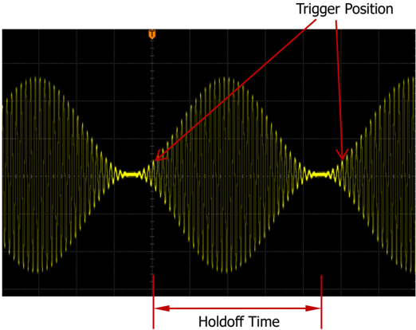
image text: Figure ID 84 parsed from layout.

image text: Figure 5-2 Schematic Diagram of Trigger Holdoff

Press MENU → Setting → Holdoff in the trigger control area (TRIGGER) on the front panel and use the multifunction knob to modify the holdoff time (the default is 16 ns) until the waveform triggers stably. The adjustable range of holdoff time is from 16 ns to 10 s.

Note: Trigger holdoff is not available for video trigger, timeout trigger , setup/hold trigger, Nth edge trigger , RS232 trigger, I2C trigger and SPI trigger.

# Noise Rejection

Noise rejection can reject the high frequency noise in the signal and reduce the possibility of miss-trigger of the oscilloscope.

Press MENU → Setting → NoiseReject in the trigger control area (TRIGGER) on the front panel to enable or disable noise rejection.

Note: This function is not available when the current trigger source is a digital channel.

# Trigger Type

DS1000Z provides various trigger functions. Among various trigger types, RS232 trigger, I2C trigger and SPI trigger are serial bus triggers.

⚫ Edge Trigger

⚫ Pulse Trigger

⚫ Slope Trigger

⚫ Video Trigger

⚫ Pattern Trigger

⚫ Duration Trigger

⚫ TimeOut Trigger

⚫ Runt Trigger

⚫ Window Trigger

⚫ Delay Trigger

⚫ Setup/Hold Trigger

⚫ Nth Edge Trigger

⚫ RS232 Trigger

⚫ I2C Trigger

⚫ SPI Trigger

# Edge Trigger

Trigger on the trigger threshold of the specified edge of the input signal.

# Trigger Type:

Press Type , rotate to select "Edge" and press down . At this point, the trigger setting information is displayed at the upper right corner of the screen.

image text: Figure ID 85 parsed from layout.

For example, . The trigger type is edge trigger; the trigger source is CH1; the trigger level is 0.00 V .

# Source Selection:

Press Source to open the signal source list and select CH1-CH4, AC or D0-D15. For the details, please refer to the introduction in " Trigger Source ". The current trigger source is displayed at the upper right corner of the screen.

Note: Select channel with signal input as trigger source to obtain stable trigger.

# Edge Type:

Press Slope to select the kind of edge of the input signal on which the oscilloscope triggers. The current edge type is displayed at the upper right corner of the screen.

⚫ : trigger on the rising edge of the input signal when the voltage level meets the preset trigger level.

⚫ : trigger on the falling edge of the input signal when the voltage level meets the preset trigger level.

⚫ : trigger on the rising or falling edge of the input signal when the voltage level meets the preset trigger level.

# Trigger Mode:

Press Sweep to open the trigger mode list and select auto, normal or single. For the details, please refer to " Trigger Mode ". The corresponding status light of the current trigger mode turns on.

# Trigger Setting:

Press Setting to  set  the trigger parameters (trigger coupling, trigger holdoff and noise rejection) under this trigger type.

# Trigger Level:

When the trigger source is an analog channel, trigger occurs only when the signal reaches the preset trigger level. You can modify the level using TRIGGER LEVEL . At this point, an orange trigger level line and the trigger mark " " appear

on the screen and move up and down with the rotation of the knob. The trigger level

value (such as ) at the lower left corner of the screen also changes accordingly. When stopping turning the knob, the trigger level line disappears in about 2 s.

# Pulse Trigger

Trigger on the positive or negative pulse with a specified width. In this mode, the oscilloscope will trigger when the pulse width of the input signal satisfies the specified pulse width condition.

# Trigger Type:

Press Type , rotate to select "Pulse" and press down . At this point, the trigger setting information is displayed at the upper right corner of the screen.

For example, . The trigger type is pulse trigger; the trigger source is CH1; the trigger level is 168 mV.

# Source Selection:

Press Source to open the signal source list and select CH1-CH4 or D0-D15. For the details, please refer to the introduction in " Trigger Source ". The current trigger source is displayed at the upper right corner of the screen.

Note: Select channel with signal input as trigger source to obtain stable trigger.

# Pulse Condition:

In this oscilloscope, positive pulse width is defined as the time difference between the two crossing points of the trigger level and positive pulse; negative pulse width is defined as the time difference between the two crossing points of the trigger level and negative pulse, as shown in the figure below.

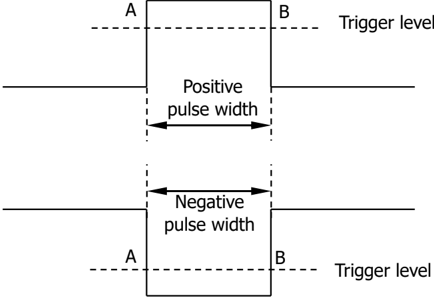
image text: Figure ID 86 parsed from layout.

image text: Figure 5-3 Positive Pulse Width/Negative Pulse Width

Press When to select the desired pulse width condition.

⚫ : trigger when the positive pulse width of the input signal is greater than the specified pulse width.

⚫ : trigger when the positive pulse width of the input signal is lower than the specified pulse width.

⚫ : trigger when the positive pulse width of the input signal is greater than the specified lower limit of pulse width and lower than the specified upper limit

of pulse width.

⚫ : trigger when the negative pulse width of the input signal is greater than the specified pulse width.

⚫ : trigger when the negative pulse width of the input signal is lower than the specified pulse width.

⚫ : trigger when the negative pulse width of the input signal is greater than the specified lower limit of pulse width and lower than the specified upper limit of pulse width.

# Pulse Width Setting:

⚫ When the Pulse Condition is set to , , or , press Setting and use to input the desired value. The range available is from 8 ns to 10 s.

⚫ When the Pulse Condition is set to or , press Upper Limit and Lower Limit and use to input the desired values respectively. The range of the upper limit is from 16 ns to 10 s. The range of the lower limit is from 8 ns to 9.99 s.

Note: The lower limit of the pulse width must be lower than the upper limit.

# Trigger Mode:

Press Sweep to open the trigger mode list and select auto, normal or single. For the details, please refer to " Trigger Mode ". The corresponding status light of the current trigger mode turns on.

# Trigger Setting:

Press Setting to set the trigger parameters (trigger holdoff and noise rejection) under this trigger type.

# Trigger Level:

When the trigger source is an analog channel, you can use TRIGGER LEVEL to modify the level. For the details, please refer to the introduction of " Trigger Level ".

# Slope Trigger

In slope trigger, the oscilloscope triggers on the positive or negative slope of the specified time. This trigger mode is applicable to ramp and triangle waveforms.

# Trigger Type:

Press Type , rotate to select "Slope" and press down . At this point, the trigger setting information is displayed at the upper right corner of the screen.

For example, . The trigger type is slope trigger; the trigger source is CH1; the difference between the upper limit of trigger level and the lower limit of trigger level is 400 mV .

# Source Selection:

Press Source to switch the signal source and select CH1-CH4. For the details, please refer to the introduction in " Trigger Source ". The current trigger source is displayed at the upper right corner of the screen.

Note: Select channel with signal input as trigger source to obtain stable trigger.

# Slope Condition:

In this oscilloscope, positive slope time is defined as the time difference between the two crossing points of trigger level line A and B with the rising edge; negative slope time is defined as the time difference between the two crossing points of trigger level line A and B with the falling edge as shown in the figure below.

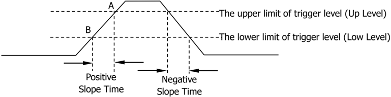
image text: Figure ID 87 parsed from layout.

image text: Figure 5-4 Positive Slope Time/Negative Slope Time

Press When to select the desired slope condition.

⚫ : trigger when the positive slope time of the input signal is greater than the specified time.

⚫ : trigger when the positive slope time of the input signal is lower than the specified time.

⚫ : trigger when the positive slope time of the input signal is greater than the specified lower limit of time and lower than the specified upper limit of time.

⚫ : trigger when the negative slope time of the input signal is greater than the specified time.

⚫ : trigger when the negative slope time of the input signal is lower than the specified time.

⚫ : trigger when the negative slope time of the input signal is greater than the specified lower limit of time and lower than the specified upper limit of time.

# Time Setting:

⚫ When the Slope Condition is set to , , or , press Time and use to input the desired value. The range available is from 8 ns to 10 s.

⚫ When the Slope Condition is set to or , press Upper Limit and Lower Limit and use to input the desired values respectively. The range of time upper limit is from 16 ns to 10 s. The range of the time lower limit is from 8 ns to 9.99 s.

image text: Figure ID 88 parsed from layout.

Note: The time lower limit must be lower than the upper limit.

# Vertical Window and Trigger Level:

After the trigger condition setting is completed, adjust the trigger level using TRIGGER LEVEL to correctly trigger the signal and obtain stable waveform. The adjustment mode of the trigger level is different when different vertical window is selected in slope trigger. Press Vertical and use to select the desired vertical window or press down Vertical continuously to switch the vertical window. You can choose to only adjust the upper limit, the lower limit or both of them.

⚫ : only adjust the upper limit of the trigger level. During the adjustment, "UP Level" and "Slew Rate" change accordingly but "Low Level" remains unchanged.

⚫ : only adjust the lower limit of the trigger level. During the adjustment, "Low Level" and "Slew Rate" change accordingly but "UP Level" remains unchanged.

⚫ : adjust the upper and lower limits of the trigger level at the same time. During the adjustment, "UP Level" and "Low Level" change accordingly but "Slew Rate" remains unchanged.

When the Slope Condition is set to , , , or , the current trigger level and slew rate will be displayed at the lower left corner of the screen, as shown in figure 5-5 (a). The formula of slew rate is:

S l e w R a t = \frac { U p L e v e l - L o w L e v e l } { T i m e }

When the Slope Condition is set to or , the current trigger level and slew rate range will be displayed at the lower left corner of the screen, as shown in figure 5-5 (b). The formula of slew rate range is:

S l e w R a t e = \frac { U p L e v e l - L o w L e v e l } { U p p e r L i m i t } \sim \frac { U p L e v e l - L o w L e v e l } { L o w e r L i m i t }

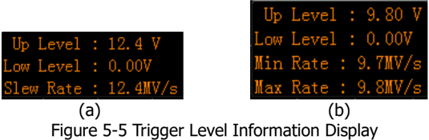
image text: Figure ID 89 parsed from layout.

Note: Under the "Slope" trigger menu, you can also press down the trigger level knob continuously to switch the vertical window.

During the adjustment of trigger level, two orange trigger level lines and two trigger marks ( and ) appear on the screen and move up and down with the rotation of the knob. At the same time, the current trigger level information is displayed at the lower right corner of the screen according to different slope condition settings. After stopping turning the knob, the trigger level lines and trigger level information disappear in about 2 s.

# Trigger Mode:

Press Sweep to open the trigger mode list and select auto, normal or single. For the details, please refer to " Trigger Mode ". The corresponding status light of the current trigger mode turns on.

# Trigger Setting:

Press Setting to set the trigger parameters (trigger holdoff and noise rejection) under this trigger type.

# Video Trigger

The video signal can include image information and timing information and can adopt different standards and formats. DS1000Z can trigger on the standard video signal field or line of NTSC (National Television Standards Committee), PAL (Phase Alternating Line) or SECAM (Sequential Couleur A Memoire).

# Trigger Type:

Press Type , rotate to select "Video" and press down . At this point, the trigger setting information is displayed at the upper right corner of the screen.

image text: Figure ID 90 parsed from layout.

For example, . The trigger type is video trigger; the trigger source is CH1; the trigger level is 0.00 V.

# Source Selection:

Press Source to switch the signal source and select CH1-CH4. For the details, please refer to the introduction in " Trigger Source ". The current trigger source is displayed at the upper right corner of the screen.

Note: Select channel with signal input as trigger source to obtain stable trigger.

# Video Polarity:

Press Polarity to select the desired video polarity. The polarities available are positive polarity ( ) and negative polarity ( ).

# Sync:

Press Sync to select the desired sync type.

⚫ All Line: trigger on the first line found.

⚫ Line: for NTSC and PAL/SECAM video standards, trigger on the specified line in the odd or even field.

Note: When this sync trigger mode is selected, you can modify the line number using in Line menu with a step of 1.

The range of the line number is from 1 to 525 (NTSC), 1 to 625 (PAL/SECAM), 1 to 525 (480P) or 1 to 625 (576P).

⚫ Odd: trigger on the rising edge of the first ramp pulse in the odd field.

⚫ Even: trigger on the rising edge of the first ramp pulse in the even field.

# Video Standard:

Press Standard to select the desired video standard.

⚫ NTSC: the field frequency is 60 fields per second and the frame frequency is 30 frames per second. The TV scan line is 525 with the even field goes first and the odd field follows behind.

⚫ PAL/SECAM:

--PAL: the frame frequency is 25 frames per second. The TV scan line is 625 with the odd field goes first and the even field follows behind.

--SECAM: the frame frequency is 25 frames per second. The TV scan line is 625 with interlaced scan.

⚫ 480P: the frame frequency is 60 frames per second; the TV scan line is 525; progressive scan; the line frequency is 31.5 kHz.

⚫ 576P: the frame frequency is 60 frames per second; the TV scan line is 625; progressive scan.

# Trigger Mode:

Press Sweep to open the trigger mode list and select auto, normal or single. For the details, please refer to " Trigger Mode ". The corresponding status light of the current trigger mode turns on.

# Trigger Setting:

Press Setting to set the trigger parameter (noise rejection) under this trigger type.

# Trigger Level:

Use TRIGGER LEVEL to modify the level. For the details, please refer to the introduction of " Trigger Level ".

# Tips

⚫ For a better observation of the waveform details in the video signal, you can set a larger memory depth first.

⚫ In the trigger debugging process of video signals, the frequency in different part of the signal can be reflected by different brightness as RIGOL digital oscilloscope provides the intensity graded color display function. Experienced users can quickly judge the signal quality and discover abnormalities.

# Pattern Trigger

Identify a trigger condition by looking for a specified pattern. This pattern is a logical "AND" combination of channels. Each channel can have a value of high (H), low (L) or don't care (X). A rising or falling edge (you can only specify a single edge) can be specified for one channel included in the pattern. When an edge is specified, the oscilloscope will trigger at the edge specified if the pattern set for the other channels are true (namely the actual pattern of the channel is the same with the preset pattern). If no edge is specified, the oscilloscope will trigger on the last edge that makes the pattern true. If all the channels in the pattern are set to "Don ' t Care", the oscilloscope will not trigger.

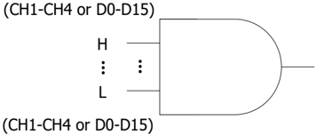
image text: Figure ID 91 parsed from layout.

image text: Figure 5-6 Pattern Trigger

# Trigger Type:

Press Type , rotate to select "Pattern" and press down . At this point, the trigger setting information is displayed at the upper right corner of the screen.

image text: Figure ID 92 parsed from layout.

For example, . The trigger type is pattern trigger; the current trigger source is CH1; the trigger level is 0.00 V .

# Source Selection:

Press Source to open the signal source list and select CH1-CH4 or D0-D15. For the details, please refer to the introduction in " Trigger Source ". The current trigger source is displayed at the upper right corner of the screen.

# Pattern Setting:

Press Code to set the pattern of the current signal source. At this point, the corresponding pattern is displayed at the bottom of the screen. The patterns of channels CH1-CH4 and D0-D15 are presented from left to right as shown in the figure below.

⚫ : set the pattern of the channel selected to "H", namely the voltage level is higher than the trigger level of the channel.

⚫ : set the pattern of the channel selected to "L", namely the voltage level is lower than the trigger level of the channel.

⚫ : set the pattern of the channel selected to "Don ' t Care", namely this channel is not used as a part of the pattern. When all channels in the pattern are set to

"Don ' t Care", the oscilloscope will not trigger.

image text: Figure ID 93 parsed from layout.

⚫ or : set the pattern to the rising or falling edge of the channel selected.

# Note:

⚫ When digital channels D7-D0 are enabled, CH4 is automatically disabled; the corresponding pattern cannot be set and is replaced by X. When D15-D8 are enabled, CH3 is automatically disabled; the corresponding pattern cannot be set and is replaced by X.

⚫ Only one edge (rising or falling edge) can be specified in the pattern. If one edge item is currently defined and then another edge item is defined in another channel in the pattern, the former edge item defined will be replaced by X.

# All Bits:

Press AllBits to set the patterns of all trigger sources to the pattern settings selected currently.

# Trigger Mode:

Press Sweep to open the trigger mode list and select auto, normal or single. For the details, please refer to " Trigger Mode ". The corresponding status light of the current trigger mode turns on.

# Trigger Setting:

Press Setting to set the trigger parameters (trigger holdoff and noise rejection) under this trigger type.

# Trigger Level:

For the analog channels, the trigger level of each channel needs to be set independently. For example, set the trigger level of CH1. Press Source to select CH1, and then use TRIGGER LEVEL to modify the level. For the details, please refer to the introduction of " Trigger Level ".

image text: Figure ID 94 parsed from layout.

image text: Figure ID 95 parsed from layout.

# Duration Trigger

In duration trigger, the instrument identifies a trigger condition by looking for the duration of a specified pattern. This pattern is a logical "AND" combination of the channels. Each channel can have a value of high (H), low (L) or don ' t care (X). The instrument triggers when the duration ( △ T) of this pattern meets the preset time, as shown in the figure below.

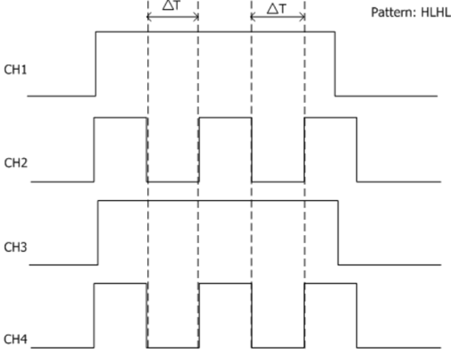
image text: Figure ID 96 parsed from layout.

image text: Figure 5-7 Duration Trigger

# Trigger Type:

Press Type , rotate to select "Duration" and press down . At this point, the trigger setting information is displayed at the upper right corner of the screen.

image text: Figure ID 97 parsed from layout.

For example, . The trigger type is duration trigger; the current trigger source is CH1; the trigger level is 0.00 V .

# Source Selection:

Press Source to open the signal source list and select CH1-CH4 or D0-D15. For the details, please refer to the introduction in " Trigger Source ". The current trigger source is displayed at the upper right corner of the screen.

# Pattern Setting:

Press Code to set the pattern of the current channel. At this point, the pattern setting area (as shown in the figure below) is displayed at the bottom of the screen.

⚫ : set the pattern of the channel selected to "H", namely the voltage level is higher than the trigger level of the channel.

⚫ : set the pattern of the channel selected to "L", namely the voltage level is

lower than the trigger level of the channel.

⚫ : set the pattern of the channel selected to "Don ' t Care", namely this channel is not used as a part of the pattern. When all channels in the pattern are set to "Don ' t Care", the oscilloscope will not trigger.

Note: When digital channels D7-D0 are enabled, CH4 is automatically disabled; its corresponding pattern cannot be set and is replaced by X. When D15-D8 are enabled, CH3 is automatically disabled; its corresponding pattern cannot be set and is replaced by X.

# All Bits:

Press AllBits to set the patterns of all trigger sources to the pattern settings selected currently.

# Trigger Condition:

Press When to select the desired trigger condition.

⚫ > : trigger when the duration of the pattern is greater than the preset time. Press Time to set the duration of the pattern and the range is from 8 ns to 10 s.

⚫ < : trigger when the duration of the pattern is lower than the preset time. Press Time to set the duration of the pattern and the range is from 8 ns to 10 s.

⚫ <> : trigger when the duration of the pattern is lower than the upper limit of the preset time and greater than the lower limit of the preset time. Press Upper Limit to set the upper limit of the duration of the pattern and the range is from 16 ns to 10 s. Press Lower Limit to set the lower limit of the duration of the pattern and the range is from 8 ns to 9.99 s.

Note: The time lower limit must be lower than the time upper limit.

# Trigger Mode:

Press Sweep to open the trigger mode list and select auto, normal or single. For the details, please refer to " Trigger Mode ". The corresponding status light of the current trigger mode turns on.

# Trigger Setting:

Press Setting to  set  the  trigger  parameters  (trigger  holdoff  and  noise  rejection) under this trigger type.

# Trigger Level:

Press Source to select CH1 to CH4 respectively; use TRIGGER LEVEL to modify the trigger level for each channel. For the details, please refer to the introduction of " Trigger Level ".

# TimeOut Trigger

In timeout trigger, the instrument triggers when the time interval ( △ T) from when the rising edge (or falling edge) of the input signal passes through the trigger level to when the neighbouring falling edge (or rising edge) passes through the trigger level is greater than the timeout time set, as shown in the figure below.

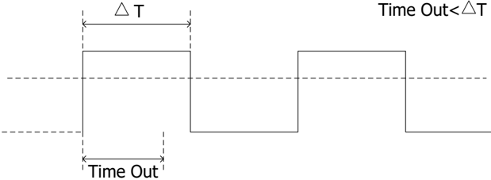
image text: Figure ID 98 parsed from layout.

image text: Figure 5-8 TimeOut Trigger

# Trigger Type:

Press Type , rotate to select "TimeOut" and press down . At this point, the trigger setting information is displayed at the upper right corner of the screen.

image text: Figure ID 99 parsed from layout.

For example, . The trigger type is timeout trigger; the trigger source is CH1; the trigger level is 0.00 V.

# Source Selection:

Press Source to open the signal source list and select CH1-CH4 or D0-D15. For the details, please refer to the introduction in " Trigger Source ". The current trigger source is displayed at the upper right corner of the screen.

Note: Select channel with signal input as trigger source to obtain stable trigger.

# Edge Type:

Press Slope to select the type of the first edge of the input signal that passes through the trigger level.

⚫ : start timing when the rising edge of the input signal passes through the trigger level.

⚫ : start timing when the falling edge of the input signal passes through the trigger level.

⚫ : start timing when any edge of the input signal passes through the trigger level.

# Timeout Time:

Timeout time represents the minimum time that the clock signal must be in the idle state before the oscilloscope starts searching for the data meets the trigger condition. Press TimeOut to set the timeout time of timeout trigger and the range is from 16

ns to 10 s.

# Trigger Mode:

Press Sweep to open the trigger mode list and select auto, normal or single. For the details, please refer to " Trigger Mode ". The corresponding status light of the current trigger mode turns on.

# Trigger Setting:

Press Setting to set the trigger parameter (noise rejection) under this trigger type.

# Trigger Level:

When the trigger source is an analog channel, you can use TRIGGER LEVEL to modify the level. For the details, please refer to the introduction of " Trigger Level ".

# Runt Trigger

This trigger mode is used to trigger pulses that pass through one trigger level but fail to pass through the other trigger level as shown in the figure below.

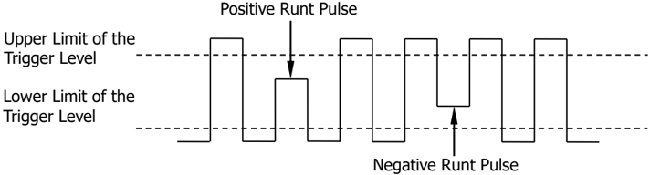
image text: Figure ID 100 parsed from layout.

image text: Figure 5-9 Runt Trigger

# Trigger Type:

Press Type , rotate to select "Runt" and press down . At this point, the trigger setting information is displayed at the upper right corner of the screen.

For example, . The trigger type is runt trigger; the trigger source is CH1; the difference between the upper limit of trigger level and the lower limit of trigger level is 10.00 V .

# Source Selection:

Press Source to switch the signal source and select CH1-CH4. For the details, please refer to the introduction in " Trigger Source ". The current trigger source is displayed at the upper right corner of the screen.

Note: Select channel with signal input as trigger source to obtain stable trigger.

# Pulse Polarity:

Press Polarity to select the pulse polarity of runt trigger .

⚫ : positive polarity. The instrument triggers on the positive runt pulse.

⚫ : negative polarity. The instrument triggers on the negative runt pulse.

# Qualifier:

Press Qualifier to set the trigger conditions of runt trigger.

⚫ None : do not set the trigger condition of runt trigger.

⚫ > : trigger when the runt pulse width is greater than the lower limit of pulse width. Press Lower Limit to set the minimum pulse width of runt trigger. The range available is from 8.00 ns to 10 s.

⚫ < : trigger when the runt pulse width is lower than the upper limit of pulse width. Press Upper Limit to set the maximum pulse width of runt trigger. The range available is from 16.0 ns to 10.0 s.

⚫ <> : trigger when the runt pulse width is greater than the lower limit and lower than the upper limit of pulse width. Press Upper Limit to set the maximum pulse width of runt trigger and the range is from 16.0 ns to 10.0 s; press Lower

Limit to set the minimum pulse width of runt trigger and the range is from 8.00 ns to 9.99 s.

Note: The lower limit of the pulse width must be lower than the upper limit.

# Vertical Window and Trigger Level:

After the trigger condition setting is completed, you need to adjust the trigger level to correctly trigger the signal and obtain stable waveform. The adjustment mode of the trigger level is different when different vertical window is selected in the runt trigger. Press Window and use to select the desired vertical window or press down Window continuously to switch the vertical window. You can choose to only adjust the upper limit, the lower limit or both of them. For more details, please refer to the following introduction.

Note: Under the "Runt" trigger menu, you can also press down TRIGGER LEVEL continuously to switch the vertical window.

image text: Figure ID 101 parsed from layout.

After the vertical window type is selected, you can use Trigger LEVEL to adjust the trigger level. During the adjustment, two orange trigger level lines and trigger marks ( and ) appear on the screen and move up and down with the rotation of the knob. At the same time, the current trigger level values are displayed at the lower left corner of the screen (as shown in the figure below). The trigger level lines and trigger marks disappear after you stop rotating the knob for about 2 s.

image text: Figure ID 102 parsed from layout.

The adjustment mode of the trigger level differs when different vertical window is selected.

⚫ : only adjust the upper limit of the trigger level. During the adjustment, the "Up Level" changes accordingly and "Low Level" remains unchanged.

⚫ : only adjust the lower limit of the trigger level. During the adjustment, the "Low Level" changes accordingly and the "Up Level" remains unchanged.

⚫ : adjust the upper and lower limits of the trigger level at the same time. During the adjustment, the "Up Level" and "Low Level" change accordingly.

# Trigger Mode:

Press Sweep to open the trigger mode list and select auto, normal or single. For the details, please refer to " Trigger Mode ". The corresponding status light of the current trigger mode turns on.

# Trigger Setting:

Press Setting to set the trigger parameters (trigger holdoff and noise rejection) under this trigger type.

# Window Trigger

Window trigger provides a high trigger level and a low trigger level. The instrument triggers when the input signal passes through the high trigger level or the low trigger level.

# Trigger Type:

Press Type , rotate to select "Window" and press down . At this point, the trigger setting information is displayed at the upper right corner of the screen.

image text: Figure ID 103 parsed from layout.

For example, . The trigger type is window trigger; the trigger source is CH1; the difference between the upper limit of trigger level and the lower limit of trigger level is 2.00 V .

# Source Selection:

Press Source to switch the trigger source and select CH1-CH4. For the details, please refer to the introduction in " Trigger Source ". The current trigger source is displayed at the upper right corner of the screen.

Note: Select channel with signal input as trigger source to obtain stable trigger.

# Window Type:

Press WndType to select the kind of edge of the input signal on which the oscilloscope triggers.

⚫ : trigger on the rising edge of the input signal when the voltage level is greater than the preset high trigger level.

⚫ : trigger on the falling edge of the input signal when the voltage level is lower than the preset low trigger level.

⚫ : trigger on any edge of the input signal when the voltage level meets the preset trigger level.

# Trigger Position:

After selecting the window type, press Position to further specify the time point of trigger by selecting the trigger position.

⚫ Enter : trigger when the trigger signal enters the specified trigger level range.

⚫ Exit : trigger when the input signal exits the specified trigger level range.

⚫ Time : trigger when the accumulated hold time after the trigger signal enters the specified trigger level range is equal to the window time. When this type is selected, press Time to set the window time. The range is from 8 ns to 10 s. For the setting method, please refer to the introduction in " Parameter Setting Method ".

# Vertical Window and Trigger Level:

Press Window to select the desired vertical window type and use Trigger LEVEL to adjust the trigger level. For detailed operation, please refer to the introduction in " Vertical Window and Trigger Level " in runt trigger .

image text: Figure ID 104 parsed from layout.

# Trigger Mode:

Press Sweep to open the trigger mode list and select auto, normal or single. For the details, please refer to " Trigger Mode ". The corresponding status light of the current trigger mode turns on.

# Trigger Setting:

Press Setting to set the trigger parameters (trigger holdoff and noise rejection) under this trigger type.

# Delay Trigger

In delay trigger , you need to set signal source A and signal source B. The oscilloscope triggers when the time difference ( △ T) between the specified edges of source A (Edge A) and source B (Edge B) meets the preset time limit, as shown in the figure below.

Note: Edge A and Edge B must be neighbouring edges.

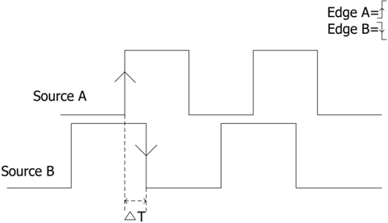
image text: Figure ID 105 parsed from layout.

image text: Figure 5-10 Delay Trigger

# Trigger Type:

Press Type to open the trigger type list. Rotate to select "Delay" and press down . At this point, the trigger setting information is displayed at the upper right corner of the screen.

For example, . The trigger type is delay trigger; the current trigger source is CH1; the trigger level is 0.00 V .

image text: Figure ID 106 parsed from layout.

# Source A:

Press SourceA to select CH1-CH4 as the trigger source of signal source A. For the details, please refer to the introduction in " Trigger Source ". The current trigger source is displayed at the upper right corner of the screen.

Note: Select channel with signal input as trigger source to obtain stable trigger.

# Edge A:

Press EdgeA to select the trigger edge type of signal source A in delay trigger . It can be set to the rising edge or falling edge.

# Source B:

Press SourceB to select CH1-CH4 as the trigger source of signal source B. For the details, please refer to the introduction in " Trigger Source ". The current trigger source is displayed at the upper right corner of the screen.

Note: Select channel with signal input as trigger source to obtain stable trigger.

# Edge B:

Press EdgeB to select the trigger edge type of signal source B in delay trigger . It can be set to the rising edge or falling edge.

# Delay Type:

Press DelayType to set the time limit condition of delay trigger.

⚫ > : trigger when the time difference ( △ T) between the specified edges of source A and source B is greater than the preset time lower limit. Press Lower Limit to set the delay time lower limit in delay trigger and the range is from 8.00 ns to 10 s. For the setting method, please refer to the introduction in " Parameter Setting Method ".

⚫ < : trigger when the time difference ( △ T) between the specified edges of source A and source B is lower than the preset time upper limit. Press Upper Limit to set the delay time upper limit in delay trigger and the range is from 16.0 ns to 10.0 s. For the setting method, please refer to the introduction in " Parameter Setting Method ".

⚫ <> : trigger when the time difference ( △ T) between the specified edges of source A and source B is greater than the lower limit of the preset time and lower than the upper limit of the preset time. Press Upper Limit to set the upper limit of the delay time in delay trigger and the range is from 16.0 ns to 10.0 s. Press Lower Limit to set the lower limit of the delay time in delay trigger and the range is from 8.00 ns to 9.99 s. For the setting method, please refer to the introduction in " Parameter Setting Method ".

Note: The time lower limit must be lower than the time upper limit.

⚫ ><: trigger when the time difference ( △ T) between the specified edges of source A and source B is lower than the lower limit of the preset time or greater than the upper limit of the preset time. Press Upper Limit to set the upper limit of the delay time in delay trigger and the range is from 16.0 ns to 10.0 s. Press Lower Limit to set the lower limit of the delay time in delay trigger and the range is from 8.00 ns to 9.99 s. For the setting method, please refer to the introduction in " Parameter Setting Method ".

Note: The time lower limit must be lower than the time upper limit.

# Trigger Mode:

Press Sweep to open the trigger mode list and select auto, normal or single. For the details, please refer to " Trigger Mode ". The corresponding status light of the current trigger mode turns on.

# Trigger Setting:

Press Setting to set the trigger parameters (trigger holdoff and noise rejection) under this trigger type.

# Trigger Level:

The trigger level of each source needs to be set independently. For example, set the trigger level of source A. Press SourceA to select the desired source, and then use TRIGGER LEVEL to modify the level. For the details, please refer to the introduction of " Trigger Level ".

# Setup/Hold Trigger

In setup/hold trigger , you need to set the data signal line and clock signal line. The setup time starts when the data signal passes the trigger level and ends at the coming of the specified clock edge; the hold time starts at the coming of the specified clock edge and ends when the data signal passes the trigger level again (as shown in the figure below). The oscilloscope triggers when the setup time or hold time is lower than the preset time.

image text: Figure ID 107 parsed from layout.

# Trigger Type:

Press Type to open the trigger type list. Rotate to select "StpHold" and press down . At this point, the trigger setting information is displayed at the upper right corner of the screen.

For example, . The trigger type is setup/hold trigger; the current trigger source is CH1; the trigger level is 0.00 V .

image text: Figure ID 108 parsed from layout.

# Source Selection:

Press DataSource and ClkSource to set the signal sources of the data line and clock line respectively. They can be set to CH1-CH4. For the details, please refer to the introduction in " Trigger Source ". The current trigger source is displayed at the upper right corner of the screen.

Note: Select channel with signal input as trigger source to obtain stable trigger.

# Edge Type:

Press Slope to select the desired clock edge type and it can be set to the rising edge or falling edge.

# Data Type:

Press DataType to set the effective pattern of the data signal to H (high level) or L (low level).

# Setup Type:

It is used to select the different trigger types of setup/hold trigger. Press SetupType to select the desired setup type.

⚫ Setup : the oscilloscope triggers when the setup time is less than the specified setup time. After selecting this type, press Setup to set the setup time and the range is from 8 ns to 1 s.

⚫ Hold : the oscilloscope triggers when the hold time is less than the specified hold time. After selecting this type, press Hold to set the hold time and the range is from 8 ns to 1 s.

⚫ StpHold : the oscilloscope triggers when the setup time or hold time is less than the specified time. After selecting this type, press Setup and Hold to set the setup time and hold time respectively and the range is from 8 ns to 1 s.

# Trigger Mode:

Press Sweep to open the trigger mode list and select auto, normal or single. For the details, please refer to " Trigger Mode ". The corresponding status light of the current trigger mode turns on.

# Trigger Setting:

Press Setting to set the trigger parameter (noise rejection) under this trigger type.

# Trigger Level:

Press DataSource and use TRIGGER LEVEL to modify the trigger level of the data source channel. Press ClkSource and use TRIGGER LEVEL to modify the trigger level of the clock source channel. For the details, please refer to the introduction of " Trigger Level ".

# Nth Edge Trigger

Trigger on the nth edge that appears after the specified idle time. For example, in the waveform shown in the figure below, the instrument should trigger on the second rising edge after the specified idle time (the time between two neighbouring rising edges) and the idle time should be set to P<Idle Time<M. Wherein, M is the time between the first rising edge and its previous rising edge and P is the maximum time between the rising edges participate in the counting.

image text: Figure ID 109 parsed from layout.

image text: Figure 5-12 Nth Edge Trigger

# Trigger Type:

Press Type to open the trigger type list. Rotate to select "Nth" and press down . At this point, the trigger setting information is displayed at the upper right corner of the screen.

For example, . The trigger type is Nth edge trigger; the trigger source is CH1; the trigger level is 0.00 V.

image text: Figure ID 110 parsed from layout.

# Source Selection:

Press Source to open the signal source list and select CH1-CH4 or D0-D15. For the details, please refer to the introduction in " Trigger Source ". The current trigger source is displayed at the upper right corner of the screen.

Note: Select channel with signal input as trigger source to obtain stable trigger.

# Edge Type:

Press Slope to select the kind of edge of the input signal on which the oscilloscope triggers.

⚫ : trigger on the rising edge of the input signal when the voltage level meets the specified trigger level.

⚫ : trigger on the falling edge of the input signal when the voltage level meets the specified trigger level.

# Idle Time:

Press Idle to set the idle time before the edge counting in Nth edge trigger . The range available is from 16 ns to 10 s.

# Edge Number:

Press Edge to set the value of "N" in Nth edge trigger and the range available is from 1 to 65535.

# Trigger Mode:

Press Sweep to open the trigger mode list and select auto, normal or single. For the details, please refer to " Trigger Mode ". The corresponding status light of the current trigger mode turns on.

# Trigger Setting:

Press Setting to set the trigger parameter (noise rejection) under this trigger type.

# Trigger Level:

When the trigger source is an analog channel, you can use TRIGGER LEVEL to modify the level. For the details, please refer to the introduction of " Trigger Level ".

# RS232 Trigger

RS232 bus is a serial communication mode used in the data transmission between PCs or between PC and terminal. In RS232 serial protocol, a character is transmitted as a frame of data which consists of 1 bit start bit, 5~8 bits data bits, 1 bit check bit and 1~2 bits stop bit(s). Its format is as shown in the figure below. DS1000Z oscilloscope triggers when the start frame, error frame, check error or the specified data of the RS232 signal is detected.

image text: Figure ID 111 parsed from layout.

# Trigger Type:

Press Type to open the trigger type list. Rotate to select "RS232" and press down . At this point, the trigger setting information is displayed at the upper right corner of the screen.

For example, . The trigger type is RS232 trigger; the current trigger source is CH1; the trigger level is 0.00 V .

image text: Figure ID 112 parsed from layout.

# Source Selection:

Press Source to open the signal source list and select CH1-CH4 or D0-D15. For the details, please refer to the introduction in " Trigger Source ". The current trigger source is displayed at the upper right corner of the screen.

Note: Select channel with signal input as trigger source to obtain stable trigger.

# Polarity

Press Polarity to select the polarity of data transmission. It can be set to " " or " " and the default is .

# Trigger Condition:

Press When to select the desired trigger condition.

⚫ Start: trigger on the start frame position.

⚫ Error: trigger when error frame is detected. After this trigger condition is selected:

--press Stop Bit to select "1 bit" or "2 bits";

--press EvenOdd to select "None", "Odd" or "Even".

The oscilloscope will determine error frame according to the preset parameters.

⚫ ChkError: trigger when check error is detected. When this trigger condition is selected, press EvenOdd to select "Odd" or "Even". The oscilloscope will determine check error according to the preset parameters.

⚫ Data: trigger on the last bit of the preset data bits. When this trigger condition is

# selected:

--press Data Bits to select "5 bits", "6 bits", "7 bits" or "8 bits";

--press Data and use to set the data value of RS232 trigger. According to the setting in Data Bits and the ranges can be from 0 to 31, from 0 to 63, from 0 to 127 or from 0 to 255 respectively.

# Baud Rate:

Set the baud rate of data transmission (equal to specifying a clock frequency). Press BaudRate to set the desired baud rate to 2400 bps, 4800 bps, 9600 bps (default), 19200 bps, 38400 bps, 57600 bps, 115200 bps, 230400 bps, 460800 bps, 921600 bps, 1 Mbps and user-defined. When "User" is selected, press Setup to set a more specific value from 110 bps to 20000000 bps with an adjustment step of 1 bps. For the setting method, please refer to the introduction in " Parameter Setting Method ".

# Trigger Mode:

Press Sweep to open the trigger mode list and select auto, normal or single. For the details, please refer to " Trigger Mode ". The corresponding status light of the current trigger mode turns on.

# Trigger Setting:

Press Setting to set the trigger parameter (noise rejection) under this trigger type.

# Trigger Level:

When the trigger source is an analog channel, you can use TRIGGER LEVEL to modify the level. For the details, please refer to the introduction of " Trigger Level ".

# I2C Trigger

I2C is a 2-wire serial bus used to connect the microcontroller and its peripheral device and is a bus standard widely used in the microelectronic communication control field.

The I2C serial bus consists of SCL and SDA. Its transmission rate is determined by SCL and its transmission data is determined by SDA, as shown in the figure below. DS1000Z triggers on the start condition, restart, stop, missing acknowledgement, specific device address or data value. Besides, it can also trigger on the specific device address and data values at the same time.

image text: Figure ID 113 parsed from layout.

image text: Figure 5-14 Schematic Diagram of I2C Protocol

# Trigger Type:

Press Type to open the trigger type list. Rotate to select "I2C" and press down . At this point, the trigger setting information is displayed at the upper right corner of the screen.

For example, . The trigger type is I2C trigger; the current trigger source is CH1; the trigger level is 0.00 V.

image text: Figure ID 114 parsed from layout.

# Source Selection:

Press SCL and SDA to specify the signal sources of SCL and SDA respectively. They can be set to CH1-CH4 or D0-D15. For the details, please refer to the introduction in " Trigger Source ". The current trigger source is displayed at the upper right corner of the screen.

Note: Select channel with signal input as trigger source to obtain stable trigger.

# Trigger Condition:

Press When to select the desired trigger condition.

⚫ Start: trigger when SDA data transitions from high level to low level while SCL is high level.

⚫ Restart: trigger when another start condition occurs before a stop condition.

⚫ Stop: trigger when SDA data transitions from low level to high level while SCL is high level.

⚫ MissedACK: trigger when the SDA data is high level during any acknowledgement of SCL clock position.

⚫ Address: the trigger searches for the specified address value. When this event occurs, the oscilloscope will trigger on the read/write bit. After this trigger condition is selected:

--press AddrBits to select "7 bits", "8 bits" or "10 bits";

--press Address to set the address value of I2C trigger. According to the setting in AddrBits , the range can be from 0 to 0x7F, from 0 to 0xFF or from 0 to 0x3FF;

--press Direction to select "Read", "Write" or "R/W". Note: This setting is not available when AddrBits is set to "8 bits".

⚫ Data: the trigger searches for the specified data value on the data line (SDA). When this event occurs, the oscilloscope will trigger on the clock line (SCL) transition edge of the last bit of data. After this trigger condition is selected: --press Bit X to select the desired data bit and the range is from 0 to (Byte Length× 8-1);

--press Data to set the data pattern of the current data bit to X, H or L;

--press Bytes to set the length of the data and the range is from 1 to 5;

--press AllBits to set the data pattern of all the data bits to the data pattern specified in Data .

⚫ A&D: the oscilloscope searches for the specified address and data at the same time and triggers when the specified address and data are found. After this trigger condition is selected:

--press AddrBits to select "7 bits", "8 bits" or "10 bits";

--press Address and use to set the address value. According to the setting in AddrBits , the range can be from 0 to 0x7F, from 0 to 0xFF or from 0 to 0x3FF;

--press Bit X to select the desired data bit and the range is from 0 to (Byte Length× 8-1);

--press Data to set the data pattern of the current data bit to X, H or L;

--press Bytes to set the length of the data and the range is from 1 to 5;

--press AllBits to set the data pattern of all the data bits to the data pattern specified in Data ;

--press Direction to select "Read", "Write" or "R/W". Note: This setting is not available when AddrBits is set to "8 bits".

# Trigger Mode:

Press Sweep to open the trigger mode list and select auto, normal or single. For the details, please refer to " Trigger Mode ". The corresponding status light of the current trigger mode turns on.

# Trigger Setting:

Press Setting to set the trigger parameter (noise rejection) under this trigger type.

# Trigger Level:

When SCL is an analog channel, press SCL and use TRIGGER LEVEL to modify the trigger level of the SCL channel. When SDA is an analog channel, press SDA and use TRIGGER LEVEL to modify the trigger level of the SDA channel. For the details, please refer to the introduction of " Trigger Level ".

# SPI Trigger

In SPI trigger , after the CS or timeout condition is satisfied, the oscilloscope triggers when the specified data is found. When using SPI trigger, you need to specify the SCL clock sources and SDA data sources. Below is the sequential chart of SPI bus.

image text: Figure ID 115 parsed from layout.

image text: Figure 5-15 Sequential Chart of SPI Bus

# Trigger Type:

Press Type to open the trigger type list. Rotate to select "SPI" and press down . At this point, the trigger setting information is displayed at the upper right corner of the screen.

For example, . The trigger type is SPI trigger; the current trigger source is CH1; the trigger level is 0.00 V.

image text: Figure ID 116 parsed from layout.

# Source Selection:

Press SCL and SDA to specify the data sources of SCL and SDA respectively. They can be set to CH1-CH4 or D0-D15. For the details, please refer to the introduction in " Trigger Source ". The current trigger source is displayed at the upper right corner of the screen.

Note: Select channel with signal input as trigger source to obtain stable trigger.

# Data Line Setting:

Press Data to set the data bits and data of SPI trigger.

⚫ Press DataBits to set the number of bits of the serial data character string. It can be set to any integer between 4 and 32.

⚫ Press CurrentBit to set the number of the data bit and the range is from 0 to (value specified in DataBits - 1).

⚫ Press Data to set the value of the current bit to H, L or X.

⚫ Press AllBits to set all the data bits to the value specified in Data .

# Trigger Condition:

Press When to select the desired trigger condition.

⚫ CS: if the CS signal is valid, the oscilloscope will trigger when the data (SDA) satisfying the trigger conditions is found.

-After selecting this condition, you can press CS to select the chip selection

signal line. The available channels are CH1-CH4 or D0-D15 (only the channels currently enabled can be selected). For the details, please refer to the introduction in " Trigger Source ". The current trigger source is displayed at the upper right corner of the screen.

-After selecting this condition, you can press Mode to set the CS mode to " " (high level is valid) or " " (low level is valid).

⚫ Timeout: the clock (SCL) signal need to maintain a certain idle time before the oscilloscope searches for a trigger . The oscilloscope will trigger on when the data (SDA) satisfying the trigger conditions is found. After selecting this condition, you can press Timeout to set the minimum idle time and the range is from 100 ns to 1 s.

# Clock Edge:

Press ClockEdge to select the desired clock edge.

⚫ : sample the SDA data on the rising edge of the clock.

⚫ : sample the SDA data on the falling edge of the clock.

# Trigger Mode:

Press Sweep to open the trigger mode list and select auto, normal or single. For the details, please refer to " Trigger Mode ". The corresponding status light of the current trigger mode turns on.

# Trigger Setting:

Press Setting to set the trigger parameter (noise rejection) under this trigger type.

# Trigger Level:

When SCL is an analog channel, press SCL and use TRIGGER LEVEL to modify the trigger level of the SCL channel. When SDA is an analog channel, press SDA and use TRIGGER LEVEL to modify the trigger level of the SDA channel. For the details, please refer to the introduction of " Trigger Level ".

# Trigger Output Connector

The trigger output connector ( [Trigger Out] ) on the rear panel can output trigger signals determined by the current setting.

image text: Figure ID 117 parsed from layout.

image text: Trigger Output Connector

A signal which reflects the current oscilloscope capture rate can be output from [Trigger Out] connector each time a trigger is generated by the oscilloscope. If this signal is connected to a waveform display device to measure the frequency, the measurement result is equal to the current capture rate.

Note: If you press Utility → Aux Out to select "Pass/Fail" or press Utility → Pass/Fail → Aux Out to select "ON", in the pass/fail test, when a failure is detected, the oscilloscope outputs a negative pulse from the [Trigger Out] connector; when no failure is detected, the oscilloscope outputs a low level continuously from this connector.

# Chapter 6 MATH and Measurement

DS1000Z can make math operation, cursor measurement and auto measurement after data is sampled and displayed.

The contents of this chapter:

◼ Math Operation

◼ Auto Measurement

◼ Cursor Measurement

# Math Operation

DS1000Z can realize various math operations, including:

⚫ Algebra operations: A+B, A-B, A× B and A/B

⚫ Spectrum operation: FFT

⚫ Logic operations: A&&B, A||B, A^B and !A

⚫ Function operations: Intg, Diff, Sqrt, Lg, Ln, Exp and Abs

⚫ Filter: Low Pass, High Pass, Band Pass, Band Stop

⚫ Fx operations: combination of two operations. For the details, please refer to the introduction in " Fx Operation ".

The results of math operation also allow further measurement.

Press MATH → Math → Operator in the vertical control area (VERTICAL) on the front panel to select the desired operation function. Press Operation to enable the operation. The result of math operation is displayed on the waveform marked with "M" on the screen.

# Addition

Add the waveform voltage values of signal source A and B point by point and display the results.

Press MATH → Math → Operator to select "A+B":

⚫ Press Operation to enable or disable the addition operation function.

⚫ Press SourceA and SourceB to select the desired channels (CH1, CH2, CH3, CH4 or fx (please refer to the introduction in " Fx Operation ")).

⚫ Press Offset and use to adjust the vertical position of the operation results.

⚫ Press Scale and use to adjust the vertical scale of the operation results.

⚫ Press Scale Reset to adjust the vertical scale of the operation results to the optimal value according to the current configuration.

⚫ Press Options to set the start and end points of the operation results, enable or disable waveform invert, etc.

-Press Start and use to set the start point of the operation results.

-Press End and use to set the end point of the operation results.

-Press Invert to enable or disable the inverted display function of the waveform.

-Press Auto Scale to enable or disable the auto scale function. When auto scale is enabled, the instrument will adjust the vertical scale of the operation results to the optimal value according to the current configuration.

-Press fx Operator , fx A and fx B to set the operator and signal sources of the inner layer operation of Fx operation (please refer to the introduction in

# " Fx Operation ").

Note: Sens. and Smooth are grayed out and disabled. Sens. is only available when a digital channel is selected as the source. Smooth is only available for differential operation.

⚫ You can also use HORIZONTAL POSITION and HORIZONTAL SCALE to adjust the horizontal position and scale of the operation results.

# Subtraction

Subtract the waveform voltage values of signal source B from that of source A point by point and display the results.

Press MATH → Math → Operator to select "A-B":

⚫ Press Operation to enable or disable the subtraction operation function.

⚫ Press SourceA and SourceB to select the desired channels (CH1, CH2, CH3, CH4 or fx (please refer to the introduction in " Fx Operation ")).

⚫ Press Offset and use to adjust the vertical position of the operation results.

⚫ Press Scale and use to adjust the vertical scale of the operation results.

⚫ Press Scale Reset to adjust the vertical scale of the operation results to the optimal value according to the current configuration.

⚫ Press Options to set the start and end points of the operation results, enable or disable waveform invert, etc.

-Press Start and use to set the start point of the operation results.

-Press End and use to set the end point of the operation results.

-Press Invert to enable or disable the inverted display function of the waveform.

-Press Auto Scale to enable or disable the auto scale function. When auto scale is enabled, the instrument will adjust the vertical scale of the operation results to the optimal value according to the current configuration.

-Press fx Operator , fx A and fx B to set the operator and signal sources of the inner layer operation of Fx operation (please refer to the introduction in " Fx Operation ").

Note: Sens. and Smooth are grayed out and disabled. Sens. is only available when a digital channel is selected as the source. Smooth is only available for differential operation.

⚫ You can also use HORIZONTAL POSITION and HORIZONTAL SCALE to adjust the horizontal position and scale of the operation results.

# Multiplication

Multiply the waveform voltage values of signal source A and B point by point and display the results.

Press MATH → Math → Operator to select "A× B":

⚫ Press Operation to enable or disable the multiplication operation function.

⚫ Press SourceA and SourceB to select the desired channels (CH1, CH2, CH3, CH4 or fx (please refer to the introduction in " Fx Operation ")).

⚫ Press Offset and use to adjust the vertical position of the operation results.

⚫ Press Scale and use to adjust the vertical scale of the operation results.

⚫ Press Scale Reset to adjust the vertical scale of the operation results to the optimal value according to the current configuration.

⚫ Press Options to set the start and end points of the operation results, enable or disable waveform invert, etc.

-Press Start and use to set the start point of the operation results.

-Press End and use to set the end point of the operation results.

-Press Invert to enable or disable the inverted display function of the waveform.

-Press Auto Scale to enable or disable the auto scale function. When auto scale is enabled, the instrument will adjust the vertical scale of the operation results to the optimal value according to the current configuration.

-Press fx Operator , fx A and fx B to set the operator and signal sources of the inner layer operation of Fx operation (please refer to the introduction in " Fx Operation ").

Note: Sens. and Smooth are grayed out and disabled. Sens. is only available when a digital channel is selected as the source. Smooth is only available for differential operation.

⚫ You can also use HORIZONTAL POSITION and HORIZONTAL SCALE to adjust the horizontal position and scale of the operation results.

# Division

Divide the waveform voltage values of signal source A by that of source B point by point and display the results. It can be used to analyze the multiple relationships of waveforms of two channels.

Note: When the voltage of signal source B is 0V, the division result is invalid and "NAN" is displayed at the bottom of the screen.

Press MATH → Math → Operator to select "A/B":

⚫ Press Operation to enable or disable the division operation function.

⚫ Press SourceA and SourceB to select the desired channels (CH1, CH2, CH3, CH4 or fx (please refer to the introduction in " Fx Operation ")).

⚫ Press Offset and use to adjust the vertical position of the operation results.

⚫ Press Scale and use to adjust the vertical scale of the operation results.

⚫ Press Scale Reset to adjust the vertical scale of the operation results to the optimal value according to the current configuration.

⚫ Press Options to set the start and end points of the operation results, enable or disable waveform invert, etc.

-Press Start and use to set the start point of the operation results.

-Press End and use to set the end point of the operation results.

-Press Invert to enable or disable the inverted display function of the waveform.

-Press Auto Scale to enable or disable the auto scale function. When auto scale is enabled, the instrument will adjust the vertical scale of the operation results to the optimal value according to the current configuration.

-Press fx Operator , fx A and fx B to set the operator and signal sources of the inner layer operation of Fx operation (please refer to the introduction in " Fx Operation ").

Note: Sens. and Smooth are grayed out and disabled. Sens. is only available when a digital channel is selected as the source. Smooth is only available for differential operation.

⚫ You can also use HORIZONTAL POSITION and HORIZONTAL SCALE to adjust the horizontal position and scale of the operation results.

# FFT

FFT (Fast Fourier Transform) is used to transform time domain signals to frequency domain components (frequency spectrum). DS1000Z oscilloscope provides FFT operation function which enables users to observe the time domain waveform and spectrum of the signal at the same time. FFT operation can facilitate the following works:

⚫ Measure harmonic components and distortion in the system

⚫ Display the characteristics of the noise in DC power

⚫ Analyze vibration

Press MATH → Math → Operator to select "FFT". You can set the parameters of FFT operation.

image text: Figure ID 118 parsed from layout.

image text: Figure 6-1 FFT Operation

# 1. Operation

Press Operation to enable or disable the FFT operation function. When FFT operation is enabled, the time domain waveform and frequency domain waveform are displayed separately on the screen by default as shown in Figure 6-1. The FFT sample rate is equal to 100 divided by the current horizontal time base in figure above.

# 2. Source Selection

Press Source to select the desired channel (CH1, CH2, CH3 or CH4).

# 3. Center Frequency

Press Center and use to adjust the frequency of the frequency domain waveform corresponding to the horizontal center of the screen.

# 4. Horizontal Scale

Press Hz/Div and use to adjust the horizontal scale of the frequency domain waveform.

# 5. Vertical Position

Press Offset and use to adjust the vertical position of the operation results.

# 6. Vertical Scale

Press Scale and use to adjust the vertical scale of the operation results.

# 7. Select Window Function

Spectral leakage can be considerably decreased when a window function is used. DS1000Z provides six kinds of FFT window functions (as shown in the table on the next page) which have different characteristics and are applicable to measure different waveforms. You need to select the window function according to the waveform to be measured and its characteristics. Press Window to select the desired window function and the default is "Rectangle".

| Window    | Characteristics                                                                                                         | Waveforms Suitable for Measurement                                                                                                                                                                                                                       |
|-----------|-------------------------------------------------------------------------------------------------------------------------|----------------------------------------------------------------------------------------------------------------------------------------------------------------------------------------------------------------------------------------------------------|
| Rectangle | The best frequency resolution; the poorest amplitude resolution; similar to the situation when no window is multiplied. | Transient or short pulse, the signal levels before and after the multiplication are basically the same; Sine waveforms with the same amplitude and rather similar frequencies; Wide band random noise with waveform spectrum changing relatively slower. |
| Blackman  | The best amplitude resolution; the poorest frequency resolution                                                         | Single frequency signal, search for higher order harmonics.                                                                                                                                                                                              |
| Hanning   | Better frequency resolution and poorer amplitude resolution compared to Rectangle window.                               | Sine, periodic and narrow band random noise.                                                                                                                                                                                                             |
| Hamming   | A little bit better frequency resolution than Hanning                                                                   | Transient or short pulse, the signal levels before and after the multiplication are rather different.                                                                                                                                                    |
| Flattop   | Accurate measurement of signal.                                                                                         | Signal without accurate reference and require to accurately measurement.                                                                                                                                                                                 |
| Triangle  | Better frequency resolution.                                                                                            | Narrow band signal with stronger interference noise.                                                                                                                                                                                                     |

image text: Table 6-1 Window Function

# 8. Select FFT Mode

Press Mode to set the data source of the FFT operation to "Trace" or "Memory*".

⚫ Trace

-The data source of the FFT operation is the data of the waveform displayed on the screen; the length is up to 1200 points.

-The FFT sample rate is the screen sample rate (namely 100/horizontal time base).

⚫ Memory*

-The data source of the FFT operation is the data of the waveform in the memory; the length is up to 16384 points. When the memory depth doesn ' t exceed 16384 points, all of the data is used for FFT operation. Otherwise, the instrument will read data of 16384 points according to the trigger position; the read rule is as follows:

If the trigger position is before the start point of the memory, the instrument will read the data of 16384 points from the start point of the memory.

image text: Figure ID 119 parsed from layout.

If the trigger position is in the memory and the number of the points from the trigger point to the end point of the memory is greater than or equal to 16384, the instrument will read the data of 16384 points from the trigger point.

If the trigger position is in the memory and the number of the points from the trigger point to the end point of the memory is less than 16384, the instrument will read the data of the last 16384 points.

-The FFT sample rate is the memory sample rate.

image text: Figure ID 120 parsed from layout.

image text: Figure ID 121 parsed from layout.

Note: The memory mode is only available in YT time base mode and not slow sweep mode.

# 9. Set the Display Mode

Press View to select "Half" (default) or "Full" display mode.

⚫ Half: the source channel and the FFT operation results are displayed separately. The time domain and frequency domain signals are displayed clearly.

⚫ Full: the source channel and the FFT operation results are displayed in the same window to view the frequency spectrum more clearly and to perform more precise measurement.

# 10. Set the Vertical Unit

The vertical unit can be selected as dB/dBm or Vrms. Press Unit to select the desired unit and the default is dB/dBm. dB/dBm and Vrms use logarithmic mode and linear mode to display vertical amplitude respectively. If you need to display the FFT frequency spectrum in a relatively larger dynamic range, dB/dBm is recommended.

Press Scale Reset to adjust the vertical scale of the operation results to the optimal value according to the current configuration.

# Tips

⚫ You can adjust the center frequency and horizontal scale at the same time using HORIZONTAL SCALE .

⚫ Signals with DC components or deviation would cause error or deviation of the FFT waveform components. To reduce the DC components, set the " Channel Coupling " to "AC".

⚫ To reduce the random noise and aliasing frequency components of repetitive or single pulse, set the " Acquisition Mode " of the oscilloscope to "Average".

# "AND" Operation

Perform logic "AND" operation on the waveform voltage values of the specified sources point by point and display the results. In operation, when the voltage value of the source channel is greater than the threshold of the corresponding channel, it is regarded as logic "1"; otherwise logic "0".

The results of logic AND operation of two binary bits are as follows.

|   A |   B |   A&&B |
|-----|-----|--------|
|   0 |   0 |      0 |
|   0 |   1 |      0 |
|   1 |   0 |      0 |
|   1 |   1 |      1 |

image text: Table 6-2 Logic "AND" Operation

Press MATH → Math → Operator to select "A&&B":

⚫ Press Operation to enable or disable the "AND" operation function.

⚫ Press SourceA and SourceB to select the desired channels (CH1-CH4 or D0-D15).

-If source A selects any channel in CH1-CH4, press Thre.A and use set the threshold of source A in logic operation. If source A selects any channel in D0-D15, Thre.A will be hidden automatically.

-If source B selects any channel in CH1-CH4, press Thre.B and use set the threshold of source B in logic operation. If source B selects any channel in D0-D15, Thre.B will be hidden automatically.

⚫ Press Offset and use to adjust the vertical position of the operation results.

⚫ Press Scale and use to adjust the vertical scale of the operation results.

⚫ Press Scale Reset to adjust the vertical scale of the operation results to the optimal value according to the current configuration.

⚫ Press Options to set the start and end points of the operation results, enable or disable waveform invert, etc.

-Press Start and use to set the start point of the operation results.

-Press End and use to set the end point of the operation results.

-Press Invert to enable or disable the inverted display function of the waveform.

-Press Sens. and use to set the sensitivity of the digital signal converted from the analog signal on the source. The setting range is from 0 Div to 0.96 Div.

-Press Auto Scale to enable or disable the auto scale function. When auto scale is enabled, the instrument will adjust the vertical scale of the operation results to the optimal value according to the current configuration.

Note: Smooth is grayed out and disabled. It is only available for differential operation.

⚫ You can also use HORIZONTAL POSITION and HORIZONTAL SCALE to adjust the horizontal position and scale of the operation results.

# "OR" Operation

Perform logic "OR" operation on the waveform voltage values of the specified sources point by point and display the results. In operation, when the voltage value of the source channel is greater than the threshold of the corresponding channel, it is regarded as logic "1"; otherwise logic "0".

The results of logic OR operation of two binary bits are as follows.

|   A |   B |   A||B |
|-----|-----|--------|
|   0 |   0 |      0 |
|   0 |   1 |      1 |
|   1 |   0 |      1 |
|   1 |   1 |      1 |

image text: Table 6-3 Logic "OR" Operation

# Press MATH → Math → Operator to select "A||B":

⚫ Press Operation to enable or disable the "OR" operation function.

⚫ Press SourceA and SourceB to select the desired channels (CH1-CH4 or D0-D15).

-If source A selects any channel in CH1-CH4, press Thre.A and use set the threshold of source A in logic operation. If source A selects any channel in D0-D15, Thre.A will be hidden automatically.

-If source B selects any channel in CH1-CH4, press Thre.B and use set the threshold of source B in logic operation. If source B selects any channel in D0-D15, Thre.B will be hidden automatically.

⚫ Press Offset and use to adjust the vertical position of the operation results.

⚫ Press Scale and use to adjust the vertical scale of the operation results.

⚫ Press Scale Reset to adjust the vertical scale of the operation results to the optimal value according to the current configuration.

⚫ Press Options to set the start and end points of the operation results, enable or disable waveform invert, etc.

-Press Start and use to set the start point of the operation results.

-Press End and use to set the end point of the operation results.

-Press Invert to enable or disable the inverted display function of the waveform.

-Press Sens. and use to set the sensitivity of the digital signal converted

from the analog signal on the source. The setting range is from 0 Div to 0.96 Div.

-Press Auto Scale to enable or disable the auto scale function. When auto scale is enabled, the instrument will adjust the vertical scale of the operation results to the optimal value according to the current configuration.

Note: Smooth is grayed out and disabled. It is only available for differential operation.

image text: Figure ID 122 parsed from layout.

⚫ You can also use HORIZONTAL POSITION and HORIZONTAL SCALE to adjust the horizontal position and scale of the operation results.

# "XOR" Operation

Perform logic "XOR" operation on the waveform voltage values of the specified sources point by point and display the results. In operation, when the voltage value of the source channel is greater than the threshold of the corresponding channel, it is regarded as logic "1"; otherwise logic "0".

The results of logic XOR operation of two binary bits are as follows.

# Table 6-4 Logic "XOR" Operation

|   A |   B |   A^B |
|-----|-----|-------|
|   0 |   0 |     0 |
|   0 |   1 |     1 |
|   1 |   0 |     1 |
|   1 |   1 |     0 |

# Press MATH → Math → Operator to select "A^B":

⚫ Press Operation to enable or disable the "XOR" operation function.

⚫ Press SourceA and SourceB to select the desired channels (CH1-CH4 or D0-D15).

-If source A selects any channel in CH1-CH4, press Thre.A and use set the threshold of source A in logic operation. If source A selects any channel in D0-D15, Thre.A will be hidden automatically.

-If source B selects any channel in CH1-CH4, press Thre.B and use set the threshold of source B in logic operation. If source B selects any channel in D0-D15, Thre.B will be hidden automatically.

⚫ Press Offset and use to adjust the vertical position of the operation results.

⚫ Press Scale and use to adjust the vertical scale of the operation results.

⚫ Press Scale Reset to adjust the vertical scale of the operation results to the optimal value according to the current configuration.

⚫ Press Options to set the start and end points of the operation results, enable or

disable waveform invert, etc.

-Press Start and use to set the start point of the operation results.

-Press End and use to set the end point of the operation results.

-Press Invert to enable or disable the inverted display function of the waveform.

-Press Sens. and use to set the sensitivity of the digital signal converted from the analog signal on the source. The setting range is from 0 Div to 0.96 Div.

-Press Auto Scale to enable or disable the auto scale function. When auto scale is enabled, the instrument will adjust the vertical scale of the operation results to the optimal value according to the current configuration.

Note: Smooth is grayed out and disabled.    It is only available for differential operation.

⚫ Use HORIZONTAL POSITION and HORIZONTAL SCALE can also be used to adjust the horizontal position and scale of the operation results.

# "NOT" Operation

Perform logic "NOT" operation on the waveform voltage values of the specified sources point by point and display the results. In operation, when the voltage value of the source channel is greater than the threshold of the corresponding channel, it is regarded as logic "1"; otherwise logic "0".

The results of logic NOT operation of one binary bit are as follows.

|   A |   !A |
|-----|------|
|   0 |    1 |
|   1 |    0 |

image text: Table 6-5 Logic "NOT" Operation

Press MATH → Math → Operator to select "!A":

⚫ Press Operation to enable or disable the "NOT" operation function.

⚫ Press SourceA to select the desired channels (CH1-CH4 or D0-D15). If source A selects any channel in CH1-CH4, press Thre.A and use set the threshold of source A in logic operation. If source A selects any channel in D0-D15, Thre.A will be hidden automatically.

⚫ Press Offset and use to adjust the vertical position of the operation results.

⚫ Press Scale and use to adjust the vertical scale of the operation results.

⚫ Press Scale Reset to adjust the vertical scale of the operation results to the optimal value according to the current configuration.

⚫ Press Options to set the start and end points of the operation results, enable or

disable waveform invert, etc.

-Press Start and use to set the start point of the operation results.

-Press End and use to set the end point of the operation results.

-Press Invert to enable or disable the inverted display function of the waveform.

-Press Sens. and use to set the sensitivity of the digital signal converted from the analog signal on the source. The setting range is from 0 Div to 0.96 Div.

-Press Auto Scale to enable or disable the auto scale function. When auto scale is enabled, the instrument will adjust the vertical scale of the operation results to the optimal value according to the current configuration.

Note: Smooth is grayed out and disabled. It is only available for differential operation.

⚫ You can also use HORIZONTAL POSITION and HORIZONTAL SCALE to adjust the horizontal position and scale of the operation results.

# Intg

Calculate the integral of the selected source. You can use integral to measure the area under a waveform or the pulse energy.

Press MATH → Math → Operator to select "Intg":

⚫ Press Operation to enable or disable the "Intg" operation function.

⚫ Press Source to select the desired channel (CH1, CH2, CH3, CH4 or fx (please refer to the introduction in " Fx Operation ")).

⚫ Press Offset and use to adjust the vertical position of the operation results.

⚫ Press Scale and use to adjust the vertical scale of the operation results.

⚫ Press Scale Reset to adjust the vertical scale of the operation results to the optimal value according to the current configuration.

⚫ Press Options to set the start and end points of the operation results, enable or disable waveform invert, etc.

-Press Start and use to set the start point of the operation results.

-Press End and use to set the end point of the operation results.

-Press Invert to enable or disable the inverted display function of the waveform.

-Press Auto Scale to enable or disable the auto scale function. When auto scale is enabled, the instrument will adjust the vertical scale of the operation results to the optimal value according to the current configuration.

-Press fx Operator , fx A and fx B to set the operator and signal sources of

the inner layer operation of Fx operation (please refer to the introduction in " Fx Operation ").

Note: Sens. and Smooth are grayed out and disabled. Sens. is only available when a digital channel is selected as the source. Smooth is only available for differential operation.

⚫ You can also use HORIZONTAL POSITION and HORIZONTAL SCALE to adjust the horizontal position and scale of the operation results.

# Diff

Calculate the discrete time differentiate of the selected source. For example, you can use differentiate to calculate the instantaneous slope of a waveform.

Press MATH → Math → Operator to select "Diff":

⚫ Press Operation to enable or disable the "Diff" operation function.

⚫ Press Source to select the desired channel (CH1, CH2, CH3, CH4 or fx (please refer to the introduction in " Fx Operation ")).

⚫ Press Offset and use to adjust the vertical position of the operation results.

⚫ Press Scale and use to adjust the vertical scale of the operation results.

⚫ Press Scale Reset to adjust the vertical scale of the operation results to the optimal value according to the current configuration.

⚫ Press Options to set the start and end points of the operation results, enable or disable waveform invert, etc.

-Press Start and use to set the start point of the operation results.

-Press End and use to set the end point of the operation results.

-Press Invert to enable or disable the inverted display function of the waveform.

-Press Smooth to set the smoothing window width of differential operation. The setting range is from 3 to 201. The smoothing window is rectangular which can increase the smoothing for differential operation.

-Press Auto Scale to enable or disable the auto scale function. When auto scale is enabled, the instrument will adjust the vertical scale of the operation results to the optimal value according to the current configuration.

-Press fx Operator , fx A and fx B to set the operator and signal sources of the inner layer operation of Fx operation (please refer to the introduction in " Fx Operation ").

Note: Sens. is grayed out and disabled. It is only available when a digital channel is selected as source.

⚫ You can also use HORIZONTAL POSITION and HORIZONTAL SCALE to adjust the horizontal position and scale of the operation results.

# Tip

Because the differential operation is very sensitive to noise, you can set the " Acquisition Mode " to "Average".

# Sqrt

Calculate the square root of the selected source point by point and display the results. When the operation is invalid, "NAN" is displayed at the bottom of the screen.

Press MATH → Math → Operator to select "Sqrt":

⚫ Press Operation to enable or disable the "Sqrt" operation function.

⚫ Press Source to select the desired channel (CH1, CH2, CH3, CH4 or fx (please refer to the introduction in " Fx Operation ")).

⚫ Press Offset and use to adjust the vertical position of the operation results.

⚫ Press Scale and use to adjust the vertical scale of the operation results.

⚫ Press Scale Reset to adjust the vertical scale of the operation results to the optimal value according to the current configuration.

⚫ Press Options to set the start and end points of the operation results, enable or disable waveform invert, etc.

-Press Start and use to set the start point of the operation results.

-Press End and use to set the end point of the operation results.

-Press Invert to enable or disable the inverted display function of the waveform.

-Press Auto Scale to enable or disable the auto scale function. When auto scale is enabled, the instrument will adjust the vertical scale of the operation results to the optimal value according to the current configuration.

-Press fx Operator , fx A and fx B to set the operator and signal sources of the inner layer operation of Fx operation (please refer to the introduction in " Fx Operation ").

Note: Sens. and Smooth are grayed out and disabled. Sens. is only available when a digital channel is selected as the source. Smooth is only available for differential operation.

image text: Figure ID 123 parsed from layout.

⚫ You can also use HORIZONTAL POSITION and HORIZONTAL SCALE to adjust the horizontal position and scale of the operation results.

# Lg (Use 10 as the Base)

Calculate the logarithm of the selected source (use10 as the base) point by point and display the results. When the operation is invalid, "NAN" is displayed at the bottom of the screen.

Press MATH → Math → Operator to select "Lg":

⚫ Press Operation to enable or disable the "Lg" operation function.

⚫ Press Source to select the desired channel (CH1, CH2, CH3, CH4 or fx (please refer to the introduction in " Fx Operation ")).

⚫ Press Offset and use to adjust the vertical position of the operation results.

⚫ Press Scale and use to adjust the vertical scale of the operation results.

⚫ Press Scale Reset to adjust the vertical scale of the operation results to the optimal value according to the current configuration.

⚫ Press Options to set the start and end points of the operation results, enable or disable the inverted waveform, etc.

-Press Start and use to set the start point of the operation results.

-Press End and use to set the end point of the operation results.

-Press Invert to enable or disable the inverted display function of the waveform.

-Press Auto Scale to enable or disable the auto scale function. When auto scale is enabled, the instrument will adjust the vertical scale of the operation results to the optimal value according to the current configuration.

-Press fx Operator , fx A and fx B to set the operator and signal sources of the inner layer operation of Fx operation (please refer to the introduction in " Fx Operation ").

Note: Sens. and Smooth are grayed out and disabled. Sens. is only available when a digital channel is selected as the source. Smooth is only available for differential operation.

⚫ You can also use HORIZONTAL POSITION and HORIZONTAL SCALE to adjust the horizontal position and scale of the operation results.

# Ln

Calculate the natural logarithm of the selected source point by point and display the results. When the operation is invalid, "NAN" is displayed at the bottom of the screen.

Press MATH → Math → Operator to select "Ln":

⚫ Press Operation to enable or disable the "Ln" operation function.

⚫ Press Source to select the desired channel (CH1, CH2, CH3, CH4 or fx (please refer to the introduction in " Fx Operation ")).

⚫ Press Offset and use to adjust the vertical position of the operation results.

⚫ Press Scale and use to adjust the vertical scale of the operation results.

⚫ Press Scale Reset to adjust the vertical scale of the operation results to the

optimal value according to the current configuration.

⚫ Press Options to set the start and end points of the operation results, enable or disable waveform invert, etc.

-Press Start and use to set the start point of the operation results.

-Press End and use to set the end point of the operation results.

-Press Invert to enable or disable the inverted display function of the waveform.

-Press Auto Scale to enable or disable the auto scale function. When auto scale is enabled, the instrument will adjust the vertical scale of the operation results to the optimal value according to the current configuration.

-Press fx Operator , fx A and fx B to set the operator and signal sources of the inner layer operation of Fx operation (please refer to the introduction in " Fx Operation ").

Note: Sens. and Smooth are grayed out and disabled. Sens. is only available when a digital channel is selected as the source. Smooth is only available for differential operation.

⚫ You can also use HORIZONTAL POSITION and HORIZONTAL SCALE to adjust the horizontal position and scale of the operation results.

# Exp

Calculate the exponent of the selected source point by point and display the results.

Press MATH → Math → Operator to select "Exp":

⚫ Press Operation to enable or disable the "Exp" operation function.

⚫ Press Source to select the desired channel (CH1, CH2, CH3, CH4 or fx (please refer to the introduction in " Fx Operation ")).

⚫ Press Offset and use to adjust the vertical position of the operation results.

⚫ Press Scale and use to adjust the vertical scale of the operation results.

⚫ Press Scale Reset to adjust the vertical scale of the operation results to the optimal value according to the current configuration.

⚫ Press Options to set the start and end points of the operation results, enable or disable waveform invert, etc.

-Press Start and use to set the start point of the operation results.

-Press End and use to set the end point of the operation results.

-Press Invert to enable or disable the inverted display function of the waveform.

-Press Auto Scale to enable or disable the auto scale function. When auto scale is enabled, the instrument will adjust the vertical scale of the operation results to the optimal value according to the current

configuration.

-Press fx Operator , fx A and fx B to set the operator and signal sources of the inner layer operation of Fx operation (please refer to the introduction in " Fx Operation ").

Note: Sens. and Smooth are grayed out and disabled. Sens. is only available when a digital channel is selected as the source. Smooth is only available for differential operation.

⚫ You can also use HORIZONTAL POSITION and HORIZONTAL SCALE to adjust the horizontal position and scale of the operation results.

# Abs

Calculate the absolute value of the selected source and display the results.

Press MATH → Math → Operator to select "Abs":

⚫ Press Operation to enable or disable the "Abs" operation function.

⚫ Press Source to select the desired channel (CH1, CH2, CH3, CH4 or fx (please refer to the introduction in " Fx Operation ")).

⚫ Press Offset and use to adjust the vertical position of the operation results.

⚫ Press Scale and use to adjust the vertical scale of the operation results.

⚫ Press Scale Reset to adjust the vertical scale of the operation results to the optimal value according to the current configuration.

⚫ Press Options to set the start and end points of the operation results, enable or disable waveform invert, etc.

-Press Start and use to set the start point of the operation results.

-Press End and use to set the end point of the operation results.

-Press Invert to enable or disable the inverted display function of the waveform.

-Press Auto Scale to enable or disable the auto scale function. When auto scale is enabled, the instrument will adjust the vertical scale of the operation results to the optimal value according to the current configuration.

-Press fx Operator , fx A and fx B to set the operator and signal sources of the inner layer operation of Fx operation (please refer to the introduction in " Fx Operation ").

Note: Sens. and Smooth are grayed out and disabled. Sens. is only available when a digital channel is selected as the source. Smooth is only available for differential operation.

⚫ You can also use HORIZONTAL POSITION and HORIZONTAL SCALE to adjust the horizontal position and scale of the operation results.

# Filter

DS1000Z provides 4 types of filters (Low Pass Filter, High Pass Filter, Band Pass Filter and Band Stop Filter). The specified frequencies can be filtered by setting the bandwidth.

Press MATH → Math → Operator to select "Filter":

⚫ Press Operation to enable or disable the "Filter" operation function.

⚫ Press Source to select the desired channel (CH1, CH2, CH3 or CH4).

⚫ Press Offset and use to adjust the vertical position of the operation results.

⚫ Press Scale and use to adjust the vertical scale of the operation results.

⚫ Press Scale Reset to adjust the vertical scale of the operation results to the optimal value according to the current configuration.

⚫ Press Filter to select the desired filter type.

-: low pass, namely only the signals whose frequencies are lower than the current cutoff frequency ( ω c1 ) can pass the filter.

-: high pass, namely only the signals whose frequencies are greater than the current cutoff frequency ( ω c1 ) can pass the filter.

-: band pass, namely only the signals whose frequencies are greater than the current cutoff frequency 1 ( ω c1 ) and lower than the current cutoff frequency 2 ( ω c2 ) can pass the filter.

Note: The cutoff frequency 1 ( ω c1 ) must be lower than the cutoff frequency 2 ( ω c2 ).

-: band stop, namely only the signals whose frequencies are lower than the current cutoff frequency 1 ( ω c1 ) or greater than the current cutoff frequency 2 ( ω c2 ) can pass the filter.

Note: The cutoff frequency 1 ( ω c1 ) must be lower than the cutoff frequency 2 ( ω c2 ).

⚫ When "low pass" or "high pass" filter is selected, you need to set cutoff frequency. Press ω c1 and use to adjust the cutoff frequency. When "band pass" or "band stop" filter is selected, you need to set 2 cutoff frequencies. Press ω c1 and use to adjust the cutoff frequency 1; press ω c2 and use to adjust the cutoff frequency 2. The settable range of the bandwidth is related to the current horizontal

Note: time base.

⚫ Press Options to set the start and end points of the operation results, enable or disable waveform invert, etc.

-Press Start and use to set the start point of the operation results.

-Press End and use to set the end point of the operation results.

-Press Invert to enable or disable the inverted display function of the waveform.

-Press Auto Scale to enable or disable the auto scale function. When auto scale is enabled, the instrument will adjust the vertical scale of the operation results to the optimal value according to the current configuration.

Note: Sens. and Smooth are grayed out and disabled. Sens. is only available when a digital channel is selected as the source. Smooth is only available for differential operation.

⚫ You can also use HORIZONTAL POSITION and HORIZONTAL SCALE to adjust the horizontal position and scale of the operation results.

# Fx Operation

DS1000Z supports the fx operation function which can achieve more complex operations.

The procedures are as follows:

Split the complex operation Users can split a more complex operation into inner and outer layers (the inner layer can only be one of the algebra operations; the outer layer can be one of the algebra or function operations) according to their needs.

Set the operator and signal sources of the inner layer Press MATH → Math → Options → fx Operator select "A+B", "A-B", "A× B" or "A/B". Press fx A or fx B to select the source A and source B of the inner layer operation respectively.

Set the operator and signal source of the outer layer Press MATH → Math → Operator to select the desired operator. The outer layer supports multiple operations, including A+B, A-B, A× B, A/B, Intg, Diff, Sqrt, Lg, Ln, Exp and Abs. Then, you can set the result ("fx") of the inner layer operation as the signal source of the outer layer operation.

For example, Intg(CH1*CH2). The procedure is as follows: Press MATH → Math → Options → fx Operator to select "A× B". Press fx A to select "CH1" and press fx B to select "CH2". At this point, the inner layer operation setting is completed. Press MATH → Math → Operator to select "Intg". You can set the parameters of the function operation (Intg). Press Operation to select "ON" and press Source to select "fx".

# Math Operation Label

Press MATH → Math → Label → Display to enable or disable the MATH label. When "ON" is selected, you can add the MATH label via two modes.

# ⚫

⚫

To Use Preset Label

Press Preset to select ADD, SUB, MUL, DIV, FFT, AND, OR, XOR, NOT, Intg, Diff, Sqrt, Lg, Ln, Exp, Abs, LPas, HPas, BPas or BStop.

To Edit Label Manually

Press Label Edit to open the label input interface. You can input the label manually. For the details, please refer to the introduction in " Channel Label ".

# Auto Measurement

DS1000Z provides auto measurements of 37 waveform parameters and the statistics and analysis of the measurement results. What ' s more, you can also use the frequency counter to realize more precise frequency measurement.

# Quick Measurement after AUTO

When the oscilloscope is correctly connected and has detected valid input signal, press AUTO to enable the waveform auto setting function and open the following function menu:

image text: Figure ID 124 parsed from layout.

image text: Figure 6-2 Function Menu after AUTO

Note: Waveform auto setting function requires that the frequency of sine is no lower than 41 Hz; the duty cycle should be greater than 1% and the amplitude must be at least 20 mVpp for square. Otherwise, the Waveform auto setting function may be invalid and the quick parameter measurement function displayed in the menu will also be unavailable.

# One-key Measurement of 37 Parameters

Press MENU at the left of the screen to turn on the measurement menu of the 37 parameters and then press the corresponding menu softkey to quickly realize "One-key" measurement. The measurement results can be displayed at the bottom of the screen in various font sizes (press Measure → Font Size to select "Normal", "Large" or "Extra Large").

The time and voltage parameters icons in the measurement items and the measurement results on the screen are always marked in the same color with the channel ( Measure → Source ) currently used.

The parameter icons and the measurement results of delay and phase are always marked in white. The colors of the numbers (1 and 2) in the icons and results are related to the measurement source currently selected. When the measurement source is an analog channel, the color of 1 or 2 is the same with that of the channel selected. When the measurement source is a digital channel, 1 or 2 is marked in green.

Note: If the measurement result is displayed as "*****", it means that there is no signal input in the current source or the measurement result is not within the valid range (too large or too small).

# Time Parameters

image text: Figure ID 125 parsed from layout.

image text: Figure 6-3 Time Parameters

Period: defined as the time between the middle threshold points of two consecutive, like-polarity edges.

Freq: defined as the reciprocal of period.

Rise Time: the time for the signal amplitude to rise from the threshold lower limit to the threshold upper limit.

Fall Time: the time for the signal amplitude to fall from the threshold upper limit to the threshold lower limit.

+Width: the time difference between the threshold middle value of a rising edge and the threshold middle value of the next falling edge of the pulse.

-Width: the time difference between the threshold middle value of a falling edge and the threshold middle value of the next rising edge of the pulse.

+Duty: the ratio of the positive pulse width to the period.

-Duty: the ratio of the negative pulse width to the period.

tVmax: the time corresponding to the waveform maximum value (Vmax).

tVmin: the time corresponding to the waveform minimum value (Vmin).

Note: The default values of the threshold upper limit, threshold middle value and threshold lower limit are 90%, 50% and 10% respectively. You can set them via Measure → Setting → Type → "Threshold" and for the setting method, please refer to the introduction in " Threshold Measurement Setting ".

# Count Values

+Pulses: the number of positive pulses that rise from below the threshold lower limit to above the threshold upper limit.

-Pulses: the number of negative pulses that fall from above the threshold upper limit to below the threshold lower limit.

+Edges: the number of rising edges that rise from below the threshold lower limit to above the threshold upper limit.

-Edges: the number of falling edges that fall from above the threshold upper limit to below the threshold lower limit.

image text: Figure ID 126 parsed from layout.

image text: Figure ID 127 parsed from layout.

image text: Figure ID 128 parsed from layout.

image text: Figure ID 129 parsed from layout.

# Note:

⚫ The above measurement items only apply to analog channels.

⚫ The default values of the threshold upper limit and threshold lower limit are 90% and 10% respectively. You can set them via Measure → Setting → Type → "Threshold" and for the setting method, please refer to the introduction in " Threshold Measurement Setting ".

# Delay and Phase

image text: Figure ID 130 parsed from layout.

image text: Figure 6-4 Delay and Phase

Source 1 and source 2, the same as source A and source B in the measurement setting menu can be any channel of CH1-CH4 or D0-D15. For the setting method, please refer to the introduction in " Measurement Setting ".

Delay 1 → 2: the time difference between the rising edges of source 1 and source 2. Negative delay indicates that the selected rising edge of source 1 occurred after that of source 2.

Delay 1 → 2: the time difference between the falling edges of source 1 and source 2. Negative delay indicates that the selected falling edge of source 1 occurred after that of source 2.

Phase 1 → 2: phase difference calculated according to " Delay 1 → 2 " and the period of source 1, expressed in degree. The calculation formula is as shown in equation (6-1).

Phase 1 → 2: phase difference calculated according to " Delay 1 → 2 " and the period of source 1, expressed in degree. The calculation formula is as shown in equation (6-1).

The phase calculation formula:

P h a s e = \frac { \ D e l a y } { P e r i o d { 1 } } \times 3 6 0 ^ { \circ }

Wherein,

Phase represents " Phase 1 → 2 " or " Phase 1 → 2 "

Delay represents " Delay 1 → 2 " or " Delay 1 → 2 "

1 Period represents the period of source 1

# Voltage Parameters

image text: Figure ID 131 parsed from layout.

image text: Figure 6-5 Voltage Parameters

Vmax: the voltage value from the highest point of the waveform to the GND.

Vmin: the voltage value from the lowest point of the waveform to the GND.

Vpp: the voltage value from the highest point to the lowest point of the waveform.

Vtop: the voltage value from the flat top of the waveform to the GND.

Vbase: the voltage value from the flat base of the waveform to the GND.

Vamp: the voltage value from the top of the waveform to the base of the waveform.

Vupper: the actual voltage value corresponding to the threshold maximum value.

Vmid: the actual voltage value corresponding to the threshold middle value.

Vlower: the actual voltage value corresponding to the threshold minimum value.

Vavg: the arithmetic average value on the whole waveform or on the gating area. The calculation formula is as follows:

A v e r a g e = \frac { \sum x _ { i } } { n }

Wherein, i x is the measurement result of the i th point, n is the number of points being measured.

Vrms: the root mean square value on the whole waveform or the gating area. The calculation formula is as follows.

Per.Vrms: the root mean square value within a period. The calculation formula is as follows.

R M S = \sqrt { \frac { \sum _ { i = 1 } ^ { n } x _ { i } ^ { 2 } } { n } } & & ( 6 - 3 ) \\

Wherein, i x is the measurement result of the i th point, n is the number of points being measured.

Overshoot: the ratio of the difference of the maximum value and top value of the waveform to the amplitude value.

Preshoot: the ratio of the difference of the minimum value and base value of the waveform to the amplitude value.

Variance: the average of the sum of the squares for the difference between the amplitude value of each waveform point and the waveform average value on the whole waveform or on the gating area. The variance reflects the fluctuation degree of the waveform. The calculation formula is as follows:

\sum _ { \substack { \text {$\text {$variance} = \frac{i=1}{n}$} \\ \text {$\text {$variance} = \frac{n}{n}$} } } ^ { n } ( V a m p ( i ) - A v e r a g e ) ^ { 2 } & & \\

Wherein, ( ) Vamp i is the amplitude of the i th point, Average is the waveform average value, n is the number of points being measured.

# Other Parameters

+Rate: divide the difference of the upper value and lower value on the rising edge by the corresponding time.

-Rate: divide the difference of the lower value and upper value on the falling edge by the corresponding time.

Area: the area of the whole waveform within the screen and the unit is Vs. The area of the waveform above the zero reference (namely the vertical offset) is positive and the area of the waveform below the zero reference is negative. The area measured is the algebraic sum of the area of the whole waveform within the screen.

Per.Area: the area of the first period of waveform on the screen and the unit is Vs. The area of the waveform above the zero reference (namely the vertical offset) is positive and the area of the waveform below the zero reference is negative. The area measured is the algeraic sum of the area of the whole period waveform.

# Frequency Counter Measurement

The hardware frequency counter supplied with DS1000Z oscilloscope can make more precise measurement of the input signal frequency.

Press Measure → Counter to select CH1-CH4 or D0-D15 as the measurement source. The measurement result is displayed at the upper right corner of the screen and you can identify the current measurement source according to the color of the icon and channel number. The following figure is the result of the frequency measurement of the input signal of CH1.

image text: Figure ID 132 parsed from layout.

Select "OFF" to disable the frequency counter measurement function.

Note: When the frequency of the input signal of the measurement source is lower than 15 Hz, the measurement result is displayed as "<15Hz".

# Measurement Setting

# 1. Source Selection

Press Measure → Source to select the desired channel for measurement (CH1-CH4, MATH or D0-D15). The color of the parameter icons under MENU at the left of the screen will change with the source selected.

# 2. Measurement Range

Press Measure → Range → Region to select the "Screen" region or "Cursor" region for measurement.

When the "Cursor" region is selected, you can press CursorA and CursorB and then use to adjust the positions of the two cursor lines respectively to determine the measurement range; or you can press CursorAB and use to adjust the positions of cursor A and cursor B at the same time (the horizontal distance between cursor A and cursor B remains unchanged). During the adjustment, two cursor lines (denote the current positions of the cursors) are displayed on the screen and will disappear about 2 s later after you stop adjusting the cursor position(s).

Note: The adjustable range of the position of cursor A (cursor B) is related to the current position of cursor B (cursor A) and the position of cursor A must be lower than that of cursor B. You can press CursorA , CursorB or CursorAB and then press to quickly set the position of the corresponding cursor to the minimum value within the settable range.

# 3. Delay Measurement Setting

Specify the source 1 and source 2 in the measurement items " Delay 1 → 2 " and " Delay 1 → 2 ".

Press Measure → Setting → Type → "Delay" and then press SourceA and SourceB to set the two channel sources (CH1-CH4 or D0-D15) of delay measurement respectively.

# 4. Phase Measurement Setting

Specify the source 1 and source 2 in the measurement items " Phase 1 → 2 " and " Phase 1 → 2 ".

Press Measure → Setting → Type → "Phase" and then press SourceA and SourceB to set the two channel sources (CH1-CH4 or D0-D15) of phase measurement respectively.

# 5. Threshold Measurement Setting

Specify the upper limit, lower limit and middle value of the auto measurement of the analog channel. Measurements of all the time, delay and phase parameters will be influenced by this setting.

Press Measure → Setting → Type → "Threshold" and then:

⚫ Press Max and use to set the upper limit of the measurement. Reducing the upper limit to the current middle value will automatically reduce the middle value and lower limit to keep them lower than the upper limit. The default is 90% and the range available is from 7% to 95%.

⚫ Press Mid and use to set the middle value of measurement. The middle value is limited by the settings of the upper limit and lower limit. The default is 50% and the range available is from 6% to 94%.

⚫ Press Min and use to set the lower limit of the measurement. Increasing the lower limit to the current middle value will automatically increase the middle value and upper limit to keep them higher than the lower limit. The default is 10% and the range available is from 5% to 93%.

# To Clear the Measurement

If you have currently enabled one or more items in the 37 measurement parameters, you can "Delete" or "Recover" the last five parameters. The measurement results of measurement items 1 to 5 are displayed from left to right at the bottom of the screen.

Note: The last five parameters are determined according to the order in which you turned them on and they will not change as you delete one or more measurement items.

Press Measure → Clear → Item n (n=1~5) to "Delete" or "Recover" the specified measurement item.

⚫ When the state of Item n (n=1~5) is "Delete", you can press Item n (n=1~5) to delete the corresponding item. At this point, the Nth measurement result at the bottom of the screen is grayed out. If a new measurement item is opened, all items will move one-item left.

⚫ When the state of Item n (n=1~5) is "Recover", you can press Item n (n=1~5) to recover the corresponding item. At this point, the Nth measurement result (from the left) at the bottom of the screen is illuminated automatically.

Press Measure → Clear → All Items to "Delete" or "Recover" the last five parameters at the same time. When all measurement items are deleted, all measurement results will be hidden. At this point, you can press All Items to recover the last five items deleted at the same time.

Note: You can press and hold Measure to clear all the measurement items currently turned on. At this point, you can recover the last five parameters turned on by pressing Measure → Clear → Item n (n=1~5) or Measure → Clear → All Items .

# All Measurement

All measurement could measure all the time and voltage parameters (each measurement source has 29 items) of the current measurement source and display the results on the screen. Press Measure → Measure All to enable or disable the all measurement function. Press All Measure Source and use to select the channel(s) to be measured (CH1-CH4 and MATH).

⚫ When all measurement is enabled, "One-key" measurement is also valid.

⚫ " To Clear the Measurement " will not clear the results of all measurement.

# Statistic Function

Make statistic and display the current, average, minimum (or standard deviation) and maximum (or count) values of at most 5 measurement items that are turned on last.

Press Measure → Statistic to turn the statistic function on or off. When the statistic function is enabled, press Stat.Sel. to select "Extremum" or "Difference" measurement. When "Extremum" is selected, minimum and maximum values are displayed. When "Difference" is selected, standard deviation and count values are displayed. Press Measure → Reset Stat. to clear the history data and make statistic again.

image text: Figure ID 133 parsed from layout.

image text: Figure ID 134 parsed from layout.

# Measurement History

The measurement history function can display the history measurement data of the measurement items currently turned on in graph or table form.

Press Measure → History → Disp Type to select "Graph" or "Table". Press Measure → History → DispHistory to turn on or off the measurement history function. In "Graph" display mode, the oscilloscope draws the measurement value curve in real time with the horizontal axis denoting time and the vertical axis denoting the measurement value. In "Table" display mode, the oscilloscope displays the 8 latest measurement values in real time. As shown in the figures below.

image text: Figure ID 135 parsed from layout.

image text: Table

# Measurement Result Display Type

The measurement results can be displayed at the bottom of the screen in various font sizes. Press Measure → Font Size to select "Normal", "Large" or "Extra Large".

⚫ When "Normal" is selected, the measurement results of at most 5 measurement items that are turned on last can be displayed at the bottom of the screen.

⚫ When "Large" or "Extra Large" is selected, the number of measurement results can be displayed at the bottom of the screen will be affected. At this point, you can press Sel.Item and use to select the measurement item to be viewed.

Note: Sel.Item is not available when no measurement item is turned on.

# Cursor Measurement

Cursor measurement can measure the X axis values (usually Time) and Y axis values (usually Voltage) of the selected waveform. Before making cursor measurement, connect the signal to the oscilloscope and acquire stable display. All the parameters supported by the " Auto Measurement " function can be measured through cursors.

Press Cursor → Mode on the front panel and use to select the desired cursor mode (the default is "OFF") and then press down the knob. The modes available are "Manual", "Track" and "Auto". When the Time Base Mode is set to XY , you can select the XY cursor measurement mode.

# Manual Mode

In this mode, a pair of cursors will appear. You can adjust the cursors manually to measure the X (or Y), X increment (or Y increment) between cursors and the reciprocal of X increment on the waveform of the selected source (CH1-CH4, LA or MATH). When the measurement source is set to LA, the logic level value of the digital channel currently turned on will be displayed in hexadecimal forms (high level is 1 and low level is 0).

Press Cursor → Mode → "Manual" to turn the manual cursor function on. To easily read data, the display form of measurement results on the upper left corner of the screen changes with the measurement source and unit selected.

When the measurement source is set to CH1-CH4 or MATH:

⚫ When the measurement source is set to FFT (press MATH → Math → Operator → "FFT" and press Operation to select "ON"; press Cursor → Source → "MATH") and the horizontal unit is set to "Hz", the form of the measurement results is as shown in figure (a).

⚫ When the measurement source is non-FFT and the horizontal unit is set to "s", the form of the measurement results is as shown in figure (b).

⚫ AX: the X value at cursor A. X value takes the trigger position as reference. Its unit is "s" or "Hz" (when measuring FFT waveform).

⚫ AY: the Y value at cursor A. Y value takes the channel GND of CH1 as reference. Its unit is the same as that of the current signal source.

⚫ BX: the X value at cursor B. X value takes the trigger position as reference. Its unit is "s" or "Hz" (when measuring FFT waveform).

image text: Figure ID 136 parsed from layout.

⚫ BY: the Y value at cursor B. Y value takes the channel GND of CH1 as reference. Its unit is the same as that of the current signal source.

⚫ BX-AX: the horizontal difference between cursors A and B.

⚫ BY-AY: the vertical difference between cursors A and B.

⚫ |dX|: when the horizontal unit is set to "s", |dX| represents the time difference between cursor A and cursor B; when the horizontal unit is set to "Hz", |dX| represents the frequency difference between cursor A and cursor B.

⚫ 1/|dX|: the frequency difference between cursor A and cursor B.

When the measurement source is set to LA, the form of the measurement results is as shown in the figure below if the horizontal unit is set to "s".

image text: Figure ID 137 parsed from layout.

⚫ AX: the X value at cursor A. X value takes the trigger position as reference.

⚫ D15-D0: display the logic level values at cursor A (D15-D0 from left to right) in hexadecimal forms. If the digital channel is currently turned off, it will be denoted by "*".

⚫ BX: the X value at cursor B. X value takes the trigger position as reference.

⚫ D15-D0: display the logic level values at cursor B (D15-D0 from left to right) in hexadecimal forms. If the digital channel is currently turned off, it will be denoted by "*".

For the introductions of BX-AX, |dX| and 1/|dX|, refer to the introductions in " When the measurement source is set to CH1-CH4 or MATH ".

If needed, please refer to the following steps to modify the parameters of manual cursor measurement.

# 1. Select Cursor Type

Press Select to select " " or " ".

⚫ : the X cursors are a pair of vertical solid (cursor A)/dotted (cursor B) lines and are usually used to measure time parameters.

⚫ : the Y cursors are a pair of horizontal solid (cursor A)/dotted (cursor B) lines and are usually used to measure voltage parameters. Note: When the current measurement source is LA, the cursor type is " " and cannot be set.

# 2. Select Measurement Source

Press Source to select the waveform of the analog channels (CH1-CH4), math operation results (MATH) or LA waveform for measurement. Note: Only channel currently enabled can be selected.

# 3. Adjust Cursor Position

⚫ Adjust cursorA: press CursorA and use to adjust the position of cursorA. The measurement result will change accordingly during the adjustment and the adjustable range is limited within the screen.

⚫ Adjust cursorB: press CursorB and use to adjust the position of cursorB. The measurement result will change accordingly during the adjustment and the adjustable range is limited within the screen.

⚫ Adjust cursorA and cursorB at the same time: press CursorAB and use to adjust the positions of cursorA and cursorB at the same time. The measurement result will change accordingly during the adjustment and the adjustable range is limited within the screen.

Note: You can also press down knob continuously to switch the current cursor.

# 4. Select X (Y) Axis Unit

Press Units to set the horizontal unit and vertical unit of the cursor measurement.

Press Hori.Unit to select "s", "Hz", "Degree" or "Percent".

⚫ s: when this unit is selected, in the measurement results, AX, BX and BX-AX are in "s" and 1/|dX| is in "Hz".

⚫ Hz: when this unit is selected, in the measurement results, AX, BX and |dX| are in "Hz" and 1/|dX| is in "s".

⚫ Degree: when this unit is selected, in the measurement results, AX, BX and BX-AX are in "° ". At this point, AX, BX and BX-AX will change to "0° ", "360° " and "360° " respectively when you press Set Range , no matter where cursors A and B are currently located. At the same time, the two cursor lines (unmovable) appear on the screen as the reference positions.

⚫ Percent: when this unit is selected, in the measurement results, AX, BX and BX-AX are in "%". At this point, AX, BX and BX-AX will change to "0%", "100%" and "100%" respectively when you press Set Range , no matter where cursors A and B are currently located. At the same time, the two cursor lines (unmovable) appear on the screen as the reference positions.

Press Vert. Unit to select "Source" or "Percent".

⚫ Source: when this unit is selected, in the measurement results, the units of AY, BY and BY-AY will be automatically set to the unit of the current source.

⚫ Percent: when this unit is selected, in the measurement results, AY, BY and BY-AY are in "%". At this point, AY , BY and BY-AY will change to "0%", "100%" and "100%" respectively when you press Set Range , no matter where cursors A and B are currently located. At the same time, the two cursor lines (unmovable) appear on the screen as the reference positions.

# 5. Select Screen Region

⚫ When delayed sweep is enabled (pressing the HORIZONTAL SCALE can enable Zoom), the screen is divided into two regions, Main and Zoom. Press Cursor → Region to select "Main" or "Zoom" and measure the

image text: Figure ID 138 parsed from layout.

corresponding value. When "Main" is selected, the cursor values are displayed in the zoom region. When "Zoom" is selected, the cursors values are displayed in the main region.

# Note:

-When the cursor measurement source is set to "LA" and the main time base is measured (namely the "Main" region is selected), there is not any Y axis measurement value.

-When the cursor measurement source is set to "MATH", you can only measure the zoom region using the cursor. At this point, "Zoom" is automatically selected and Region is grayed out.

⚫ When the XY time base mode is selected, the measurement values of the manual cursor are displayed on the lower-half screen.

# 6. Measurement Example

Use manual cursor measurement to measure the period (BX-AX=1 ms) of a square waveform and the result is equal to the period from auto measurement, as shown in the figure below.

image text: Figure ID 139 parsed from layout.

Measurement

image text: Figure 6-6 Manual Cursor Measurement Example

# Track Mode

In this mode, one or two pairs of cursors will appear . You can adjust the two pairs of cursors (cursor A and cursor B) to measure the X and Y values on two different sources respectively. The points being measured on cursors A and B are marked by and respectively. When the cursors are moved horizontally, the marks will position on the waveform automatically. When the waveform is expanded or compressed horizontally, the marks will track the points being marked at the last adjustment of the cursors.

Press Cursor → Mode → "Track" to turn on the cursor track function and the measurement results will be displayed at the upper left corner of the screen in the following mode.

image text: Figure ID 140 parsed from layout.

⚫ AX: the X value at cursor A. The X value takes the trigger position as reference and "s" or "Hz" (when measuring FFT waveform) as its unit.

⚫ AY: the Y value at cursor A. The Y value takes the channel GND as reference and use the same unit as the current source.

⚫ BX: the X value at cursor B. The X value takes the trigger position as reference and "s" or "Hz" (when measuring FFT waveform) as its unit.

⚫ BY: the Y value at cursor B. The Y value takes the channel GND as reference and use the same unit as the current source.

⚫ BX-AX: the horizontal difference between cursors A and B.

⚫ BY-AY: the vertical difference between cursors A and B.

⚫ 1/|dX|: the reciprocal of the horizontal difference between cursors A and B.

If needed, please refer to the following steps to modify the track cursor measurement parameters.

# 1. Select Measurement Source

Press CursorA to select the waveform of analog channels (CH1-CH4) or math operation results (MATH) as the measurement source of cursor A (only channels enabled are available). You can also select "None", namely do not use cursor A. Press CursorB to select the waveform of analog channels (CH1-CH4) or math operation results (MATH) as the measurement source of cursor B (only channels enabled are available). You can also select "None", namely do not use cursor B.

# 2. Adjust Cursor Position

⚫ Adjust cursor A: press CursorA and use to adjust the position of cursor

A. During the adjustment, the measurement result will change accordingly. The adjustable range is limited within the screen.

⚫ Adjust cursor B: press CursorB and use to adjust the position of cursor B. During the adjustment, the measurement result will change accordingly. The adjustable range is limited within the screen.

⚫ Adjust cursor A and B at the same time: press CursorAB and use to adjust the position of cursor A and B at the same time. During the adjustment, the measurement results will change accordingly. The adjustable range is limited within the screen.

# Note:

-Under the current menu, you can rotate to switch the current cursor.

-In track mode, the cursor will track the marked point (namely jumps up and down with the transient change of the waveform). Thus, the Y value might change even though you do not adjust the cursor.

# Auto Mode

In this mode, one or more cursors will appear . You can use auto cursor measurement to measure any of the 37 waveform parameters. Before using this mode, you need to at least enable one auto measurement parameter and the number of cursors will change with the measurement parameter enabled.

Press Cursor → Mode → "Auto" and the number of cursors displayed on the screen is determined by the measurement parameter enabled (different measurement parameter needs different number of cursors).

Note: No cursor will be displayed if no auto cursor measurement parameter is enabled or the measurement source has no input. When the waveform is expanded or compressed horizontally, the cursor will move accordingly.

You can press the parameter measurement softkeys at the left of the screen to directly switch the waveform parameter currently measured by auto cursors. If multiple measurement parameters are turned on later, you can use Auto Item to switch among at most five measurement parameters that are turned on last. If "NONE" is selected, cursor measurement will not be used.

The following figure shows the auto measurement example of sine signal frequency in CH2.

image text: Figure ID 141 parsed from layout.

image text: Figure 6-7 Auto Cursor Measurement

# XY Mode

XY mode is only available when the horizontal time base mode is "XY". In this mode, two pairs of cursors will appear. You can adjust the cursor positions and the instrument will automatically calculate the chord length and curvature of the ellipses corresponding to the crossing points of the two pairs of cursor lines.

Press Cursor → Mode → "XY" to enable the XY mode cursor measurement function. The measurement results are displayed at the upper left corner of the screen in the following mode.

image text: Figure ID 142 parsed from layout.

| ⚫ AX: the X value at cursor AX.                             |
|--------------------------------------------------------------|
| ⚫ AY: the Y value at cursor AY.                             |
| ⚫ BX: the X value at cursor BX.                             |
| ⚫ BY: the Y value at cursor BY.                             |
| ⚫ BX-AX: the horizontal difference between cursors BX and   |
| AX.                                                          |
| ⚫ BY-AY: the vertical difference between cursors BY and AY. |
| ⚫ dX*dY: the product of the horizontal difference between   |
| cursors BX and AX times the vertical difference between      |
| cursors BY and AY.                                           |
| ⚫ dX/dY: the quotient of the horizontal difference between  |
| cursors BX and AX divided by the vertical difference         |
| between cursors BY and AY.                                   |
| ⚫ absAA: the chord length of the crossing point of cursors  |
| AX and AY relative to the center point. The center point is  |

(X-axis) and the vertical position (Y-axis) of two channel labels on the screen as shown in Figure 6-8.

⚫ absAB: the chord length of the crossing point of cursors AX and BY relative to the center point.

⚫ absBA: the chord length of the crossing point of cursors BX and AY relative to the center point.

⚫ absBB: the chord length of the crossing point of cursors BX and BY relative to the center point.

⚫ argAA: the angle between X-axis and absAA. The range is from -180° to +180° .

⚫ argAB: the angle between X-axis and absAB. The range is from -180° to +180° .

⚫ argBA: the angle between X-axis and absBA. The range is from -180° to +180° .

⚫ argBB: the angle between X-axis and absBB. The range is from -180° to +180° .

image text: Figure ID 143 parsed from layout.

image text: Figure 6-8 XY Cursor Measurement Definition

# 1. Select Values

Press Values and use to turn the value(s) to be measured on or off. The measurement items opened are displayed at the upper left corner of the screen.

⚫ △ X, △ Y: Open the BX-AX and BY-AY measurement items.

⚫ △ X * △ Y: Open the dX*dY measurement item.

⚫ △ X/ △ Y: Open the dX/dY measurement item.

⚫ △ Y/ △ X: Open the dY/dX measurement item.

⚫ AX.AY: Open the absAA and argAA measurement items at the same time.

⚫ AX.BY: Open the absAB and argAB measurement items at the same time.

⚫ BX.AY: Open the absBA and argBA measurement items at the same time.

⚫ BX.BY: Open the absBB and argBB measurement items at the same time.

image text: Figure ID 144 parsed from layout.

# 2. Adjust Cursor Position

⚫ Adjust cursor AX: press AX and use to adjust the position of cursor AX.

⚫ Adjust cursor BX: press BX and use to adjust the position of cursor BX.

⚫ Adjust cursor AY: press AY and use to adjust the position of cursor AY .

⚫ Adjust cursor BY: press BY and use to adjust the position of cursor BY.

⚫ Adjust cursors AX and BX at the same time: press ABX and use to adjust the position of cursors AX and BX at the same time.

⚫ Adjust cursors AY and BY at the same time: press ABY and use to adjust the position of cursors AY and BY at the same time. During the adjustment, the measurement results will change accordingly. The adjustable range is limited within the screen.

Note: You can also press down knob continuously to switch the current cursor.

# 3. Display Lissajous Legend

This oscilloscope provides the lissajous schematic diagram under different frequencies and phases.

image text: Figure ID 145 parsed from layout.

image text: Figure 6-9 Lissajous Schematic Diagram

# Chapter 7 Digital Channel

DS1000Z Plus can provide 16 digital channels when it has been upgraded with the MSO upgrade option. For the digital channels, the oscilloscope compares the voltages acquired in each sample with the preset logic threshold. If the voltage of the sample point is greater than the logic threshold, it will be stored as logic 1; otherwise, it will be stored as logic 0. The oscilloscope displays the logic 1 and logic 0 in figure form for users to easily detect and analyze the errors in circuit design (hardware design and software design). This chapter introduces how to use the digital channels of the mixed signal digital oscilloscopes.

Before using the digital channels, connect the oscilloscope and the device under test using RPL1116 logic probe provided in the accessories. For the using method of the logic probe, refer to the RPL1116 Logic Probe User Guide.

Note: The digital channel input terminal does not support hot plug. Please do not insert or pull out the logic probe when the instrument is powered on.

The contents of this chapter:

◼ To Select the Digital Channel

◼ To Turn on/off the Digital Channel

◼ Group Set

◼ To Set the Waveform Display Size

◼ Reorder Setting

◼ Auto View

◼ To Set the Threshold

◼ To Set the Label

◼ Probe Calibration

◼ Digital Channel Delay Calibration

# To Select the Digital Channel

Press LA to open the logic analysis control menu. You can select any of the digital channels or user-defined digital channel groups. Press Current to open the channel/group dropdown menu and rotate the multifunction knob to select the desire channel or channel group. You can also press Current or VERTICAL POSITION continuously to switch among the options in order.

⚫ D0-D15: select any channel of D0-D15. The channel label and waveform corresponding to the channel selected are displayed in red.

⚫ Group1-Group4: select any of the user-defined groups (Group1-Group4). The channel labels and waveforms of all the channels of the channel group selected are displayed in red.

⚫ None: do not select any channel/group.

Note: Only digital channels or user-defined groups that are turned on can be selected.

For how to turn on the digital channel/group, please refer to the introduction in " To Turn on/off the Digital Channel ".

For how to define channel group, please refer to the introduction in " Group Set ".

# To Turn on/off the Digital Channel

You can turn on or off the digital channels through the following two methods.

# Method One:

Press D7-D0 to turn on or off channels D7-D0 at the same time.

Press D15-D8 to turn on or off channels D15-D8 at the same time.

# Method Two:

Press ON/OFF to enter the digital channel/group "ON/OFF" setting menu.

⚫ Press SelectCH to turn on channels D0-D15 selection list. Rotate to select any channel and press to turn on or off the channel. You can also press SelectCH continuously to turn on or off the selected channel. Channels turned on are marked with and channels that are not turned on are marked with . You can turn on or off any channel via the channel selection menu.

⚫ Press Group , rotate to select any channel group and press down to turn on or off all the channels in the group at the same time. You can also press Group continuously to turn on or off the selected group. The channel groups turned on are marked with and the channel groups that are not turned on are marked with .

# Note:

-When you have turned off channels D7-D0 at the same time using D7-D0 , you can still turn on or off any of the channels via the channel selection

menu. When you have turned on channels D7-D0 at the same time using D7-D0, the channels in the list switch to ON status automatically. The situation of channels D15-D8 is similar.

-Only user-defined digital channel groups can be selected.

For how to define channel groups, please refer to the introduction in " Group Set ".

# Group Set

Press Group Set to enter the user-defined group setting menu. You can perform group and ungroup operations on the 16 digital channels.

# ⚫ Group:

The group operations of Group1-Group4 are the same and Group1 is taken as an example for illustration.

Press Group1 to turn on channels D0-D15 selection list (the status label is located at the left side of each channel), rotate to select the channel to be added into Group1 and press down or Group1 to add the channel selected to Group1. Channels added into Group1 are marked with and channels that are not added into Group1 is marked with .

Use the same method to group the other channels. Each channel can only be added into a single group and channels that are already added into other group cannot be selected (its status label is gray). You can group the 16 digital channels (D0-D15) via the group setting.

# ⚫ Ungroup:

Press UnGroup to open the channel/group list and rotate to select the desired channel/group. If any of channels D0-D15 is selected, pressing down will cancel the group operation of the channel; if any of Group1-Group4 is selected, pressing down will cancel the group operations of all the channels in the group.

# Note:

-You  can  only  perform  the  ungroup  operation  on  the  grouped  digital channels or digital channel groups.

-If none group is set, UnGroup will be grayed out and disabled.

# To Set the Waveform Display Size

Press WaveSize to open the waveform size selection list. You can use or press WaveSize to set the waveform display size of the channel currently turned on to S (small) and L (large).

# Note:

⚫ L (large) can only be used when the number of channels currently turned on is no more than 8.

⚫ You can also directly rotate VERTICAL SCALE to set the waveform display size. Turn clockwise to set it to L; turn counterclockwise to set it to S.

# Reorder Setting

Press ReOrder to select the waveform order mode on the screen of the channels currently selected. You can select "D0-D15" or "D15-D0" and the default is "D0-D15".

⚫ D0-D15: the waveforms on the screen are D0-D15 from top to bottom.

⚫ D15-D0: the waveforms on the screen are D15-D0 from top to bottom.

# Auto View

Press Auto View and the analog channel waveform and digital channel waveform will be displayed respectively on the upper and lower half screen respectively. By default, the digital channel waveforms are displayed on the upper half screen and the analog channel waveforms are displayed on the lower half screen.

Note: When the number of channels currently turned on is more than 8 or the waveform display size is L, Auto View is grayed out and disabled.

# To Set the Threshold

Press Threshold to enter the threshold setting menu. When the voltage of the input signal is greater than the threshold currently set, it is treated as logic 1; otherwise, it is treated as logic 0.

The threshold levels of channels D7-D0 and channels D15-D8 can be set separately according to the need. You can select a preset value or user-defined threshold. The range of the user-defined threshold is from -15.0 V to +15.0 V.

Press Low Type to open the threshold selection list to select the threshold of D7-D0. The selectable preset values include TTL (1.40 V), CMOS (2.50 V), ECL (-1.30 V), PECL (3.70 V), LVDS (1.20 V) and 0V. You can also press D7-D0 and use to set the desired threshold.

image text: Figure ID 146 parsed from layout.

Press High Type to open the threshold selection list to select the threshold of D15-D8. The selectable preset values include TTL (1.40 V), CMOS (2.50 V), ECL (-1.30 V), PECL (3.70 V), LVDS (1.20 V) and 0V. You can also press D15-D8 and use to set the desired threshold.

# To Set the Label

You can set another label for each digital channel using the following two methods to easily distinguish the digital channels.

Press Select CH to select the digital channel (any channel of D0-D15) that needs to set a label. Press Preset to select ACK, AD0, ADDR, BIT, CAS, CLK, CS, DATA, HALT, IN, INT, LOAD, MISO, MOSI, NMI, OUT, PAS, PIN, RDY, RST, RX, TX

⚫ Use preset labels or WR.

⚫

Input a label manually

Press Label Edit to enter the label input interface to input a label manually. For the input method, refer to the introduction in " Channel Label ".

Press Clear to delete the label of the current channel.

# Probe Calibration

You can calibrate the digital probe via the oscilloscope to reduce the measurement error of the digital signal. Connect RPL1116 digital probe to the oscilloscope and make sure that no signal is connected to the digital probe. Press Probe-Cal → Start to start calibrating the zero point of the digital probe. Press Exit to exit the calibration.

Note: Before calibrating the probe, please make sure that there is no signal input into the connected digital probe.

# Digital Channel Delay Calibration

When using the oscilloscope for actual measurement, the transmission delay of the probe cable may cause relatively larger error (zero offset). Zero offset is defined as the offset of the crossing point of the waveform and threshold level line relative to the trigger position. You can set a delay time to calibrate the zero offset of the digital channels.

Press Delay-Cal and rotate to set the delay calibration time. The range is from -100 ns to 100 ns.

Note: The delay calibration setting is related to the instrument model and the current horizontal time base. The larger the horizontal time base is, the larger the setting step will be. Take DS1104Z Plus as an example; the steps under different horizontal time bases are as shown in the table below.

| Horizontal Time Base   | Delay Calibration Time Step   |
|------------------------|-------------------------------|
| 5 ns                   | 100 ps                        |
| 10 ns                  | 200 ps                        |
| 20 ns                  | 400 ps                        |
| 50 ns                  | 1 ns                          |
| 100 ns                 | 2 ns                          |
| 200 ns                 | 4 ns                          |
| 500 ns                 | 10 ns                         |
| 1 μs to 10 μ s         | 20 ns                         |

image text: Table 7-1 Relationship between the delay calibration step and horizontal time base

Note: When the horizontal time base is equal to or greater than 10 μs , the delay calibration time cannot be adjusted.

# Chapter 8 Protocol Decoding

Protocol analysis can be used by users to discover errors, debug hardware and accelerate development easily, so as to guarantee quick and high-quality accomplishment of projects. Protocol decoding is the basis of protocol analysis. Only protocol analyses with correct protocol decoding are acceptable and only correct protocol decoding can provide more error information. DS1000Z provides two bus decoding modules (Decode 1 and Decode 2) to make common protocol decoding (including Parallel, RS232, I2C and SPI) for the input signals of the analog channels (CH1-CH4) and digital channels (D0-D15). Among these decoding types, RS232 decoding, I2C decoding, and SPI decoding are serial bus decodings. As the decoding functions and setting methods of Decode 1 and Decode 2 are the same, this chapter only takes Decode1 for illustration.

The contents of this chapter:

◼ Parallel Decoding

◼ RS232 Decoding

◼ I2C Decoding

◼ SPI Decoding

# Parallel Decoding

Parallel bus consists of clock line and data line. As shown in the figure below, CLK is the clock line, while Bit0 and Bit1 are the 0 bit and 1st bit on the data line respectively. The oscilloscope will sample the channel data on the rising edge, falling edge or the rising/falling edge of the clock and judge each data point (logic "1" or logic "0") according to the preset threshold level.

image text: Figure ID 147 parsed from layout.

image text: Press MATH → Decode1 → Decoder to select "Parallel" and open the parallel decoding function menu.

Press Decode to turn on or off the decoding function.

# 2. Clock Line Setting (CLK)

⚫ Press CLK to select any channel (CH1-CH4 or D0-D15) as the clock channel. If "OFF" is selected, no clock channel is set.

⚫ Press Edge to set the oscilloscope to sample the channel data on the rising edge ( ), falling edge ( ) or rising/falling edge ( ) of the clock. If no clock channel is selected, the instrument will sample when the channel data jumps during the decoding.

# 3. Digital Bus

Press BUS to select the digital bus for parallel decoding. This setting will automatically modify the settings of Width , Bit X and CH , as shown in the table on the next page.

| BUS    |   Width |   BitX | CH   | Note                                             |
|--------|---------|--------|------|--------------------------------------------------|
| D7-D0  |       8 |      0 | D0   | Bit0 to Bit7 are set to D0 to D7 respectively.   |
| D15-D8 |       8 |      0 | D8   | Bit0 to Bit7 are set to D8 to D15 respectively.  |
| D15-D0 |      16 |      0 | D0   | Bit0 to Bit15 are set to D0 to D15 respectively. |
| D0-D7  |       8 |      0 | D7   | Bit0 to Bit7 are set to D7 to D0 respectively.   |
| D8-D15 |       8 |      0 | D15  | Bit0 to Bit7 are set to D15 to D8 respectively.  |
| D0-D15 |      16 |      0 | D15  | Bit0 to Bit15 are set to D15 to D0 respectively. |

In additional, you can also modify the settings of Width , Bit X and CH manually.

Note: This function is only applicable to DS1000Z Plus with the MSO upgrade option.

# 4. Data Line Setting

# ⚫

Set the bus width

Press Width to set the data width of the parallel bus namely the number of bits per frame. The default is 8 and the range is from 1 to 16.

Bit X to select the bit that needs to specify a channel. Press CH to

⚫ Specify data channel for each bit. Press specify a channel source from CH1-CH4 or D0-D15.

# 5. Analog Channel Threshold Setting

To judge logic "1" and logic "0" of the buses, you need to set a threshold for each analog channel (CH1-CH4). When the signal amplitude is greater than the preset value, it is considered as "1"; otherwise "0".

image text: Figure ID 148 parsed from layout.

Press MATH → Decode Options → Auto Thre. to turn on or off the auto threshold function. When auto threshold is turned on, the middle value of the channel waveform is defined as the digital threshold level. When auto threshold is turned off, you can press Thre.Set to enter the threshold setting menu. Press CH1 , CH2 , CH3 and CH4 respectively and use to set the threshold of each channel. Press 50% and set the current threshold to 50% of the current waveform trace manually.

# 6. Display-related Setting

⚫ Press Format to set the display format of the bus to HEX, DEC, BIN, ASC or LINE.

Note: In LINE format, the actual values of the bus are displayed in binary form and the order is consistent with the bus transmission order. This format is only valid for the serial bus which includes LSB and MSB endian. If MSB endian is selected, LINE format is the same as binary.

⚫ Press Pos and use to adjust the vertical display position of the bus.

# Tip

Press MATH → Decode Options → ASC List , characters, numbers and ASCII table of the common control characters will be displayed on the screen. You can instantly query the corresponding ASCII value.

# 7. Noise Rejection

Press NRJ to enable or disable the noise rejection function. Noise rejection can remove the data without enough duration on the bus to eliminate the burst glitch of the actual circuit. When the noise rejection is enabled, press NRJ.Time to set the desired rejection time and the range is from 0.00 s to 100 ms.

# 8. Clock Compensation

Press CLK Tune to set the compensation time. You can fine-tune the phase difference between the clock line and data line. The setting range is from -100 ms to 100 ms. A negative value indicates the clock moves forward and a positive value indicates the clock moves backward.

# 9. Curve

Press Plot to enable or disable the curve function. When "ON" is selected, the change trend of the bus data will be displayed in vector mode.

# 10. Polarity

Press Polarity to select the data polarity.

# 11. Decoding Configuration

Press Configure to enter the decoding configuration submenu.

⚫ Press Label to enable or disable the label display function. When "ON" is selected, the bus label will be displayed at the upper left of the bus (the bus display is turned on).

⚫ Press Line to enable or disable the bus display function. When "ON" is selected, the bus will be displayed on the screen. You can use " Pos " to adjust the vertical display position of the bus.

⚫ Press Format to enable or disable the format display function. When "ON" is selected, the current bus display format will be displayed on the right side of the label display (the bus display is turned on). You can use " Format " to set the display format of the bus.

⚫ Press Width to enable or disable the width display function. When "ON" is selected, the current bus width will be displayed on the right side of the format display (the bus display is turned on). You can use " Width " to set the bus width.

⚫ Dig.Sa menu displays the current digital sample rate which is related to the currently selected data source. When the data source is "Trace", the digital sample rate is related to the horizontal time base.

Note: By default, DS1000Z uses "Trace" as the data source.

# 12. Event Table

The event table displays the decoded data and the corresponding line number and time in table format. It can be used to observe relatively longer decoded data. Press Evt.Table → EventTable to select "ON" ( Note: This operation is only available when MATH → Decode1 / Decode2 → Decode is set to "ON") to enter the event table interface as shown in Figure 8-2.

Format : set "Data" display format in the event table to HEX, DEC or ASC.

Focus : press this key and turn to browse the "Data" item.

View : select the display form of the event table. If "Packets" is selected, the time and data are displayed in the event table; if "Details" is selected, the detailed data of the specified row will be displayed in the event table; if "Payload" is selected, all data of the specified column will be displayed in the event table. When different view is selected, the export format of the data table will change accordingly.

Data : select the data column to be viewed in the "Details" or "Payload" view. It is valid for the decoder of multiple data output.

Order : select the display type of decoding result in the event table to "Ascend" or "Descend".

Export : if a USB storage device (FAT32 format, flash memory) is currently connected to the instrument, press this softkey to export the data table to the external USB storage device in CSV format ("Packets" is selected) or HEX format ("Payload" or "Details" is selected).

image text: Figure ID 149 parsed from layout.

image text: Figure 8-2 Parallel Decoding Event Table

# RS232 Decoding

RS232 serial bus consists of the transmitting data line (TX) and the receiving data line (RX).

image text: Figure ID 150 parsed from layout.

image text: Figure 8-3 RS232 Serial Bus Schematic Diagram

The industry standard of RS232 uses "Negative Logic", namely high level is logic "0" and low level is logic "1".

image text: Figure ID 151 parsed from layout.

image text: Figure 8-4 Negative Logic Schematic Diagram

By default, RS232 uses LSB (Least Significant Bit) transmission sequence, namely the lowest bit of the data is transmitted first. While for MSB (Most Significant Bit), the highest bit of the data is transmitted first.

Endian (LSB)                                                    Endian (MSB

image text: Figure ID 152 parsed from layout.

image text: Figure ID 153 parsed from layout.

In RS232, baud rate is used to represent the transmitting rate (namely bits per second) of the data. The commonly used baud rates include 2400 bps, 4800 bps, 9600 bps, 19200 bps, 38400 bps, 57600 bps and 115200 bps.

In RS232, you need to set the start bit, data bits, check bit (optional) and stop bit of each frame of data.

image text: Figure ID 154 parsed from layout.

Start Bit: represent when the data starts outputting.

Data Bits: represent the number of data bits actually contained in each frame of data.

Check Bit: used to check the correctness of the data transmission.

⚫ Odd Checkout: the total number of "1" in the data bit and check bit is an odd. For example, when 0x55 (01010101) is sent, a 1 needs to be filled in the check bit to make the number of 1 be an odd.

⚫ Even Checkout: the total number of "1" in the data bit and check bit is an even. For example, when 0x55 (01010101) is sent, a 0 should be filled in the check bit.

⚫ None: there would not be check bit during the transmission.

Stop Bit: represent when the data stops outputting.

Press MATH → Decode1 → Decoder to select "RS232" to open the RS232 decoding function menu.

Press Decode to turn on or off the decoding function.

TX and RX Channel Setting

Press Tx to select any channel (CH1-CH4 or D0-D15) as the transmitting channel and when "OFF" is selected, no transmitting channel is set. Use the same method the set the Rx channel.

# 3. Baud Rate Setting

Press Baud and use to set the desired baud rate. The range is from 110 to 20000000. You can also press Preset to select 2400, 4800, 9600, 19200, 38400, 57600, 115200, 230400, 460800, 9216000, 1M, 2M, 5M, 10M and 20M. The default is 9600 and the unit is bps.

# 4. Copy Trigger

Press CopyTrig to copy the protocol trigger settings from the trigger system and set the corresponding decoding parameters automatically. During RS232 decoding, this function is valid only when the trigger type is RS232 trigger. You can copy the settings of data channel, width, baud rate, stop bit, check mode and polarity.

# 5. Polarity Setting

image text: Figure ID 155 parsed from layout.

Press Polarity to select " (positive)" or " (negative)" and the default is .

# 6. Order Setting

Press Order to select "LSB" or "MSB" and the default is "LSB".

# 7. Data Line Setting

As mentioned before, in RS232, you need to set the start bit, data bits, check bit (optional) and stop bit of each frame of data. "Start Bit" is specified by the

"Polarity Setting". The setting methods of other parameters are as follows.

⚫ Press Data to set the data width of each frame. It can be set to 5, 6, 7 or 8 and the default is 8.

⚫ Press Stop to set the stop bit after each frame of data. It can be set to 1 bit, 1.5 bits or 2 bits.

⚫ Press Parity to set the even-odd check mode of the data transmission. It can be set to None, Odd or Even.

# 8. Analog Channel Threshold Setting

For more details, please refer to the introduction in " Analog Channel Threshold Setting " of parallel decoding.

# 9. Display-related Setting

For more details, please refer to the introduction in " Display-related Setting " of parallel decoding.

# 10. Event Table

Press Evt.Table → EventTable to select "ON" ( Note: This operation is only available when MATH → Decode1 / Decode2 → Decode is set to "ON") to enter the event table interface.

Format : set "Data" display format in the event table to HEX, DEC or ASC. Focus : press this key and turn to browse the "Data" item.

View : select the display form of the event table. If "Packets" is selected, the time and data are displayed in the event table; if "Details" is selected, the detailed data of the specified row will be displayed in the event table; if "Payload" is selected, all data of the specified column will be displayed in the event table. When different view is selected, the export format of the data table will change accordingly.

Data : select the data column to be viewed in the "Details" or "Payload" view. During RS232 decoding, if TX and RX channels are set at the same time, you can specify to display TX or RX data.

Order : select the display type of decoding result in the event table to "Ascend" or "Descend".

Export : if a USB storage device (FAT32 format, flash memory) is currently connected to the instrument, press this softkey to export the data table to the external USB storage device in CSV format ("Packets" is selected) or HEX format ("Payload" or "Details" is selected).

# 11. Decoding Configuration

Press Configure to enter the decoding configuration submenu.

⚫ Press Label to enable or disable the label display function. When "ON" is selected, the bus label will be displayed at the upper left of the bus (the bus display is turned on).

⚫ Press Line to enable or disable the bus display function. When "ON" is selected, the bus will be displayed on the screen. You can use " Pos " to adjust the vertical display position of the bus.

⚫ Press Format to enable or disable the format display function. When "ON" is selected, the current bus display format will be displayed on the right side of the label display (the bus display is turned on). You can use " Format " to set the display format of the bus.

⚫ Press Endian to enable or disable the endian display function. When "ON" is selected, the current bus endian will be displayed on the right side of the format display (the bus display is turned on). You can use " Order " to set the bus endian.

⚫ Press Width to enable or disable the width display function. When "ON" is selected, the width per frame data will be displayed on the right side of the endian display (the bus display is turned on). You can use " Width " to set the width per frame data.

⚫ Did.Sa menu displays the current digital sample rate which relates to the data source selected currently. When the data source is "Trace", the digital sample rate relates to the horizontal time base.

Note: By default, DS1000Z uses "Trace" as the data source.

# 12. The Error Expression during Decoding

End Frame Error: errors generated when the end frame condition is not met. When the stop bit is set to 1, error mark "?" will be displayed if the stop bit is less than 1.

image text: Figure ID 156 parsed from layout.

image text: The stop bit is less than 1

Check Error: when check bit error is detected during the decoding, error mark "?" will be displayed. For example, when the transmitting terminal is set to none check and the decoder is set to odd check, the following check error occurs.

image text: Figure ID 157 parsed from layout.

image text: The check bit detected is 0

Wherein, there are even number of 1 in the 8-bit data 01111101 and the check bit should be 1; but the check bit detected on the TX is 0, thus check error occurs.

Note: Two error marks will be displayed when end frame error and check error are detected at the same time.

image text: Figure ID 158 parsed from layout.

# I2C Decoding

I2C serial bus consists of the clock line (SCLK) and the data line (SDA).

image text: Figure ID 159 parsed from layout.

image text: Figure 8-5 I2C Serial Bus

image text: Figure ID 160 parsed from layout.

Press MATH → Decode1 → Decoder to select "I2C" and open the I2C decoding function menu.

Press Decode to turn on or off the decoding function.

# 2.

# 3.

Press DATA to select any channel (CH1-CH4 or D0-D15) as the data channel. Note: Press Exchange to switch the current signal sources of the clock channel

CLK Setting

Press CLK to select any channel (CH1-CH4 or D0-D15) as the clock channel.

SDA Setting and data channel.

# 4. Copy Trigger

Press CopyTrig to copy the protocol trigger settings from the trigger system and set the corresponding decoding parameters automatically. During I2C decoding, this function is valid only when the trigger type is I2C trigger. You can copy the settings of clock and data channels.

# 5. Analog Channel Threshold Setting

For more details, please refer to the introduction in " Analog Channel Threshold Setting " of parallel decoding.

# 6. Display-related Setting

For more details, please refer to the introduction in " Display-related Setting " of parallel decoding.

# 7. Event Table

The event table displays the decoded data, the corresponding line number and time in table format. Press Evt. Table → EventTable to select "ON" ( Note: This operation is only available when MATH → Decode1 / Decode2 → Decode is set to "ON") to enter the event table interface.

Format : set "Data" display format in the event table to HEX, DEC or ASC. Focus : press this key and turn to browse the "Data" item.

View : select the display form of the event table. If "Packets" is selected, the time and data are displayed in the event table; if "Details" is selected, the detailed data of the specified row will be displayed in the event table; if "Payload" is selected, all data of the specified column will be displayed in the event table. When different view is selected, the export format of the data table will change accordingly.

Data : select the data column to be viewed in the "Details" or "Payload" view. It is valid for the decoder of multiple data output.

Order : select the display type of decoding result in the event table to "Ascend" or "Descend".

Export : if a USB storage device (FAT32 format, flash memory) is currently connected to the instrument, press this softkey to export the data table to the external USB storage device in CSV format ("Packets" is selected) or HEX format ("Payload" or "Details" is selected).

# 8. Decoding Configuration

Press Configure to enter the decoding configuration submenu.

⚫ Press Label to enable or disable the label display function. When "ON" is selected, the bus label will be displayed at the upper left of the bus (the bus display is turned on).

⚫ Press Line to enable or disable the bus display function. When "ON" is selected, the bus will be displayed on the screen. You can use " Pos " to adjust the vertical display position of the bus.

⚫ Press Format to enable or disable the format display function. When "ON" is selected, the current bus display format will be displayed on the right side of the label display (the bus display is turned on). You can use " Format " to set the display format of the bus.

⚫ Press Endian to enable or disable the endian display function. When "ON" is selected, the current bus endian will be displayed on the right side of the format display (the bus display is turned on). The default is MSB.

⚫ Press Width to enable or disable the width display function. When "ON" is selected, the width per frame data will be displayed on the right side of the endian display (the bus display is turned on). The default is 8.

⚫ Dig.Sa menu displays the current digital sample rate which relates to the data source selected currently. When the data source is "Trace", the digital

sample rate relates to the horizontal time base.

Note: By default, DS1000Z uses "Trace" as the data source.

# 9. Address Information during Decoding

In I2C bus, the front part of each frame of data contains the address information and blue patches are used to represent the address ID. In the ID, "Write" is used to represent writing address and "Read" is used to represent reading address.

Press ADDR to select "Normal" or "R/W". When "R/W" is selected, " AddrBits " will include the "R/W" bit as a part of the address value.

image text: Figure ID 161 parsed from layout.

Address ID

image text: Figure 8-6 I2C Address Information during Decoding

When the ACK (ACKnowledge Character) is not met, error marks "?" as shown in the figure below will be displayed.

image text: Figure ID 162 parsed from layout.

ACK=1

image text: Figure 8-7 I2C Error Expressions during Decoding

# SPI Decoding

SPI bus is based on the master-slave configuration and usually consists of chip select line (CS), clock line (SCLK) and data line (SDA). Wherein, the data line includes MISO and MOSI.

image text: Figure ID 163 parsed from layout.

image text: Figure 8-1 SPI Serial Bus

SCLK: SDA is sampled on the rising or falling edge of clock.

SDA:

represents the data channel.

Press MATH → Decode1 → Decoder to select "SPI" and open SPI decoding function menu.

Press Decode to turn on or off the decoding function.

# 2. CLK Setting

Press CLK to select any channel (CH1-CH4 or D0-D15) as the clock channel.

# 3. MISO and MOSI Settings

Press MISO to select any channel (CH1-CH4 or D0-D15) as the MISO data channel. If "OFF" is selected, this data line is not set. You can use the same method to set the MOSI data line.

Note: Press Exchange to switch the current signal sources of the clock channel and data channel.

# 4. Copy Trigger

Press CopyTrig to copy the protocol trigger settings from the trigger system and set the corresponding decoding parameters automatically. During SPI decoding, this function is valid only when the trigger type is SPI trigger. You can copy the settings of clock, data channel, data bits, edge, type (CS/Timeout), CS channel, CS polarity and timeout time as well as set the data polarity to positive.

# 5. Mode

⚫ Timeout: you can perform frame synchronization according to the timeout and the timeout must be greater than half of the clock cycle.

⚫ CS: it contains a chip select line (CS). You can perform frame synchronization according to CS. Press Mode to select "CS" and enter the CS mode. At this point, you can select CS signal line and CS polarity. The CS signal line can be CH1-CH4 or D0-D15. The CS polarity can be " " (high level is valid, namely the instrument starts transmitting data when the CS is high level) or " " (low level is valid, namely the instrument starts transmitting data when the CS is low level).

# 6. Timeout

When there are only two lines, the decoder can find the right start frame according to the timeout. The timeout must be greater than the maximum clock pulse width and less than the idle time between frames. For the setting method, please refer to the introduction in " Parameter Setting Method ".

# 7. Edge Setting

Press Edge to set the instrument to sample MISO and MOSI on the rising edge ( ) or falling edge ( ) of CLK.

image text: Figure ID 164 parsed from layout.

# 8. Polarity Setting

Press Polarity to set the polarity of the SDA data line to (high level is 1) or (low level is 1).

# 9. Width Setting

Press Width to set the number of digits per frame of data and the setting range is from 4 to 32.

# 10. Order

Press Order to select "LSB" or "MSB" and the default is MSB.

# 11. Display-related Setting

For more details, please refer to the introduction in " Display-related Setting " of parallel decoding.

# 12. Event Table

The event table displays the decoded data, the corresponding line number and time in table format. Press Evt.Table → EventTable to select "ON" ( Note: This operation is only available when MATH → Decode1 / Decode2 → Decode is set to "ON") to enter the event table interface.

Format : set "Data" display format in the event table to HEX, DEC or ASC. Focus : press this key and turn to browse the "Data" item.

View : select the display form of the event table. If "Packets" is selected, the time and data are displayed in the event table; if "Details" is selected, the detailed data of the specified row will be displayed in the event table; if "Payload" is selected, all data of the specified column will be displayed in the event table. When different view is selected, the export format of the data table will change accordingly.

Data : select the data column to be viewed in the "Details" or "Payload" view. During SPI decoding, if the MISO and MOSI data lines are set at the same time, you can specify to display the data of MISO or MOSI.

Order : select the display type of decoding result in the event table to "Ascend" or "Descend".

Export : if a USB storage device (FAT32 format, flash memory) is currently connected to the instrument, press this softkey to export the data table to the external USB storage device in CSV format ("Packets" is selected) or HEX format ("Payload" or "Details" is selected).

# 13. Decoding Configuration

Press Configure to enter the decoding configuration submenu.

⚫ Press Label to enable or disable the label display function. When "ON" is selected, the bus label will be displayed at the upper left of the bus (the bus display is turned on).

⚫ Press Line to enable or disable the bus display function. When "ON" is selected, the bus will be displayed on the screen. You can use " Pos " to adjust the vertical display position of the bus.

⚫ Press Format to enable or disable the format display function. When "ON" is selected, the current bus display format will be displayed on the right side of the label display (the bus display is turned on). You can use " Format " to set the display format of the bus.

⚫ Press Endian to enable or disable the endian display function. When "ON" is selected, the current bus endian will be displayed on the right side of the format display (the bus display is turned on). You can use " Order " to set the bus endian.

⚫ Press Width to enable or disable the width display function. When "ON" is selected, the number of digits per frame data will be displayed on the right side of the endian display (the bus display is turned on). You can use " Width " to set the number of digits per frame data.

⚫ Dig.Sa menu displays the current digital sample rate which relates to the data source selected currently. When the data source is "Trace", the digital sample rate relates to the horizontal time base.

Note: By default, DS1000Z uses "Trace" as the data source.

# Chapter 9 Reference Waveform

In the actual test process, you can compare the waveform with the reference waveform to determine the cause of failure.

The contents of this chapter:

◼ To Enable REF Function

◼ To Select REF Source

◼ To Adjust REF Waveform Display

◼ To Save to Internal Memory

◼ To Set the Color

◼ To Reset the Reference Waveform

◼ To Export to Internal or External Memory

◼ To Import from Internal or External Memory

# To Enable REF Function

Press REF in the vertical control area (VERTICAL) on the front panel to enable the REF function.

DS1000Z provides 10 reference waveform channels. Press Channel and use to set the desired reference channel to on or off and the channel icon (for example, ) of the channel enabled will be displayed at the left side of the screen grid.

When the REF function is enabled, you can select different color for each reference waveform, set the source of each reference channel, adjust the vertical scale and position of the reference waveform and save the reference waveform to internal or external memory as well as recall it when needed. For the details, please refer to the introductions below.

# To Select REF Source

Press Current and use to select any of the reference channels (Ref1 to Ref10) enabled and then press Source to specify a reference source (CH1-CH4, MATH or D0-D15) for this channel.

# To Adjust REF Waveform Display

You can adjust the reference waveform specified in Current .

Press REF to enable the REF function. Press Offset and use to adjust the vertical position of the reference waveform and press Scale and use to adjust the vertical scale of the reference waveform. At this point, you can also directly rotate VERTICAL POSITION and VERTICAL SCALE to adjust the vertical position and scale respectively.

# To Save to Internal Memory

Press Save to save the waveform (screen region) in the specified source to the internal memory as reference waveform.

Note: This operation only saves the reference waveform in the volatile memory and the waveform will be cleared at power-off.

# To Set the Color

DS1000Z series oscilloscope provides five colors (light gray, green, light blue, magenta and orange) to mark the reference waveforms of different channels in order to distinguish them.

Press Current and use to select any of the reference channels (Ref1-Ref10) enabled. Then, press Color to specify a different color for the reference waveform of that channel. The corresponding icon at the left of the channel currently selected will be filled with the specified color, for example, .

# To Reset the Reference Waveform

Press Reset and the reference waveform returns to the position where the source channel waveform is located when the Save operation was executed.

# To Export to Internal or External Memory

Users can also save the reference waveform to the internal flash memory or external USB storage device. The file format of the reference waveform is "*.ref". Note: DS1000Z only supports the flash memory USB storage device of FAT32 format.

Press Export to enter the file store interface. Please refer to the relative descriptions in " Store and Recall " to save the reference waveform to the internal or external memory.

# To Import from Internal or External Memory

Users can also import the reference waveform stored in the internal flash memory or external USB storage device to the internal memory.

Note: DS1000Z only supports the flash memory USB storage device of FAT32 format.

Press Import to enter the file recall interface. Please refer to the relative descriptions in " Store and Recall " to import the reference waveform to the internal memory of the instrument.

# Chapter 10 Pass/Fail Test

During the product design and manufacture process, you usually need to monitor the change of the signal or judge whether the product is up to standard. The pass/fail test function of DS1000Z oscilloscope can fulfill this task perfectly.

The contents of this chapter:

◼ To Enable Pass/Fail Test

◼ To Select Source

◼ Mask Range

◼ Test and Output

◼ To Save the Test Mask

◼ To Load the Test Mask

# To Enable Pass/Fail Test

Press Utility → Pass/Fail → Enable to select "ON". The blue shadow area denotes the failure area and if the waveform measured at certain time point during the measurement process passes through the failure area, it will be treated as failed frame. Press Operate to select " " to start testing and select " ■ " to stop testing. Note: When the time base is set to X-Y, ROLL or the horizontal time base is set to 200 ms/div or slower under YT mode and the instrument enter the "slow sweep" mode, the pass/fail test function is not available.

When the test function is enabled, you can set the output form of the test results. For the details, please refer to the introduction in " Test and Output ". You can also select the signal source, set the test mask range as well as save and recall the test mask. For the details, refer to the introductions below.

# To Select Source

Before selecting the source, you need to connect the signal under test to the analog channel input terminal of the oscilloscope. Press Source to select the channel (CH1-CH4) to be tested.

Note: Only channels enabled can be selected.

# Mask Range

Users can define their desired test mask range. Press Range → MaskRange to set the mask region to "Screen" or "Cursor". The default is "Screen".

When "Screen" is selected, the entire waveform display area is defined as the mask region. When "Cursor" is selected, two gray cursor lines appear on the screen. At this point, press CursorA and CursorB ; then, use to adjust the positions of the two cursor lines respectively. Or, press CursorAB and use to adjust the positions of cursor A and cursor B at the same time. Thereby the mask region is determined.

When the mask region is determined, press X Mask and Y Mask respectively, rotate to adjust the pass/fail mask range. Press Create to apply the mask currently created. The horizontal and vertical adjustment ranges are 0.02 div to 4.0 div and 0.04 div to 5.12 div respectively.

# Test and Output

You can set the output form of the test results by the following method. Press Stat.Disp to select "ON" or "OFF". When "ON" is selected, the test results will be displayed at the upper right corner of the screen as shown in the figure below.

image text: Figure ID 165 parsed from layout.

Press Stat.Reset to clear the current data and perform statistics on the test results again.

Press StopOnFail to select "ON" or "OFF".

⚫ ON: when failed waveforms are detected, the oscilloscope will stop the test and enter the "STOP" state. At this point, if Stat.Disp is turned on, the last statistic results will be displayed on the screen; if Aux Out is turned on, a pulse is output from the [Trigger Out] connector on the rear panel.

⚫ OFF: the oscilloscope will continue with the test even though failed waveforms are detected. The test results on the screen will update continuously. If Aux Out is turned on, a pulse will be output from the [Trigger Out] connector on the rear panel each time a failed waveform is detected.

Press Output to select " " or " ".

⚫ : when failed waveforms are detected, the instrument displays the statistic results and outputs a pulse. The beeper does not sound.

⚫ : when failed waveforms are detected, the instrument displays the statistic results and outputs a pulse and the beeper sounds (not related to the on/off state of the sound).

Press AuxOut to quickly turn "ON" or "OFF" the output of test results from the [Trigger Out] connector on the rear panel. When a failed waveform is detected, the oscilloscope outputs a negative pulse from the [Trigger Out] connector on the rear panel; when no failed waveform is detected, the instrument will output low level continuously.

# To Save the Test Mask

Users can save the current test mask to the internal flash memory or external USB storage device. The file format of the test mask file is "*.pf".

Note: DS1000Z only supports the flash memory USB storage device of FAT32 format.

Press Save to enter the file store interface. Please refer to the relative descriptions in " Store and Recall " to save the test mask file to the internal or external memory.

# To Load the Test Mask

Users can also load the test mask files (*.pf) stored in the internal flash memory or external USB storage device to the internal memory.

Note: DS1000Z only supports the flash memory USB storage device of FAT32 format.

Press Load to enter the file recall interface. Please refer to the relative descriptions in " Store and Recall " to load the test masks to the internal memory of the instrument.

# Chapter 11 Waveform Record

Waveform record can record the waveforms of the analog input channels (CH1-CH4) and the digital channels (D0-D15). Waveform playback can provide better waveform analysis effect.

Note: The horizontal time base must be set to Y-T mode during waveform record.

The contents of this chapter:

◼ Common Settings

◼ Playback Option

◼ Record Option

# Common Settings

Press Utility → Record → Record to turn on or off the waveform record function.

# 1. Record Waveform

Before recording the waveform, you can refer to the introduction in " Record Option " to set the waveform recording parameters. Press Record to start recording the waveform. During the recording, the current recording information as shown in the figure below is displayed at the upper right corner of the screen. " ● " in the menu changes to " ■ " automatically. At this point, press Record

again to stop recording.

image text: Figure ID 166 parsed from layout.

Tip

Under the waveform recording menu, pressing RUN/STOP can also start and stop the recording.

# 2. Play

Press Play to start playing the waveform recorded. For more details, please refer to the introduction in " Playback Option ".

# 3.

Stop During the playback, you can press Stop to stop the playback.

# 4. Current Frame

Press Current and use to set the current frame. The default is the maximum number of frames recorded currently. During the setting, the screen will display the corresponding waveform of the current frame synchronously, namely manual playback.

# 5. Step Direction

Press Step Dir to select the single frame playback direction of the recorded waveform.

⚫ : press SINGLE to play the single frame forward (namely the single frame playback sequence is the same as the waveform record sequence) and the number of the frame is incremental.

⚫ : press SINGLE to play the single frame backward (namely the single frame playback sequence is opposite to the waveform record sequence) and the number of the frame is decremental.

# 6. The Last/First Frame

You can view the last or first frame of waveform. Pressing can jump to the last frame of the recorded waveform; pressing can jump to the first frame of the recorded waveform.

# Playback Option

Waveform playback can play back the waveforms currently recorded. During the playback, the information as shown in the figure below is displayed at the upper right corner of the screen. The data at the left side of the figure indicates the specific frame currently displayed on the screen. During the playback, this value would change continuously. The data at the right side of the figure indicates the maximum number of frames recorded currently.

image text: Figure ID 167 parsed from layout.

Before playing back the waveform, you can press Play Opt to set the playback parameters.

# 1. Play Mode

Press Mode to set the playback mode to cycle or single.

⚫ : cycle playback. Play from the start frame to the end frame and then repeat until you stop it manually.

⚫ : single playback. Play from the start frame to the end frame and then stop.

# 2. Play Direction

Press Dir to set the play direction to positive or negative direction.

⚫ : positive direction. Play from the start frame to the end frame.

⚫ : negative direction. Play from the end frame to the start frame.

# 3. Interval

Press Interval to set the time interval of playback. The range availbale is from 100 ns to 10 s and the default is 100 ns. For the setting method, please refer to the introduction in " Parameter Setting Method ".

# 4. Start Frame

Press Start to set the start frame of playback. The default is 1 and the maximum is the maximum number of frames recorded. For the setting method, please refer to the introduction in " Parameter Setting Method ".

# 5. End Frame

Press End to set the end frame of the playback. The default is the total number of frames of the waveform recorded. For the setting method, please refer to the introduction in " Parameter Setting Method ".

# Record Option

Before recording the waveform, you can press Record Opt to set the following parameters.

# 1. Interval

Press Interval to set the time interval between the frames in waveform recording and the range available is from 100 ns to 10 s. For the setting method, please refer to the introduction in " Parameter Setting Method ".

# 2. Length

Press Length to set the number of waveform frames to be recorded currently.The range availbale is from 1 to the maximum number of frames can be recorded currently. For the setting method, please refer to the introduction in " Parameter Setting Method ". Press Set Max to set the number of waveform frames to be recorded to the maximum number of frames can be recorded currently.

# 3. Max Length

The menu shows the maximum number of frames that can be recorded currently. As the capacity of the waveform memory is fixed, the more the number of points each frame of waveform has, the less the number of waveform frames can be recorded. Thus, the maximum end frame of waveform recording is decided by the memory depth currently selected. The less the memory depth, the more the number of waveform frames can be recorded.

The current memory depth refers to the number of waveform points per frame. Memory depth = Sample rate ×  Horizontal time base ×  Number of grids horizontally on the screen; wherein, for DS1000Z, "Number of grids horizontally on the screen" is 12. Therefore, the maximum end frame of waveform recording is also related to the "Sample rate" and "Horizontal time base".

# 4. Beep

⚫ : the beeper does not sound at the end of recording.

⚫ : the beeper sounds at the end of recording.

# Chapter 12 Display Control

You can set the type, persistence time and brightness of waveform display as well as the grid type and grid brightness of the screen display.

The contents of this chapter:

◼ To Select the Display Type

◼ To Set the Persistence Time

◼ To Set the Waveform Intensity

◼ To Set the Screen Grid

◼ To Set the Grid Brightness

# To Select the Display Type

Press Display → Type to set the waveform display mode to "Vector" or "Dots".

⚫ Vectors: the sample points are connected by lines and displayed, as shown in the figure below. Normally, this mode can provide the most vivid waveform to view the steep edge of the waveform (such as square waveform).

⚫ Dots: display the sample points directly as shown in the figure below. You can directly view each sample point and use the cursor to measure the X and Y values of the sample point.

image text: Figure ID 168 parsed from layout.

image text: Vectors Display                                                  Dots Display

image text: Figure ID 169 parsed from layout.

# To Set the Persistence Time

Press Display → Persis.Time to set the persistence time of the oscilloscope to Min, specific values (100 ms, 200 ms, 500 ms, 1 s, 5 s and 10 s) or Infinite.

In the following part, the frequency sweep signal of a sine waveform is used to demonstrate the waveform effects in different persistence times.

# 1. Min

Enable to view waveform changing in high refresh rate.

image text: Figure ID 170 parsed from layout.

# 2. Specific Values

Enable to observe glitch that changes relatively slowly or glitch with low occurrence probability. The persistence time can be set to 100 ms, 200 ms, 500 ms, 1 s, 5 s or 10 s.

image text: Figure ID 171 parsed from layout.

# 3. Infinite

In this mode, the oscilloscope displays the waveform newly acquired without clearing the waveforms acquired formerly. The waveforms acquired formerly will be displayed in relatively low-brightness color and the waveform newly acquired will be displayed in normal brightness and color. Infinite persistence can be used to measure noise and jitter and to capture incidental events.

image text: Figure ID 172 parsed from layout.

# To Set the Waveform Intensity

Press Display → Intensity or turn in non-menu operation to adjust the waveform brightness of the channel. The default is 60% and the range available is from 0% to 100%.

# To Set the Screen Grid

Press Display → Grid to set the screen grid type.

⚫ : turn the background grid and coordinate on.

⚫ : turn the background grid off.

⚫ : turn the background grid and coordinate off.

# To Set the Grid Brightness

Press Display → Brightness to set the brightness of the screen grid. Turn to adjust the grid brightness. The default is 50% and the range available is from 0% to 100%.

# Chapter 13 Signal Source

DS1000Z combines signal generator and oscilloscope in one instrument by providing a built-in dual-channel, 25MHz signal generator, thus providing convenience for engineers who need to use the signal generator and oscilloscope at the same time. This chapter introduces how to use the built-in signal generator. As the functions and setting methods of source 1 and source 2 are the same, this chapter takes source 1 for illustration.

Press Source to enter the signal generator control menu.

⚫ Press Output to enable or disable the signal output. When it is enabled, the [Source 1] connector on the rear panel outputs a signal according to the current setting.

⚫ Press Src1Conf to set the signal type and the signal parameters.

⚫ Pressing AlignPhase can align the phases of the signals output from source 1 and source 2.

⚫ Press StatusDisp to view the parameter settings of source 1 and source 2, such as the frequency, amplitude, offset, phase, modulation type and modulation frequency, etc.

⚫ Press RecoveryCalls to set the output signal type and parameters to be recalled when the oscilloscope is powered on again after power-off. You can select "Last" or "Default".

⚫ Pressing Factory can restore the default settings of the signal source separately.

image text: Figure ID 173 parsed from layout.

Note: The function of Source → Output is the same with that of Source → Src1Conf → Output .

The contents of this chapter:

◼ To Output Basic Waveform

◼ To Output Built-in Waveform

◼ To Output Arbitrary Waveform

◼ Modulation

# To Output Basic Waveform

DS1000Z built-in signal source can output a variety of basic waveforms, including sine, square, ramp, pulse, DC and noise.

# To Output Sine

Press Src1Conf to open the waveform setting menu. Press Wave and select "Sine". At this point, you can set the sine parameters.

# 1. Source 1 output

Press Output to turn on or off the signal output. This function is the same with that of Source → Output . When "ON" is selected, the signal set currently is output from the [Source 1] connector on the rear panel.

# 2. Set the frequency

Press Frequency to set the frequency of the signal. For the setting method, please refer to the introduction in " Parameter Setting Method ". For different waveforms, the frequency ranges are different.

Sine: 100 mHz to 25 MHz

Square: 100 mHz to 15 MHz

Ramp: 100 mHz to 100 kHz

Pulse: 100 mHz to 1 MHz

DC and noise: there is no frequency parameter.

# 3. Set the amplitude

Press Amplitude to set the amplitude of the signal. For the setting method, please refer to the introduction in " Parameter Setting Method ". When the impedance is set to HighZ, the range is from 20 mVpp to 5 Vpp; when the impedance is set to 50 Ω , the range is from 10 mVpp to 2.5 Vpp.

# 4. Set the DC offset voltage

Press Offset to set the DC offset of the signal. For the setting method, please refer to the introduction in " Parameter Setting Method ". When the impedance is HighZ, the range is from (-2.5 V + the current amplitude/2) to (2.5 V - the current amplitude/2); when the impedance is set to 50 Ω , the range is from (-1.25 V + the current amplitude/2) to (1.25 V - the current amplitude/2).

# 5. Set the start phase

Press StartPhase to set the start phase of the signal. For the setting method, please refer to the introduction in " Parameter Setting Method ". The range is from 0 ° to 360 ° .

# 6. Align phase

Pressing AlignPhase will re-configure the two channels to output according to the preset frequency and phase. For two signals of which the frequencies are the same or are multiples, this operation can align their phases. Acquire the waveforms of the two channels using the oscilloscope and display the waveforms stably. After switching the channel status, the phase deviation between the two waveforms is changed. At this point, press AlignPhase and the phase deviation shown on the oscilloscope will restore to the current phase deviation between the two waveforms automatically.

# 7. Modulation

Press Src1Mod to enter the modulation setting interface. For detailed introduction of the modulation function, please refer to " Modulation ". Note: When "Pulse", "DC" or "Noise" is selected by pressing Wave this setting.

# 8. Set the impedance

Press Impedance to set the output impedance of the signal generator. It can be set to "HighZ" or " 50Ω ".

# To Output Square

Press Src1Conf to open the waveform setting menu. Press Wave and select "Square". At this point, you can set the square parameters. For the detailed setting method, refer to the introduction in " To Output Sine ". The duty cycle of square is fixed at 50%.

, there is not

# To Output Ramp

Press Src1Conf to open the waveform setting menu. Press Wave and select "Ramp". At this point, you can set the ramp parameters. For the detailed setting method, refer to the introduction in " To Output Sine ". This section only introduces "Symmetry".

Symmetry is defined as the percentage that the rising period of the ramp takes up in the whole period.

image text: Figure ID 174 parsed from layout.

image text: Figure 13-1 Symmetry Definition

Press Symmetry to set the symmetry of the ramp waveform. For the setting method, please refer to the introduction in " Parameter Setting Method ". The range is from 0% to 100%.

# To Output Pulse

Press Src1Conf to open the waveform setting menu. Press Wave and select "Pulse". At this point, you can set the pulse parameters. For the detailed setting method, refer to the introduction in " To Output Sine ". This section only introduces "DutyCycle".

Duty cycle is defined as the percentage that the high level takes up in the whole pulse period.

image text: Figure ID 175 parsed from layout.

image text: Figure 13-2 Duty Cycle Definition

Press DutyCycle to set the duty cycle of the pulse. For the setting method, please refer to the introduction in " Parameter Setting Method ". The range is from 10% to 90%.

# To Output DC

Press Src1Conf to open the waveform setting menu. Press Wave and select "DC". At this point, you can output a DC signal with the specified offset and impedance.

# 1.

Source 1 output

Press Output to turn on or off the signal output.

Set the offset impedance is HighZ, the range is from -2.5 V to +2.5 V; when the impedance is

# 3.

Press Offset to set the offset of the DC signal. For the setting method, please refer to the introduction in " Parameter Setting Method ". When the set to 50 Ω , the range is from -1.25 V to +1.25 V.

Set the impedance

Press Impedance to set the output impedance of the signal generator. It can be set to "HighZ" or " 50Ω "

# To Output Noise

Press Src1Conf to open the waveform setting menu. Press Wave and select "Noise". At this point, you can output a noise signal with the specified amplitude, offset and impedance.

# 1. Source 1 output

Press Output to turn on or off the signal output.

# 2. Set the amplitude

Press Amplitude to set the amplitude of the signal. For the setting method, please refer to the introduction in " Parameter Setting Method ". When the impedance is set to HighZ, the range is from 20 mVpp to 5 Vpp; when the impedance is set to 50 Ω , the range is from 10 mVpp to 2.5 Vpp.

# 3. Set the offset

Press Offset to set the DC offset of the noise signal. For the setting method, please refer to the introduction in " Parameter Setting Method ". When the impedance is HighZ, the range is from (-2.5 V + the current amplitude/2) to (2.5 V - the current amplitude/2); when the impedance is set to 50 Ω , the range is from (-1.25 V + the current amplitude/2) to (1.25 V - the current amplitude/2).

# To Output Built-in Waveform

DS1000Z series oscilloscope provides 7 kinds of built-in waveforms, including Sinc, ExpRise, ExpFall, ECG, Gauss, Lorentz and Haversine. Press Src1Conf to open the waveform setting menu. Press Wave and select "Built-in". At this point, you can set the output signal parameters according to the type of the built-in waveform selected.

# 1. Source 1 output

Press Output to turn on or off the signal output.

# 2. Select built-in waveform

Press Built-In to select any of the 7 built-in waveforms (as shown in the figures below).

image text: Figure ID 176 parsed from layout.

image text: Figure 13-3 Built-in Waveform-Sinc

image text: Figure ID 177 parsed from layout.

image text: Figure 13-4 Built-in Waveform-ExpRise

image text: Figure ID 178 parsed from layout.

image text: Figure 13-5 Built-in Waveform-ExpFall

image text: Figure ID 179 parsed from layout.

image text: Figure 13-6 Built-in Waveform-ECG

image text: Figure ID 180 parsed from layout.

image text: Figure 13-7 Built-in Waveform-Gauss

image text: Figure ID 181 parsed from layout.

image text: Figure 13-8 Built-in Waveform-Lorentz

image text: Figure ID 182 parsed from layout.

image text: Figure 13-9 Built-in Waveform-Haversine

# 3. Set the frequency

Press Frequency to set the frequency of the signal. For the setting method, please refer to the introduction in " Parameter Setting Method ". The range is from 100 mHz to 1 MHz.

# 4. Set the amplitude

Press Amplitude to set the amplitude of the signal. For the setting method, please refer to the introduction in " Parameter Setting Method ". When the impedance is set to HighZ, the range is from 20 mVpp to 5 Vpp; when the impedance is set to 50 Ω , the range is from 10 mVpp to 2.5 Vpp.

# 5. Set the DC offset voltage

Press Offset to set the DC offset of the signal. For the setting method, please refer to the introduction in " Parameter Setting Method ". When the impedance is HighZ, the range is from (-2.5 V + the current amplitude/2) to (2.5 V - the current amplitude/2); when the impedance is set to 50 Ω , the range is from (-1.25 V + the current amplitude/2) to (1.25 V - the current amplitude/2).

# 6. Set the start phase

Press StartPhase to set the start phase of the signal. For the setting method, please refer to the introduction in " Parameter Setting Method ". The range is from 0 ° to 360 ° .

# 7. Align Phase

Pressing AlignPhase will re-configure the two channels to output according to the preset frequency and phase. For two signals of which the frequencies are the same or are multiples, this operation can align their phases. Acquire the waveforms of the two channels using the oscilloscope and display the waveforms stably. After switching the channel status, the phase deviation between the two waveforms is changed. At this point, press AlignPhase and the phase deviation shown on the oscilloscope will restore to the current phase deviation between the two waveforms automatically.

# 8. Modulation

Press Src1Mod to enter the modulation setting interface. For detailed introduction of the modulation function, please refer to " Modulation ". Note: When "Pulse", "DC" or "Noise" is selected, the modulation menu will be hidden automatically.

# 9. Set the impedance

Press Impedance to set the output impedance of the signal generator. It can be set to "HighZ" or " 50Ω ".

# To Output Arbitrary Waveform

DS1000Z allows users to define their own arbitrary waveform and save it in the internal or external memory. At most 10 arbitrary waveforms can be stored in the internal memory. The user-defined waveform can contain 2 to 16384 data points (namely 2 pts to 16 kpts).

# 1. Source 1 output

Press Output to turn on or off the signal output.

# 2. Set the frequency

Press Frequency to set the frequency of the signal. For the setting method, please refer to the introduction in " Parameter Setting Method ". The available range is from 100 mHz to 10 MHz.

# 3. Set the amplitude

Press Amplitude to set the amplitude of the signal. For the setting method, please refer to the introduction in " Parameter Setting Method ". When the impedance is set to HighZ, the range is from 20 mVpp to 5 Vpp; when the impedance is set to 50 Ω , the range is from 10 mVpp to 2.5 Vpp.

# 4. Set the DC offset voltage

Press Offset to set the DC offset of the signal. For the setting method, please refer to the introduction in " Parameter Setting Method ". When the impedance is HighZ, the range is from (-2.5 V + the current amplitude/2) to (2.5 V - the current amplitude/2); when the impedance is set to 50 Ω , the range is from (-1.25 V + the current amplitude/2) to (1.25 V - the current amplitude/2).

# 5. Set the start phase

Press StartPhase to set the start phase of the signal. For the setting method, please refer to the introduction in " Parameter Setting Method ". The range is from 0°  to 360° .

# 6. Align Phase

The align phase operation is for the two channels. Pressing AlignPhase will re-configure the two channels to output according to the preset frequency and phase. For two signals of which the frequencies are the same or are multiples, this operation can align their phases. Acquire the waveforms of the two channels using the oscilloscope and display the waveforms stably. After switching the channel status, the phase deviation between the two waveforms is changed. At this point, press AlignPhase and the phase deviation shown on the oscilloscope will restore to the current phase deviation between the two waveforms automatically.

# 7. Select waveform

Select the arbitrary waveform in the internal or external memory. For the detailed operation, please refer to the introduction in " To Select Waveform ".

# 8. Create waveform

Users define their own arbitrary waveform. For the detailed operation, please refer to the introduction in " To Create Waveform ".

# 9. Edit waveform

Edit the arbitrary waveform stored. For the detailed operation, please refer to the introduction in " To Edit Waveform ".

# 10. Modulation

Press Src1Mod to enter the modulation setting interface. For detailed introduction of the modulation function, please refer to " Modulation ".

# 11. Set the impedance

Press Impedance to set the output impedance of the signal generator. It can be set to "HighZ" or "50 Ω ".

The following section introduces how " To Select Waveform ", " To Create Waveform " and " To Edit Waveform ".

# To Select Waveform

Users can load the waveform stored or recall the channel signal waveform according to their needs.

# ⚫ Load

Select arbitrary waveforms in the internal or external memory (D disk) for output. Press Select → Load , use to select the desired waveform. For the detailed operation, please refer to the introduction in " Store and Recall ".

# ⚫ Channel Signal

Select the signals of analog channel (CH1-CH4) turned on currently for output.

Press Select → CHSignal to set the desired channel signal.

-Press Source to select the waveform of any of the channels turned on (CH1-CH4).

-Press WaveRange to set the waveform in the "Cursor" or "Screen" region for output. When "Cursor" is selected, Press CursorA or CursorB and use to adjust the positions of the two orange cursor lines respectively; or press CursorAB and rotate to adjust the positions of cursors A and B at the same time.

-Press Probe to set the probe ratio when the analog channel signal is recalled. You can select "0.1X", "0.2X", "0.5X", "1X", "2X" or "5X". For example, if the selected analog channel amplitude is 10 VPP and the probe ratio is "0.5X", the amplitude of the arbitrary waveform recalled is 5 VPP.

-Pressing Load can recall the channel signal selected.

You can also edit the waveform currently selected; for the details, refer to the introduction in " To Edit Waveform ".

# To Create Waveform

Users can create arbitrary waveforms according to their needs. Press Create to enter the waveform creation menu.

# 1. Set the Number of Initial Points

The number of initial points refers to the number of editable points. By default, the number of editable points of arbitrary waveform created can be preset to 2 points. Point 1 is fixed at 0 s and point 2 is fixed at the middle of the period. Press InitPoint to set the number of editable points of the new waveform. For the setting method, please refer to the introduction in " Parameter Setting Method ". The arbitrary waveform can contain up to 16384 (16 kpts) points.

# 2. Interpolation

Press Interp to turn on or off the interpolation mode between the points of the arbitrary waveform.

⚫ ON: the waveform editor connects two points using a straight line.

image text: Figure ID 183 parsed from layout.

⚫ OFF: the waveform editor will keep a constant voltage level between two points and create a ladder-like waveform.

image text: Figure ID 184 parsed from layout.

# 3. Zoom

Press Zoom to turn on or off the zoom function.

⚫ ON: the waveform editing window only displays the current point.

⚫ OFF: the waveform editing window displays all the initial points.

# 4. Current Point

Press CurPoint to set the point to be edited. The range is from 1 to the initial points . For the setting method, please refer to the introduction in " Parameter Setting Method ".

# 5. Voltage

Press Voltage to set the voltage of the current point. The range is from -2.5 V to +2.5 V and the default is 0.000 mV. For the setting method, please refer to the introduction in " Parameter Setting Method ".

# 6. Time

Press Time to set the duration of the current point. This setting is limited by the times of the previous point and following point. The time of point 1 is fixed at 0 s.

# 7. Insert

Press Insert to insert a new waveform point between the current point and the next point. At this time, the initial points increases by one. You can press Insert continuously to increase the editable point successively.

# 8. Delete

Press Delete to delete the current point from the waveform and connect the remaining points using the current interpolation mode.

Note:

Point 1 cannot be deleted.

# 9. APPly

Press Apply to finish editing the current waveform and output the edited waveform.

# 10. Save

Press Save to enter the file store interface. Please refer to the introduction in

" Store and Recall " to save the current waveform file in ".arb" format in the internal memory or external memory (you can overwrite the original file or save the current waveform again). You can select the arbitrary waveforms in the internal or external memory for output. For the details, refer to the introduction in " To Select Waveform ".

# To Edit Waveform

Users can edit the waveform currently stored in the volatile memory. Press Edit to enter the waveform editing menu.

# 1. Interp

Press Interp to turn on or off the interpolation mode between the points of the waveform.

⚫ ON: the waveform editor connects two points using a straight line.

⚫ OFF: the waveform editor will keep a constant voltage level between the two points and create a ladder-like waveform when the interpolation is disabled.

# 2. Zoom

Press Zoom to turn on or off the zoom function.

⚫ ON: the waveform editing window only displays the current point.

⚫ OFF: the waveform editing window displays all the initial points.

# 3. Current Point

Press CurPoint to set the point to be edited. The range is from 1 to the initial points . For the setting method, please refer to the introduction in " Parameter Setting Method ".

# 4. Voltage

Press Voltage to set the voltage of the current point. The range is from -2.5 V to +2.5 V and the default is 0.000 mV. For the setting method, please refer to the introduction in " Parameter Setting Method ".

# 5. Time

Press Time to set the duration of the current point. This setting is limited by the times of the previous point and following point. The time of point 1 is fixed at 0 s. For the setting method, please refer to the introduction in " Parameter Setting Method ".

# 6. Insert

Press Insert to insert a new waveform point in the middle position between the current point and the next point.

# 7. Delete

Press Delete to delete the current point from the waveform and connect the remaining points using the current interpolation mode.

Note: Point 1 cannot be deleted.

# 8. Apply

Press Apply to finish editing the current waveform.

# 9. Save

Press Save to enter the file store interface. Please refer to the introduction in " Store and Recall " to save the current waveform file in ".arb" format in the internal memory or external memory (you can overwrite the original file or save the current waveform again).You can select the arbitrary waveforms in the internal or external memory for output. For the details, refer to the introduction in " To Select Waveform ".

# Modulation

The built-in signal generator of DS1000Z series oscilloscope supports amplitude modulation (AM) and frequency modulation (FM). The modulated waveform consists of the carrier waveform and modulating waveform. The carrier waveform is the waveform output from the signal generator and the modulating signal can be the built-in sine, square, ramp waveform or noise signal.

Press Src1Mod to open the source 1 modulation setting menu. Press Modulation to turn on or off the modulation function. Press Mod.Type to set the modulation type of the current signal to "AM" or "FM". Then, you can set the modulation parameters according to the selected modulation type.

# AM

AM (Amplitude Modulation), namely the amplitude of the carrier waveform changes with the amplitude of the modulating waveform, as shown in the figure below.

image text: Figure ID 185 parsed from layout.

image text: Figure 13-10 Amplitude Modulation

# 1. Select the Carrier Waveform

Press Src1Conf to enter the waveform setting interface. Press Wave to select the desired carrier .

Note: When "Pulse", "DC" or "Noise" is selected, the modulation menu will be hidden automatically.

# 2. Set the Carrier Parameters

After selecting the desired carrier, you can refer to the introduction in " Parameter Setting Method " to set the carrier parameters (frequency, amplitude, etc).

# 3. Select the Modulating Waveform

Press Src1Mod to open the source 1 modulation setting menu. Press Shape to select the desired modulating waveform, including sine, square, triangle waveform and noise.

# 4. Set the Modulation Frequency

Press Frequency to set the frequency of the modulating waveform. The range is from 1 Hz to 50 kHz. For the setting method, please refer to the introduction in " Parameter Setting Method ".

# 5. Set the Modulation Depth

The modulation depth refers to the strength of the AM and is expressed in percentage. Press Depth to set the modulation depth of the modulating waveform. The range is from 0% to 120%. When it is set to 0%, the output amplitude is half of the carrier amplitude. When it is set to 100%, the output amplitude equals the carrier amplitude. When it is set to a value greater than 100%, envelop distortion will occur which must be avoided in actual circuit; at this point, the output of the instrument will not exceed 5 Vpp (the load is 50 Ω ).

# FM

FM (Frequency Modulation), namely the frequency of the carrier waveform changes with that of the modulating waveform, as shown in the figure below.

image text: Figure ID 186 parsed from layout.

image text: Figure 13-11 Frequency Modulation

# 1. Select the Carrier Waveform

Press Src1Conf to enter the waveform setting interface. Press Wave to select the desired carrier .

Note: When "Pulse", "DC" or "Noise" is selected, the modulation menu will be hidden automatically.

# 2. Set the Carrier Parameters

After selecting the desired carrier, you can refer to the introduction in " Parameter Setting Method " to set the carrier parameters (frequency, amplitude, etc).

# 3. Select the Modulating Waveform

Press Src1Mod to open the source 1 modulation setting menu. Press Shape to select the desired modulating waveform, including sine, square, triangle waveform and noise.

# 4. Set the Modulation Frequency

Press Frequency to set the frequency of the modulating waveform. The range is from 1 Hz to 50 kHz.

# 5. Set the Modulation Deviation

Press Deviation to set the deviation of the frequency of the modulating waveform relative to the carrier frequency. The range is from 0 Hz to the current carrier frequency and the sum of the frequency deviation and carrier frequency cannot be greater than the current carrier frequency upper limit. For the setting method, please refer to the introduction in " Parameter Setting Method ".

# Chapter 14 Store and Recall

Users can save the current settings, waveforms, screen image and parameters of the oscilloscope in internal memory or external USB mass storage device (such as USB storage device) in various formats and recall the stored traces, settings or waveforms when needed.

Note: DS1000Z only supports the flash memory USB storage device of FAT32 format.

The contents of this chapter:

◼ Storage System

◼ Storage Type

◼ Internal Storage and Recall

◼ External Storage and Recall

◼ Disk Management

◼ Factory

# Storage System

Press Storage to enter the store and recall setting interface.

The internal memory (Local Disk) of this oscilloscope is 90.5 MByte. It provides a USB Host interface on the front panel to connect USB storage device for external storage. The USB storage device connected is marked as "Disk D".

# Storage Type

Press Storage → Storage to select the desired storage type. The default is "Picture". The storage and recall descriptions of each type are as follows.

# 1. Picture

Save the screen image to external memory in ".png", ".bmp8", ".bmp24", ".jpeg" or ".tiff" format. You can specify the file name and saving directory and save the corresponding parameter file (*.txt) under the same directory using the same file name. This parameter file is the same as the " Parameters " function. The recall of image and parameter files is not supported. After selecting this type:

Press PicType to select the desired storage format.

Press Param to enable or disable the parameter save function.

Press Invert to enable or disable the invert function.

Press Color to select the desired storage color. It can be set to "Gray" or "Color".

# Tip

After a USB storage device (FAT32 format, flash memory) is connected, press

image text: Figure ID 187 parsed from layout.

on the front panel to quickly save the current screen image under the root directory of the USB storage device.

# 2. Traces

Save the waveform data of all enabled channels (analog channel and digital channel) to the external memory in "*.trc" format. When loading the traces file, display the waveform data on the screen directly. After the file is loaded, the loaded waveform will not change when you adjust the settings (such as the horizontal scale and vertical scale) of the oscilloscope.

# Note:

⚫ The reading and saving operations of the file in ".trc" format can only be completed on the oscilloscope.

⚫ Press Clear to clear the loaded waveform; besides, other waveforms on the screen will also be cleared. (If the oscilloscope is in the "RUN" state, new

waveforms will be displayed on the screen.)

# 3. Waves

Save the main setting information (e.g. "On/Off" states of the channels, vertical scale and horizontal scale) and waveform data of all enabled channels (analog channel and digital channel) to the external memory in "*.wfm" format. When the waves file is loaded, the system will set the oscilloscope based on its existing saved setting information of the oscilloscope and recall all the waveform data. When the loading is complete, the oscilloscope will be in the "STOP" state. Under such situation, you can adjust the waveform display by changing the setting (such as the horizontal scale and vertical scale) of the oscilloscope; or you can adopt the one-key measurement or cursor measurement to measure the waveform parameters.

# Note:

⚫ The reading and saving operations of the file in ".wfm" format can only be completed on the oscilloscope.

⚫ If you set the oscilloscope to be in the "RUN" state, the oscilloscope will start over the waveform sampling. (That means, the loaded waveform data will be cleared.)

# 4. Setups

Save the settings of the oscilloscope to internal or external memory in "*.stp" format. The stored settings can be recalled.

# 5. CSV

Save the screen waveform data of all enabled channels (analog channel and digital channel) or the memory data of the specified enabled channels to the external memory in "*.csv" format. You can specify the file name and the saving directory and save the corresponding parameter file (*.txt) under the same directory using the same file name. This parameter file is the same as the " Parameters " function. The recall of CSV and parameter files is not supported.

After selecting this type:

Press DataSrc to select "Screen" or "Memory". After selecting "Memory", press Channel to select the desired channel ( Note: Only channels currently enabled can be selected).

Press Param to enable or disable the parameter save function.

Press Sequence to choose whether to add sequence numbers for the waveform points in the CSV file. You can select "ON" or "OFF" and the default is "ON" (namely add the sequence number).

# 6. Parameters

Save the parameters of the screen waveform to the external memory in "*.txt" format. The parameter storage contains the system information (such as the software and hardware version number) and the current setting information of the instrument (such as vertical, horizontal, trigger , etc). The recall of the parameter file is not supported.

# Internal Storage and Recall

"Setups" and "Param" (internal recall is not supported) in Storage support internal storage. In the following part, the storage and recall method and procedures of internal storage are introduced.

# 1. Save the specified oscilloscope setting in internal memory.

Connect a signal to the oscilloscope and obtain stable display.

Press Storage → Storage to select "Setups" or "Param" and press Save and use to select "Local Disk" (blue shading) and press down to open the local disk.

Press New File and use the pop-up keyboard to create a new file name. For the details, please refer to the introduction in " To Create a New File or Folder ". If this type of file is saved in the internal memory, use to select this file and then Save and Delete are illuminated. At this point, pressing down Save will execute the storage operation and the original file will be overwritten; pressing Delete will delete the original file. Use to select and then press down to return to the previous directory.

Load the specified type of file in internal memory.

Press Storage → Storage to select "Setups" and then press Load and use to select "Local Disk" and then press down to open the local disk.

If this type file is saved in the internal memory, use to select the desired file and press Load to load the file selected.

# External Storage and Recall

Before using external storage and recall, make sure that a USB storage device (FAT32 format, flash memory) is connected correctly. External storage supports all the types of files in Storage but in recall, "Picture", "CSV" and "Param" are not supported. In the following part, we will take "Traces" as an example to introduce the storage and recall method and procedures.

# 1. Save the specified type of file in the external USB storage device

Connect a signal to the oscilloscope and obtain stable display.

Press Storage → Storage to select "Traces". Press Save and use to select "Disk D" and then press down to open the USB storage device.

Use to select the desired storage position. The file can be stored under the root directory or in a certain folder under the root directory of the USB storage device.

Note: Pressing NewFolder can create a new folder. For the detailed, please refer to the introduction in " To Create a New File or Folder ".

After the storage position is selected, press New File to create a new filename using the pop-up keyboard. For the details, please refer to the descriptions in " To Create a New File or Folder ". If this type file is saved in the USB storage device, use to select this file and then Save and Delete are illuminated. At this point, pressing down Save will execute the storage operation and the original file will be overwritten; pressing Delete will delete the original file. Use to select and then press down to return to the previous directory.

Press OK to execute the saving operation.

# 2. Load the specified type of file in the external USB storage device

Press Storage → Storage to select "Traces" and then press Load and use to select "Disk D". Press down to open the USB storage device.

If this type file is saved in the USB storage device, use to select the desired file and press Load to load the file selected.

# Disk Management

Press Storage → DiskManage to turn on the disk management interface as shown in Figure 14-1 and use to select the desired disk. The disk currently selected is displayed in blue shading. Press down to open the disk selected.

Execute the following operations through the disk management menu:

⚫ To Select File Type

⚫ To Create a New File or Folder

⚫ To Delete a File or Folder

⚫ To Rename a File or Folder

⚫ To Clear the Local Memory

image text: Figure ID 188 parsed from layout.

image text: Figure 14-1 Disk Management Interface

# To Select File Type

Except the file types in Storage , the oscilloscope can also display files for advanced applications such as mask file of the Pass/Fail test (*.pf), upgrade file (*.gel) and reference waveform file (*.ref).

Press Storage → DiskManage → File Type to select the desired file type. The default is "*.*". Under the current directory, only files of which the suffix of the file name matches with the file type selected will be displayed in the current disk.

# To Create a New File or Folder

This operation is only valid in external storage. Before using external disk, make sure that a USB storage device (FAT32 format, flash memory) is connected correctly.

First, press Storage → DiskManage and use to select and open the external disk ("Disk D"). Then, select the desired directory under which you need to create a new file or folder. The default is the root directory of the USB storage device. Finally, select the desired file type and press New File or press New Folder directly to turn on the interface as shown in the figure below.

image text: Figure ID 189 parsed from layout.

image text: Figure 14-2 To Create a New File or Folder

This oscilloscope supports Chinese/English input method. The file name or folder name can contain letters, numbers, underscores, spaces and Chinese characters and the length of the characters is limited to 31 bytes. The following part introduces how to input a file name or folder name using Chinese/English input method.

# Operation Tip

During the name input, use the menu softkeys to select different operation areas, then turn to select the desired content and press down to input the content selected.

# English Input Method

For example, create a file or folder with the name "Filename".

Press Keyboard .

Use to select English input method "En" and uppercase input state "Aa".

Use to input the letter "F". If the input is wrong, press Delete to delete the character input.

Use to select lowercase input state "aA".

Use to input the remaining letters "ilename".

During the name input, you can press Name to select the "Name Input Area" and use to move the cursor, then press Delete to delete the characters at the left of the cursor one by one.

After finishing the input, press OK and the oscilloscope will create a folder or a specified type of file with this name under the current directory.

image text: Figure ID 190 parsed from layout.

# Chinese Input Method

For example, create a file or folder with the name " 文件名 ".

Press Keyboard .

Use to select Chinese input method " 中 ". Note: Chinese is added in the menu items at the right of the screen.

Use to input the pinyin "wen". If the input is wrong, press Delete to delete the pinyin input. After "wen" is input, a series of Chinese characters appear in the "Chinese Chraracter Selecting Area".

Press Chinese and use to select and input " 文 ".

Use the same method to input " 件 " and " 名 ".

During the name input, you can press Name to select the "Name Input Area" and then press Delete to delete the Chinese characters at the left of the cursor one by one.

After finishing the input, press OK and the oscilloscope will create a folder or a specified type of file with this name under the current directory.

image text: Figure ID 191 parsed from layout.

# To Delete a File or Folder

Folder operation is valid only in external storage. Before using the external disk, make sure that a USB storage device (FAT32 format, flash memory) is connected correctly.

Delete a file in internal memory.

Press Storage → DiskManage and use to select and open the local disk ("local Disk").

Press File Type to select the desired type of file to be deleted.

Use to select the desired file to be deleted.

Press Delete → OK to delete the file selected.

Delete a file or folder in external memory. Press Storage → DiskManage and use to select and open the external disk ("Disk D"). Use to select the file (or folder) to be deleted and then press Delete → OK to delete the selected file (or folder).

# To Rename a File or Folder

Rename operation is valid only in external storage. Before using the external disk, make sure that a USB storage device (FAT32 format, flash memory) is connected correctly.

Press Storage → DiskManage and use to select and open the external disk ("Disk D"). Use to select the desired file or folder to rename and then press Rename to turn on the rename interface. For specific operations, please refer to the descriptions in " To Create a New File or Folder ".

# To Clear the Local Memory

Press Storage → DiskManage and select "Local Disk". You can press FlashErase → OK to delete all the files stored in the local memory.

# Factory

Press Storage → Default to return the oscilloscope to its factory state (refer to the table below).

# Table 14-1 Factory

| Parameter                                                                                                                                                                                                                                                                                         | Factory                                                                                                                                                                                                                                                                                           |
|---------------------------------------------------------------------------------------------------------------------------------------------------------------------------------------------------------------------------------------------------------------------------------------------------|---------------------------------------------------------------------------------------------------------------------------------------------------------------------------------------------------------------------------------------------------------------------------------------------------|
| Horizontal Setting (HORIZONTAL) Vertical Setting (VERTICAL) Acquisition Setting (Acquire) Trigger Setting (TRIGGER) Display Setting (Display) Signal Source (Source) Cursor Setting (Cursor) Storage Setting (Storage) Utility Function Setting (Utility) Math Operation Setting (MATH → Math) LA | Horizontal Setting (HORIZONTAL) Vertical Setting (VERTICAL) Acquisition Setting (Acquire) Trigger Setting (TRIGGER) Display Setting (Display) Signal Source (Source) Cursor Setting (Cursor) Storage Setting (Storage) Utility Function Setting (Utility) Math Operation Setting (MATH → Math) LA |
| Horizontal Setting (HORIZONTAL)                                                                                                                                                                                                                                                                   | Horizontal Setting (HORIZONTAL)                                                                                                                                                                                                                                                                   |
| Horizontal Time Base                                                                                                                                                                                                                                                                              | 1 μ s                                                                                                                                                                                                                                                                                             |
| Horizontal Offset                                                                                                                                                                                                                                                                                 | 0 s                                                                                                                                                                                                                                                                                               |
| Delayed Sweep                                                                                                                                                                                                                                                                                     | OFF                                                                                                                                                                                                                                                                                               |
| Time Base Type                                                                                                                                                                                                                                                                                    | YT                                                                                                                                                                                                                                                                                                |
| Vertical Setting (VERTICAL)                                                                                                                                                                                                                                                                       | Vertical Setting (VERTICAL)                                                                                                                                                                                                                                                                       |
| Vertical Scale                                                                                                                                                                                                                                                                                    | 1 V                                                                                                                                                                                                                                                                                               |
| Vertical Offset                                                                                                                                                                                                                                                                                   | 0.00 V                                                                                                                                                                                                                                                                                            |
| CH1 Switch                                                                                                                                                                                                                                                                                        | ON                                                                                                                                                                                                                                                                                                |
| CH2 Switch                                                                                                                                                                                                                                                                                        | OFF                                                                                                                                                                                                                                                                                               |
| CH3 Switch                                                                                                                                                                                                                                                                                        | OFF                                                                                                                                                                                                                                                                                               |
| CH4 Switch                                                                                                                                                                                                                                                                                        | OFF                                                                                                                                                                                                                                                                                               |
| Channel Coupling                                                                                                                                                                                                                                                                                  | DC                                                                                                                                                                                                                                                                                                |
| Bandwidth Limit                                                                                                                                                                                                                                                                                   | OFF                                                                                                                                                                                                                                                                                               |
| Probe Ratio                                                                                                                                                                                                                                                                                       | 10X                                                                                                                                                                                                                                                                                               |
| Invert                                                                                                                                                                                                                                                                                            | OFF                                                                                                                                                                                                                                                                                               |
| Amplitude Scale                                                                                                                                                                                                                                                                                   | Coarse                                                                                                                                                                                                                                                                                            |
| Channel Unit                                                                                                                                                                                                                                                                                      | [V]                                                                                                                                                                                                                                                                                               |
| Display Label                                                                                                                                                                                                                                                                                     | OFF                                                                                                                                                                                                                                                                                               |
| Template Label                                                                                                                                                                                                                                                                                    | CH1                                                                                                                                                                                                                                                                                               |
| Delay Calibration                                                                                                                                                                                                                                                                                 | 0.00 s                                                                                                                                                                                                                                                                                            |

| Acquisition Setting (Acquire)   | Acquisition Setting (Acquire)   |
|---------------------------------|---------------------------------|
| Acquisition Mode                | Normal                          |
| Sin(x)/x                        | ON                              |
| Memory Depth                    | Auto                            |
| Anti-Aliasing                   | OFF                             |
| Trigger Setting (TRIGGER)       | Trigger Setting (TRIGGER)       |
| Trigger Type                    | Edge                            |
| Source                          | CH1                             |
| Slope                           | Rising Edge                     |
| Trigger Mode                    | Auto                            |
| Trigger Coupling                | DC                              |
| Trigger Holdoff                 | 16 ns                           |
| Noise Reject                    | OFF                             |
| Display Setting (Display)       | Display Setting (Display)       |
| Display Type                    | Vectors                         |
| Persistence Time                | Min                             |
| Waveform Intensity              | 60%                             |
| Screen Grid                     |                                 |
| Brightness                      | 50%                             |
| Signal Source (Source) [1]      | Signal Source (Source) [1]      |
| Source 1 Switch                 | OFF                             |
| Source 2 Switch                 | OFF                             |
| Status Display                  | OFF                             |
| Source 1/Source 2 Setup         | Source 1/Source 2 Setup         |
| Waveform                        | Sine                            |
| Channel Switch                  | OFF                             |
| Frequency                       | 1.00 kHz                        |
| Amplitude                       | 5.000 V                         |
| Offset                          | 0.000 μ V                       |
| Start Phase                     | 0.0°                            |
| Modulation                      | OFF                             |
| Impedance                       | HighZ                           |
| Cursor Setting (Cursor)         | Cursor Setting (Cursor)         |
| Mode                            | OFF                             |
| Manual                          | Manual                          |
| Select                          |                                 |
| Source                          | CH1                             |
| CursorA                         | -4.000 μ s                      |
| CursorB                         | 4.000 μ s                       |
| Vertical Unit                   | Source                          |

| Horizontal Unit                      | s                                    |
|--------------------------------------|--------------------------------------|
| Track                                |                                      |
| CursorA Source                       | CH1                                  |
| CursorB Source                       | CH1                                  |
| CursorA                              | -4.000 μ s                           |
| CursorB                              | 4.000 μ s                            |
| XY                                   |                                      |
| AX                                   | 2.000 V                              |
| BX                                   | -2.000 V                             |
| AY                                   | 2.000 V                              |
| BY                                   | -2.000 V                             |
| Storage Setting (Storage)            | Storage Setting (Storage)            |
| Storage Type                         | Picture                              |
| Utility Function Setting             | (Utility)                            |
| Sound                                | OFF                                  |
| Pass/Fail Test                       |                                      |
| Enable Test                          | OFF                                  |
| Source                               | CH1                                  |
| Operate                              | OFF                                  |
| Mask Range                           | Screen Region                        |
| X Mask                               | 0.02 div                             |
| Y Mask                               | 0.96 div                             |
| Statistics Display                   | OFF                                  |
| Stop On Fail                         | OFF                                  |
| Output                               |                                      |
| Aux Out                              | OFF                                  |
| System Setting                       |                                      |
| Vertical Reference                   | Ground                               |
| Power Set                            | Last                                 |
| Math Operation Setting (MATH → Math) | Math Operation Setting (MATH → Math) |
| Operation                            | OFF                                  |
| Source A                             | CH1                                  |
| Source B                             | CH1                                  |
| Offset                               | 0.00 V                               |
| Scale                                | 1.00 V                               |
| A-B                                  |                                      |
| Operation                            | OFF                                  |
| Source A                             | CH1                                  |
| Source B                             | CH1                                  |
| Offset                               | 0.00 V                               |

| Scale            | 1.00 V    |
|------------------|-----------|
| A×B              |           |
| Operation        | OFF       |
| Source A         | CH1       |
| Source B         | CH1       |
| Offset           | 0.00 U    |
| Scale            | 2.00 U    |
| A/B              |           |
| Operation        | OFF       |
| Source A         | CH1       |
| Source B         | CH1       |
| Offset           | 0.00 U    |
| Scale            | 50.0 mU   |
| FFT              |           |
| Operation        | OFF       |
| Source           | CH1       |
| Center Frequency | 5.00 MHz  |
| Horizontal Scale | 5.00 MHz  |
| Offset           | 0.00 dBV  |
| Scale            | 10.0 dBV  |
| Window Function  | Rectangle |
| Mode             | Trace     |
| View             | Half      |
| Unit             | dB/dBm    |
| A&&B             |           |
| Operation        | OFF       |
| Source A         | D0        |
| Source B         | D1        |
| Offset           | 0.00 V    |
| Scale            | 1.00 V    |
| Threshold A      | 0.00 V    |
| Threshold B      | 0.00 V    |
| A||B             |           |
| Operation        | OFF       |
| Source A         | D0        |
| Source B         | D1        |
| Offset           | 0.00 V    |
| Scale            | 1.00 V    |
| Threshold A      | 0.00 V    |
| Threshold B      | 0.00 V    |
| A^B              |           |
| Operation        | OFF       |
| Source A         | D0        |
| Source B         | D1        |

| Offset      | 0.00 V    |
|-------------|-----------|
| Scale       | 1.00 V    |
| Threshold A | 0.00 V    |
| Threshold B | 0.00 V    |
| !A          |           |
| Operation   | OFF       |
| Source A    | D0        |
| Offset      | 0.00 V    |
| Scale       | 1.00 V    |
| Threshold A | 0.00 V    |
| Intg        |           |
| Operation   | OFF       |
| Source      | CH1       |
| Offset      | 0.00 U    |
| Scale       | 10.0 μU   |
| Diff        |           |
| Operation   | OFF       |
| Source      | CH1       |
| Offset      | 0.00 V/s  |
| Scale       | 50.0 MV/s |
| Sqrt        |           |
| Operation   | OFF       |
| Source      | CH1       |
| Offset      | 0.00 U    |
| Scale       | 2.00 U    |
| Lg          |           |
| Operation   | OFF       |
| Source      | CH1       |
| Offset      | 0.00 U    |
| Scale       | 500 mU    |
| Ln          |           |
| Operation   | OFF       |
| Source      | CH1       |
| Offset      | 0.00 U    |
| Scale       | 1.00 U    |
| Exp         |           |
| Operation   | OFF       |
| Source      | CH1       |
| Offset      | 0.00 U    |
| Scale       | 5.00 U    |
| Abs         |           |
| Operation   | OFF       |
| Source      | CH1       |
| Offset      | 0.00 V    |

| Scale                            | 50.0 V      |
|----------------------------------|-------------|
| Filter                           |             |
| Operation                        | OFF         |
| Source                           | CH1         |
| Offset                           | 0.00 V      |
| Scale                            | 1.00 V      |
| Filter                           | Low Pass    |
| Cutoff Frequency                 | 500 kHz     |
| [2]                              |             |
| LA                               |             |
| Current Channel                  | None        |
| D7-D0                            | OFF         |
| D15-D8                           | OFF         |
| Wave Size                        | S           |
| ReOrder                          | D0-D15      |
| Delay Calibration                | 0.00 s      |
| Switch Channel                   |             |
| Channel Selection                | D7-D0       |
| Threshold Settings               |             |
| Low Type                         | TTL         |
| D7-D0                            | 1.40 V      |
| High Type                        | TTL         |
| D15-D8                           | 1.40 V      |
| Label                            |             |
| Select Channel                   | D0          |
| Preset Label                     | ACK         |
| Protocol Decoding (MATH → Decode |             |
| 1/Decode                         | 2)          |
| Decoder                          | Parallel    |
| Decode                           | OFF         |
| Format                           | ASC         |
| Parallel                         |             |
| CLK                              | CH1         |
| Edge                             | Rising Edge |
| Bus Width                        | 8           |
| Bit X                            | 0           |
| Channel                          | D0          |
| RS232                            |             |
| TX                               | CH1         |
| Polarity                         |             |
| Baud                             | 9600        |
| RX                               | OFF         |
| Order                            | LSB         |
| Data Bits                        | 8           |

| Stop Bit                         | 1                                |
|----------------------------------|----------------------------------|
| Parity                           | None                             |
| I2C                              |                                  |
| CLK                              | CH1                              |
| DATA                             | CH2                              |
| Address Mode                     | Normal                           |
| SPI                              |                                  |
| CLK                              | CH1                              |
| MISO                             | OFF                              |
| MOSI                             | CH2                              |
| Mode                             | Timeout                          |
| Timeout                          | 1.00 us                          |
| Edge                             | Rising Edge                      |
| Polarity                         |                                  |
| Width                            | 8                                |
| Order                            | MSB                              |
| Decoding Configuration           | Decoding Configuration           |
| Label                            | ON                               |
| Line                             | ON                               |
| Format                           | ON                               |
| Endian                           | OFF                              |
| Width                            | OFF                              |
| Data Source                      | Traces                           |
| Reference Waveform Setting (REF) | Reference Waveform Setting (REF) |
| Channel Setting                  | Ref1                             |
| Current Channel                  | Ref1                             |
| Source                           | CH1                              |
| Offset                           | 0.00 nV                          |
| Scale                            | 100 mV                           |
| Color                            | Light Gray                       |

Note [1] : Only applicable to digital oscilloscopes with source channels.

Note [2] : Only applicable to DS1000Z Plus with the MSO upgrade option.

# Chapter 15 Accessibility Setting

The contents of this chapter:

◼ Remote Interface Configuration

◼ System-related

# Remote Interface Configuration

DS1000Z provides two remote control interfaces: USB Device (TMC and SICD static image capture devices share this interface) and LAN. The USB Device interface takes precedence over the LAN interface. You can press Utility → IO Setting → RemoteIO to select the desired communication interface according to the particular condition.

⚫ When the USB Device interface is connected and press Utility → IO Setting → USB Device → "Computer", the system will select the USB Device interface automatically as the only valid interface no matter whether the LAN interface is connected or not. In the RemoteIO menu, the state of the TMC (USB Device) is "ON", and the state of the LAN is "OFF". The states of the interfaces are not allowed to be changed.

⚫ When only the LAN interface is connected, the system will automatically detect the LAN interface. In the RemoteIO menu, the state of the LAN is "ON" by default, and you can press LAN softkey to turn "OFF" or "ON" the LAN interface. The state of the TMC (USB Device) is "OFF", and it is not allowed to make any change.

# LAN Configuration

Press Utility → IO Setting → LAN Conf. to turn on the LAN setting interface. You can view the network connection status and configure the network parameters.

image text: Figure ID 192 parsed from layout.

image text: Figure 15-1 LAN Setting Interface

# Network Status

Connect the oscilloscope to your local area network using a network cable. The network interface of the oscilloscope is on the rear panel. The oscilloscope will give different prompts according to the current network connection status.

⚫ Net Config Success ！

⚫ Acquire IP...

⚫ IP Conflict!

⚫ Unconnected!

⚫ DHCP Fail!

⚫ Read Status Fail!

# IP Configuration Type

The configuration type of the IP address can be DHCP, auto IP or static IP. In different IP configuration type, the configuration mode of the network parameters (such as the IP address) is different.

# DHCP

Press Configure and use to select "DHCP". Then press down to select this type. When DHPC is valid, the DHCP server in the current network will assign the network parameters (such as the IP address) for the oscilloscope.

image text: Figure ID 193 parsed from layout.

# Auto IP

Press Configure and use to select "Auto IP". Then press down to select this type. When the auto IP type is valid, disable DHCP manually, Gate and DNS are added to the right side of the screen and users can define the gateway and DNS server address of the oscilloscope. In auto IP mode, the oscilloscope will get the IP address ranging from 169.254.0.1 to 169.254.255.254 and the subnet mask 255.255.0.0 automatically according to the current network configuration.

# Static IP

Press Configure and use to select "Static IP". Then press down to select this type. When this type is valid, disable DHCP and auto IP manually, IP Address , Mask , Gate and DNS are added to the right of the screen. At this point, users can define their own network parameters (such as the IP address) of the oscilloscope.

# 1. Set the IP Address

The format of IP address is nnn.nnn.nnn.nnn. The range of the first nnn is from 0 to 255 (except 127); wherein, the valid range is from 0 to 223. The ranges of the other three nnn are from 0 to 255. You are recommended to ask your network administrator for an IP address available.

Press IP Address and use to input the desired IP address. This setting will be saved in the non-volatile memory; if " Power-off Recall " is set to "Last" and DHCP and Auto IP are "Off" at the next power-on, the oscilloscope will load the preset IP address automatically.

# 2. Set the Subnet Mask

The format of the subnet mask is nnn.nnn.nnn.nnn; wherein, the range of the nnn is from 0 to 255. You are recommended to ask your network administrator for a subnet mask available.

Press Mask and use to input the desired subnet mask. This setting will be saved in the non-volatile memory; if " Power-off Recall " is set to "Last" and DHCP and Auto IP are "Off" at the next power-on, the oscilloscope will load the preset subnet mask automatically.

# Set the Gate

You can set this paramter in Auto IP and Static IP mode.

The format of the gate is nnn.nnn.nnn.nnn; wherein, the range of the first nnn is from 0 to 223 (except 127) and the ranges of the other three nnn are from 0 to 255. You are recommended to ask your network administrator for a gate address available.

Press Gate and use to input the desired gate address. This setting will be saved in the non-volatile memory; if " Power-off Recall " is set to "Last" and DHCP and Auto IP are "Off" at the next power-on, the oscilloscope will load the preset gate address automatically.

# Set the Domain Name Server

You can set this paramter in Auto IP and Static IP mode.

The address format of the domain name server is nnn.nnn.nnn.nnn; wherein, the range of the first nnn is from 0 to 223 (except 127) and the ranges of the other three nnn are from 0 to 255. You are recommended to ask your network administrator for an address available.

press DNS and use to input the desired address. Generally, users do not need to set the DNS, therefore this parameter setting can be ignored.

# Tips

⚫ When the three IP configuration types are all turned on, the priority of the parameter configuration from high to low is "DHCP", "Auto IP" and "Static IP".

⚫ The three IP configuration types cannot be all turned off at the same time.

# Apply the Network Parameter Setting

Press Apply to validate the current network parameter setting.

# Initialize the Network Parameters

Press Initialize to return the network parameters to the default state.

# MAC Address

For each oscilloscope, the MAC address is unique. When attributing IP address for the oscilloscope, the MAC address is usually used to identify the instrument.

# VISA Address

Display the VISA address currently used by the oscilloscope.

# USB Device

Press Utility → IO Setting → USB Device to select the device type ("Computer" or "PicBridge") connected to the USB device interface and the default is "Computer". When "Computer" is selected, the oscilloscope can communicate with the PC. When "PictBridge" is selected, you can print the content displayed on the screen via a PicBridge printer.

# System-related

# Sound

When the sound is enabled, you can hear the sound of the beeper when you press a function key or a menu softkey or when the prompt message pops up. Press Utility → Sound to select (off) or (on). The default is off.

# Language

This oscilloscope supports menus in multiple languages as well as provides Chinese and English help information, prompt messages and interface display. Press Utility → Language and use to select the desired language; then, press down to select the language.

# System Information

Press Utility → System → System Info to view the system information of your oscilloscope. The system information includes the manufacturer, model, serial number as well as software version and board version.

# Vertical Reference

When rotating VERTICAL SCALE to change the vertical scale of the analog channel, you can expand and compress the signal vertically around the screen center or signal ground level position.

Press Utility → System → VerticalRef. to select "Center" or "Ground". The default is "Ground".

⚫ Center: when the vertical scale is changed, the waveform will be expanded or compressed around the screen center.

⚫ Ground: when the vertical scale is changed, the waveform will be expanded or compressed around the signal ground level position.

# Power-off Recall

You can set the system configuration to be recalled when the oscilloscope is powered on again after power-off. Press Utility → System → Power Set to select "Last" or "Default".

⚫ Last: return to the setting of the system at last power-off.

⚫ Default: return to the factory setting of the system.

# Self-calibration

The self-calibration program can quickly make the oscilloscope reach the best working state to get the most precise measurement values. You can perform self-calibration at any time especially when the change of the environment temperature is up to or more than 5 ℃ . Make sure that the oscilloscope has been warmed up or operated for more than 30 minutes before the self-calibration.

Disconnect all the input channel connections, and then press Utility → Self-Cal and the self-calibration interface as shown in the figure below is displayed.

image text: Figure ID 194 parsed from layout.

image text: Figure 15-2 Self-calibration Interface

Press Start and the oscilloscope will start to execute the self-calibration program. Press Exit to give up the self-calibration operation at any time and return to the previous menu.

Note:

Most of the keys are disabled during the self-calibration.

# Print Setting

PictBridge is a new print standard. If your oscilloscope and the printer both comply with the PictBridge standard, you can connect the oscilloscope to the printer using a USB cable to print the screen image directly. Devices complies with the PictBridge standard always have the icon as shown in the figure on the right side.

image text: Figure ID 195 parsed from layout.

DS1000Z digital oscilloscope supports the PictBridge printer function. Printers that support PictBridge can be connect directly via the USB Device connector on the rear panel of the oscilloscope. You can set the printer parameters using the oscilloscope to output the corresponding picture.

After connecting the printer, you need to first set the USB device type of the oscilloscope. Press Utility → IO Setting → USB Device to select "PictBridge". Then, press Utility → Print Set to set the print parameters.

# 1. Print

After setting the print parameters, press this key or press panel to execute the print operation.

# 2. Continue

When the print is paused, press this key to resume the unfinished print. Note: This key is only available after the print is paused.

# 3. Abort

Pressing this key can stop the current print via the oscilloscope. Note: This key is only available during the print process.

# 4. Status

Press this key and pop-up message box will be displayed on the screen showing the current print status.

# 5. Print Range

Press this key to set the print range to "Screen" or "Wave" and the default is "Screen".

⚫ Screen: print the whole screen image.

⚫ Wave: only print the waveform area.

# 6. Palette

Press this key to set the print color to "Gray Scale" or "Color" and the default is "Color".

image text: Figure ID 196 parsed from layout.

on the front

# 7. Paper Size

Press this key to open the size list and rotate the multifunction knob to select the desired paper size. You can also press this key continuously to switch among the options. The sizes include "Default", "A2", "A3", "A4", "A5", "A6" or "B5".

Note: The paper sizes available are related to the property of the printer connected. Sizes not supported by the printer cannot be selected.

# 8. File Type

Press this key to open the file type list and rotate the multifunction knob to select the desired file type. You can also press this key continuously to switch among the options. The file types include "Default", "Jpeg" or "Bmp". Note: The file types available are related to the property of the printer connected. File types not supported by the printer cannot be selected.

# 9. Print Quality

Press this key to open the print quality list and rotate the multifunction knob to select the desired print quality. You can also press this key continuously to switch among the options. The print qualities include "Default", "Normal", "Draft" or "Fine".

Note: The print qualities available are related to the property of the printer connected. Print qualities not supported by the printer cannot be selected.

# 10. Copies

Press this key to set the number of copies to be printed. Rotate the multifunction knob to select the desired number of copies. The range is from 1 to 999.

# 11. Invert

Press this key to set the print color invert to "ON" or "OFF" and the default is "OFF".

# Aux Output

Users can set the type of the signal output from the [Trigger Out] connector on the rear panel.

Press Utility → Aux Out to select the desired output type.

# 1. TrigOut

After this type is selected, the oscilloscope outputs a signal that can reflect the current capture rate of the oscilloscope at each trigger. Connect this signal to a waveform display device, measure the signal frequency and the measurement result equals the current acquisition rate.

# 2. PassFail

After this type is selected, the oscilloscope will output a negative pulse from this connector when a failed waveform is detected in the pass/fail test. The instrument will output low level continuously if no failure is detected.

# Option Management

This oscilloscope provides multiple options to fulfill your measurement requirements. To use the option functions, please order the corresponding options according to the order numbers provided in " Appendix A: Accessories and Options " in this manual. You can view the options currently installed on the oscilloscope or activate the newly bought option through this menu.

To install an option, an option license (each instrument corresponds to a license) is required. Option license is a 28-byte string consisting of uppercase English letters and numbers. After you purchase the desired option, you can get the corresponding key. Before installing an option, follow the steps below to generate the option license using the key.

Log in RIGOL official website (www.rigol.com); click License Activation to enter the "Registered product license code" interface.

Input the correct key, instrument serial number (press Utility → System → System Info to acquire the instrument serial number) and identifying code in the software license generation interface and press Generate to acquire the option license.

Press Utility → Options → Installed to view the options currently installed on the oscilloscope and their information. Press Setup to enter the option activation operation menu.

⚫ Editor: press this softkey to select "ON" to turn on the option license input interface as shown in the figure below. Use to select the character on the virtual keyboard and press down the knob to input the character.

⚫ Backspace: press this softkey to delete the characters in the "Option License Input Area" from the right to the left.

⚫ Clear: press this softkey to clear all the characters in the "Option License Input Area".

⚫ Apply: press this softkey and the oscilloscope will activate the corresponding option using the option license currently input.

image text: Figure ID 197 parsed from layout.

image text: Figure 15-3 Option License Input Interface

# Auto Options

As mentioned before, pressing AUTO on the front panel can enable the waveform automatic setting function. The oscilloscope will automatically adjust the vertical scale, horizontal time base and trigger mode according to the input signal to realize optimum waveform display. The oscilloscope allows users to set the related parameters of the waveform auto setting function.

Press Utility → Auto Options to enter the auto options setting menu. You can set the following parameters.

⚫ Press Lock to lock AUTO . At this point, this key is disabled. Note: You can only unlock the key through the remote command (:SYSTem:AUToscale 1). For the remote command, please refer to DS1000Z Programming Guide.

⚫ Pres Pk.Pk to enable or disable the peak-peak priority function. When "ON" is selected, the peak-peak value is displayed on the screen with the best scale. For signals with offset, this function is more practical for observing signal variations.

⚫ Press CH to select the channel to use the AUTO operation. You can select "OPENed" (the channel turned on currently) or "ALL". The default is "ALL". Note: If no channel is turned on currently, the instrument will execute the AUTO operation for all channels.

⚫ Press Menu Hold to enable or disable the menu hold function. When "ON" is selected, the screen does not display the menus as shown in Figure 6-2 (namely the instrument holds the current menus) after the AUTO operation is successful.

⚫ Press Overlay to enable or disable the overlay display function. When "ON" is selected and signals are input through multiple channels, the signals of multiple channels overlap on the screen. Each channel can occupy 8 grids of vertical range; amplitude resolution is small and the trigger is more stable. When "OFF" is selected, the signals of multiple channels are displayed on the screen respectively. Each channel can only copy about 2 grids of vertical range; amplitude resolution is large and the trigger is instable.

⚫ Press Coupling to enable or disable the coupling hold function. When "ON" is selected, the channel coupling settings of the signal detected will be held. If the channel is set to DC coupling, the instrument keeps the DC coupling after the signal is detected; if the channel is set to AC coupling, the instrument keeps the AC coupling after the signal is detected; if the channel is set to GND, DC coupling is used by default. When "OFF" is selected, DC coupling is used by default after the signal is detected.

# Key Lock

Press Utility → KeyLock → Lock to lock all softkeys and buttons of the oscilloscope except the Unlock softkey. Press Unlock to unlock these keys.

# Chapter 16 Remote Control

DS1000Z oscilloscope can be controlled remotely mainly through the following two methods.

# User-defined programming

Users can program and control the oscilloscope by using the SCPI (Standard Commands for Programmable Instruments) commands. For more information about the commands and programming, refer to the DS1000Z Programming Guide.

# Use PC software

Users can use PC software to send commands to control the oscilloscope remotely. Ultra Sigma of RIGOL is recommended. You can download Ultra Sigma from RIGOL official website (www.rigol.com).

This oscilloscope can communicate with PC through USB or LAN instrument bus. This chapter gives a detailed introduction of how to use Ultra Sigma to control the oscilloscope remotely through various interfaces.

The contents of this chapter:

◼ Remote Control via USB

◼ Remote Control via LAN

# Remote Control via USB

# 1. Connect the device

Connect the USB Device interface of the oscilloscope on the rear panel with the USB Host interface of your PC using a USB cable.

# 2. Install the USB driver

This oscilloscope is a USB-TMC device. After you connect the oscilloscope to the PC and turn both on for the first time (the oscilloscope is automatically configured to USB interface; at the same time, make sure that Utility → IO Setting → USB Device is set to "Computer"), the Found New Hardware Wizard as shown in the figure below is displayed on the PC. Please install the "USB Test and Measurement Device (IVI)" driver following the directions in the wizard. The steps are as follows.

image text: Figure ID 198 parsed from layout.

image text: Figure ID 199 parsed from layout.

image text: Figure ID 200 parsed from layout.

image text: Figure ID 201 parsed from layout.

image text: Figure ID 202 parsed from layout.

# 3. Search for device resource

Start up Ultra Sigma and the software will automatically search for the instrument resources currently connected to the PC via the USB interface. You can also click to search for the resources.

# 4. View the device resource

The resources found will appear under the "RIGOL Online Resource" directory and the model number and USB interface information of the instrument will also be displayed.

For example, DS1104Z (USB0::0x1AB1::0x04CE::DS1ZD170800001::INSTR).

# 5. Control the instrument remotely

Right click the resource name "DS1104Z

(USB0::0x1AB1::0x04CE::DS1ZD170800001::INSTR)" and select "SCPI Panel Control" to turn on the remote command control panel through which you can send commands and read data.

# Remote Control via LAN

# 1. Connect the device

Connect the oscilloscope to your LAN using a network cable.

# 2. Configure network parameters

Configure the network parameters of the oscilloscope according to the description in "LAN Configuration".

# 3. Search for device resource

Start up Ultra Sigma, click and the panel as shown in the figure below is displayed. Click and the instrument will automatically search for the instrument resource currently connected to the local network. The name of the instrument resource found will be displayed at the right side of the panel. You can click to add the instrument resource.

image text: Figure ID 203 parsed from layout.

image text: Figure ID 204 parsed from layout.

# 4. View the device resource

The resources found will appear under the "RIGOL Online Resource" directory. For example, DS1104Z (TCPIP::172.16.3.94::INSTR).

# 5. Control the instrument remotely

Right click the resource name "DS1104Z (TCPIP::172.16.3.94::INSTR)" and select "SCPI Panel Control" to turn on the remote command control panel through which you can send commands and read data.

# 6. Load LXI webpage

As this oscilloscope conforms to LXI CORE 2011 DEVICE standards, you can load LXI webpage through Ultra Sigma (right-click the instrument resource name and select "LXI-Web"). Various important information about the oscilloscope (including the model number, manufacturer, serial number, description, MAC address and IP address) will be displayed on the webpage. In addition, you can also load LXI webpage by directly inputting the IP address of the instrument into the address bar of the PC browser.

# Chapter 17 Troubleshooting

The commonly encountered failures and their solutions are listed below. When you encounter those problems, please solve them following the corresponding steps. If the problem remains still, please contact RIGOL and provide your device information ( Utility → System → System Info ).

The  screen  is  still  dark  (no  display)  after  you  powered  on  the instrument.

Check whether the power switch is really on.

Check whether the power is correctly connected.

Check whether the fuse is burned out. If the fuse needs to be changed, please use the specified fuse.

Restart the instrument after finishing the above inspections.

If it still persists, please contact RIGOL .

The signal is sampled but no waveform of the signal is displayed.

Check whether the probe is correctly connected to the oscilloscope and item under test.

Check whether signals are generated from the item under test (you can connect the probe compensation signal to the problematic channel to locate the problem).

Resample the signal.

The tested voltage amplitude is greater or smaller than the actual value (this problem usually occurs when probe is used).

Check whether the probe ratio of the channel complies with the attenuation ratio of the probe.

Waveforms are found to be displayed but not stable.

Check the trigger source: press MENU (in the trigger control area (TRIGGER) on the front panel) → Source to check whether the trigger source selected complies with the signal channel actually used.

Check the trigger type: general signals should use "Edge" trigger and video signal should use "Video" trigger. Only when the proper trigger type is used, can the waveform be displayed stably.

Check the trigger level: adjust the trigger level to the middle of the signal.

Change the trigger holdoff setting.

No display is found after pressing RUN/STOP.

Check whether the trigger mode in the trigger control area (TRIGGER) on the front panel is "Normal" or "Single" and whether the trigger level exceeds the waveform range. If yes, set the trigger level to the middle or set MODE to "Auto".

Note: Pressing AUTO could automatically finish the above setting.

# 6. The display of waveform is ladder-like.

The horizontal time base might be too low. Increase the horizontal time base to increase the horizontal resolution and improve the display.

If the display type is "Vector", the lines between the sample points may cause ladder-like display. Press Display → Type to set the display type to "Dots" to solve the problem.

# 7. I fail to connect PC or PictBridge printer through USB.

Press Utility → IO Setting → USB Device to check whether the current setting matches the device currently connected.

Check whether the USB cable is correctly connected to the oscilloscope and PC.

Check whether the USB cable is in good condition. If needed, restart the oscilloscope.

# 8. The USB storage device cannot be recognized.

Check whether the USB storage device can work normally.

Make sure that the USB storage device being used is flash memory type and FAT32 format. This oscilloscope does not support USB3.0 and hardware type USB storage device.

Make sure whether the capacity of the USB storage device is too large. It is recommended that the capacity of the USB storage device being used with this oscilloscope should not exceed 8 GBytes.

Restart the instrument and then insert the USB storage device to check it.

If the USB storage device still cannot be used normally, please contact RIGOL .

# Chapter 18 Appendix

# Appendix A: Accessories and Options

|                      | Description                                                                                                              | Order Number             |
|----------------------|--------------------------------------------------------------------------------------------------------------------------|--------------------------|
| Models               | DS1104Z Plus (100 MHz, 4 analog channels, 16 digital channels available after upgrade)                                   | DS1104Z Plus             |
| Models               | DS1104Z-S Plus (100 MHz, 4 analog channels, 2-channel 25 MHz signal source, 16 digital channels available after upgrade) | DS1104Z-S Plus           |
| Models               | DS1074Z Plus (70 MHz, 4 analog channels, 16 digital channels available after upgrade)                                    | DS1074Z Plus             |
| Models               | DS1074Z-S Plus (70 MHz, 4 analog channels, 2-channel 25 MHz signal source, 16 digital channels available after upgrade)  | DS1074Z-S Plus           |
| Models               | DS1054Z (50 MHz, 4 analog channels)                                                                                      | DS1054Z                  |
| Standard Accessories | Power Cord conforming to the standard of the destination country                                                         | -                        |
| Standard Accessories | USB Cable                                                                                                                | CB-USBA-USBB- FF-150     |
| Standard Accessories | 4 Passive Probes (150 MHz)                                                                                               | PVP3150                  |
| Standard Accessories | Quick Guide (Hard Copy)                                                                                                  | -                        |
| MSO Upgrade Option   | Only available for DS1000Z Plus only, including logic analyzer probe (RPL1116) and model label                           | MSO1000Z Upgrade Package |
| Optional Accessory   | Rack Mount Kit                                                                                                           | RM-DS1000Z               |

Note: All the options or accessories can be ordered from you local RIGOL Office.

# Appendix B: Warranty

RIGOL TECHNOLOGIES CO., LTD. (hereinafter referred to as RIGOL ) warrants that the product will be free from defects in materials and workmanship within the warranty period. If a product proves defective within the warranty period, RIGOL guarantees free replacement or repair for the defective product.

To get repair service, please contact with your nearest RIGOL sales or service office.

There is no other warranty, expressed or implied, except such as is expressly set forth herein or other applicable warranty card. There is no implied warranty of merchantability or fitness for a particular purpose. Under no circumstances shall RIGOL be liable for any consequential, indirect, ensuing, or special damages for any breach of warranty in any case.

# Index

+Duty  ......................................  6-26

+Edges  ....................................  6-27

+Pulses ...................................  6-27

+Rate  ......................................  6-30

+Width  ....................................  6-26

Acquisition Mode ........................  4-2

AM ........................................ 13-16

amplitude.................................  13-2

Antialiasing ................................  4-7

Area ........................................  6-30

Auto IP  ....................................  15-3

Aux Output ............................ 15-10

Average .....................................  4-2

Bandwidth Limit  ..........................  2-3

Blackman  ...................................  6-8

Built-in Waveform ..................... 13-6

Channel Coupling  ........................  2-2

Channel Label  .............................  2-5

CSV  .........................................  14-3

DC ..........................................  13-5

DC offset voltage ......................  13-2

Delay  .......................................  6-28

Delay Calibration  .........................  2-7

Delay Trigger  ............................  5-25

Delayed Sweep  ...........................  3-2

digital channel  ............................  7-1

Domain Name Server ................ 15-4

Dots ........................................  12-2

Duration Trigger .......................  5-17

-Duty  .......................................  6-26

Duty cycle  ................................  13-5

ECG  .........................................  13-8

Edge Trigger  ...............................  5-7

edge type ..........................  5-7, 5-30

-Edges  .....................................  6-27

ExpFall  .....................................  13-7

ExpRise....................................  13-7

Factory .................................. 14-12

Fall Time  ..................................  6-26

FFT Mode  ...................................  6-8

Flattop  .......................................  6-8

FM ........................................ 13-17

Freq ........................................  6-26

| frequency.................................13-2   |                                                   |
|--------------------------------------------------|---------------------------------------------------|
| Frequency Counter                                | ....................6-31                          |
| Gate                                             | .......................................15-4       |
| Gauss.......................................13-8 |                                                   |
| Hamming                                          | .................................. 6-8            |
| Hanning                                          | .................................... 6-8          |
| Haversine                                        | .................................13-9             |
| High Resolution..........................        | 4-3                                               |
| I2C Decoding............................8-12     |                                                   |
| I2C Trigger                                      | ...............................5-34               |
| Idle Time..................................5-31  |                                                   |
| impedance................................13-3    |                                                   |
| interpolation                                    | ...........................13-14                  |
| IP Address................................15-4   |                                                   |
| LAN                                              | .........................................15-2     |
| logic analyzer............................1-13   |                                                   |
| Lorentz.....................................13-8 |                                                   |
|                                                  | MAC........................................15-5   |
| Memory Depth...........................          | 4-6                                               |
| Modulating Waveform..............13-16           |                                                   |
| Modulation                                       | .............................13-15                |
| Modulation Depth....................13-17        |                                                   |
| Modulation Deviation                             | ...............13-18                              |
| Modulation Frequency..............13-16          |                                                   |
| Network Status                                   | ........................15-3                      |
| Noise                                            | .......................................13-6       |
| Noise Rejection                                  | .......................... 5-5                    |
| Normal......................................     | 4-2                                               |
| Nth Edge Trigger                                 | .......................5-30                       |
| Overshoot.................................6-30   |                                                   |
| Parallel Decoding........................        | 8-2                                               |
| Parameters...............................14-3    |                                                   |
| Pattern Setting.................                 | 5-15, 5-17                                        |
| Peak Detect                                      | ............................... 4-2               |
| Per.Area...................................6-30  |                                                   |
| Per.Vrms...................................6-30  |                                                   |
| Period                                           | ......................................6-26        |
| Persistence                                      | Time.......................12-2                   |
| Phase.......................................6-28 |                                                   |
| Picture                                          | .....................................14-2         |
| Preshoot...................................6-30  |                                                   |
| Probe Ratio................................      | 2-3                                               |
|                                                  | Pulse........................................13-5 |

| Pulse Condition                                  | .......................... 5-8             |
|--------------------------------------------------|--------------------------------------------|
| Pulse Polarity ...........................       | 5-21                                       |
| Pulse Trigger..............................      | 5-8                                        |
| Pulse Width Setting.....................         | 5-9                                        |
| -Pulses ....................................     | 6-27                                       |
| Qualifier                                        | .................................. 5-21    |
| Ramp......................................       | 13-4                                       |
| -Rate.......................................     | 6-30                                       |
| Rectangle                                        | .................................. 6-8     |
| Rise Time                                        | ................................ 6-26      |
| Roll ........................................... | 3-5                                        |
| RS232 Decoding.........................          | 8-7                                        |
| RS232 Trigger ..........................         | 5-32                                       |
| Runt Trigger.............................        | 5-21                                       |
| Sample Rate                                      | .............................. 4-4         |
| Setup/Hold Trigger ...................           | 5-28                                       |
| Setups.....................................      | 14-3                                       |
| Sin(x)/x                                         | ..................................... 4-4  |
| Sinc.........................................    | 13-7                                       |
| Sine ........................................    | 13-2                                       |
| Slope Condition ........................         | 5-10                                       |
| Slope Trigger............................        | 5-10                                       |
| SPI Decoding ...........................         | 8-15                                       |
| SPI Trigger...............................       | 5-37                                       |
| Square ....................................      | 13-3                                       |
| start phase                                      | .............................. 13-2        |
| Static IP                                        | .................................. 15-3    |
| Subnet Mask............................          | 15-4                                       |
| Symmetry................................         | 13-4                                       |
| Sync........................................     | 5-13                                       |
| Threshold                                        | ................................ 6-32      |
| Time Setting                                     | ............................ 5-11          |
| To Create Waveform                               | ................13-12                      |
| To Edit Waveform                                 | ....................13-14                  |
| To Select Waveform.................13-11         |                                            |
| Traces                                           | ..................................... 14-2 |
| Triangle                                         | ..................................... 6-8  |
| Trigger Coupling.........................        | 5-4                                        |

| Trigger                                          | Holdoff............................5-5           |
|--------------------------------------------------|--------------------------------------------------|
| Trigger Level...............................5-7  |                                                  |
| Trigger Mode                                     | ..............................5-3                |
| Trigger Position.........................5-23    |                                                  |
| Trigger Source                                   | ............................5-2                  |
| tVmax......................................6-26  |                                                  |
| tVmin.......................................6-26 |                                                  |
|                                                  | USB.........................................15-5 |
| Vamp.......................................6-29  |                                                  |
| Variance...................................6-30  |                                                  |
| Vavg........................................6-29 |                                                  |
| Vbase                                            | ......................................6-29       |
| Vectors                                          | ....................................12-2         |
| Vertical Scale..............................2-4  |                                                  |
| Vertical Window...............                   | 5-11, 5-22                                       |
| Video Polarity                                   | ...........................5-13                  |
| Video Standard                                   | .........................5-13                    |
| Video Trigger                                    | ............................5-13                 |
|                                                  | VISA.......................................15-5  |
| Vlower                                           | .....................................6-29        |
| Vmax.......................................6-29  |                                                  |
| Vmid........................................6-29 |                                                  |
|                                                  | Vmin........................................6-29 |
| Vpp                                              | .........................................6-29    |
|                                                  | Vrms........................................6-29 |
| Vtop                                             | ........................................6-29     |
| Vupper.....................................6-29  |                                                  |
| Waveform Confusion                               | ...................4-4                           |
| Waveform Distortion....................4-4       |                                                  |
| Waveform Leakage......................4-5        |                                                  |
| Waves......................................14-3  |                                                  |
| -Width                                           | .....................................6-26        |
| Window Function                                  | ........................6-7                      |
| Window trigger                                   | .........................5-23                    |
| Window                                           | Type............................5-23             |
| XY Mode                                          | ....................................3-3          |
| YT Mode                                          | ....................................3-3          |
